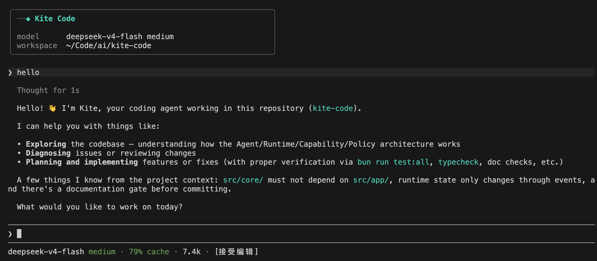

# Kite Code

[English](README.md) | **中文**

[](https://github.com/ferqx/kite-code/actions/workflows/required.yml)

**可控、可恢复、可验证的开源代码 Agent。**

Kite Code 在终端中理解代码、修改文件、运行命令并验证结果。它支持多种模型，提供交互式 TUI 和 Headless CLI。

<p align="center">
  <a href="terminal.png">
    
  </a>
</p>

## 为什么选择 Kite Code

- **多模型**：支持 DeepSeek、OpenAI、OpenAI-compatible 和 Ollama。
- **可恢复**：持久化会话状态，支持 Restore 和 Fork。
- **有边界**：通过审批、授权和 sandbox 控制副作用。
- **可扩展**：支持 Builtin Tool、MCP 和 Subagent；Skill Workflow 受 feature flag 控制，默认关闭。
- **重验收**：使用 Receipt、Artifact 和 Verification 判断任务是否完成。

## 快速开始

需要先安装 [Bun](https://bun.sh/)。

```bash
bun install
bun run tui
```

首次启动时，按照界面引导配置模型 Provider。

Headless CLI：

```bash
bun run agent run \
  --workspace . \
  --trust-workspace \
  --task "检查并修复测试"
```

完整参数以 `bun run agent --help` 为准。

## 文档

- [项目全景](docs/book/01-项目全景.md)
- [CLI 与配置](docs/book/09-CLI模式与配置.md)
- [Runtime 架构](docs/active/six-concept-runtime-architecture.md)
- [工具与安全策略](docs/book/05-工具系统与安全策略.md)
- [MCP 与 Skills](docs/book/11-MCP与Skills扩展.md)
- [当前行为规则](docs/active/)
