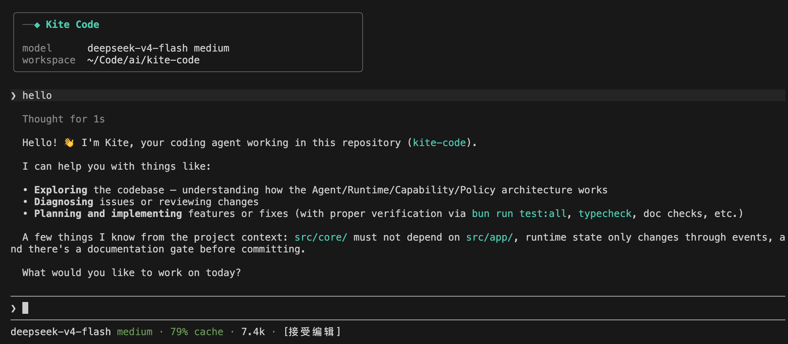

# Kite Code

[English](README.md) | **中文**

[](https://github.com/ferqx/kite-code/actions/workflows/required.yml)

**可控、可恢复、可验证的开源代码 Agent。**

Kite Code 使用多种模型帮助你理解代码、修改文件、运行命令并检查结果。通过 TUI 或 CLI 执行任务，通过本机只读 Web 界面查看会话与诊断。

<p align="center">
  <a href="terminal.png">
    
  </a>
</p>

## 为什么选择 Kite Code

- **多模型**：支持 DeepSeek、OpenAI、OpenAI-compatible 和 Ollama。
- **可恢复**：持久化会话状态，支持 Restore 和 Fork。
- **有边界**：通过审批、授权和 sandbox 控制副作用。
- **可扩展**：支持 Builtin Tool、MCP 和 Subagent；Skill Workflow 受 feature flag 控制，默认关闭。
- **重验收**：按任务要求检查执行证据及已启用的验证结果，判断工作是否完成。

## 快速开始

使用 Bun 1.4.2，安装锁定依赖并构建新 workspace 与 Terminal 候选：

```bash
bun install --frozen-lockfile
bun run build
bun run release:build
bun run tui
```

正式 TUI/CLI 固定选择 `dist/unified-terminal` 的完整候选，启动其配套 Service，业务经同一 HTTP/SSE Client。默认 profile 与原实现分开；本次切换不迁移旧用户数据。模型配置和当前客户端行为见[产品手册](docs/handbook/README.md)。

Headless CLI：

```bash
bun run agent run \
  --workspace . \
  --trust-workspace \
  --task "检查并修复测试"
```

当前参数以 `bun run agent --help` 为准。V1.3 仍在实施：默认生产 Shell 当前 unavailable，完整能力与平台资格尚未取得。准确证据与限制见[实施进度](docs/plans/unified-agent-refactor-v1-progress.md)。

## 本地 Service 与 Web

`bun run server` 显式启动选定候选的本机 daemon 并打印只读 Web 地址。`bun run agent server start|status|stop|restart` 管理这个显式 daemon；`bun run agent web` 只发现已有实例。Browser 经 Cookie Gateway 使用同一公共只读 API；关闭视图不取消活动 Run。

开发时先执行 `bun run build`，再使用 `web:dev`、`cli:dev` 或 `tui:dev`，它们固定明确的 `development` profile。Web 前台 launcher 退出时关闭其所属 Service。当前行为由[Web](apps/web/README.md)与[CLI/TUI](apps/cli/README.md)负责；profile 和制品选择见[本地开发](docs/development/local-development.md)。

## 文档

- [产品手册](docs/handbook/README.md)：共享概念、各客户端指南、命令与问题处理。
- [TUI 手册](docs/handbook/clients/tui/README.md) · [Web 手册](docs/handbook/clients/web/README.md)
- [CLI](docs/handbook/cli/README.md) · [Server](docs/handbook/server/README.md) · [能力对照](docs/handbook/capabilities.md)
- [开发文档](docs/development/README.md)：架构、模块入口和验证。
- [有效计划](docs/plans/README.md)

## 通用 Agent V1.3 当前入口

根 build、typecheck、默认测试、CLI/TUI 和 release 工具已选择八个新 workspace。正式 `agent` / `tui` 前先运行 `bun run build` 与 `bun run release:build`；开发入口保持明确 development profile。当前行为及资格限制见[实施进度](docs/plans/unified-agent-refactor-v1-progress.md)与[release control](docs/active/release-control.md)。完整 V1.3 与三平台发布资格仍在实施。
