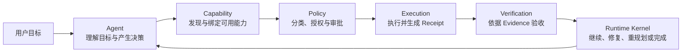
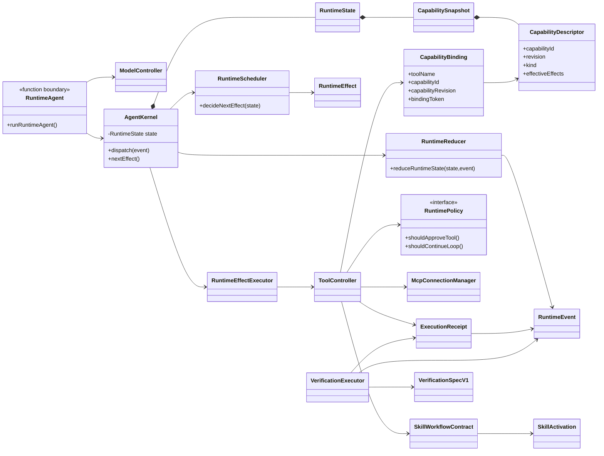

# Kite Code 六概念 Runtime 架构

状态：active

读取时机：理解或修改 Agent 主循环、Runtime Kernel、Capability、Policy、Execution、Verification，以及 MCP、Skill、Subagent 的跨模块职责时。

验证：`bun run check:docs`、`bun run check:core-boundary`、`bun run typecheck`。

相关：ADR-0001、ADR-0007、ADR-0008、ADR-0021、`mcp-runtime-governance.md`、`verification-governance.md`、`capability-progressive-disclosure.md`。

## 1. 两个正交视角

Kite Code 同时使用两套互不替代的架构视角：

- `protocol → core → app` 是物理分层，约束代码依赖方向；
- `Agent → Capability → Policy → Execution → Verification` 是业务流水线，Runtime Kernel 作为唯一事实与调度中心贯穿全程。

六概念模型不是新增第 四层，也不改变 `app → core → protocol` 的依赖规则。它用于说明 `src/core/` 内部职责如何划分。



## 2. 六概念到目录和核心实现的映射

| 概念 | 当前目录 | 核心实现 | 架构职责 |
| --- | --- | --- | --- |
| Agent | `src/core/runtime/agent.ts`、`src/core/controllers/model-controller.ts`、`src/core/model/`、`src/core/prompts/` | `runRuntimeAgent()`、Model Controller | 理解目标，结合 Runtime 投影调用模型，产出工具调用或最终回答；不直接改变持久状态 |
| Runtime Kernel | `src/core/runtime/` | `AgentKernel`、`RuntimeState`、`RuntimeEvent`、`RuntimeEffect`、`decideNextEffect()`、`reduceRuntimeState()`、`RuntimeStore` | 唯一事实中心和状态转换权威；根据 State 调度 Effect，通过 Event 更新 State |
| Capability | `src/core/capabilities/`、`src/protocol/capabilities.ts` | `CapabilityDescriptor`、`CapabilitySnapshot`、`CapabilityBinding`、`createSnapshot()`、`createBinding()` | 统一描述 Builtin、MCP、Skill 与 Subagent；使用稳定 ID、不可变 revision 和轮次绑定 |
| Policy | `src/core/policies/`、`src/core/sandbox/`、`src/core/harness/tool-policy.ts` | `RuntimePolicy`、`PolicyDecision`、`createModePolicy()`、`buildToolApproval()` | 对有效副作用进行分类，执行模式限制、授权、审批和技术隔离 |
| Execution | `src/core/runtime/executor.ts`、`src/core/controllers/tool-controller.ts`、`src/core/execution/` | `createRuntimeEffectExecutor()`、`executeRuntimeTools()`、`ToolExecutionRequest`、`ExecutionReceipt` | 执行已经解析并获准的能力，持久化 invocation intent、结果、副作用和 artifact |
| Verification | `src/core/verification/`、`src/protocol/verification.ts` | `VerificationSpecV1`、`executeVerificationEffect()`、`resolveVerificationMode()` | 使用 Receipt、Artifact 和外部查询形成证据，决定通过、修复、重规划、补偿或 waiver |

仓库采用 TypeScript 的类型、纯函数和少量状态类组合，因此这里的“核心实现”不要求都是 `class`。`AgentKernel` 和 `McpConnectionManager` 是显式类；Scheduler、Reducer、Policy 和 Verification 主要通过类型与纯函数表达。

## 3. Runtime Kernel：唯一状态转换权威

Kernel 的基本循环是：

```text
读取 RuntimeState
  → decideNextEffect(state)
  → 执行 RuntimeEffect
  → 产生 RuntimeEvent
  → reduceRuntimeState(state, event)
  → 持久化 event / snapshot
  → 再次调度
```

目录内职责如下：

```text
src/core/runtime/
├── agent.ts       Agent 与模型循环入口
├── kernel.ts      AgentKernel，状态转换和 Effect lease
├── state.ts       RuntimeState 及 capability/skill/verification 投影
├── events.ts      已发生的事实
├── effects.ts     下一步准备执行的动作
├── scheduler.ts   State → Effect 的确定性决策
├── reducer.ts     State × Event → State
├── executor.ts    Effect 执行适配
├── runner.ts      驱动 Kernel
├── store.ts       event、snapshot 与恢复持久化
└── invariants.ts  Runtime 不变量
```

Capability、Skill 和 Verification 不得直接修改 RuntimeState。任何具有恢复价值的变化都必须先形成 Runtime Event，再由 reducer 归纳为当前事实。

Runtime schema v15 将 transcript message identity、结构化 Tool Result 和 M2 checkpoint lifecycle 作为可恢复事实持久化。Kernel 为新产生的 user/model/tool transcript event 固化 `createdAt`，reducer 分配 turn、ordinal 和稳定 message ID；工具结果元数据同时投影到 `ToolCallRecord` 与 transcript。旧 snapshot migration 只补齐可确定的身份默认值，不从 stdout 反向推断 path、command 或其他结构化结果。

`RuntimeState.context` 保存 active checkpoint、pending compaction、最近失败与有界历史。压缩通过 `context.compaction_requested/completed/failed/reset` 事件和 `compact_context` effect 进入同一个 State → Effect → Event → State 循环；scheduler 在 recovery、外部交互、工具、verification 和 final 之后、再次调用模型之前执行 pending compaction。Controller 只返回类型化事件，结果仍通过 Kernel effect lease 的 `expectedRevision` 提交；期间 revision 变化时结果被丢弃，不引入第二套锁。

M2 使用严格的 `StructuredContextSummaryV1`。Runtime 先从任务目标、明确用户约束、文件与 side-effecting capability 结果、失败、verification、plan 引用和最近可靠观察生成 deterministic fact ledger；summary model 只能压缩叙述，不能决定 mandatory fact 是否保留。候选结果依次经过 JSON/Zod、provenance、mandatory fact IDs、message coverage 和 token gain 校验，并只允许一次 schema repair。超出单次输入预算或 hard 路径校验失败时按完整 turn/tool block 分块；chunk summary 只是 merge 输入，只有最终 summary 能成为 checkpoint。

启用 `contextCompactionAutoV1` 后，Model Controller 在 provider 调用前根据完整请求估算产生 soft/hard 自动请求。Soft 受安全边界、收益与 cooldown 约束；hard 在无法安全切分或压缩失败时阻断新的模型调用。Provider overflow 每个 turn 只允许一次 checkpoint recovery，不能作为普通 retry 重放。Active checkpoint 只替换模型投影中的 covered prefix，原始 transcript 继续由 RuntimeStore 保存。

手动 `/compact` 同样不能绕过 Kernel。App shell 对空闲 session 可打开 Kernel 并执行单次 `compact_context`；若 agent loop 正在运行，则使用其暴露的受限 live control 只注入 RuntimeEvent，依靠现有 scheduler 排队。Live control 不暴露可变 State 或直接 reducer，外部事件推进 revision 后，正在运行的旧 effect 仍由 lease 机制判 stale。

MCP Provider Action 也遵循同一边界。typed provider failure 先把原 Tool Call 终结为 `failed`，再由独立 interaction 调度 App shell；原调用不重新入队。恢复完成事件与新的 `turn.started` 一起提交，确保后续 binding 不可能沿用旧 turn。

RuntimeStore 的所有连接必须使用同一 journal 策略。默认在 Linux/macOS 使用 WAL；Windows 使用 DELETE journal，规避 Bun 在关闭 WAL 数据库后仍持有 WAL/SHM 文件锁的问题。TUI 的长期 stats 连接与 AgentKernel 的 RuntimeStore 连接必须从同一策略函数取值，禁止分别硬编码 journal mode。关闭 Store 时先 finalize 缓存 statement，再执行适用的 WAL cleanup/checkpoint，最后关闭数据库。

## 4. Capability：统一能力身份

Builtin Tool、MCP Tool、MCP Resource、MCP Prompt、Skill 和 Subagent 都是 Capability，不是新的顶层架构层。

```text
Capability Provider
├── builtin    src/core/tools/
├── MCP        src/core/mcp/
├── Skill      src/core/skills/
└── Subagent   src/core/subagent/
```

能力的权威身份是 `capabilityId + revision`。例如：

```text
builtin:read_file
mcp:github/create_issue
skill:create-release
subagent:review
```

模型看到的工具名称只是当前轮的 `CapabilityBinding`。执行前必须重新核对 binding token、turn、capability revision 和参数 schema。Catalog 变化不会原地修改旧 binding；旧 binding 必须 fail closed。

Capability discovery 只回答“系统有哪些能力”，不构成授权。大目录可通过 `tool_search` 渐进披露；MCP provider directory 还可提供不可执行的 unavailable 摘要。两种搜索结果都不授予执行权限，只有当前 revision 的 available descriptor 才能在后续 turn 形成 binding。

MCP Tool 的按需披露会把搜索命中的 `capabilityId + revision + firstLoadedAtTurnId` 持久化为 session-loaded set；恢复后的每个新 turn 都重新签发 Binding，并在 descriptor 漂移、禁用、删除时自动淘汰。MCP Resource 列表与读取由稳定内置工具访问，不进入 loaded set 或 Binding。Tool/Resource 调用失败必须形成成对的 Tool Result，不能因 Provider 或适配逻辑异常中断会话。

## 5. Policy：发现与授权分离

Policy 使用本地计算得到的 effective effects，而不是直接相信 provider 声明。它依次处理：

```text
参数与 binding 有效
  → 副作用分类
  → 当前 mode 是否允许
  → 是否需要 workspace trust
  → 是否需要 auto review 或用户审批
  → 选择 sandbox / network 边界
```

MCP annotation、Skill manifest 和远端描述都是不可信声明，只能辅助分类或收紧能力，不能扩大用户授权。未知、写入或破坏性外部副作用默认进入保守路径。

Sandbox 是 Policy 的技术执行手段，不是授权决策本身；获得批准也不代表可以绕过 sandbox。

## 6. Execution：统一执行网关与回执

Runtime 调度出的能力调用通过 Effect Executor 和 Tool Controller 进入具体 provider：

```text
RuntimeEffectExecutor
  → ToolController
      → resolve binding
      → validate arguments
      → classify effects
      → policy / approval
      → persist invocation intent
      → provider adapter
          ├── Builtin tool
          ├── McpConnectionManager
          ├── Skill workflow
          └── Subagent runner
      → normalize result
      → persist receipt / artifact
      → emit RuntimeEvent
```

Execution 不能只返回面向人的成功字符串。`ExecutionReceipt`/`CapabilityInvocationRecord` 保存调用身份、状态、参数摘要、观察到的副作用、外部引用、artifact、重试安全性和 reconciliation 结果。

外部写入遵循“先记录 intent，再发生副作用”。对无法证明是否成功的调用，Runtime 记录 `unknown` 并禁止盲目自动重放；恢复时先 reconciliation。

## 7. Verification：完成不是模型声明

Verification 强度分为：

- `not_required`：普通问答等任务不创建完成门禁；
- `best_effort`：执行并记录验证，失败或不确定可带风险完成；
- `required`：验证未通过时禁止 `run.completed`。

验证使用执行回执、不可变 artifact、文件/命令/schema 断言、MCP read-after-write、外部引用或独立 reviewer。结果为 `passed`、`failed` 或 `inconclusive`。

```text
passed       → 允许完成
failed       → repair / replan
inconclusive → 补充证据、repair 或请求用户决策
budget 用尽  → replan / compensation / user waiver
```

Tool 执行成功只表示一次调用完成，不表示用户目标已经达成。模型输出 final 也不能绕过既有 required verification。

## 8. MCP 与 Skill 的归属

MCP 对 Runtime 暴露中立的 `McpRuntimeProvider`；Runtime 不依赖连接 control API 或 TUI。`McpSupervisor` 组合配置门禁与连接生命周期，并作为唯一 façade 暴露 capability snapshot、脱敏 availability directory 和 revision-bearing `callCapability`。内部 `McpConnectionManager` 负责唯一 SDK client 路径、协议 discovery、health、单次原始结构化调用与资源读取，不实现 Runtime provider，也不从公共 MCP barrel 导出。模型工具名只用于 binding 展示，执行身份始终是 `capabilityId + expectedRevision`。

默认关闭的 `mcpProviderActionV1` 只增加 Runtime lifecycle，不把 control-plane mutation 移入 Core。Runtime 持久化 required/started/completed/deferred/failed，App shell 执行 login/approve/retry；成功后强制新 turn，defer/failure 则留下明确事实。TUI 把 required 事件投影到既有 foreground/background interrupt surface，并由 App controller 委托 Supervisor。

该 flag 也保护 required-provider admission：首次模型调用前，Runtime 把 unavailable required Provider 排入持久 gate。Retry 结果、session waiver 和 cancel 都是事件；waiver 只解除本次 session 准入，不会改变 Capability snapshot 或签发 binding。TUI 与 CLI 均在没有恢复能力时安全降级，且不得绕过持久 gate。

Skill 是受治理的组合 Capability。`SKILL.md` 被编译为 revisioned `SkillWorkflowContract`，生产 catalog 使用当前 Builtin/MCP resolver 计算 `require - deny` 的统一 effective ceiling，并保守合并依赖 effects 与 minimum approval；模型激活先经过正常 approval/auto-review gateway，激活后的 inline/fork frame 使用同一 ceiling，并受到输入输出 schema、verification 和 recovery 约束。无效高优先级候选不能遮蔽有效低优先级 Skill，扫描受固定资源预算约束，忽略目录中的内容不能作为验证或补偿入口。Skill 不再是直接拼接到用户任务的 Prompt 片段。

## 9. 迁移后的核心关系



## 10. 架构边界总结

一句话描述当前架构：

> Agent 决定下一步意图；Capability 提供稳定、可绑定的能力身份；Policy 决定是否允许；Execution 产生可恢复的执行事实；Verification 根据证据决定目标是否达成；Runtime Kernel 根据全部事实继续、修复、重规划或结束。

以下规则必须保持：

1. Runtime Kernel 是唯一持久状态转换权威。
2. Capability discovery、binding 和 authorization 是三个不同阶段。
3. 模型可见工具名不是能力的稳定身份。
4. Provider 声明不能扩大本地权限。
5. 外部副作用必须先记录 invocation intent。
6. Execution success 不等于目标完成。
7. Required verification 不能被 final response、feature flag 关闭或模型声明绕过。
