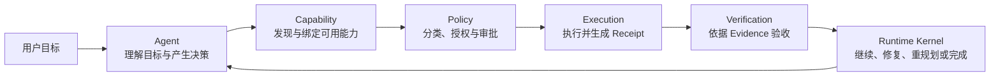
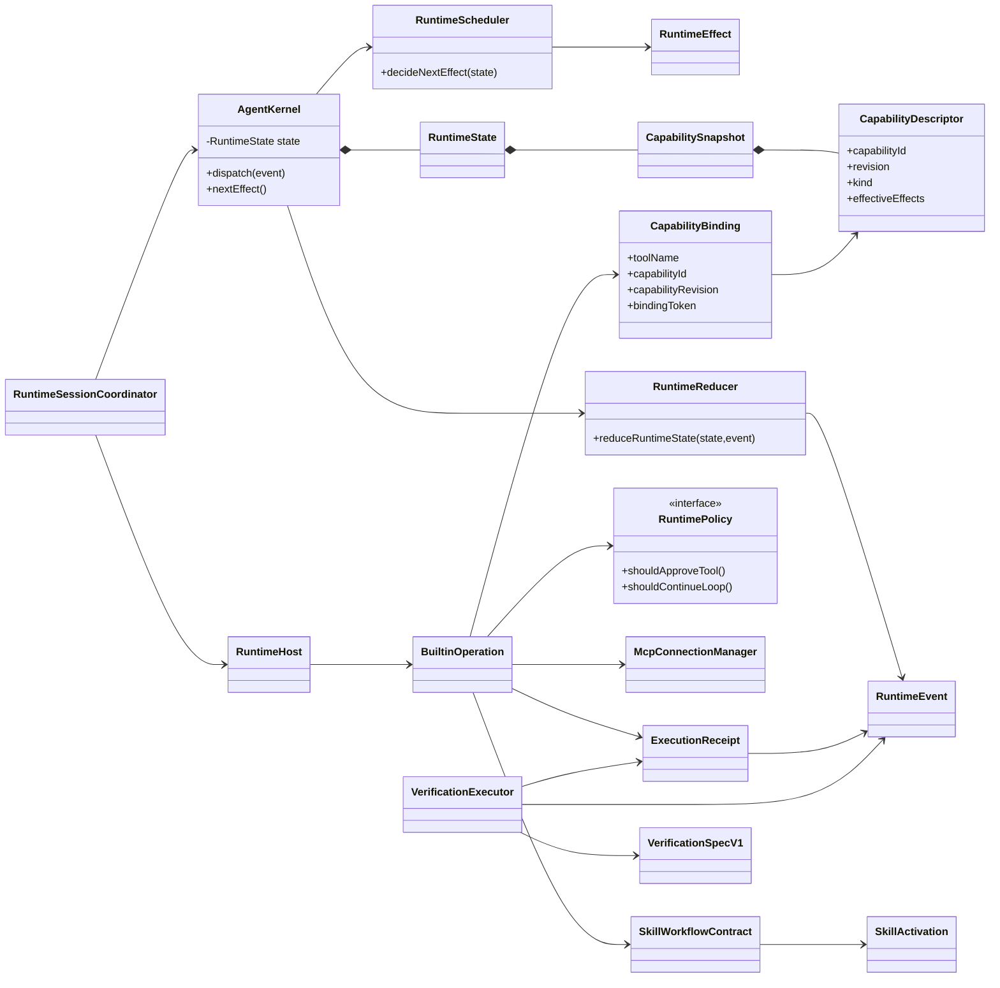

# Kite Code 六概念 Runtime 架构

状态：active

读取时机：理解或修改 Agent 主循环、Runtime Kernel、Capability、Policy、Execution、Verification，以及 MCP、Skill、Subagent 的跨模块职责时。

验证：`bun run check:docs`、`bun run check:core-boundary`、`bun run check:runtime-packages`、`bun run typecheck`，以及对应
`packages/agent-kernel/test`、`packages/runtime-host/test`、`packages/runtime-spi/test`、`packages/builtin-runtime/test`
和 `tests/runtime/` 的当前 package/Runtime suites。

`check:runtime-packages` 是 RMV1-16 Required Gate；RMV1-16 与 RMV1 总计划已经 completed，完成证据绑定
implementation final SHA `e5a64c212a3e6a5207b00ed6e7f220c899cd7663`。唯一 concrete
Host/Registry/Builtin-catalog/SQLite composition root、package import、manifest、journey、fault、soak 与 docs Gate 均已闭合。
RAV1 已在真实持久化、序列化或进程外边界完成 identity/integrity/format production cutover；同进程 Kernel/Host/Builtin
继续是可信 typed seam，详见 `runtime-authority-boundary.md`。本文中标注为 RMV1-xx 的段落记录当时的分阶段不变量；当前 format 事实统一为 State26、Store5 与 `kite-runtime-modularization-v1-2026-08-19`，不得把历史“保持 State26/Store5”语句解释为现行 composition。

PS-02 追加验证：`bun test tests/execution/sandbox-execution-provider.test.ts`。

相关：ADR-0001、ADR-0007、ADR-0008、ADR-0021、ADR-0022、ADR-0024、ADR-0031、ADR-0032、ADR-0048、ADR-0049、ADR-0109、ADR-0110、ADR-0111、ADR-0114、ADR-0115、ADR-0116、ADR-0117、ADR-0118、`mcp-runtime-governance.md`、`verification-governance.md`、`capability-progressive-disclosure.md`。

## 1. 两个正交视角

Kite Code 同时使用两套互不替代的架构视角：

- `protocol → core → app` 是物理分层，约束代码依赖方向；
- `Agent → Capability → Policy → Execution → Verification` 是业务流水线，Runtime Kernel 作为唯一事实与调度中心贯穿全程。

六概念模型不是新增第四层。当前物理边界由 Runtime Contract、Runtime SPI、Agent Kernel、Runtime Host、Builtin Runtime
与 `apps/kite` 组成；App 组合这些 package，Kernel、Host 与 Builtin 不依赖 App。本文只说明当前 package 的职责如何划分。

RMV1 当前 authority seam 必须与“operation owner”分开阅读：Agent Kernel 只产生纯 effect；App 只组合一个
`ModelInvocationGatewayV1` 与一个 `BuiltinModelOperationExecutionPortV1`；Host 只提供同一 frozen SPI snapshot
对应的 `CapabilityExecutionPortV1`、generic lifecycle/lease/transaction/abort/notification；Builtin catalog
snapshot 才是 schema/parser/effects/traits/operation identity authority。当前 State26 的 App orchestration 只通过
`apps/kite/src/bootstrap/runtime/RuntimeSessionCoordinator.ts`、`runtime-effect-coordinator.ts`、
`runtime-tool-effect.ts` 与 `turn-coordinator.ts` 进入唯一 App seam；Host generic coordinator 负责 prepared/ack/receipt
机制，Kernel 负责纯 State26 decision/reducer。旧 Core tree 与 bootstrap legacy tree 已无 production source。
dynamic MCP 保持独立 binding/descriptor/catalogRevision route；`ask_user` 仍由 Kernel request-user-input interrupt terminal
拥有。RMV1-16 的 caller/owner closure、Required Gate 与完成证据已经闭合；RAV1 不得反向恢复第二 owner。

### 1.1 RMV1-15 Model/Builtin、Runtime Registry、Pure Kernel、Host lifecycle、Client Contract 与 Storage 状态

RMV1 已建立六个私有 workspace package 和目标 App：

```text
runtime-host -> runtime-contract + agent-kernel + runtime-spi
runtime-spi -> runtime-contract
runtime-storage-sqlite -> runtime-host/storage
builtin-runtime -> runtime-spi + runtime-contract
apps/kite/bootstrap -> runtime-contract + runtime-host + runtime-spi + runtime-storage-sqlite + builtin-runtime
```

RMV1-03 已建立 App 可见的 `RuntimeAccess.command/query/subscribe`、Command Receipt、Session/Work/Turn/
Interaction/Evidence projection，以及彼此分离的 durable/ephemeral Notification。CLI 和 TUI 源码、Git/
Observability/Release/Workspace App 组合已物理迁入 `apps/kite/src/`；release 与根 scripts 进入 App executable，
根 `package.json#module` 精确指向 `apps/kite/src/index.ts`；该 App 入口只重导出
`createKiteRuntimeBoundaryV1`、`runCli` 和 `runTui`，过渡 `src/index.ts` 已物理删除，不再导出或构造 Core Runtime
authority。

Client presentation 不得拥有或导入 Core 的 `AgentState`、`RuntimeEvent`、`RuntimeStore`、Kernel、Executor 等
State/Effect authority；受控的 `@kite/runtime-contract` DTO 与 Builtin presentation/config exports 可以由 App Client
使用。
`apps/kite/src/bootstrap.ts` 是唯一 concrete composition root。它注入
`RuntimeSessionCoordinator`、`KiteRuntimeExecutionModule` 与同一 frozen Registry/Host port；
`RuntimeHostExecutionBridge` 只把每条命令或查询转发给一个明确 handler，
没有异常 fallback、双写、第二 mailbox、receipt cache 或 subscription history；`DefaultRuntimeHost` 是 CLI/TUI
production `RuntimeAccess` owner。

Host 为每个 Session 保留一个稳定 FIFO mailbox：同 Session 的 command 串行，不同 Session 可以并行；
`expectedRevision` 与 Fork source revision 在 legacy bridge 前返回 conflict，同一 Session 内相同 `commandId`
只执行一次且不同 payload 会 fail closed。Host 只保存最后 committed Client projection 与有界 durable history，
Query 不读取执行中间态；订阅 history 连续时发送 delta，缺口或 history 未覆盖最新 projection 时先发送 full
snapshot。ephemeral stream 不持久化、不向新 subscriber 重放，按 work/turn/attempt/stream/sequence 丢弃 stale
delta，并在慢消费者积压时有界淘汰；durable-only 队列过慢则断开该 subscriber。iterator `return()` 或
AbortSignal 只释放该订阅者，不取消 Runtime work。

RMV1-06 的幂等 receipt 与 projection history 仍只覆盖当前 Host 生命周期，因为 Store5 没有 durable command ledger
或 notification outbox；不得把它表述为跨重启幂等。State/effect/receipt 由唯一 App RuntimeSessionCoordinator
与 Host bridge 端到端执行，Host 不复制一套 Kernel State。长期 execution 的 root AbortController、same-session cleanup barrier、
shutdown drain、四类 transaction acknowledgement、单-Store effect lease/fencing 与 restart recovery 已由 Host
拥有；App bridge 只执行已准备的单一路径并把 current State26 facts 投影回 Host。

RMV1-04 已把 production persistence API 迁到 `@kite/runtime-host/storage` port 与
`@kite/runtime-storage-sqlite` 的唯一 `SqliteRuntimeStorageAdapter`。旧
旧 v4 storage driver 实现与 caller 已清零。`packages/runtime-host/src/state26-storage.ts`
与 `packages/runtime-storage-sqlite/src/` 是唯一 Store5 storage seam。`apps/kite/src/bootstrap.ts` 是唯一
concrete storage 创建者，并通过 `createRuntimeHost({ storage, modules })` 注入；CLI、TUI、Kernel 和 App
只接收注入的 Store/metadata port，不持有 raw SQLite handle，也不自行根据路径构造 Store。
root tests 只经 Host State26 codec 与 Store5 adapter 组合同一 storage seam，
不复制 concrete driver。

adapter 将 decision、attempt-start、receipt/evidence、terminal/recovery 四类 transaction port 精确映射到
当前单次 event+snapshot 原子事务。RMV1-06 的 Host `EffectSupervisor` 在这些 port 前提供唯一 acknowledgement
owner，并把当前 effect lease owner/expiry 作为 terminal transaction 的原子前置条件；lease claim/renew/release、
checkpoint/fork/rewind 保持 Store5 语义。执行者取得的 owner token 通过 execution context 与 Kernel batch 贯穿到
Host；相同 effectId 的旧执行者不能借用 replacement owner claim。TUI token stats
经独立 metadata port 使用同一数据库策略。Artifact port 只登记现有强类型 namespace access，不转换 ref、
不合并 namespace，也不改变既有 Artifact owner。Tool/Model/Context/Skill 等 operation authority 已在
RMV1-10 至 RMV1-15 迁入 Builtin；Kernel decision authority 已在 RMV1-07 切到纯包。
Root build/typecheck/test 继续机械覆盖全部 workspace，
`check:runtime-packages` 同时拒绝 Client 获得敏感 Runtime authority、Legacy 绕过、第二 composition root、
非 bootstrap App 对 Host/Registry/Builtin catalog/SQLite authority factory 的导入与 RAV1 format 泄漏。App
子组合仍可消费显式 export 的 SPI type、Builtin presentation/config/mechanism 与 Host observability contract；这些
导入不构造第二 Host、Store、Registry 或 frozen catalog。State26、Store5、epoch
`kite-runtime-modularization-v1-2026-08-19` 和现有安全行为未改变。

TUI compatibility facade 仍可等待 legacy run completion，以保持现有 presentation/idle 时序；但 bridge 的
`start_turn` 与 manual compaction 只调度后台工作并立即返回 receipt，所以 Host mailbox 不等待 Model、Shell、
MCP 或其他 Provider。Host lifecycle 为每个长期 operation 创建 root AbortController；兼容 facade 只接收该 signal，
并把 deadline 或拒绝触发的 abort 请求回送 Host。Cancel 先经 bridge 持久化，再触发 Host signal；同一 Session 仅在
当前 operation 已 abort 后保留一条 successor，并等待 cleanup 完成。Host hydrate/首次执行还会为每个 Session 恰好
执行一次 restart recovery，失败则在 Provider dispatch 前关闭该路径。跨 Host fence、Project identity 与 format
authority 仍不属于 RMV1。

RMV1-07 将 production transition owner 切到 `@kite/agent-kernel` 的
`decide/reduce/selectPendingEffects`。Host 把 Command、Receipt 或 Host fact 翻译成私有 `KernelInput`，并显式投影
JSON-safe、无 callback/handle 的 canonical `DecisionFacts`，其中显式携带 bounded snapshot 之外的当前进程
known event IDs 以保持既有幂等窗口；Kernel package 不读取 clock、random、Node/Bun、Store、
Host、SPI、App，也不执行 effect。当前 State26 的 event normalization、domain reducer、invariant 与 scheduler 通过
固定 `KernelDomain` 在 composition 时绑定；这只是 RMV1-16 物理 domain split 前的编译期适配，不是第二 transition
owner。生产 `AgentKernel.processEvent/processEventBatch` 先取得纯 decision，再通过唯一 Store5 port 原子提交
event/snapshot，提交成功后才推进进程内 State。

Host 仅在 applied receipt 与 committed revision 已形成后签发 RMV1 最小 `AuthorizedEffect`，并把它交给
`apps/kite/src/bootstrap/runtime/KiteRuntimeExecutionModule.ts` 注册的单一 `RuntimeHostExecutionBridge`。bridge 精确核对 session、
operation、operationId 与 committed revision，且只能消费一次；它不能 classify、policy、approve、reduce、持久化
或扩大 authority。其内部 dispatch closure 只调用 frozen snapshot 选择的单一 Builtin operation owner；Legacy
operation registration 与 production caller closure 均已清零，剩余只待 RMV1-16 Required Gate 证据闭合。
`RuntimeKernelControl` 与 `createAgentKernel` 旧 production surface 已删除；
State26 restore/recovery 由 `RuntimeSessionCoordinator` 与 Host State26 session seam 负责；不存在旧 Kernel coordinator。

RMV1-08 把 module lifecycle 与 production registry 切到 `@kite/runtime-spi` / `@kite/runtime-host`。Registry
以 module/provider/operation/capability/revision 的精确身份拒绝重复 owner，registration writer 在同步声明后
封闭；Host 按序 start、反序有界 dispose，并在 partial startup 时 fail closed。Host 只从固定 adapter ID 取得
execution bridge，不再同时接收旁路 factory，也不提供异常 fallback。

App-local `KiteRuntimeExecutionModule` 当前不注册 concrete capability operation；冻结 SPI snapshot 由六个 Builtin module
直接提供全部 29 个 operation。Legacy operation registration 与 production caller closure、Required Gate 均已闭合。SPI 的
Receipt/Grant/Context DTO 仍是 RMV1 私有进程内
transport；RAV1 在真实持久边界叠加 keyless integrity，在 child-process 边界使用 invocation-local frame material，并加入 DataOrigin、Credential、ProjectIdentity 与 single-Host invariant，不改变同进程 typed trust seam，也不创建 Runtime installation root。

RMV1-09 将 State26 的精确 turn-scoped `CapabilityBinding` DTO 冻结在 `@kite/runtime-spi`，并把唯一 binding
构造者切到 `@kite/builtin-runtime#createCapabilityBindingV1`；`@kite/runtime-spi` 的 immutable registry snapshot 与
`arbitrateCapabilityV1` 只解析 binding、definition、provider、executor 与 revision/schema 一致性，返回 typed
failure；它不读取 approval/Policy、不调用 Provider，也不生成 Grant。现有 Tool Pipeline 仍按
Catalog → Disclosure → Binding → Proposal → Intent → AuthorizedEffect → Receipt 的分离阶段执行，当前
Policy/approval 语义没有改变。

具体工具的调度元数据由冻结 Builtin catalog declaration 声明，State26 调度前才投影为 resource scopes、access、conflict keys、
isolation、causal group、interaction barrier、concurrency group 与 lease requirement，不写入 State 或 Event。
`@kite/agent-kernel` 的纯 scheduler 只比较这些 traits；`packages/agent-kernel/src/scheduler.ts` 和 App/Host runner 的 shell overlap
判定均不再包含具体 Tool name。并行读、同一 causal group 的 sibling Subagent、逐项 shell 审批/重叠和所有
交互/未知/写入 fail-closed 行为保持原样。

RMV1-10 建立 Host-owned `CapabilityExecutionPortV1`：它只对启动时冻结的 Registry 做 exact arbitration、
request/grant/attempt identity、单次 claim 与 receipt identity validation，不读取领域 facts 或扩展授权。
App Tool Pipeline 将当前 catalog/provider directory 复制为冻结
JSON facts，Store5 原子确认 invocation intent 与 attempt 后，唯一 Builtin executor 才可读取这些 facts 并返回
SPI Receipt。Receipt 继续经 Host Tool Pipeline Artifact/terminal commit 到 Kernel 和 Client，Legacy operation 与
旧 central executor 已物理删除。没有 second executor、fallback 或双写；State26、Store5 和 epoch 不变。

RMV1-11 又把 Skills、Context compiler/source、MCP/Web 的 8 个 operation 切给 Builtin Runtime；RMV1-12
继续把 `read_file/search_content/search_files/write_file/edit_file/git_inspect` 的 definition、executor 与具体
Filesystem/Git 实现切给 `@kite/builtin-runtime`，专用 JSON-safe Provider contract 位于 `@kite/runtime-spi`。
旧 Core compatibility surfaces、`execute/projectResult` 与 Legacy operation 均已删除；Builtin catalog 是唯一 schema/parser/effects/traits authority。
Host execution port 仍只做 exact arbitration、single-use claim 与 receipt identity validation；当前 Tool Pipeline
在 durable attempt acknowledgement 后注入已经授权的 filesystem dispatcher 或 typed Git broker mechanism，
Builtin 不能取得 State、Store、Kernel Event、Host 或扩大 path scope。canonical path、trusted Workspace、external
mutation approval、read-before-edit、preimage、descriptor-relative/no-follow commit、protected-path、unknown recovery
和 sealed seam 保持原行为。

RMV1-13 又把 `shell_execute` 的 definition/executor 切给 `@kite/builtin-runtime`，把 Sandbox Provider contract
切给 `@kite/runtime-spi`，把唯一异步 process spawn、POSIX supervisor、bounded output 与 process-tree cleanup
切给 `@kite/runtime-host`。App 仍唯一组合 native/host-shell availability；旧 Core/protocol 路径与 compatibility adapter
已在 RMV1-16 物理删除。RMV1-13 checkpoint 的四个 Builtin module 合计拥有 16 个
operation、Legacy module 在该历史 checkpoint 尚余 13 个；当前 Legacy module 已清零，RAV1 authority/identity/single-Host/format 已闭合。

RMV1-14 把 8 个 interaction/planning/Subagent/Verification operation、Subagent/Verification private SPI、
deterministic verification executor、Local Provider/composition、continuation/role ceiling/replay semantics 与
child lifecycle registration/single-use/expiry owner 切给 `@kite/builtin-runtime`。在 RMV1-14 checkpoint，旧树尚保留
State26 adapter、Plan/Artifact store 与待迁移的 Model runner/message adapter；这些 compatibility owners 已在 RMV1-16 删除，Verification Policy/Completion 始终由
Kernel 唯一裁决。该 checkpoint 的五个 Builtin module 合计拥有 24 个 operation，Legacy module 只剩 5 个 Model purpose；
State26、Store5、原 epoch 与安全行为未改变。

RMV1-15 已把 Model Surface 私有 contract 迁到 `@kite/runtime-spi/model`，把 Gateway、transport、response source、
prompt/message/token/cache、Context compiler、compaction 与 reviewer 实现迁到 `@kite/builtin-runtime/model`，并由
Builtin 唯一拥有五类 Model purpose。App composition root 显式注入 Model Artifact 自有 mechanism、Subagent/Workspace
mechanism 与唯一 live Gateway；同一 App/Host lifetime 的 workspace-bound factory 复用该 Gateway，并创建一个只持有它的
`BuiltinModelEffectCoordinatorV1`。auto-review、Verification reviewer、context compactor 与 primary/subagent model step
均经同一 Gateway；缺 coordinator、provider denial 或 identity mismatch 均 fail closed，不创建第二 Gateway，不回退到
另一个 reviewer 或用户审批。App 的 `RuntimeSessionCoordinator`、`runtime-effect-coordinator.ts`、
`runtime-tool-effect.ts` 与 `turn-coordinator.ts` 是唯一 State26 effect orchestration seam；Host generic
`tool-pipeline-coordinator.ts` 只负责 prepared/ack/receipt/lifecycle 机制，Kernel 只负责纯 decision/reducer。
当前六个 Builtin module 合计拥有全部 29 个 operation，20 个 model-visible、9 个 internal；Legacy operation registration、
Core/App production caller 与第二 compaction coordinator 均已清零。该源码 closure 尚需 RMV1-16 的最终 manifest、docs、
journey、fault、soak 与 Required Gate 证据，不能将本页表述为 completed。
`packages/builtin-runtime/src/subagent/{roles,model-context,tool-surface,model-loop-engine}.ts` 拥有 child 角色 prompt、
canonical Workspace/CWD、Builtin catalog 与独立 dynamic MCP overlay、child 多轮 Model loop、ordinal、token estimate、
frozen transcript 与 ToolMessage 配对；App `subagent/` adapter 只注入 exact registration/runtime callback，缺少已解析
Model 时 fail closed，不现场重建 Model 或 composition。RuntimeSessionCoordinator recovery 为每个 session 只 ensure 一次
State26/Store5 session seam；idle `/compact` 复用同一 Kernel、Store、Builtin model composition/Gateway 与 Host capability
port，并以 terminal exactly-once 结束。Context/status/planning projections 复用同一 App coordinator，不打开 standalone
Kernel，也不存在旧 coordinator 或 Core fallback。
当前 State26、Store5、epoch `kite-runtime-modularization-v1-2026-08-19`、identity、keyless persisted integrity、DataOrigin、Credential 与 single-Host invariant 共用同一 App/Host/Builtin composition，无 Runtime installation key 或旧 format fallback。

29/20/9 的机械证据来自同一 frozen SPI snapshot：
`bun test packages/builtin-runtime/test/builtin-runtime.test.ts tests/scripts/runtime-modularization-manifests.test.ts`。



## 2. 六概念到目录和核心实现的映射

| 概念           | 当前目录                                                                                                                                                                                                                                                                   | 核心实现                                                                                                                                                                                             | 架构职责                                                                                                                                                                                                    |
| -------------- | -------------------------------------------------------------------------------------------------------------------------------------------------------------------------------------------------------------------------------------------------------------------------- | ---------------------------------------------------------------------------------------------------------------------------------------------------------------------------------------------------- | ----------------------------------------------------------------------------------------------------------------------------------------------------------------------------------------------------------- |
| Agent          | `apps/kite/src/bootstrap/runtime/RuntimeSessionCoordinator.ts`、`turn-coordinator.ts`、`packages/builtin-runtime/src/model/`                                                                                                                                               | `executeRuntimeTurnV1()`、Builtin Model Gateway/Context compiler                                                                                                                                        | 结合 Runtime 投影调用模型，产出工具调用或最终回答；App coordinator 注入 Kernel session、effect port、concrete Model 与 composition，Builtin 拥有 Model/Prompt 语义 |
| Runtime Kernel | `packages/agent-kernel/src/`；State26 reducer/domain 位于该 package；持久化 port 位于 `packages/runtime-host/src/storage.ts`                                                                                                                                                  | `decide()`、`reduceAgentState()`、`selectPendingEffects()`、`selectSchedulableEffectBatchV1()`、`KernelInput`、`DecisionFacts`                                                                                 | 唯一纯状态转换与调度权威；只消费显式 State/Input/Facts/ExecutionTraits/domain，不读外部 I/O；Host 负责翻译与 Store5 commit |
| Capability     | `packages/runtime-spi/src/`、`packages/builtin-runtime/src/`、`apps/kite/src/bootstrap/runtime/tool-pipeline-*.ts`                                                                                                                                                          | `CapabilityDefinitionV1`、`CapabilityBindingV1`、`CapabilityRegistrySnapshotV1`、`arbitrateCapabilityV1()`、`createCapabilityBindingV1()`、Builtin operation modules                                 | 分离 Catalog/Disclosure/Binding/Proposal/Intent/Grant/Receipt；使用稳定 ID、不可变 revision 和轮次绑定，arbitration 不授权或执行；具体 Filesystem/Git/MCP/Skill/Web/Model 语义由 Builtin 拥有 |
| Policy         | `packages/agent-kernel/src/authorization.ts`、`apps/kite/src/bootstrap/runtime/tool-policy.ts`、`packages/builtin-runtime/src/sandbox/`                                                                                                                                    | State26 governance facts、App policy adapter、Builtin sandbox policy facts                                                                                                                               | 对有效副作用进行分类，执行模式限制、授权、审批和技术隔离；Builtin Sandbox 不自行授权 |
| Execution      | `packages/builtin-runtime/src/rmv1-13-operations.ts`、`rmv1-14-operations.ts`、`rmv1-15-operations.ts`、`packages/builtin-runtime/src/model/`、`packages/runtime-host/src/process-spawn.ts`、`packages/runtime-host/src/process-output.ts`、`apps/kite/src/bootstrap/runtime/runtime-effect-coordinator.ts`、`runtime-tool-effect.ts` | `createRmv113RuntimeModuleV1()`、`createRmv114RuntimeModuleV1()`、`createRmv115RuntimeModuleV1()`、`ModelInvocationGatewayV1`、Host process supervisor、`createAppRuntimeEffectExecutorV1()`、`executeAppRuntimeToolsEffectV1()` | Builtin 执行已获准的领域 operation，Host 唯一监督通用机制，App 显式组合 concrete mechanism；App effect coordinator/turn coordinator 是唯一 State26 orchestration seam |
| Verification   | `packages/runtime-spi/src/verification.ts`、`packages/builtin-runtime/src/verification/`、`apps/kite/src/bootstrap/runtime/verification-effect.ts`                                                                                                                                 | `VerificationSpecV1`、`executeDeterministicVerificationChecksV1()`、`executeVerificationEffect()`、`resolveVerificationMode()`                                                                       | Builtin 依据 Receipt、Artifact 和注入 port 形成 check evidence；Kernel/Runtime 唯一决定通过、修复、重规划、补偿或 waiver |

仓库采用 TypeScript 的类型、纯函数和少量状态类组合，因此这里的“核心实现”不要求都是 `class`。`AgentKernel` 和 `McpConnectionManager` 是显式类；Scheduler、Reducer、Policy 和 Verification 主要通过类型与纯函数表达。

Model Surface V1 已完成 MS-01–MS-04 migration series；RMV1-15 后由
`packages/runtime-spi/src/model-surface.ts` 定义完整、JSON-safe、provider-neutral 的请求/响应 evidence DTO 与五类
purpose 映射，由 `packages/builtin-runtime/src/model/surface-canonicalizer.ts` 定义严格 canonical identity 与分层 digest，private immutable
storage 与 `ModelArtifactStoreV1` 以 keyed opaque ref 保存严格 schema 的 Surface/Response/Provider options。
Agent、compaction、auto review、verification review 与 subagent step 都先编译同一冻结 Surface，再通过唯一
`ModelInvocationGatewayV1` 调用 single-attempt transport；旧 `invokeBoundModel` 权威已删除。Gateway 在每次
attempt 前取得 durable ack，并在 Response Artifact 与 completion/purpose terminal ack 成功前密封 response。
静态边界检查阻止 transport、AI SDK 或 LanguageModel low-level dispatch bypass。当前 Runtime schema 为 v25，
并保留当前 format epoch 的 invocation evidence；没有 legacy runtime flag。production composition 只选择 live
`ModelResponseSourceV1`，所有 response/attempt identity 都由 Builtin Gateway、Host ack 与 State26 persistence seam
共同验证；不引入第二 Source、fallback 或独立回归 authority。

## 3. Runtime Kernel：唯一状态转换权威

Kernel 的基本循环是：

```text
Host 翻译 Command / Receipt / Host fact → KernelInput + DecisionFacts
  → @kite/agent-kernel decide(state, input, facts, fixedDomain)
  → 得到 next State / Event envelope / pending Effect
  → Host Store5 port 原子提交 event / snapshot
  → 提交成功后推进进程内 State
  → Host 签发 AuthorizedEffect 并交给唯一执行 adapter
```

目录内职责如下：

```text
packages/agent-kernel/src/
├── kernel.ts      AgentKernel，状态转换和纯 Effect decision
├── state.ts       State26 及 capability/skill/verification 投影
├── events.ts      已发生的事实
├── effects.ts     下一步准备执行的动作
├── scheduler.ts   State + Builtin catalog 投影的 ExecutionTraits → Effect 的确定性调度
├── reducer.ts     State × Event → State；approval.rejected 和 tool.rejected 均写入 transcript ToolMessage
└── invariants.ts  Runtime 不变量

apps/kite/src/bootstrap/runtime/
├── RuntimeSessionCoordinator.ts  App 唯一 State26 session/coordinator
├── runtime-effect-coordinator.ts App 唯一 model/compaction/review/verification effect seam
├── runtime-tool-effect.ts        App 唯一 run_tools effect seam
└── turn-coordinator.ts           App 唯一 turn/model orchestration seam

packages/runtime-host/src/
└── tool-pipeline-coordinator.ts  generic prepared/ack/receipt/lifecycle coordinator
```

Capability、Skill 和 Verification 不得直接修改 RuntimeState。任何具有恢复价值的变化都必须先形成 Runtime Event，再由 reducer 归纳为当前事实。`user.command_invoked` 是例外：持久化以供审计与 TUI 重放，但 reducer 视为 no-op，不进入模型 transcript 也不改变 RuntimeState。

Runtime restore 只接受 `RUNTIME_STATE_SCHEMA_VERSION` 与 `RUNTIME_STATE_FORMAT_EPOCH` 都精确匹配的 snapshot。缺失、错误或损坏的 epoch 在 event decode、reducer、Scheduler、Tool 或外部 adapter dispatch 前进入 `incompatible_runtime_format`；旧数据不迁移、不重放、不改写。当前 epoch 只使用 `reduceRuntimeState()` 归约 snapshot 之后的当前事件尾，Kernel 仍以 effect lease 与最新 State 的一致性阻止过期副作用。

模型流增量是另一类明确例外：`model.text_delta`、`model.reasoning_delta`、reasoning 段边界 `model.reasoning_completed` 以及 shell `tool.progress` 只用于当前进程的即时展示，不是可恢复事实，不进入 reducer、event store、snapshot 或 session log。Runner 仅在产生这些瞬态事件的 effect lease 仍为 current 时向 App 转发；并发 shell progress 复用同一 tool ownership 判定但不 reduce、不持久化、不推进 revision，pending producer queue 按 call/stream 合并为有界 tail。过期 lease 的晚到事件必须丢弃，started/terminal 等 durable fact 仍作为 ordering barrier。模型调用以 `model.invocation_completed` 证明私有 response receipt 已 ack，再由同 batch 的 `model.responded` 或 purpose-owned terminal 形成可消费事实；`tool.finished/failed/cancelled` 仍是工具完整事实。Gateway 在同一 effect 内重试流消费，抑制 text 与 reasoning 已经交付的公共前缀；恢复流发生分歧时，从新尝试的差异处继续发出增量，App 负责保留旧段并开启新的显示段，Runtime 不把显示分段提升为持久状态。

Shell 的 `tool.progress` 同样是瞬态展示事件，不修改 RuntimeState，也不逐行写入 event store 或 snapshot；可恢复的完整结果只来自后续 `tool.finished`。Runner 在同一 `toolCallId + stream` 上有界合并尚未消费的完整行，并沿用 effect/concurrent-shell lease 所有权检查；任何 durable lifecycle 或 terminal 事件都是顺序屏障。TUI 再按展示帧合并进度、只保留有界 tail，并保证在对应 terminal 事件前排空；后台会话可以淘汰或合并 progress，但不得以 progress 替换 terminal fact。

CUT-01 已按 ADR-0117 把 Production Runtime 切换到 schema v25 与 format epoch
`kite-runtime-modularization-v1-2026-08-19`。当前 snapshot 必须显式持久化 transcript identity、turn lifecycle、context
checkpoint、resource budget、Provider readiness、Model invocation evidence、CompletionGuard、canonical
`ToolOutcomeV1`、Tool recovery journal 与 low-information Subagent lifecycle；restore 不执行 historical event
decoder，也不再补造缺失 `modelInvocations`/readiness/completion state。v24、旧 epoch、raw queued Task、inline
Subagent continuation 与路径型 Capability Artifact ref 在任何调度前 fail closed；源数据不迁移、不重放、
不改写。

active `TaskState.planning` 是 Planning 唯一持久权威；RuntimeState 不保存 thread-level compatibility
mirror。`getActivePlanning()` 只读取 active Task，没有 active Task 时固定返回
`building_without_plan`。reducer、CompletionGuard、Context 与 App 不得直接维护第二份 Planning 状态。

当前 schema 还持久化 parent/subagent 共用语义的 `ToolRecoveryJournalV1`。journal 的随机 HMAC
key、invocation fingerprint、failure instance 和 lineage 只存在于 canonical private Runtime
state/continuation，不进入 SessionLog 或 observability。retry record 必须在一次受信 safe-read
自动重放前先落盘；模型参数修正和自动重放分别最多一次，restore 不重置次数。policy/approval
deny、timeout、cancel、unknown effect 和仅有 idempotency key 而无 receipt 的调用不重放；malformed
journal restore 或同一 recovery root、同一工具、同 task/turn 与同 progress revision 的第六次无进展
failure 会 fail closed 为 quality block，明显早于 250 次资源上限。参数变化不能重置同一恢复链的计数；
没有共同 `recoveryOf` root 的独立调用即使工具名和 fingerprint 相同，也只累计有界 observation，不能仅因
总数达到十二次而封锁整轮。单次 failure 的真实模型修正/自动重放额度仍分别最多一次；额度外提案保持
零 dispatch suppression，但不能在第一次被拒时直接把整个 scope 提升为 `no_progress`。
failure 还绑定 owning task、turn 与紧随其后的 eligible model response，并在该响应中由 Runtime 唯一绑定
一个具体 `toolCallId`；未被绑定的同名或异名 sibling 不能消费该 failure 的恢复额度。task/turn close 会把记录移出
新 scope；只有成功 `recoveryOf` receipt，或 Runtime-owned skip/replan/user action、Provider/capability
revision 才能把失败标为 recovered、推进 progress revision 并解除对应链；无 lineage 的无关成功 receipt
不构成该链进展，不能重置其计数。restore 从 failures 推导 quality block 时必须保留触发链的 task/turn scope。
deny/never、timeout、cancel、unknown effect、terminal exhaustion 和
`next_response_elapsed` 在原 scope 继续保留 suppression 与 CompletionGuard blocker，不得把“额度耗尽”
当作恢复。`alternative` 可在下一 eligible response 选择不同 capability，但必须由 Runtime 绑定
受控 `capabilityIntent` 对应的具体调用及 `recoveryOf`，不能把响应中的任意工具当作 alternative。
CompletionGuard 只读取当前 task/turn 真正 active 的 blocking/quality state，历史 deny
不会永久阻断后续任务。quality block 仍允许 `write_plan/update_plan/read_plan/ask_user/tool_search`
形成替代进展。

canonical identity 对已解析调用使用当前 Builtin catalog entry 或动态 MCP binding 的 schema defaults 与 revision；
解析前失败把 raw equality 立即写入私有 HMAC，不持久化参数正文。自动 safe-read replay 的
`tool.retry_recorded` 必须先得到 RuntimeStore durable ack；持久化缺失、返回 false 或抛错都在第二次
Provider dispatch 前停止。Kernel 原子 batch 逐事件用前一事件产生的 next state 合成 envelope，
因此 `[tool.started, tool.finished]` 的 terminal certainty/timing 不会读取陈旧 state。
生产 safe-read retry 还要求唯一一次有效 `tool.started` 已由 Kernel reducer 持久化；随后
`tool.retry_recorded` 才能记录 attempt/recoveryOf 并授权第二次 dispatch。ack 后崩溃重启不得重置
ceiling。MCP readiness 是 provider/capability dispatch 之前的生产边界：首次 readiness failure 使用
`not_started/none/pre_dispatch` authority，durable retry ack 后才允许第二次 readiness attempt 与唯一一次
capability dispatch。restore 对 journal 重新计算 canonical failure ID，并验证 map/order/outcome lineage、parent
recoveryOf、attempt counters 与 progress revision；伪造相互一致的 ID 也不能绕过重算。
当前 snapshot 或 Subagent continuation 缺少 recovery journal 本身就是损坏状态，restore 必须
quality-blocked，不得补默认 journal 后继续调度。当前 auto-review 接受/升级由 Kernel 的纯
`decideAutoReviewV1` 从 reviewer facts 决定，State26 adapter 使用 `escalatedToUser` 保持非终态并转人工审批；
当前 epoch 内已经持久化的 rejection 在 replay 和下一次
model projection 中保持与原 AI tool call 配对的 ToolMessage。
`auto_review.requested` 同时对当前真实请求（包括 suspended child 的 blocked tool）记录有界
doom-loop 指纹。同一请求在 60 秒窗口达到可配置阈值时，Executor 把计数作为低基数
reviewer context 传入，使原有自动审查/人工升级路由保守处理；它不取代 Recovery Journal 的
`no_progress/loop_exhausted` 硬阻断。
损坏 journal 使用 `journal_invalid/persistence_unavailable`，普通 no-progress ceiling 使用
`no_progress/loop_exhausted`；二者由同一 terminal outcome 驱动 Session、metrics 与 TUI。
task 子 Agent 的完整 result 只在 Controller 私有侧用于 journal merge，模型面只接收显式 public DTO，
不会 JSON stringify continuation、execution journal、exhausted fingerprint 或 recovery key/lineage。parent
reducer 与 child provider context 复用唯一 public projection helper：success 为 `stdout || stderr || ''`，failure
为 `stderr || stdout || ''`，输入同时包含 `ok` 与 terminal status。Sandbox fail-closed boundary 以 Runtime-authored
`terminationReason=sandbox_denied` 分类为 `sandbox_error/sandbox_denied`，不解析 stderr，也不调用底层命令；受控
fallback sentinel 与 persisted authorization-widening event 计数提供可突变的零调用/零放宽证据。

Child 执行上下文也必须由 Runtime 签发而不是模型自报：Subagent 入口一次规范化 canonical Workspace，并将同一路径用于模型 `Workspace`/`CWD` 和工具执行；子工具显式继承父 Runtime 当前的 interaction mode，审批恢复重新读取 live mode；文件 freshness 则以 Runtime 签发、在 continuation 中稳定的 child id 与 Parent/sibling 隔离，并只由成功 capability terminal 的 digest-only observation 持久化。restore 不从 transcript 或路径字符串补造 freshness。
`journal_invalid` 对所有 journal mutator 都是吸收态，因此同一 Kernel batch 中 child merge 后紧随的
task success 也不能清除 hard block。其 task/turn scope 只用于 provenance，scheduler/admission 必须在
下一 turn、新 task、task close 与 SQLite restore 后继续全局 `persistence_unavailable` 零 dispatch 阻断；
普通 `no_progress` 才按原 scope 隔离。Scheduler 在 correctness hard-block 阶段先于 interaction、legacy、
queued tools、verification、completion 与 compaction 检查损坏 journal；Controller direct 入口和 Runner
prepared/admission/lease 边界再防御性重验；Runner 在 preparation 后对 `journal_invalid` 和 scoped
`no_progress` 都重新采用最新的 `recovery_blocked` decision，阻止已经准备或租赁的 stale effect。
健康 child journal merge 不得在 `qualityGuard.blocked=false` 时写入 task/turn scope；否则下一轮
State26 session recovery 的严格校验会误判健康 snapshot。恢复时父与所有 suspended child 属于同一 identity
domain；当前 epoch 缺失、损坏或 foreign child journal 会立即将 parent 置为 `journal_invalid`，不能延迟到 approval resume。
bounded journal 的 128 条裁剪以 lineage closure 为单位，优先
active/recent 记录；不能保留 child 却删除其 `recoveryOf` parent。Runtime invariant 只要求 live call 的
lineage parent 仍保持链接，已经 terminal 的历史 ToolCall 不会迫使 bounded journal 永久增长。

reservation ID 是幂等键，dispatch 后未知结果保守占用 executable upper bound，只有证明未
dispatch 的 `reserved` 才能 release。Runtime 只恢复当前 epoch 的 ledger；未 dispatch 的
reservation 自动 release，已 dispatch 无 terminal 的 reservation 转
`unknown` 且不退款/重放。

Runner 对 builtin/MCP/Skill/Sub-agent tool、Provider recovery 和 artifact-writing tool 在副作用前执行
admission；所有 model、compaction、auto-review 与 Verification reviewer reservation 则由 Gateway 在冻结
Surface 和 Provider data admission 之后拥有。模型第一次 attempt 把 reservation `dispatch_started`、
`model.invocation_attempt_started` 及 primary 的 `model.requested` 原子 ack，后续 attempt 也各自先 ack；
不存在 Runner 粗粒度 model reservation 或 transport fallback。Tool preparation transaction
先原子持久化 reservation/queue promotion，再单独持久化 `dispatch_started`；tool/capability
terminal facts 与 actual reconciliation 在一个 result transaction 中提交。并发调用使用按
resource 的 FIFO sequence；shell 同时要求 `tool + shell_invocation` compound permit，不持有
部分额度。主模型 Surface 使用将要发送给 Provider 的同一 context projection 精确计量 input，并在
编译前把实际请求的 max output clamp 到剩余 run budget；Surface identity 在 admission/ack 后变化时零
Provider dispatch。Sub-agent parent 只持有 lifecycle/concurrency，每个 child 模型及工具/Shell/MCP
调用都通过 `parentReservationId` 进入同一 durable ledger；artifact bytes 计入产出它的 child
tool/MCP reservation，不伪造第二次 invocation。延后审批的重新呈现不 dispatch，因而不创建
reservation；真正获批后的暂停恢复使用新的 parent attempt。snapshot 保留原始人工/auto-review
路由，缺失路由的历史数据保守回退到人工审批。child tool
waiter 与顶层调用共用 durable FIFO sequence，promotion + reservation 原子持久化；等待期限为
concurrency deadline 与 run deadline 的较早者，Abort 会取消仍在等待的 durable waiter。稳定结果区分
`tool_concurrency_saturated`、`shell_concurrency_saturated` 和 `budget_exhausted`。Sub-agent
Provider/tool dispatch 后失败会把 child 标记 unknown，不能由 parent 粗粒度结算掩盖。
未知 invocation 返回 `reconciliation_required`，不伪装成 budget exhaustion。child admission
拒绝不会被折叠为普通 tool/Subagent error，而是进入与顶层相同的 failure-mode terminal adapter。

`boundedCancellationV1` 使用 budget deadline 驱动统一 AbortSignal。取消事务先 release
undispatched reservation、把 dispatched reservation 转 unknown 并取消 FIFO waiter；late
terminal 不能改写工具/turn 终态；父或 child reservation 只有通过 Kernel 专用的 bounded late
resource reconciliation 入口才能从 `dispatch_started/unknown` 提交 actual usage，该入口不接受
工具/model terminal event，不能复活调度。未确认进程退出使用 `cancel_incomplete` 并保留 unknown。

`RuntimeSchedulingPolicyV1` 从实际 scheduler 常量导出 parallel-read allowlist/ceiling/barrier、
shell overlap/approval/rejection、FIFO compound admission 和 late-event policy 的唯一 canonical
snapshot/digest。Release tooling 只能 hash/消费该 snapshot。默认关闭的 `resourceBudgetV1`
不能单独生成 production 资格。

Task 1C.5 的 `resolveFailureModeV1()` 将 RFC failure matrix 固化为 `@kite/agent-kernel` 的封闭 policy table。它在不
解析展示字符串的前提下统一 continue/block/degrade、自动新 invocation 数、durable/external
effect 状态、terminal reason、safe retry、recovery、pending verification 与 fallback。预算准入
和 run deadline producer 已直接接线；suite 将全部 terminal resolution 通过 Host State26 snapshot
recovery、CLI 与 TUI 的共同投影复测。其他 capability producer 必须显式接线或增加等价入口
contract test 后才能声明 coverage。缺少 external-effect 证据时 fail closed 为 `unknown`，已有
证据做保守合并；未 reconciliation 时不得继续或降级。调用方只能进一步收紧结果。

CompletionGuard 也是同一 Kernel 的纯、单调版本化 decision：scheduler 在 `emit_final` 前、runner 在持久化前、
reducer 在接收 `run.completed` 时都按 guard version 重新评估 canonical state。V1 保留既有兼容行为与无 Plan task；
只有 PlanDocument V2 使用 V2，额外拒绝缺失 required verification、effect receipt reference、unresolved evidence 或
evidence/Runtime 投影不一致。final 文本不能绕过 Plan lifecycle、非终结 Tool/interaction、suspended subagent、unknown
invocation 或 active Skill；同一 V2 `{planId, version, structuralDigest}` 首次阻断最多请求一次模型纠正，第二次以
blocked error/aborted turn 收敛。`completion.blocked` 只保存 guard version、低基数 reason/next action、planning
lifecycle、完整 Plan identity 与 attempt；V2 `run.completed` 绑定接受 decision 的相同 identity，不保存模型正文或参数。

Context compaction 当前只有一条 Markdown narrative 管线。专用 summary request 使用当前对话模型、空工具集、确定性温度和零 SDK retry；输入只包含最小固定 prompt、已有 checkpoint narrative、全部 safe settled history 与作为不可信数据的 custom instructions，不携带普通 Agent system prompt、工具 schema、live tail 或动态 RuntimeState。模型内容产物只有规范化 `summary: string`，不生成工具结果投影、JSON、fact/evidence ledger、file ledger、repair、chunk 或 merge 产物。首次和增量压缩都只调用模型一次；manual 总结全部安全历史，auto 保护当前 turn 后总结其余安全历史，增量输入为旧 narrative 加 checkpoint 后的全部 safe history，整体替换 active checkpoint。显式 summary input 上限超出时整体失败，不得静默总结局部前缀。输出必须非空、未因长度截断、没有 tool call、可序列化且不超过 narrative 上限。Manual 与 auto 共享至少 1024 token 的统一绝对缩减门槛；target ratio 只作诊断。Checkpoint 保存 Markdown 与 Builtin 生成并验证的 boundary、digest、revision 和 estimate；统一 serializer 规范化 LF、移除外围空白并 XML 转义后，生成且只生成一个历史区首位的 `<compacted_history>` assistant frame。App `runtime-effect-coordinator.ts` 唯一拥有 Store5 effect lease 与 terminal persistence，Kernel 仍唯一应用 State26 事实；Host generic coordinator 对 `compact_context` 在 lease/Provider 前执行 prepared/ack/receipt 机制。TUI 没有 Host-recovered State26 session 时的 `/compact` 仍 fail closed；不存在 standalone compatibility coordinator。

Builtin model coordinator 在 Provider 调用前通过统一的 `buildContextProjection()` 入口计算 context pressure 术语（上下文压力）：`normal / warning / compact_due / hard_limit / unknown`，默认 warning/compact/hard 阈值为可用输入预算的 80%/90%/94%。`ResolvedModelCapabilities` 的每个字段只从所选模型显式配置、adapter runtime metadata 或 `modelKwargs` 兼容配置独立解析，并记录 `explicit_config | adapter_runtime | compatibility_config` source；缺失字段保持 unknown，布尔能力保持 true/false/unknown 三态。模型名称和默认模型列表不提供 context window、max output、tokenizer、usage 或 prompt-cache 能力。未知 window 或 output reservation 不产生隐式 4096 预算，不显示利用率，也不运行 ratio auto；用户可显式设置 `compactAfterEstimatedTokens` 绝对策略。正常模型调用、compaction effect 术语（压缩副作用）与 `/context` 通过同一个 `resolveContextProjectionEnvironment()` 重建当前工具、Skill 与 capability 环境；before/after 必须共享该环境，正式 acceptance 术语（验收）不读取旧 preflight 的 estimate。自动模式为 `off | shadow | live`，原因只允许 `manual | auto`。live 命中 compact 阈值后先执行自动压缩；失败或取消时以原请求 turn id 阻止同 turn 普通模型调用，下一用户 turn 重新 preflight，并允许该恢复尝试绕过旧 cooldown/breaker。已有 checkpoint 时执行增量压缩；Builtin/App model seam 不从通用 Provider HTTP 400 或错误文本推断 overflow 术语（上下文溢出），也不对 summary 失败执行工具输出清理、分块或自动重试。

模型控制器默认请求流式输出；adapter 未声明或未实现流能力时才使用非流式调用。`ResolvedModelCapabilities.streaming` 与其他能力字段一样按显式配置、adapter metadata、兼容配置的优先级独立解析，不能由模型名称推断。流式与非流式路径必须生成相同的终态 `AIMessage` 语义，确保 Capability binding、Policy、Execution 和持久化行为不因展示方式改变。

Tool runner 在任何模型可见截断发生前计算 `rawResultDigest`，截断后由 Tool Controller 计算 `modelContentDigest`；兼容字段 `contentDigest` 指向模型可见内容，`digestScope` 标记其为 `raw` 或 `projected`。M2 completed effect 只把真实 `rawResultDigest` 暴露为 summary 的 `rawResultDigest`，不得把 projected digest 冒充原始结果摘要。

手动 `/compact` 同样不能绕过 Kernel。Host recovery 后，App shell 对空闲 session 复用 `RuntimeSessionCoordinator` 的 State26/Store5 session seam 执行单次 `compact_context`；若 agent loop 正在运行，则使用同一 `runtime-effect-coordinator.ts` 暴露的受限 live control 只注入 RuntimeEvent，依靠现有 scheduler 排队。没有 Host-recovered session 时 fail closed；context/status/planning 的兼容投影同样复用同一 App coordinator，不打开 standalone Kernel。Live control 不暴露可变 State 或直接 reducer，外部事件推进 revision 后，正在运行的旧 effect 仍由 lease 机制判 stale。

TUI Plan Mode 切换遵循相同的 writer 边界：进入与退出事件只提交给 `RuntimeSessionCoordinator` 的 State26 session，并通过 batch 保持 placeholder 创建或 planning 取消的原子性；空闲 session 也必须通过 Host-recovered coordinator，缺失时 fail closed。App 不得为同一 thread 创建第二 Kernel writer，否则 Store5 CAS 虽会阻止 stale snapshot 覆盖，但会把正常的 Plan 切换退化为 revision conflict 并终止当前 run。

`/permissions` 在运行中的选择也走同一 live control：App 只提交带用户 source 与时间戳的
`interaction_mode.changed`，Kernel 在持久化前验证 Full-qualified sandbox，并由 reducer 同步 mode 与
authorization provenance。该事件推进 revision；旧 mode 的未提交 effect 必须判 stale，不能绕过新的
权限选择。

MCP Provider Action 也遵循同一边界。typed provider failure 先把原 Tool Call 终结为 `failed`，再由独立 interaction 调度 App shell；原调用不重新入队。恢复完成事件与新的 `turn.started` 一起提交，确保后续 binding 不可能沿用旧 turn。

Runtime storage 的所有连接必须使用同一 journal 策略。production 只有 App 组合根可以创建
`SqliteRuntimeStorageAdapter`；旧 v4 storage driver 已删除。Kernel、CLI、
TUI 和 App 只能接收 Host 注入的 port。
事件读取只保留严格 decoder 路径，损坏 row 必须
显式使恢复失败，不能吞错并投影为空历史；AgentKernel 不转发无消费者的同名 Store 恢复 façade。已有数据库先通过能看到 WAL 的只读一致视图检查；无 WAL 时的 `immutable=1` 连接必须显式启用 SQLite URI 打开模式，不能让 Linux 把 URI 当作普通文件名而绕过或中断预检。
store version、format epoch 与完整当前表 shape，只有精确匹配后才打开源文件的可写连接；不匹配时不得
补列、改 marker、搬移数据库或创建 sidecar。初始化 DDL 与 marker 写入必须处于同一事务，不能留下当前
marker 与旧表混合的半初始化状态。默认在 Linux/macOS 使用 WAL；Windows 使用 DELETE journal，规避 Bun
在关闭 WAL 数据库后仍持有 WAL/SHM 文件锁的问题。可写连接必须在设置 journal mode 或执行 schema 写入前
先安装 5000 ms `busy_timeout`，使 journal、schema 与事件写竞争都受有界等待约束。TUI 的长期 stats
连接由 SQLite storage package 的显式 metadata port 创建，并与 Host storage adapter 从同一只读预检和
策略函数取值；SessionManager 不得导入 `bun:sqlite` 或分别硬编码 journal mode。
关闭 Store 时先 finalize 缓存 statement，再执行适用的 WAL cleanup/checkpoint，最后关闭数据库。测试可
通过 `faultInjectionMaxPageCount` 构造确定性 `SQLITE_FULL`；生产组合根不得设置该选项，详见
`runtime-resilience-qualification.md`。

RuntimeStore 的 rewind sidecar 在每个检查点窗口保存最早文件原像和最后一次 Kite 成功写入后的
内容指纹；恢复只有在当前内容仍匹配该指纹时才能覆盖文件。`forkSession()` 严格解析源事件，复制
选中边界及更早的 named snapshot 和文件原像，并把 event position 重映射到新 thread；源会话保持
不变。rolling 与 named snapshot 都绑定 event position、revision、schema 和 checksum；rewind/fork 在
截断或写入前先验证这些元数据、thread ownership 与完整 Runtime invariant。当前 epoch 的 event tail
逐条经过 payload decoder 和 envelope 校验，未知或退役事件直接 corrupted；嵌套 suspended Subagent
continuation 同样在 restore invariant 阶段验证 recovery journal 与 blocked identity。
`restoreRuntimeStateFromStore()` 只负责严格读取和 event-tail replay，不执行持久化或
reconciliation 副作用；RuntimeSessionCoordinator/Host State26 recovery seam 把未终结 invocation、reservation
和 waiter 收敛为可审计的 unknown/released/cancelled 事实。这样 Session 列表读取不会因观察历史
会话而改写 Runtime Store，真正恢复执行时仍保持保守收敛。

Runtime fault/soak 仍是 RMV1-16 的独立最终 Gate；本页只定义其必须绑定当前源码、State26/Store5 receipt provenance 与完整 Runtime ledger 的证据边界，不把任何本地输出或历史报告当作完成证据。

Safe boundary 只覆盖从最旧消息开始的完整、settled、身份稳定 turn；assistant tool call 必须在边界内恰好有一个 result，非终态 tool、交错 turn、缺失或重复 pair 都会 fail closed。候选 before/after 都经统一 `buildContextProjection()` 构建，且不修改持久 transcript。`ContextHardBlock` 只通过要求 invariant reason、source digest、turn 和非空诊断证据的 correctness factory 创建；恢复事件必须精确匹配原 reason 与 source digest 才能清除。

## 4. Capability：统一能力身份

Builtin Tool、MCP Tool、MCP Resource、MCP Prompt、Skill 和 Subagent 都是 Capability，不是新的顶层架构层。

```text
Capability Provider
├── builtin    packages/builtin-runtime/src/
├── MCP        packages/builtin-runtime/src/mcp/
├── Skill      packages/builtin-runtime/src/skills/
└── Subagent   packages/builtin-runtime/src/subagent/
```

能力的权威身份是 `capabilityId + revision`。例如：

```text
builtin:read_file
mcp:github/create_issue
skill:create-release
subagent:review
```

模型看到的工具名称只是当前轮的 `CapabilityBinding`。唯一 binding provider 使用既有 canonical SHA-256
算法生成与 State26 完全相同的 `bindingId/schemaDigest`；执行前必须重新核对 binding token、turn、capability
revision 和参数 schema。Registry arbitration 只从 immutable snapshot 解析 definition/executor identity，不产生
Policy 或 Grant。Catalog 变化不会原地修改旧 binding；旧 binding 必须 fail closed。

Capability discovery 只回答“系统有哪些能力”，不构成授权。大目录可通过 `tool_search` 渐进披露；MCP provider directory 还可提供不可执行的 unavailable 摘要。两种搜索结果都不授予执行权限，只有当前 revision 的 available descriptor 才能在后续 turn 形成 binding。

MCP Tool 的按需披露会把搜索命中的 `capabilityId + revision + firstLoadedAtTurnId` 持久化为 session-loaded set；恢复后的每个新 turn 都重新签发 Binding，并在 descriptor 漂移、禁用、删除时自动淘汰。MCP Resource 列表与读取由稳定内置工具访问，不进入 loaded set 或 Binding。Tool/Resource 调用失败必须形成成对的 Tool Result，不能因 Provider 或适配逻辑异常中断会话。

## 5. Policy：发现与授权分离

Policy 使用本地计算得到的 effective effects，而不是直接相信 provider 声明。它依次处理：

```text
参数与 binding 有效
  → 副作用分类
  → 当前 mode 是否允许
  → 是否需要 workspace trust
  → 是否需要 auto review 或用户审批
  → 选择 sandbox / network 边界
```

MCP annotation、Skill manifest 和远端描述都是不可信声明，只能辅助分类或收紧能力，不能扩大用户授权。未知、写入或破坏性外部副作用默认进入保守路径。

TP-01–TP-04 已把 Tool Pipeline 的不可变参数 snapshot、target/binding resolve、Schema/revision/disclosure
validate、effective-effects classify、Policy、approval 与本地 admission 接入 production Tool Controller。
前四个纯 stage 只消费调用前捕获的 plain facts；后续 stage 以显式 early terminal 表达 phase/policy deny、
approval、auto-review 与 ask_user，不读取未绑定的 model args。Provider readiness 使用 Runtime-owned keyed
lifecycle、durable waiter ledger 和逐 attempt ack；search/discovery 只读 snapshot，不直接 readiness。
parent Runtime 发起的 builtin、MCP、Skill 与 Subagent 外层调用都经唯一 dispatch boundary，在 adapter 前原子
ack invocation intent 与 attempt；ack 后签发的 recorded/dispatched stage 使用进程内 opaque authority 绑定 exact
attempt 与 adapter result，同 attempt 只允许一个 outcome，clone/spread、替换 result/recorded 或未 ack 手造 token
在 Artifact 前 fail closed；结果再经 typed normalize、独立 private Capability Artifact 和 capability receipt，与 Tool terminal
由 Kernel 原子提交。Runtime-owned suspension 使用已记录结果 Artifact 延迟闭合，receipt 缺失后的 verification
会被 Kernel 拒绝，dispatch 后 Artifact 失败收敛为 unknown。成功 receipt 只经不可伪造的 typed
verification stage 生成 request；concrete Tool/Subagent runner import 被 static boundary 固定在 dispatch
adapter，Tool terminal projection 归 receipt stage 所有。PS-01 为避免 filesystem seam cutover 后的 child
能力回归，已由 parent Runtime 给 child filesystem tool 建立 namespaced queue identity，并递归执行同一完整
Tool Pipeline；child terminal durable 提交后才交回 `BuiltinChildRuntimeDriverV1`。PS-03 当前已把唯一生产
`LocalSubagentProviderV1` 接到 normal task、approval resume 与 Skill fork，并以 exact sealed grant 绑定父 attempt、
child identity、role/task、ceiling/binding、authorization/mode、workspace boundary、budget/cancel 与 Model replay
authority。每次 child model step 通过 App 注入的唯一 `BuiltinModelEffectCoordinatorV1` 执行；Builtin 从同一 frozen
tool surface 计算 provenance、通过唯一 Gateway 提交 response，Provider/Driver 不持有 Gateway。Provider 不导入
Policy、Runtime State/Event/Kernel 或 App；旧 Core Driver、composition 与 runner 已删除，Builtin model loop 与
App State26 tool/receipt adapter 之间只有 invocation-scoped callback，且无生产 fallback。private
task/continuation/handle readback、two-phase ready ack、same/cross-process reconcile 与
child actor identity 只由 parent Model invocation、parent task tool call、outer Task/capability attempt
(`parentAttempt`) 与 role 派生；该 attempt 与 sealed grant 使用同一 exact capability attempt。Capability invocation
identity、Artifact ref/key 漂移不改变 actor，已持久化 continuation 继续复用其 child identity。
pending fork lifecycle 已闭合。Builtin/App/Host package tests 覆盖 start→blocked→resume、private Artifact readback、
single-use grant、late receipt 与 zero-call failure；生产路径不接受模型 fixture 或外部测试 authority。
Provider/Driver 的 consumed-grant、handle recovery hint 与 pending registration ledger 按
expiry/TTL/固定总容量有界，且 expiry 使用 finite safe integer 的非递减 high-water clock；hint 被回收后只允许
`recovery_required`，不能猜测 cleanup 已完成。这些 PS-03 facts 已由 CUT-01 纳入 v25 唯一
production format；旧 epoch 不再提供恢复入口。

PS-01 已把五个 Workspace 文件工具接到 `WorkspaceFilesystemProviderV1`。Tool Pipeline 只在
`capability.invocation_recorded + capability.execution_started` 已 durable ack 后签发短时、purpose-bound、
HMAC sealed grant；观察调用随后进入 `observe`，写入调用严格经过
`prepareMutation`（零写入并固定 lexical/canonical/no-follow target identity 与 preimage）→ 私有不可变
Filesystem Preimage Artifact → `capability.filesystem_mutation_ready` durable ack → single-use
`commitMutation`。`LocalWorkspaceFilesystemProviderV1` 及其 descriptor-relative native helper 是生产路径
唯一 filesystem backend owner；旧
`file/search` 实现只保留在 `tests/helpers/` 作为差分测试实现，Fake deny/crash 也没有 Local fallback。
ADR-0118 将文件 path authorization 与进程 protected boundary 分离：read/search 对任何有效路径免审，
Workspace 外 observe 使用 `external_read`；当前受信任 Workspace 内的所有名称均可直接 mutation，外部
mutation 必须先取得 exact approval 并使用 `approved_external`，获批后不再按文件名二次拒绝。Provider
仍保留 canonical/no-follow identity、read-before-edit、preimage/stale、单次 commit、大小限制与 typed failure。
commit grant 之前任一持久化、identity、expiry、cancel 或 stale 检查失败都保持零写入；Unix final publish
消费 pinned parent descriptor，检查后的 parent swap 不能把写入重定向到 Workspace 外。Windows write/edit
在 handle-relative backend 验收前 fail closed。rename 已发生却无法取得有界 terminal evidence时收敛为
commit-unknown，禁止重放。

成功 `read_file` receipt 会把 actor、lexical/canonical target identity 与 content 的 digest-only observation
提交到 Runtime。`edit_file` 只接受同一 actor、同一 lexical target 的最新 committed observation，未读返回
`read_required`，preimage digest 漂移返回 `stale_read`；Parent、child 与 sibling 不能共享 freshness。
preimage 正文只存在于私有 Artifact；filesystem intent、ready 与 observation 不记录原始路径、正文或 grant。
既有 Tool Call arguments/result metadata 可包含模型已见的路径，但不能充当 target identity、freshness 或
commit authority；Session Logger 与 remote observability 不导出 filesystem 路径、正文、preimage 或 grant。
旧 Runtime file checkpoint 只是 rewind 的 best-effort 次级投影，不再授权 Provider commit。PS-01 没有
feature flag 或 runtime fallback；CUT-01 已在全部 Provider seam 迁移后统一切换 v25 epoch。

Sandbox 是 Policy 的技术执行手段，不是授权决策本身；获得批准也不代表可以绕过 sandbox。

PS-02 将 Sandbox 的 execution backend 抽成 protocol-first `SandboxExecutionProviderV1`：Pipeline/Kernel 保留
Policy、approval、grant、Runtime Event/State、private Artifact 与 recovery authority；Local Provider 只做
allocating confinement preparation/cleanup，返回不可执行的 data-first plan。durable preparation intent 在任何
runtime-directory allocation 或真实 backend usability probe 前，private Artifact 与 ready ack 在任何 spawn 前；Runtime lifecycle consumer 单次消费并
重验 approved command digest、expiry/cancellation，再调用 `packages/runtime-host` 的唯一 process supervisor；
Host 唯一拥有 POSIX shell/Windows runner 的实际 spawn、timeout、fixed-deadline output drain 与 descendant
cleanup。Builtin 的 `createRmv113RuntimeModuleV1()` 是 `builtin:shell_execute` 唯一 operation owner，Builtin catalog entry
不再包含 execute/projectResult。POSIX host-only control root 与 sandbox-writable
data root 分离，完整后代退出后按 data→control 顺序 descriptor-relative cleanup。restore 对 ready-but-undisposed plan 在新的模型/工具 dispatch 前调度
disposal intent/reconciliation/receipt；intent 后、ready 前的 allocation 由 preparation digest 确定性定位，
经独立 abandonment intent/receipt 回收。production 没有旧 Windows executor、Builtin catalog entry 自行 host fallback 或 Fake→Local
fallback。App composition 按 ADR-0119 只消费 typed pre-dispatch backend unavailable 与 confirmed cleanup，
为已经过 Policy/approval 和 attempt ack 的调用选择一次 unisolated host Shell；它不改变 Provider 或 native
平台 evidence。cleanup 失败保留 pending authority 与递增 attempt，成功 receipt 才 completed；Fork 不复制当前或
历史 named snapshot 的 pending authority。Darwin Seatbelt 与 Windows allocating backend 当前因 descendant
containment/handle-relative cleanup 未证明而 unavailable；Linux bubblewrap 仍只是候选，production 支持集为空。
Builtin Local Provider 的 runtime filesystem verifier 对受管 base/allocation/control/data 保持当前 UID、no-follow、
dev/inode 与 link-count 约束；只有 exact `tmpdir()` 为 root-owned sticky directory 时允许作为 pinned ancestor，
不能把这一例外扩大到任一受管 entry，也不能因 Linux 共享 temp root 或缺少 `process.getuid()` 而误拒绝合法 allocation。
PS-02 的实现验收与平台能力准入分开；当前 head 的原生 evidence 只由 Required GitHub-hosted
matrix 提供，本地非目标 OS、fake/DI、Docker、WSL 或 candidate diagnostic 都不能替代。没有绑定当前
head 的成功 Actions run 时计划状态记录为 `waiting_ci`，不改变任何 backend 的 fail-closed 结论。
PS-02 实现证据提交 `28e857f8f41913feee5eacd17a2e61fe6cbb439e` 已由 Required GitHub-hosted
[run 32096568806](https://github.com/ferqx/kite-code/actions/runs/32096568806) 的三平台
evidence/verification artifact 闭合 PS-02 implementation/native fail-closed evidence；三个 outcome 仍为
`excluded`且 `productionSupported=false`，因此这不是任一 backend 的 production admission。
PS-02 本身没有切换格式；后续 CUT-01 已把完整生产组合纳入 schema v25 与
`kite-runtime-modularization-v1-2026-08-19`，且没有因此扩大空 platform support set。

## 6. Execution：统一执行网关与回执

Runtime 调度出的能力调用通过 App coordinator、Host lifecycle 与 Builtin operation 进入具体 provider：

```text
RuntimeSessionCoordinator
  → RuntimeHost
      → Builtin operation
      → resolve binding
      → validate arguments
      → classify effects
      → policy / approval
      → persist invocation intent
      → provider adapter
          ├── Builtin tool
          ├── McpConnectionManager
          ├── Skill workflow
          └── Subagent runner
      → normalize result
      → persist receipt / artifact
      → emit RuntimeEvent
```

模型响应中的全部工具调用先以 `tool.queued` 成为可恢复事实。Scheduler 只把连续、
已持久化为 `read_only + sideEffect=false`、无交互语义且经当前 Approval Policy 再确认
无需审批的内置工具组成并行批次，单批最多 4 个；任一交互、写入、未知、动态 MCP 或审批
调用都会截断批次并保持独占。Executor 对批内调用分别进入同一 Tool Controller 链，
Kernel 仍逐事件串行归纳和持久化。队列顺序是调度与协议事实，完成顺序可以不同；模型上下文
中的 Tool Result 仍按 assistant 声明顺序投影并重新计算 transcript ordinal（ADR-0049）。

`task` 另有受治理的 sibling batch：连续调用必须属于同一 active task/model message、尚未暂停，
并经当前 Policy 判断为 allowed 且无需审批，单批最多 4 个。Executor 并发启动各自独立的
SubAgentRunner，Resource admission 再按 `maxConcurrentSubagents`、writer ceiling 和累计预算缩小
实际批次。依赖前序结果或 code 写范围重叠的 task 由模型串行派发。多个 child 同时动态暂停时，
只开放一个 canonical interaction；其余 continuation 持久化后用 `subagent.approval_deferred`
重新入队。当前 child 获批后，Scheduler 必须先恢复其 active continuation，不能让 deferred queue
插队；该 child 完成或再次暂停后，才从 snapshot 逐个呈现 sibling，且不重启 child 模型（ADR-0104）。
Executor 为实际并发派发的 sibling 写入同一个 Runtime-owned `concurrencyGroupId`，并随
`subagent.started` 事件持久化；串行 child 不携带该字段。该 identity 只用于 App 将一个真实批次投影为
单个可展开的活动单元，不参与 authorization、approval、resource admission 或 continuation ownership。
错误导致 `turn.aborted(cause=error)` 时，App 必须把该轮仍在 running/suspended 的 child 收敛为 error，
避免批次在 TUI 中永久保持活动态。

Execution 不能只返回面向人的成功字符串。`ExecutionReceipt`/`CapabilityInvocationRecord` 保存调用身份、状态、参数摘要、观察到的副作用、外部引用、artifact、重试安全性和 reconciliation 结果。

工具被策略拒绝（`tool.rejected`）或被用户拒绝（`approval.rejected`）时，reducer 同时写入 `ToolCallRecord`（status: `rejected`，含 failure classification）和 transcript ToolMessage（`ok: false, rejected: true`），保证恢复与后续轮次能看到拒绝结果。用户显式拒绝或取消任一工具审批时，action batch 同时把其余未终结调用收敛为 cancelled 并写入 `turn.aborted(cause=user)`；Runner 立即退出，Agent abort 本轮执行信号。只要最近一条带工具调用的 assistant 消息中存在 `failure.kind=approval_rejected` 且其后无新用户消息，scheduler 就返回 `stop`，从而在恢复路径上同样不能继续旧 turn。策略拒绝（`policy_denied`）及其他自动失败继续 `call_model`，允许模型看到拒绝信息后调整策略。若拒绝后已有新用户消息到来（新轮次），scheduler 正常返回 `call_model`，由模型处理该新消息。
任一 `tool.started` 或工具终态事件在 call 已是 `succeeded/failed/rejected/cancelled/exhausted`
时都是 reducer no-op；迟到、重放或跨终态事件不能复活 call、改写 outcome 或再追加
transcript ToolMessage。

`ask_user` 在 `full` interaction mode 中同样允许创建用户输入 interrupt，尤其用于 Planning
阶段澄清约束；Full mode 只改变工具授权与自动执行策略，不等于禁止必要的人机澄清。
用户拒答属于输入取消，不属于上述 authorization rejection。Runtime 将它收敛为 `tool.finished(ok=false, stdout=Cancelled)`，
不产生 `turn.aborted`；Scheduler 随即再次 `call_model`，使模型在同一 turn 内继续。

`request_plan_review` 是方案执行授权屏障，不是普通输入。用户取消或按 Esc 时，Runtime 保留方案 draft，同时写入 `plan.review_cancelled`、方案工具及其余未终结 sibling 的 `tool.cancelled`、`turn.aborted(cause=user)`；Runner 立即退出，Agent abort 本轮执行信号，不得再调用模型或进入方案执行。

同一模型消息、同一任务中的连续 `shell_execute` 若不能进入前述免审只读批次，则采用逐调用放行：Scheduler 术语（调度器）为单个调用执行策略预检，需要审批时进入既有单审批交互；收到该调用的批准后立即返回它的 `run_tools` effect 术语（效果）。Runtime Runner 术语（运行时执行循环）在其 `tool.started` 后继续调度同组下一个 sibling，所以命令执行可与后续审批重叠，后续调用获批后也可并发运行。每个 Shell 的事件仍由 Kernel 串行持久化；并发 lease 只接受同一 turn、同一 effect 所属且尚未终结的 Tool Call 事件，取消后的迟到结果不能回写。遇到非 Shell 调用、不同模型消息或不同任务边界时必须等待运行中 Shell 收敛，不能跨越方案审核、用户输入或其他工具。用户取消任一审批会终止整个当前 turn，而不是只终结对应调用。当前事件集合不包含 `tool.execution_ready`；只有精确匹配的 `approval.granted` 能把对应调用推进为 approved。

外部写入遵循“先记录 intent，再发生副作用”。对无法证明是否成功的调用，Runtime 记录 `unknown` 并禁止盲目自动重放；恢复时先 reconciliation。

`task` 的调度选择归模型编排，Runtime 不解析 active Task 的 `userGoal` 作为委派或 role 授权协议。模型只应委派有界、自包含、独立且值得额外调用的工作，用户明确要求不委派时必须遵守；code 仅用于用户任务要求实施的情形。Project、Shell、工具结果和 external context 不能提升 child 的 authorization、phase、预算、role ceiling 或 execution surface。独立 sibling 可按 ADR-0104 有界并发，并继续使用同一 run-scoped 累计预算；生命周期显式区分 running/suspended/terminal，approval 等待是 suspended，恢复后回 running。当前 continuation 必须携带 recovery journal 与 blocked reason identity；恢复后的 child 不重新 dispatch。普通 Tool、普通 Task 与恢复后的 Task 共用唯一 `ToolExecutionResult → tool.finished` terminal/digest mapper。terminal result 只投影规范 `completed`，是否经历恢复仍由 canonical Recovery Journal 保留，不再复制为第二套 UI/协议完成态。Planning 的 plan child 只能引导 `write_plan:save → write_plan:submit`；failed/cancelled/exhausted/suspended child 不得产生该 continuation。planning plan child 仅在成功 terminal 后进入既有 Plan lifecycle，顶层 completion 仍受已保存并 submit 的 plan identity gate 约束；文本提示本身不构成提交事实。
child 的 schema projection、实际 Registry parse、execution/resume 必须共享 config、phase、interaction mode、authorization、gitBroker 与 availability context；typed Git 不得因 child 路径缺依赖而回退 Shell。

ADR-0097 将 Git 拆为 Builtin-owned broker contract 与 App-owned process adapter。Runtime capability
surface 保存只读 `gitInspect` 和精确 feature revision；Registry disclosure、
Controller dispatch 与 native `.git` deny/mask 必须原子一致。broker 在任何 process 前执行
repository/binary/config/attributes/replace/grafts/protected-path admission，并以 typed evidence/receipt
将 operation identity、effects 和 timing 交回 Kernel。stage、commit 与 remote Git 不向模型披露且无 raw-shell fallback。typed Git 代码接线不等于 production admission；当前三平台证据不足，所以 production brokered Git
surface 仍为 excluded。

## 7. Verification：完成不是模型声明

Verification 强度分为：

- `not_required`：普通问答等任务不创建完成门禁；
- `best_effort`：执行并记录验证，失败或不确定可带风险完成；
- `required`：验证未通过时禁止 `run.completed`。

验证使用执行回执、不可变 artifact、文件/命令/schema 断言、MCP read-after-write、外部引用或独立 reviewer。结果为 `passed`、`failed` 或 `inconclusive`。

```text
passed       → 允许完成
failed       → repair / replan
inconclusive → 补充证据、repair 或请求用户决策
budget 用尽  → replan / compensation / user waiver
```

Tool 执行成功只表示一次调用完成，不表示用户目标已经达成。模型输出 final 也不能绕过既有 required verification。

## 8. MCP 与 Skill 的归属

MCP 对 Runtime 暴露中立的 `McpRuntimeProvider`；Runtime 不依赖连接 control API 或 TUI。`McpSupervisor` 组合配置门禁与连接生命周期，并作为唯一 façade 暴露 capability snapshot、脱敏 availability directory 和 revision-bearing `callCapability`。内部 `McpConnectionManager` 负责唯一 SDK client 路径、协议 discovery、health、单次原始结构化调用与资源读取，不实现 Runtime provider，也不从公共 MCP barrel 导出。模型工具名只用于 binding 展示，执行身份始终是 `capabilityId + expectedRevision`。

默认关闭的 `mcpProviderActionV1` 只增加 Runtime lifecycle，不把 control-plane mutation 移入 Kernel/Host。Runtime 持久化 required/started/completed/deferred/failed，App shell 执行 login/approve/retry；成功后强制新 turn，defer/failure 则留下明确事实。TUI 把 required 事件投影到既有 foreground/background interrupt surface，并由 App controller 委托 Supervisor。

该 flag 也保护 required-provider admission：首次模型调用前，Runtime 把 unavailable required Provider 排入持久 gate。Retry 结果、session waiver 和 cancel 都是事件；waiver 只解除本次 session 准入，不会改变 Capability snapshot 或签发 binding。TUI 与 CLI 均在没有恢复能力时安全降级，且不得绕过持久 gate。

Skill 是受治理的组合 Capability。`SKILL.md` 被编译为 revisioned `SkillWorkflowContract`，生产 catalog 使用当前 Builtin/MCP resolver 计算 `require - deny` 的统一 effective ceiling，并保守合并依赖 effects 与 minimum approval；模型激活先经过正常 approval/auto-review gateway，激活后的 inline/fork frame 使用同一 ceiling，并受到输入输出 schema、verification 和 recovery 约束。无效高优先级候选不能遮蔽有效低优先级 Skill，扫描受固定资源预算约束，忽略目录中的内容不能作为验证或补偿入口。Skill 不再是直接拼接到用户任务的 Prompt 片段。

## 9. 迁移后的核心关系



## 10. 架构边界总结

一句话描述当前架构：

> Agent 决定下一步意图；Capability 提供稳定、可绑定的能力身份；Policy 决定是否允许；Execution 产生可恢复的执行事实；Verification 根据证据决定目标是否达成；Runtime Kernel 根据全部事实继续、修复、重规划或结束。

以下规则必须保持：

1. Runtime Kernel 是唯一持久状态转换权威。
2. Capability discovery、binding 和 authorization 是三个不同阶段。
3. 模型可见工具名不是能力的稳定身份。
4. Provider 声明不能扩大本地权限。
5. 外部副作用必须先记录 invocation intent。
6. Execution success 不等于目标完成。
7. Required verification 不能被 final response、feature flag 关闭或模型声明绕过。

RAV1-01 引入 Host-owned ProjectIdentityStore 与 runtime-spi 的分层 identity schema，RAV1-06 已把它们持久到 target format。ProjectHandle 只解析 canonical workspace 对应的 opaque project identity，不授予 execution authority；Session、Environment、Provider、Credential 与 Artifact identity 仍按实际 operation 分层绑定。

RAV1-02 已收缩为 persisted canonical integrity record 与真实 child-process frame：Runtime Host 对 Store5 负责 issuer/domain/identity/digest equality，对 child 负责 invocation-local material、peer/sequence/replay；不存在长期 Runtime installation root，Kernel 继续只消费经过边界验证的 typed fact。

RAV1-03 的 DataOrigin 随 Context fragment 进入 compiled payload，并以 deny-wins classification 参加 EgressAuthority 判定；Host 不得用目的地或 provider 语义降低 provenance。

RAV1-04 当前采用 bootstrap single-Host invariant；Host lease 是 admission guard，不是跨 Host fencing token。V2 owner record 精确绑定 ownerId/PID：活 PID、未知/legacy/malformed owner 均不抢占，只有 OS 明确证明 PID 已退出时才原子 quarantine 并回收 stale lock。未来 multi-Host 需求必须先形成新的 authority 设计。

RAV1-05/06 的 Store5/State26 已成为新 Runtime Session 的唯一 production path；旧 Store5 不迁移、不双写、不作为 fallback。

SQLite 的 format profile 是 adapter-local mechanism；Host boundary 只消费 schema/epoch facts，不让 target constructor绕过 production cutover gate。

RAV1-06 cutover 的 production owner 是 App bootstrap + Runtime Host SQLite adapter：bootstrap 只创建未被旧 header shim 占用的 `.runtime-state26-store5.db` target path，State26 codec 在 storage boundary 处恢复为 Kernel 可消费的 typed state；任何旧 epoch/session mismatch 都 fail closed。旧 `.runtime-v5.db` 与 `project-identities-v1.json` 不读取、不改写；Runtime 不创建 installation authority key，也不存在 target key-loss startup gate。

Named snapshot/fork/rewind/delete reuses the same State26/Store5 owner；fork 重绑 provenance，rollback/delete 清理不可达 authority/receipt，reopen 验证 sealed event 对 ledger 的完整引用。production 不存在 State26 compatibility writer 或 metadata downgrade adapter。
