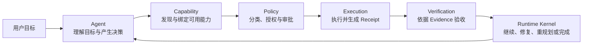

# Kite Code 六概念 Runtime 架构

状态：active

读取时机：理解或修改 Agent 主循环、Runtime Kernel、Capability、Policy、Execution、Verification，以及 MCP、Skill、Subagent 的跨模块职责时。

验证：`bun test tests/runtime/failure-mode-conformance.test.ts tests/runtime/agent-deadline.test.ts tests/runtime/kernel.test.ts tests/runtime/resource-budget-admission.test.ts tests/runtime/tool-concurrency-budget.test.ts tests/runtime/runtime-scheduling-policy.test.ts tests/runtime/failure-taxonomy.test.ts tests/runtime/schema-v17-migration.test.ts tests/runtime/tool-outcome-recovery.test.ts tests/subagent-delegation-contract.test.ts tests/subagent-continuation-codec.test.ts tests/subagent-runner.test.ts tests/git-broker.test.ts tests/runtime/git-tool-controller.test.ts tests/session-manager.test.ts`、`bun run check:docs`、`bun run check:core-boundary`、`bun run typecheck`。

相关：ADR-0001、ADR-0007、ADR-0008、ADR-0021、ADR-0022、ADR-0024、ADR-0031、ADR-0032、ADR-0048、ADR-0049、`mcp-runtime-governance.md`、`verification-governance.md`、`capability-progressive-disclosure.md`。

## 1. 两个正交视角

Kite Code 同时使用两套互不替代的架构视角：

- `protocol → core → app` 是物理分层，约束代码依赖方向；
- `Agent → Capability → Policy → Execution → Verification` 是业务流水线，Runtime Kernel 作为唯一事实与调度中心贯穿全程。

六概念模型不是新增第 四层，也不改变 `app → core → protocol` 的依赖规则。它用于说明 `src/core/` 内部职责如何划分。



## 2. 六概念到目录和核心实现的映射

| 概念 | 当前目录 | 核心实现 | 架构职责 |
| --- | --- | --- | --- |
| Agent | `src/core/runtime/agent.ts`、`src/core/controllers/model-controller.ts`、`src/core/model/`、`src/core/prompts/` | `runRuntimeAgent()`、Model Controller | 理解目标，结合 Runtime 投影调用模型，产出工具调用或最终回答；不直接改变持久状态 |
| Runtime Kernel | `src/core/runtime/` | `AgentKernel`、`RuntimeState`、`RuntimeEvent`、`RuntimeEffect`、`decideNextEffect()`、`reduceRuntimeState()`、`RuntimeStore` | 唯一事实中心和状态转换权威；根据 State 调度 Effect，通过 Event 更新 State |
| Capability | `src/core/capabilities/`、`src/protocol/capabilities.ts` | `CapabilityDescriptor`、`CapabilitySnapshot`、`CapabilityBinding`、`createSnapshot()`、`createBinding()` | 统一描述 Builtin、MCP、Skill 与 Subagent；使用稳定 ID、不可变 revision 和轮次绑定 |
| Policy | `src/core/policies/`、`src/core/sandbox/`、`src/core/harness/tool-policy.ts` | `RuntimePolicy`、`PolicyDecision`、`createModePolicy()`、`buildToolApproval()` | 对有效副作用进行分类，执行模式限制、授权、审批和技术隔离 |
| Execution | `src/core/runtime/executor.ts`、`src/core/controllers/tool-controller.ts`、`src/core/execution/` | `createRuntimeEffectExecutor()`、`executeRuntimeTools()`、`ToolExecutionRequest`、`ExecutionReceipt` | 执行已经解析并获准的能力，持久化 invocation intent、结果、副作用和 artifact |
| Verification | `src/core/verification/`、`src/protocol/verification.ts` | `VerificationSpecV1`、`executeVerificationEffect()`、`resolveVerificationMode()` | 使用 Receipt、Artifact 和外部查询形成证据，决定通过、修复、重规划、补偿或 waiver |

仓库采用 TypeScript 的类型、纯函数和少量状态类组合，因此这里的“核心实现”不要求都是 `class`。`AgentKernel` 和 `McpConnectionManager` 是显式类；Scheduler、Reducer、Policy 和 Verification 主要通过类型与纯函数表达。

## 3. Runtime Kernel：唯一状态转换权威

Kernel 的基本循环是：

```text
读取 RuntimeState
  → decideNextEffect(state)
  → 执行 RuntimeEffect
  → 产生 RuntimeEvent
  → reduceRuntimeState(state, event)
  → 持久化 event / snapshot
  → 再次调度
```

目录内职责如下：

```text
src/core/runtime/
├── agent.ts       Agent 与模型循环入口
├── kernel.ts      AgentKernel，状态转换和 Effect lease
├── state.ts       RuntimeState 及 capability/skill/verification 投影
├── events.ts      已发生的事实
├── effects.ts     下一步准备执行的动作
├── completion-guard.ts  CompletionGuard V1/V2 的纯 completion decision 与版本路由
├── plan-continuation.ts  历史 V1 executing 的只读/replan continuation 门禁
├── scheduler.ts   State → Effect 的确定性决策；连续免审只读调用最多 4 个成批；需审批的同消息连续 shell 逐项批准、立即启动并可与后续审批重叠；交互/写入/未知调用保持边界；V1 executing 只放行 read_plan/write_plan V2 replan；用户主动拒绝（approval_rejected）且无后续用户消息时返回 stop
├── reducer.ts     State × Event → State；approval.rejected 和 tool.rejected 均写入 transcript ToolMessage
├── executor.ts    Effect 执行适配
├── runner.ts      驱动 Kernel
├── store.ts       event、snapshot、恢复与文件原像持久化
└── invariants.ts  Runtime 不变量
```

Capability、Skill 和 Verification 不得直接修改 RuntimeState。任何具有恢复价值的变化都必须先形成 Runtime Event，再由 reducer 归纳为当前事实。`user.command_invoked` 是例外：持久化以供审计与 TUI 重放，但 reducer 视为 no-op，不进入模型 transcript 也不改变 RuntimeState。

缺少 `planSchemaVersion=2` 的 executing Plan 只代表可读取/replay 的历史事实，不提供新的执行授权。
Scheduler 只直接运行读取当前 Plan 或用原 identity 保存 V2 replan 的调用；两者不存在时产生受限
`call_model(toolSurface=legacy_plan_recovery)`，其 preflight、Provider tools 与 Context Projection 都只包含
`read_plan`/`write_plan`。Runner 在外部 `prepareEffect` 后再次执行同一门禁；Model Controller 把历史 queued
和模型伪造调用归约为 rejection，Tool Controller 在 direct-call 边界再次拒绝。该门禁不改变 reducer 对
既有历史 event tail 的归约，也不打开 `promptContractV2` 默认值。受限 model preflight 请求的 pending
`compact_context` 是唯一额外允许的内部 admission effect，必须匹配当前 compaction identity，不能携带任务副作用。
unknown external invocation 与全部 awaiting interaction 是更高优先级 barrier；scheduler 和 runner guard 都必须
先保持它们的 reconciliation/interrupt effect。受限 response 将 surface 作为 metadata 持久化；无合法 replan 的
final 或伪造工具按 legacy CompletionGuard V1 进行一次 correction，第二次以 aborted/error 收敛。非白名单 malformed
Tool Call 先执行 surface rejection，白名单 Plan 工具才保留 invalid-args 分类。
Runner 以 `lease.effect.toolSurface` 为唯一权威，对 executor 返回、emit 与 `persistEvent(s)` 三条路径的最终
`model.responded` marker 进行统一绑定；普通 model lease 也不能接受伪造的 recovery marker。白名单工具只有
成功 `read_plan` 可继续，任何 terminal failure 都消费 correction，`write_plan` 只有产生 V2 draft 才退出门禁。
canonical legacy subagent recovery 仍是更高优先级 effect，并由 continuation guard 精确放行。
Runner 在 `prepareEffect` 后基于最新 state 再次取得 Scheduler canonical decision，并按 effect type/identity 比较
语义等价性；预算预检可为 canonical model call 添加 resource estimate，但不能把任何更高优先级 barrier 换成
形式合法的 restricted model call 或 Plan tool run。不等价候选统一 fail closed 为 recovery block。

Legacy V1 executing 的旧 queued call 不等待下一次 Provider response 才治理。Scheduler 先按原队列顺序产生
`run_tools`，Tool Controller 在任何 adapter I/O 前把非 Plan call 终结为稳定 rejection；随后才允许 restricted
Provider dispatch。因此 Provider failure 不会留下仍 queued 的历史副作用调用，且 unknown invocation barrier
仍先于该清理链。

模型流增量是另一类明确例外：`model.text_delta`、`model.reasoning_delta`、reasoning 段边界 `model.reasoning_completed` 以及 shell `tool.progress` 只用于当前进程的即时展示，不是可恢复事实，不进入 reducer、event store、snapshot 或 session log。Runner 仅在产生这些瞬态事件的 effect lease 仍为 current 时向 App 转发；并发 shell progress 复用同一 tool ownership 判定但不 reduce、不持久化、不推进 revision，pending producer queue 按 call/stream 合并为有界 tail。过期 lease 的晚到事件必须丢弃，started/terminal 等 durable fact 仍作为 ordering barrier。终态 `model.response_received` 与 `tool.finished/failed/cancelled` 才是可持久化、可重放的完整事实。模型服务暂时断开时，Model Controller 在同一 effect 内重试流消费，抑制 text 与 reasoning 已经交付的公共前缀；恢复流发生分歧时，从新尝试的差异处继续发出增量，App 负责保留旧段并开启新的显示段，Runtime 不把显示分段提升为持久状态。

Shell 的 `tool.progress` 同样是瞬态展示事件，不修改 RuntimeState，也不逐行写入 event store 或 snapshot；可恢复的完整结果只来自后续 `tool.finished`。Runner 在同一 `toolCallId + stream` 上有界合并尚未消费的完整行，并沿用 effect/concurrent-shell lease 所有权检查；任何 durable lifecycle 或 terminal 事件都是顺序屏障。TUI 再按展示帧合并进度、只保留有界 tail，并保证在对应 terminal 事件前排空；后台会话可以淘汰或合并 progress，但不得以 progress 替换 terminal fact。

Runtime schema v15 将 transcript message identity、结构化 Tool Result 和 M2 checkpoint lifecycle 作为可恢复事实持久化。Kernel 为新产生的 user/model/tool transcript event 固化 `createdAt`，reducer 分配 turn、ordinal 和稳定 message ID；工具结果元数据同时投影到 `ToolCallRecord` 与 transcript。旧 snapshot migration 只补齐可确定的身份默认值，不从 stdout 反向推断 path、command 或其他结构化结果。

`createAgentKernel` 优先从 RuntimeStore 恢复 snapshot；恢复态若有旧 `mode` 或 `authorization.mode` 与显式请求参数不同，Kernel 使用当前请求值覆盖恢复态，防止上一轮次的 `accept_edits` 模式残留到当前 `full` 或 `auto` 轮次。

`RuntimeState.context` 保存 active checkpoint、pending compaction、最近失败与有界历史，不保存 `lastPreflight`、请求环境 digest 或 Effect lease。压缩通过 `context.compaction_requested/completed/failed/reset` 事件和 `compact_context` effect 进入同一个 State → Effect → Event → State 循环。Effect 开始和模型返回后分别解析实际 projection environment；环境变化产生 `stale_context` failed 终态、清除 pending 并拒绝 checkpoint。Runtime 恢复按 snapshot event position 严格重放 event tail；损坏 active checkpoint fail closed 为 `unrecoverable_checkpoint` correctness block，已完成事件不会重复激活。

Runtime schema v17 将当前 turn 的 `active/completed/aborted` 生命周期和 abort 诊断持久化。Scheduler 对 completed 或 aborted turn 始终返回 `stop`，只有新的 `turn.started` 才能重新开放调度。迁移旧 snapshot 时，Kernel 从 snapshot position 之前已经落盘的 `turn.completed` / `turn.aborted` 恢复终态，避免进程恢复后把已取消 turn 误判为可继续并再次调用模型。

Runtime schema v19 在 v18 `ResourceBudgetV1` run-scoped 累计 ledger 上增加持久化 FIFO waiter
和结构化 terminal outcome。父 Agent 与 descendants
共享一个 `runId`、累计 usage 和 reservation map；`resource_budget.configured/reserved/
dispatch_started/reconciled/released/unknown` 以及 waiter enqueue/promote/cancel/timeout 事件
通过现有 event + snapshot 单事务持久化。

Runtime schema v20 保留 v19 的 ledger、waiter 与 terminal outcome，并新增每个 Tool Call 的
durable `network.admission_decided` receipt。网络 controller 在任何已批准 socket 打开前先提交
allow/deny event；reducer 以 receipt digest 幂等追加到对应调用。迁移 v19 snapshot 只升级
schema version，不虚构历史 network decision。并发调用各自持有 invocation/hop 和 endpoint
revision，不能复用 sibling 的 admission。

Runtime schema v21 保留 v20 全部网络事实，并新增 redacted `mcp.egress_decided` receipt。远程
HTTP MCP 的正文许可绑定 invocation/server/endpoint/Tool/最终参数 digest，Manager 在 SDK
dispatch 前校验进程内 nonce，并由 Runtime Store 在 receipt event 同一事务中以全库唯一键
claim nonce digest；Runtime 只有在该 durable claim 成功后才允许请求，重启或 sibling process
不能复用仍有效 permit。迁移 v20 snapshot 不为历史调用虚构 egress decision，receipt 不持久化
raw arguments、正文或 nonce。

Runtime schema v22 为 CompletionGuard V2 建立可信 replay 边界。当前 V2 Plan 的 `run.completed` 与
`completion.blocked` 只能使用 V2 decision 和完整 `{planId, version, structuralDigest}`；event payload 自报 V1 不构成
legacy provenance。只有 Kernel 从 v21 或更早 snapshot 的持久化 tail 做 migration replay 时才可按 V1 读取历史事件。
V2 correction ceiling 绑定 guard version 与完整 Plan identity，跨 turn 和 restore 保持；identity revision 改变或不再存在
相关 V2 Plan 时才重置。current 与 migration reducer 都先拒绝不匹配当前 turn 的 `run.completed`，migration replay
严格采用 journal position 顺序。迁移后的 rolling snapshot 通过 `appendEventsAndSnapshot` 在同一事务中 CAS restore
读取到的 snapshot metadata 与 event-tail 末尾；并发 append/snapshot 变化触发重新 restore/replay，不能让旧 state
继承竞态之后的 event position。不可纠正的 V1/V2 completion blocker 也使用 Kernel batch，在向 consumer 暴露
attempt 2 前原子持久化 `[completion.blocked, turn.aborted, run.error]`；消费中断或进程恢复都只能观察 terminal stop，
不能从 blocked 边界重新调度第三次模型请求。

Runtime schema v23 在每个当前 Tool terminal event 内写入唯一严格的 canonical
`ToolOutcomeV1`；reducer 只生成一个 transcript ToolMessage。Envelope 由 Kernel 边界在持久化和发布前合成
status、FailureKind/detail、dispatch/effect certainty、recovery lineage 与可信 timing，ToolSpec
只能提供可收紧的 metadata advice。current reducer、TUI、Session Logger 与 metrics 不再读取 legacy
结果字段作为 outcome。独立 historical replay decoder 将旧 event 缺失 outcome 映射为
`legacy_unclassified/unknown/never`；存在但结构非法或 classifier 缺失/抛错/冲突时映射为
`unknown/never`，不从 stderr 或 result body 推断。

同一 schema 还持久化 parent/subagent 共用语义的 `ToolRecoveryJournalV1`。journal 的随机 HMAC
key、invocation fingerprint、failure instance 和 lineage 只存在于 canonical private Runtime
state/continuation，不进入 SessionLog 或 observability。retry record 必须在一次受信 safe-read
自动重放前先落盘；模型参数修正和自动重放分别最多一次，restore 不重置次数。policy/approval
deny、timeout、cancel、unknown effect 和仅有 idempotency key 而无 receipt 的调用不重放；malformed
journal restore 或同一 recovery root、同一工具、同 task/turn 与同 progress revision 的第六次无进展
failure 会 fail closed 为 quality block，明显早于 250 次资源上限。参数变化不能重置同一恢复链的计数；
没有共同 `recoveryOf` root 的独立调用即使工具名和 fingerprint 相同，也只累计有界 observation，不能仅因
总数达到十二次而封锁整轮。单次 failure 的真实模型修正/自动重放额度仍分别最多一次；额度外提案保持
零 dispatch suppression，但不能在第一次被拒时直接把整个 scope 提升为 `no_progress`。
failure 还绑定 owning task、turn 与紧随其后的 eligible model response，并在该响应中由 Runtime 唯一绑定
一个具体 `toolCallId`；未被绑定的同名或异名 sibling 不能消费该 failure 的恢复额度。task/turn close 会把记录移出
新 scope；只有成功 `recoveryOf` receipt，或 Runtime-owned skip/replan/user action、Provider/capability
revision 才能把失败标为 recovered、推进 progress revision 并解除对应链；无 lineage 的无关成功 receipt
不构成该链进展，不能重置其计数。restore 从 failures 推导 quality block 时必须保留触发链的 task/turn scope。
deny/never、timeout、cancel、unknown effect、terminal exhaustion 和
`next_response_elapsed` 在原 scope 继续保留 suppression 与 CompletionGuard blocker，不得把“额度耗尽”
当作恢复。`alternative` 可在下一 eligible response 选择不同 capability，但必须由 Runtime 绑定
受控 `capabilityIntent` 对应的具体调用及 `recoveryOf`，不能把响应中的任意工具当作 alternative。
CompletionGuard 只读取当前 task/turn 真正 active 的 blocking/quality state，历史 deny
不会永久阻断后续任务。quality block 仍允许 `write_plan/update_plan/read_plan/ask_user/tool_search`
形成替代进展。

canonical identity 对已解析调用使用当前 ToolSpec 或动态 MCP binding 的 schema defaults 与 revision；
解析前失败把 raw equality 立即写入私有 HMAC，不持久化参数正文。自动 safe-read replay 的
`tool.retry_recorded` 必须先得到 RuntimeStore durable ack；持久化缺失、返回 false 或抛错都在第二次
Provider dispatch 前停止。Kernel 原子 batch 逐事件用前一事件产生的 next state 合成 envelope，
因此 `[tool.started, tool.finished]` 的 terminal certainty/timing 不会读取陈旧 state。
生产 safe-read retry 还要求唯一一次有效 `tool.started` 已由 Kernel reducer 持久化；随后
`tool.retry_recorded` 才能记录 attempt/recoveryOf 并授权第二次 dispatch。ack 后崩溃重启不得重置
ceiling。MCP readiness 是 provider/capability dispatch 之前的生产边界：首次 readiness failure 使用
`not_started/none/pre_dispatch` authority，durable retry ack 后才允许第二次 readiness attempt 与唯一一次
capability dispatch。restore 对 journal 重新计算 canonical failure ID，并验证 map/order/outcome lineage、parent
recoveryOf、attempt counters 与 progress revision；伪造相互一致的 ID 也不能绕过重算。
schema v23/current snapshot 或当前 Subagent continuation 缺少 recovery journal 本身就是损坏状态，
restore 必须 quality-blocked；只有 pre-v23 migration 可以初始化空 journal。当前 auto-review 风险判定
使用 `escalatedToUser` 保持非终态并转人工审批；只有历史 auto-review rejection 在 replay 和下一次 model
projection 中追加一个与原 AI tool call 配对的 ToolMessage。
损坏 journal 使用 `journal_invalid/persistence_unavailable`，普通 no-progress ceiling 使用
`no_progress/loop_exhausted`；二者由同一 terminal outcome 驱动 Session、metrics 与 TUI。
task 子 Agent 的完整 result 只在 Controller 私有侧用于 journal merge，模型面只接收显式 public DTO，
不会 JSON stringify continuation、execution journal、exhausted fingerprint 或 recovery key/lineage。parent
reducer 与 child provider context 复用唯一 public projection helper：success 为 `stdout || stderr || ''`，failure
为 `stderr || stdout || ''`，输入同时包含 `ok` 与 terminal status。Sandbox fail-closed boundary 以 Runtime-authored
`terminationReason=sandbox_denied` 分类为 `sandbox_error/sandbox_denied`，不解析 stderr，也不调用底层命令；受控
fallback sentinel 与 persisted authorization-widening event 计数提供可突变的零调用/零放宽证据。

Child 执行上下文也必须由 Runtime 签发而不是模型自报：Subagent 入口一次规范化 canonical Workspace，并将同一路径用于模型 `Workspace`/`CWD` 和工具执行；子工具显式继承父 Runtime 当前的 interaction mode，审批恢复重新读取 live mode；文件 freshness 则以 Runtime 签发、在 continuation 中稳定的 child id 与 Parent/sibling 隔离。进程重启未恢复该内存状态时以 `not_read` fail closed。
`journal_invalid` 对所有 journal mutator 都是吸收态，因此同一 Kernel batch 中 child merge 后紧随的
task success 也不能清除 hard block。其 task/turn scope 只用于 provenance，scheduler/admission 必须在
下一 turn、新 task、task close 与 SQLite restore 后继续全局 `persistence_unavailable` 零 dispatch 阻断；
普通 `no_progress` 才按原 scope 隔离。Scheduler 在 correctness hard-block 阶段先于 interaction、legacy、
queued tools、verification、completion 与 compaction 检查损坏 journal；Controller direct 入口和 Runner
prepared/admission/lease 边界再防御性重验；Runner 在 preparation 后对 `journal_invalid` 和 scoped
`no_progress` 都重新采用最新的 `recovery_blocked` decision，阻止已经准备或租赁的 stale effect。
bounded journal 的 128 条裁剪以 lineage closure 为单位，优先
active/recent 记录；不能保留 child 却删除其 `recoveryOf` parent。Runtime invariant 只要求 live call 的
lineage parent 仍 retained，已经 terminal 的历史 ToolCall 不会迫使 bounded journal 永久增长。

reservation ID 是幂等键，dispatch 后未知结果保守占用 executable upper bound，只有证明未
dispatch 的 `reserved` 才能 release。v17 及更早 snapshot 迁移为
`legacy_unconfigured`，不会伪造余额；v18 ledger 保留 reservation，并补齐空 waiter queue。
恢复时未 dispatch 的 reservation 自动 release，已 dispatch 无 terminal 的 reservation 转
`unknown` 且不退款/重放。

Runner 对 model、compaction、auto-review、Verification、builtin/MCP/Skill/Sub-agent tool、
Provider recovery 和 artifact-writing tool 在副作用前执行 admission。preparation transaction
先原子持久化 reservation/queue promotion，再单独持久化 `dispatch_started`；tool/capability
terminal facts 与 actual reconciliation 在一个 result transaction 中提交。并发调用使用按
resource 的 FIFO sequence；shell 同时要求 `tool + shell_invocation` compound permit，不持有
部分额度。主模型 reservation 使用将要发送给 Provider 的同一 context projection 精确计量
input，并把实际请求的 max output clamp 到剩余 run budget；projection 在 reserve 后变化时
拒绝 dispatch。Sub-agent parent 只持有 lifecycle/concurrency，每个 child 模型及工具/Shell/MCP
调用都通过 `parentReservationId` 进入同一 durable ledger；artifact bytes 计入产出它的 child
tool/MCP reservation，不伪造第二次 invocation。暂停恢复使用新的 parent attempt。child tool
waiter 与顶层调用共用 durable FIFO sequence，promotion + reservation 原子持久化；等待期限为
concurrency deadline 与 run deadline 的较早者，Abort 会取消仍在等待的 durable waiter。稳定结果区分
`tool_concurrency_saturated`、`shell_concurrency_saturated` 和 `budget_exhausted`。Sub-agent
Provider/tool dispatch 后失败会把 child 标记 unknown，不能由 parent 粗粒度结算掩盖。
未知 invocation 返回 `reconciliation_required`，不伪装成 budget exhaustion。child admission
拒绝不会被折叠为普通 tool/Subagent error，而是进入与顶层相同的 failure-mode terminal adapter。

`boundedCancellationV1` 使用 budget deadline 驱动统一 AbortSignal。取消事务先 release
undispatched reservation、把 dispatched reservation 转 unknown 并取消 FIFO waiter；late
terminal 不能改写工具/turn 终态；父或 child reservation 只有通过 Kernel 专用的 bounded late
resource reconciliation 入口才能从 `dispatch_started/unknown` 提交 actual usage，该入口不接受
工具/model terminal event，不能复活调度。未确认进程退出使用 `cancel_incomplete` 并保留 unknown。

`RuntimeSchedulingPolicyV1` 从实际 scheduler 常量导出 parallel-read allowlist/ceiling/barrier、
shell overlap/approval/rejection、FIFO compound admission 和 late-event policy 的唯一 canonical
snapshot/digest。Release tooling 只能 hash/消费该 snapshot。默认关闭的 `resourceBudgetV1`
不能单独生成 production 资格。

Task 1C.5 的 `resolveFailureModeV1()` 将 RFC failure matrix 固化为封闭 Core policy table。它在不
解析展示字符串的前提下统一 continue/block/degrade、自动新 invocation 数、durable/external
effect 状态、terminal reason、safe retry、recovery、pending verification 与 fallback。预算准入
和 run deadline producer 已直接接线；suite 将全部 terminal resolution 通过 Core snapshot
recovery、CLI 与 TUI 的共同投影复测。其他 capability producer 必须显式接线或增加等价入口
contract test 后才能声明 coverage。缺少 external-effect 证据时 fail closed 为 `unknown`，已有
证据做保守合并；未 reconciliation 时不得继续或降级。调用方只能进一步收紧结果。

CompletionGuard 也是同一 Kernel 的纯、单调版本化 decision：scheduler 在 `emit_final` 前、runner 在持久化前、
reducer 在接收 `run.completed` 时都按 guard version 重新评估 canonical state。V1 保留 legacy replay 与无 Plan task；
只有 PlanDocument V2 使用 V2，额外拒绝缺失 required verification、effect receipt reference、unresolved evidence 或
evidence/Runtime 投影不一致。final 文本不能绕过 Plan lifecycle、非终结 Tool/interaction、suspended subagent、unknown
invocation 或 active Skill；同一 V2 `{planId, version, structuralDigest}` 首次阻断最多请求一次模型纠正，第二次以
blocked error/aborted turn 收敛。`completion.blocked` 只保存 guard version、低基数 reason/next action、planning
lifecycle、完整 Plan identity 与 attempt；V2 `run.completed` 绑定接受 decision 的相同 identity，不保存模型正文或参数。

Context compaction 当前只有一条 Markdown narrative 管线。专用 summary request 使用当前对话模型、空工具集、确定性温度和零 SDK retry；输入只包含最小固定 prompt、已有 checkpoint narrative、全部 safe settled history 与作为不可信数据的 custom instructions，不携带普通 Agent system prompt、工具 schema、live tail 或动态 RuntimeState。模型内容产物只有规范化 `summary: string`，不生成工具结果投影、JSON、fact/evidence ledger、file ledger、repair、chunk 或 merge 产物。首次和增量压缩都只调用模型一次；manual 总结全部安全历史，auto 保护当前 turn 后总结其余安全历史，增量输入为旧 narrative 加 checkpoint 后的全部 safe history，整体替换 active checkpoint。显式 summary input 上限超出时整体失败，不得静默总结局部前缀。输出必须非空、未因长度截断、没有 tool call、可序列化且不超过 narrative 上限。Manual 与 auto 共享至少 1024 token 的统一绝对缩减门槛；target ratio 只作诊断。Checkpoint 保存 Markdown 与 Core 生成的 boundary、digest、revision 和 estimate；统一 serializer 规范化 LF、移除外围空白并 XML 转义后，生成且只生成一个历史区首位的 `<compacted_history>` assistant frame。

Model Controller 术语（模型控制器）在 Provider 调用前通过统一的 `buildContextProjection()` 入口计算 context pressure 术语（上下文压力）：`normal / warning / compact_due / hard_limit / unknown`，默认 warning/compact/hard 阈值为可用输入预算的 80%/90%/94%。`ResolvedModelCapabilities` 的每个字段只从所选模型显式配置、adapter runtime metadata 或 `modelKwargs` 兼容配置独立解析，并记录 `explicit_config | adapter_runtime | compatibility_config` source；缺失字段保持 unknown，布尔能力保持 true/false/unknown 三态。模型名称和默认模型列表不提供 context window、max output、tokenizer、usage 或 prompt-cache 能力。未知 window 或 output reservation 不产生隐式 4096 预算，不显示利用率，也不运行 ratio auto；用户可显式设置 `compactAfterEstimatedTokens` 绝对策略。正常模型调用、compaction effect 术语（压缩副作用）与 `/context` 通过同一个 `resolveContextProjectionEnvironment()` 重建当前工具、Skill 与 capability 环境；before/after 必须共享该环境，正式 acceptance 术语（验收）不读取旧 preflight 的 estimate。自动模式为 `off | shadow | live`，原因只允许 `manual | auto`。live 命中 compact 阈值后先执行自动压缩；失败或取消时以原请求 turn id 阻止同 turn 普通模型调用，下一用户 turn 重新 preflight，并允许该恢复尝试绕过旧 cooldown/breaker。已有 checkpoint 时执行增量压缩；Core 不从通用 Provider HTTP 400 或错误文本推断 overflow 术语（上下文溢出），也不对 summary 失败执行工具输出清理、分块或自动重试。

模型控制器默认请求流式输出；adapter 未声明或未实现流能力时才使用非流式调用。`ResolvedModelCapabilities.streaming` 与其他能力字段一样按显式配置、adapter metadata、兼容配置的优先级独立解析，不能由模型名称推断。流式与非流式路径必须生成相同的终态 `AIMessage` 语义，确保 Capability binding、Policy、Execution 和持久化行为不因展示方式改变。

Tool runner 在任何模型可见截断发生前计算 `rawResultDigest`，截断后由 Tool Controller 计算 `modelContentDigest`；兼容字段 `contentDigest` 指向模型可见内容，`digestScope` 标记其为 `raw` 或 `projected`。M2 completed effect 只把真实 `rawResultDigest` 暴露为 summary 的 `rawResultDigest`，不得把 projected digest 冒充原始结果摘要。

手动 `/compact` 同样不能绕过 Kernel。App shell 对空闲 session 可打开 Kernel 并执行单次 `compact_context`；若 agent loop 正在运行，则使用其暴露的受限 live control 只注入 RuntimeEvent，依靠现有 scheduler 排队。Live control 不暴露可变 State 或直接 reducer，外部事件推进 revision 后，正在运行的旧 effect 仍由 lease 机制判 stale。

`/permissions` 在运行中的选择也走同一 live control：App 只提交带用户 source 与时间戳的
`interaction_mode.changed`，Kernel 在持久化前验证 Full-qualified sandbox，并由 reducer 同步 mode 与
authorization provenance。该事件推进 revision；旧 mode 的未提交 effect 必须判 stale，不能绕过新的
权限选择。

MCP Provider Action 也遵循同一边界。typed provider failure 先把原 Tool Call 终结为 `failed`，再由独立 interaction 调度 App shell；原调用不重新入队。恢复完成事件与新的 `turn.started` 一起提交，确保后续 binding 不可能沿用旧 turn。

RuntimeStore 的所有连接必须使用同一 journal 策略。默认在 Linux/macOS 使用 WAL；Windows 使用 DELETE journal，规避 Bun 在关闭 WAL 数据库后仍持有 WAL/SHM 文件锁的问题。连接必须在设置 journal mode 或执行 schema 写入前先安装 5000 ms `busy_timeout`，使 journal、schema 与事件写竞争都受有界等待约束。TUI 的长期 stats 连接与 AgentKernel 的 RuntimeStore 连接必须从同一策略函数取值，禁止分别硬编码 journal mode。关闭 Store 时先 finalize 缓存 statement，再执行适用的 WAL cleanup/checkpoint，最后关闭数据库。测试可通过 `faultInjectionMaxPageCount` 构造确定性 `SQLITE_FULL`；生产组合根不得设置该选项，详见 `runtime-resilience-qualification.md`。

RuntimeStore 的 rewind sidecar 在每个检查点窗口保存最早文件原像和最后一次 Kite 成功写入后的
内容指纹；恢复只有在当前内容仍匹配该指纹时才能覆盖文件。`forkSession()` 严格解析源事件，复制
选中边界及更早的 named snapshot 和文件原像，并把 event position 重映射到新 thread；源会话保持
不变。`restoreRuntimeStateFromStore()` 只负责严格读取、迁移和 event-tail replay，不执行持久化或
reconciliation 副作用；`createAgentKernel()` 才保存迁移快照，并把未终结 invocation、reservation
和 waiter 收敛为可审计的 unknown/released/cancelled 事实。这样 Session 列表读取不会因观察历史
会话而改写 Runtime Store，真正恢复执行时仍保持保守收敛。

Runtime fault/soak 的正式资格证据不是任意本地测试输出。qualification 报告必须把 GitHub repository、head SHA、ref、`workflow_ref`/`workflow_sha`、run ID/run attempt 与固定 seed/iteration 写入 canonical digest，保留逐 attempt 资源结构和 Runtime ledger receipt provenance，并由独立 verifier 重建 case/aggregate 摘要；缺少来源身份只能得到 `inconclusive`。digest 本身不提供真实性，Release Gate 还必须绑定成功的 GitHub Actions run 与被审查 head。这一证据边界不改变 Runtime 的运行时 schema，但约束哪些测试结果可以进入 Release Gate。

Safe boundary 只覆盖从最旧消息开始的完整、settled、身份稳定 turn；assistant tool call 必须在边界内恰好有一个 result，非终态 tool、交错 turn、缺失或重复 pair 都会 fail closed。候选 before/after 都经统一 `buildContextProjection()` 构建，且不修改持久 transcript。`ContextHardBlock` 只通过要求 invariant reason、source digest、turn 和非空诊断证据的 correctness factory 创建；恢复事件必须精确匹配原 reason 与 source digest 才能清除。

## 4. Capability：统一能力身份

Builtin Tool、MCP Tool、MCP Resource、MCP Prompt、Skill 和 Subagent 都是 Capability，不是新的顶层架构层。

```text
Capability Provider
├── builtin    src/core/tools/
├── MCP        src/core/mcp/
├── Skill      src/core/skills/
└── Subagent   src/core/subagent/
```

能力的权威身份是 `capabilityId + revision`。例如：

```text
builtin:read_file
mcp:github/create_issue
skill:create-release
subagent:review
```

模型看到的工具名称只是当前轮的 `CapabilityBinding`。执行前必须重新核对 binding token、turn、capability revision 和参数 schema。Catalog 变化不会原地修改旧 binding；旧 binding 必须 fail closed。

Capability discovery 只回答“系统有哪些能力”，不构成授权。大目录可通过 `tool_search` 渐进披露；MCP provider directory 还可提供不可执行的 unavailable 摘要。两种搜索结果都不授予执行权限，只有当前 revision 的 available descriptor 才能在后续 turn 形成 binding。

MCP Tool 的按需披露会把搜索命中的 `capabilityId + revision + firstLoadedAtTurnId` 持久化为 session-loaded set；恢复后的每个新 turn 都重新签发 Binding，并在 descriptor 漂移、禁用、删除时自动淘汰。MCP Resource 列表与读取由稳定内置工具访问，不进入 loaded set 或 Binding。Tool/Resource 调用失败必须形成成对的 Tool Result，不能因 Provider 或适配逻辑异常中断会话。

## 5. Policy：发现与授权分离

Policy 使用本地计算得到的 effective effects，而不是直接相信 provider 声明。它依次处理：

```text
参数与 binding 有效
  → 副作用分类
  → 当前 mode 是否允许
  → 是否需要 workspace trust
  → 是否需要 auto review 或用户审批
  → 选择 sandbox / network 边界
```

MCP annotation、Skill manifest 和远端描述都是不可信声明，只能辅助分类或收紧能力，不能扩大用户授权。未知、写入或破坏性外部副作用默认进入保守路径。

Sandbox 是 Policy 的技术执行手段，不是授权决策本身；获得批准也不代表可以绕过 sandbox。

## 6. Execution：统一执行网关与回执

Runtime 调度出的能力调用通过 Effect Executor 和 Tool Controller 进入具体 provider：

```text
RuntimeEffectExecutor
  → ToolController
      → resolve binding
      → validate arguments
      → classify effects
      → policy / approval
      → persist invocation intent
      → provider adapter
          ├── Builtin tool
          ├── McpConnectionManager
          ├── Skill workflow
          └── Subagent runner
      → normalize result
      → persist receipt / artifact
      → emit RuntimeEvent
```

模型响应中的全部工具调用先以 `tool.queued` 成为可恢复事实。Scheduler 只把连续、
已持久化为 `read_only + sideEffect=false`、无交互语义且经当前 Approval Policy 再确认
无需审批的内置工具组成并行批次，单批最多 4 个；任一交互、写入、未知、动态 MCP 或审批
调用都会截断批次并保持独占。Executor 对批内调用分别进入同一 Tool Controller 链，
Kernel 仍逐事件串行归纳和持久化。队列顺序是调度与协议事实，完成顺序可以不同；模型上下文
中的 Tool Result 仍按 assistant 声明顺序投影并重新计算 transcript ordinal（ADR-0049）。

Execution 不能只返回面向人的成功字符串。`ExecutionReceipt`/`CapabilityInvocationRecord` 保存调用身份、状态、参数摘要、观察到的副作用、外部引用、artifact、重试安全性和 reconciliation 结果。

工具被策略拒绝（`tool.rejected`）或被用户拒绝（`approval.rejected`）时，reducer 同时写入 `ToolCallRecord`（status: `rejected`，含 failure classification）和 transcript ToolMessage（`ok: false, rejected: true`），保证恢复与后续轮次能看到拒绝结果。用户显式拒绝或取消任一工具审批时，action batch 同时把其余未终结调用收敛为 cancelled 并写入 `turn.aborted(cause=user)`；Runner 立即退出，Agent abort 本轮执行信号。只要最近一条带工具调用的 assistant 消息中存在 `failure.kind=approval_rejected` 且其后无新用户消息，scheduler 就返回 `stop`，从而在恢复路径上同样不能继续旧 turn。策略拒绝（`policy_denied`）及其他自动失败继续 `call_model`，允许模型看到拒绝信息后调整策略。若拒绝后已有新用户消息到来（新轮次），scheduler 正常返回 `call_model`，由模型处理该新消息。

`ask_user` 的用户拒答属于输入取消，不属于上述 authorization rejection。Runtime 将它收敛为 `tool.finished(ok=false, stdout=Cancelled)`，不产生 `turn.aborted`；Scheduler 随即再次 `call_model`，使模型在同一 turn 内继续。

`request_plan_review` 是方案执行授权屏障，不是普通输入。用户取消或按 Esc 时，Runtime 保留方案 draft，同时写入 `plan.review_cancelled`、方案工具及其余未终结 sibling 的 `tool.cancelled`、`turn.aborted(cause=user)`；Runner 立即退出，Agent abort 本轮执行信号，不得再调用模型或进入方案执行。

同一模型消息、同一任务中的连续 `shell_execute` 若不能进入前述免审只读批次，则采用逐调用放行：Scheduler 术语（调度器）为单个调用执行策略预检，需要审批时进入既有单审批交互；收到该调用的批准后立即返回它的 `run_tools` effect 术语（效果）。Runtime Runner 术语（运行时执行循环）在其 `tool.started` 后继续调度同组下一个 sibling，所以命令执行可与后续审批重叠，后续调用获批后也可并发运行。每个 Shell 的事件仍由 Kernel 串行持久化；并发 lease 只接受同一 turn、同一 effect 所属且尚未终结的 Tool Call 事件，取消后的迟到结果不能回写。遇到非 Shell 调用、不同模型消息或不同任务边界时必须等待运行中 Shell 收敛，不能跨越方案审核、用户输入或其他工具。用户取消任一审批会终止整个当前 turn，而不是只终结对应调用；`tool.execution_ready` 仅用于旧回放。

外部写入遵循“先记录 intent，再发生副作用”。对无法证明是否成功的调用，Runtime 记录 `unknown` 并禁止盲目自动重放；恢复时先 reconciliation。

`task` 的调度选择归模型编排，Runtime 不解析 active Task 的 `userGoal` 作为委派或 role 授权协议。模型只应委派有界、自包含、独立且值得额外调用的工作，用户明确要求不委派时必须遵守；code 仅用于用户任务要求实施的情形。Project、Shell、工具结果和 external context 不能提升 child 的 authorization、phase、预算、role ceiling 或 execution surface。Subagent 统一串行执行并使用同一 run-scoped 累计预算；生命周期显式区分 running/suspended/terminal，approval 等待是 suspended，恢复后回 running。terminal result 只投影规范 `completed`，是否经历恢复仍由 canonical Recovery Journal 保留，不再复制为第二套 UI/协议完成态。Planning 的 plan child 只能引导 `write_plan:save → write_plan:submit`；failed/cancelled/exhausted/suspended child 不得产生该 continuation。planning plan child 仅在成功 terminal 后进入既有 Plan lifecycle，顶层 completion 仍受已保存并 submit 的 plan identity gate 约束；文本提示本身不构成提交事实。
child 的 schema projection、实际 Registry parse、execution/resume 必须共享 config、phase、interaction mode、authorization、gitBroker 与 availability context；typed Git 不得因 child 路径缺依赖而回退 Shell。

ADR-0097 将 Git 拆为 Core-owned broker contract 与 App-owned process adapter。Runtime capability
surface 保存只读 `gitInspect` 和精确 feature revision；Registry disclosure、
Controller dispatch 与 native `.git` deny/mask 必须原子一致。broker 在任何 process 前执行
repository/binary/config/attributes/replace/grafts/protected-path admission，并以 typed evidence/receipt
将 operation identity、effects 和 timing 交回 Kernel。stage、commit 与 remote Git 不向模型披露且无 raw-shell fallback。typed Git 代码接线不等于 production qualification；当前三平台证据不足，所以 production brokered Git
surface 仍为 excluded。

## 7. Verification：完成不是模型声明

Verification 强度分为：

- `not_required`：普通问答等任务不创建完成门禁；
- `best_effort`：执行并记录验证，失败或不确定可带风险完成；
- `required`：验证未通过时禁止 `run.completed`。

验证使用执行回执、不可变 artifact、文件/命令/schema 断言、MCP read-after-write、外部引用或独立 reviewer。结果为 `passed`、`failed` 或 `inconclusive`。

```text
passed       → 允许完成
failed       → repair / replan
inconclusive → 补充证据、repair 或请求用户决策
budget 用尽  → replan / compensation / user waiver
```

Tool 执行成功只表示一次调用完成，不表示用户目标已经达成。模型输出 final 也不能绕过既有 required verification。

## 8. MCP 与 Skill 的归属

MCP 对 Runtime 暴露中立的 `McpRuntimeProvider`；Runtime 不依赖连接 control API 或 TUI。`McpSupervisor` 组合配置门禁与连接生命周期，并作为唯一 façade 暴露 capability snapshot、脱敏 availability directory 和 revision-bearing `callCapability`。内部 `McpConnectionManager` 负责唯一 SDK client 路径、协议 discovery、health、单次原始结构化调用与资源读取，不实现 Runtime provider，也不从公共 MCP barrel 导出。模型工具名只用于 binding 展示，执行身份始终是 `capabilityId + expectedRevision`。

默认关闭的 `mcpProviderActionV1` 只增加 Runtime lifecycle，不把 control-plane mutation 移入 Core。Runtime 持久化 required/started/completed/deferred/failed，App shell 执行 login/approve/retry；成功后强制新 turn，defer/failure 则留下明确事实。TUI 把 required 事件投影到既有 foreground/background interrupt surface，并由 App controller 委托 Supervisor。

该 flag 也保护 required-provider admission：首次模型调用前，Runtime 把 unavailable required Provider 排入持久 gate。Retry 结果、session waiver 和 cancel 都是事件；waiver 只解除本次 session 准入，不会改变 Capability snapshot 或签发 binding。TUI 与 CLI 均在没有恢复能力时安全降级，且不得绕过持久 gate。

Skill 是受治理的组合 Capability。`SKILL.md` 被编译为 revisioned `SkillWorkflowContract`，生产 catalog 使用当前 Builtin/MCP resolver 计算 `require - deny` 的统一 effective ceiling，并保守合并依赖 effects 与 minimum approval；模型激活先经过正常 approval/auto-review gateway，激活后的 inline/fork frame 使用同一 ceiling，并受到输入输出 schema、verification 和 recovery 约束。无效高优先级候选不能遮蔽有效低优先级 Skill，扫描受固定资源预算约束，忽略目录中的内容不能作为验证或补偿入口。Skill 不再是直接拼接到用户任务的 Prompt 片段。

## 9. 迁移后的核心关系


## 10. 架构边界总结

一句话描述当前架构：

> Agent 决定下一步意图；Capability 提供稳定、可绑定的能力身份；Policy 决定是否允许；Execution 产生可恢复的执行事实；Verification 根据证据决定目标是否达成；Runtime Kernel 根据全部事实继续、修复、重规划或结束。

以下规则必须保持：

1. Runtime Kernel 是唯一持久状态转换权威。
2. Capability discovery、binding 和 authorization 是三个不同阶段。
3. 模型可见工具名不是能力的稳定身份。
4. Provider 声明不能扩大本地权限。
5. 外部副作用必须先记录 invocation intent。
6. Execution success 不等于目标完成。
7. Required verification 不能被 final response、feature flag 关闭或模型声明绕过。
