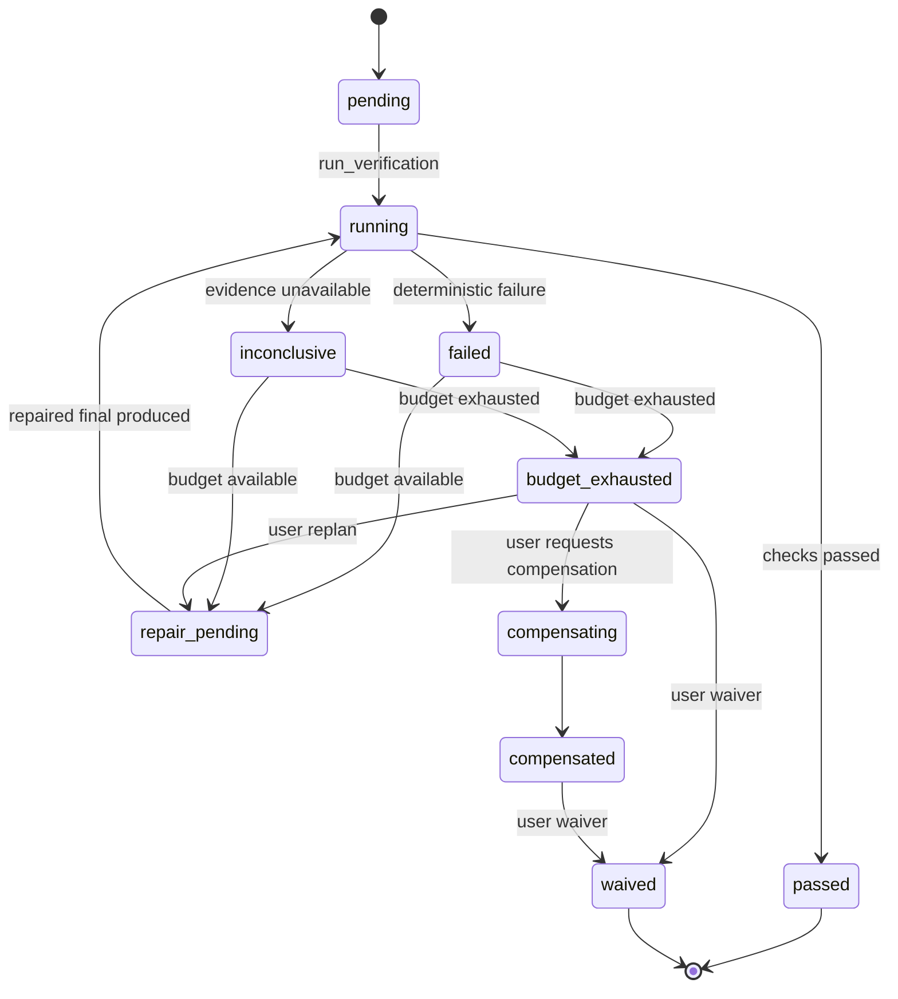

# Runtime 分级验证治理

状态：active
读取时机：修改 `VerificationSpec`、验证策略、验证事件/效果、Scheduler 完成语义、Skill verifier、MCP 执行凭据 reviewer、repair/waive/compensation 时。
验证：`bun test tests/runtime/verification.test.ts tests/runtime/tool-controller.test.ts tests/golden/golden.test.ts tests/session-manager.test.ts`、`bun run typecheck`、`bun run check:core-boundary`。
相关：ADR-0008、`docs/space/plans/2026-07-14-mcp-skills-runtime-governance-followup.md`。

## 当前行为

`verificationV1` 默认关闭。关闭时不会为新的 MCP 调用或 Skill completion 创建验证任务；已经持久化的验证任务仍须继续收敛，不能通过关闭 flag 绕过 required 验证。

有效强度为 `not_required`、`best_effort`、`required` 的单调最大值。Capability effects、Skill contract 和用户明确要求只能提高强度，不能降低既有要求。包含 write、destructive 或 unknown effect 的治理 capability 自动提升为 `required`。

`VerificationSpecV1` 是持久化、版本化且严格校验的协议。支持文件断言、命令、对象根 JSON Schema、MCP read-after-write、外部引用和独立 reviewer。检查按声明顺序运行；确定性检查应排在 reviewer 之前。MCP read-after-write 必须命中当前 capability revision，变化或不可用时返回 `inconclusive`。Reviewer 收到原始 `ExecutionReceipt`、受限 Artifact Store 内容和结构化 Skill output，不接收主模型的完成结论。

Verification executor 通过 Runtime 中立的 `McpRuntimeProvider` 查找当前 descriptor 并执行 MCP read-after-write，不依赖 Supervisor control snapshot 或 TUI。`/mcp` 状态列表显示 ready 不能替代 verification 的 revision 复核。

所有验证状态变更只通过 `verification.*` Runtime events 进入 reducer。状态包含 attempts、repairAttempts、逐项 evidence digest、waiver 和 compensation 结果；Runtime schema 9 为旧 snapshot 补充空验证投影。

## 完成与恢复语义

- `not_required` 不创建执行门禁；普通问答保持直接完成。
- `best_effort` 会执行并记录结果，但失败或不确定不阻止 `emit_final`。
- `required` 的 pending/running 会先产生 `run_verification`；failed/inconclusive 在 budget 内产生 `repair_verification`，把验证失败作为 Runtime system context 重新进入正常模型/工具/policy 链路。
- budget 耗尽、compensated 但未重新验证等状态产生 `request_verification_decision`，在 CLI/TUI 请求用户选择 replan、compensation 或 waiver，不得发出 `run.completed`。
- waiver、replan 和 compensation 只能由 `RuntimeUserAction` 入口产生。Waiver 必须包含理由并持久化 `actor: user`；模型没有 waiver event 或 effect 的生成入口。
- compensation 只有在用户结构化请求后执行。Compensation 成功不等于原结果已验证，仍须 replan/reverify 或用户 waive。

验证命令与 compensation 通过既有 Shell executor 执行并关闭网络；相对 cwd 必须位于 workspace。Skill 的声明脚本位于 workspace 外时会 fail closed 为 `inconclusive`。
