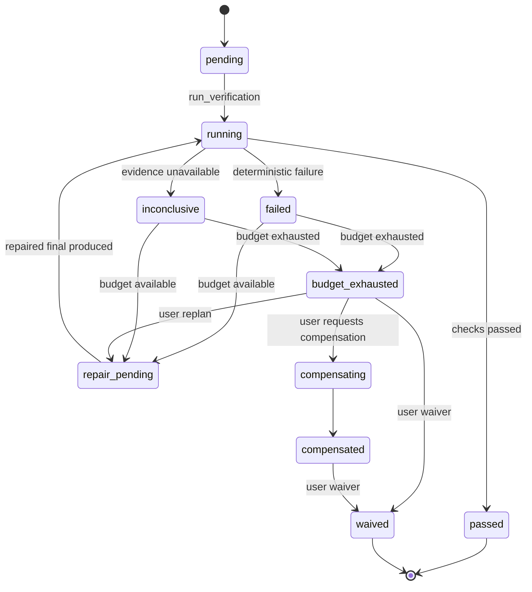

# Runtime 分级验证治理

状态：active
读取时机：修改 `VerificationSpec`、验证策略、验证事件/效果、Scheduler 完成语义、Skill verifier、MCP 执行凭据 reviewer、repair/waive/compensation 时。
验证：`bun test tests/runtime/verification.test.ts tests/runtime/tool-controller.test.ts tests/model-invocation-gateway.test.ts tests/model-invocation-recovery.test.ts tests/golden/golden.test.ts tests/session-manager.test.ts`、`bun run typecheck`、`bun run check:core-boundary`。
相关：ADR-0008、`docs/space/plans/2026-07-14-mcp-skills-runtime-governance-followup.md`。

## 当前行为

`verificationV1` 默认关闭。关闭时不会为新的 MCP 调用或 Skill completion 创建验证任务；已经持久化的验证任务仍须继续收敛，不能通过关闭 flag 绕过 required 验证。

有效强度为 `not_required`、`best_effort`、`required` 的单调最大值。Capability effects、Skill contract 和用户明确要求只能提高强度，不能降低既有要求。包含 write、destructive 或 unknown effect 的治理 capability 自动提升为 `required`。

`VerificationSpecV1` 是持久化、版本化且严格校验的协议。支持文件断言、命令、对象根 JSON Schema、MCP read-after-write、外部引用和独立 reviewer。检查按声明顺序运行；确定性检查应排在 reviewer 之前。MCP read-after-write 必须命中当前 capability revision，变化或不可用时返回 `inconclusive`。Reviewer 收到原始 `ExecutionReceipt`、受限 Artifact Store 内容和结构化 Skill output，不接收主模型的完成结论。

独立 reviewer 使用封闭的 `verification_review` Model Surface purpose，并与 primary、compaction、auto review、
subagent 共用 `ModelInvocationGatewayV1`。Surface Artifact、Provider data admission、resource reservation 与
每次 attempt intent 都必须在 transport dispatch 前 durable ack；Response Artifact 与
`model.invocation_completed` ack 成功前 reviewer 不能解析或消费 response。reviewer terminal 继续引用
invocation id，Provider admission/ack/key/Artifact failure 不得降级为旧模型调用或被包装成可信
`inconclusive` 后退款。RP-01 已提供严格、keyless、无 transport fallback 的 replay Source/catalog
contract，RP-02 已增加不包含 reviewer purpose 的 evaluation-only deterministic pilot；production reviewer
composition 仍显式只接 live Source。当前没有 approved manifest/suite 或 Required CI replay gate，不能把
replay contract 或 pilot 的存在表述为 reviewer 已启用 replay。

当 V2 Plan 通过 `update_plan complete_plan=true` 收敛时，每个 `required` verification 必须已经是
`passed` 或用户 `waived`，并由 Runtime 投影为只含 `verificationId + outcome` 的
`PlanCompletionEvidenceV1` reference。模型不能通过 `update_plan` 自报 verification、命令、路径、stdout
或 success；缺失 required reference 会稳定拒绝为 `plan_verification_required`。该 Plan 门禁不改变当前
legacy CompletionGuard V1 replay；PlanDocument V2 的 final candidate 由 CompletionGuard V2 再次读取同一
canonical verification record/evidence。required verification 缺失时 `completion.blocked` 使用低基数
`verification_required`，而不是保存检查命令、路径、stdout、prompt 或模型正文。verification 已通过但副作用
receipt reference 缺失时使用 `effect_evidence_required`；两者都绑定完整 Plan identity。

Verification executor 通过 Runtime 中立的 `McpRuntimeProvider` 查找当前 descriptor 并执行 MCP read-after-write，不依赖 Supervisor control snapshot 或 TUI。`/mcp` 状态列表显示 ready 不能替代 verification 的 revision 复核。

TP-04 后，Tool-side `verification.requested` 只能与已提交的
`capability.execution_succeeded`、匹配 Tool terminal 和所需 resource reconciliation 在同一个 Kernel batch
出现。Kernel 会从每个 verification check 提取 capability invocation identity，并拒绝引用未在该批次提交
success receipt 的请求；Runtime-owned suspension 只有结果 Artifact、没有 Tool terminal 时不能提前进入
verification。Pipeline 的 `verification_planned` stage 只接受由真实 Artifact publish 返回、进程内不可伪造的
`receipt_committed` token；Controller 不再从临时 adapter 结果或 descriptor 重新拼装 request。

Verification executor 的 Artifact reader 与 Tool receipt writer 必须来自同一个 installation composition；
不再存在模块级默认 Capability store。引用的 success receipt、opaque Artifact、reader、key 或 integrity
任一不可用时，reviewer check 在模型 dispatch 前返回 `inconclusive`，不能静默省略 Artifact 后让 reviewer
声明 passed。Concrete Tool/Subagent runner import 由 Core static boundary 固定在 Pipeline dispatch adapter。

所有验证状态变更只通过 `verification.*` Runtime events 进入 reducer。状态包含 attempts、repairAttempts、逐项 evidence digest、waiver 和 compensation 结果；Runtime schema 9 为旧 snapshot 补充空验证投影。

## 完成与恢复语义

- `not_required` 不创建执行门禁；普通问答保持直接完成。
- `best_effort` 会执行并记录结果，但失败或不确定不阻止 `emit_final`。
- `required` 的 pending/running 会先产生 `run_verification`；failed/inconclusive 在 budget 内产生 `repair_verification`，把验证失败作为 Runtime system context 重新进入正常模型/工具/policy 链路。
- budget 耗尽、compensated 但未重新验证等状态产生 `request_verification_decision`，在 CLI/TUI 请求用户选择 replan、compensation 或 waiver，不得发出 `run.completed`。
- waiver、replan 和 compensation 只能由 `RuntimeUserAction` 入口产生。Waiver 必须包含理由并持久化 `actor: user`；模型没有 waiver event 或 effect 的生成入口。
- compensation 只有在用户结构化请求后执行。Compensation 成功不等于原结果已验证，仍须 replan/reverify 或用户 waive。

验证命令与 compensation 通过既有 Shell executor 执行并关闭网络；相对 cwd 必须位于 workspace。Skill 的声明脚本位于 workspace 外时会 fail closed 为 `inconclusive`。

## 本地能力边界

Verification release profile 当前为 `under_development/off`。Profile 文本不能自证 feature、依赖或
证据；admission 使用实际 resolved flag、dependency revision、platform、evidence age 和 G3/G4/G5
outcome。Agent final、Runtime terminal、Plan completed、checks executed 与 Verification outcome 分开
投影；failed、inconclusive、repair pending、budget exhausted 或 compensated 不能显示为 passed。
本地 completion/lifecycle conformance 是当前所需终态；旧 dogfood/canary/maturity 路线已被取代，不再
对应发布阶段或待完成 Task。
