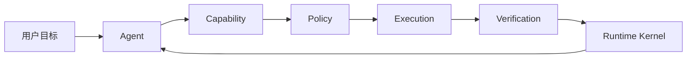

# 第二章 架构总览：物理三层与 Runtime 六概念

> 当前权威边界和完整类图见 [`../active/six-concept-runtime-architecture.md`](../active/six-concept-runtime-architecture.md)。

## 2.1 两个正交视角

Kite Code 使用两个互补视角：

1. `protocol → core → app` 描述代码的物理分层与依赖方向；
2. Agent、Runtime Kernel、Capability、Policy、Execution、Verification 描述 Core 内部的业务职责与运行流水线。

六概念模型不是新增物理层。它把 `src/core/` 内部原本分散的 Agent、工具、MCP、Skills、授权和验收机制统一到一套职责模型中。

## 2.2 物理三层

```text
src/app/                 前端与输入输出适配
├── cli/                 Headless CLI
└── tui/                 React Ink TUI

src/core/                Agent 与 Runtime 业务实现
├── runtime/             Kernel、State、Event、Effect、Scheduler
├── capabilities/        Catalog、Binding、Search、Result
├── policies/            授权、模式与副作用策略
├── controllers/         Model/Tool 执行边界
├── execution/           请求、journal 与失败分类
├── verification/        分级验收与恢复
├── tools/               Builtin Capability provider
├── mcp/                 MCP Capability provider
├── skills/              Skill Workflow provider
└── subagent/            Subagent Capability provider

src/protocol/            跨层稳定契约
├── events.ts
├── capabilities.ts
└── verification.ts
```

依赖方向为：

```text
app ──→ core ──→ protocol
 │                  ↑
 └──────────────────┘
```

- `protocol` 不依赖 core 或 app；
- `core` 不依赖 app，不处理 TUI 展示状态；
- `app` 消费 core 与 protocol，只负责交互、渲染和输入输出适配。

## 2.3 Core 六概念

| 概念 | 主要目录 | 职责 |
| --- | --- | --- |
| Agent | `runtime/agent.ts`、`model/`、`prompts/` | 理解目标并产生下一步决策 |
| Runtime Kernel | `runtime/` | 保存事实，调度 Effect，通过 Event 推进状态 |
| Capability | `capabilities/`、`protocol/capabilities.ts` | 统一 Builtin、MCP、Skill、Subagent 的身份与绑定 |
| Policy | `policies/`、`sandbox/` | 分类副作用，执行授权、审批和隔离 |
| Execution | `runtime/executor.ts`、`controllers/tool-controller.ts`、`execution/` | 执行获准能力并生成结构化 Receipt |
| Verification | `verification/`、`protocol/verification.ts` | 用 Evidence 验收目标，驱动完成或恢复 |



## 2.4 Runtime 事实循环

Runtime Kernel 是唯一状态转换权威：

```text
RuntimeState
  → Scheduler 选择 RuntimeEffect
  → Executor 执行 Effect
  → 产生 RuntimeEvent
  → Reducer 更新 RuntimeState
  → Store 持久化
```

Agent、Capability、Skill 和 Verification 都不能直接修改持久状态。需要恢复、审计或重放的变化必须进入 Runtime Event。

## 2.5 能力与执行边界

Tool、MCP、Skill 和 Subagent 都属于 Capability：

```text
Capability Catalog
  → turn-scoped Binding
  → 参数与 revision 校验
  → Policy / Approval
  → Provider Adapter
  → Execution Receipt
  → Verification
```

发现能力不代表获得授权，模型看到的临时工具名也不是稳定身份。权威身份是 `capabilityId + revision`。

## 2.6 完成语义

一次工具调用成功只表示 Execution 完成，不表示用户目标完成。Verification 根据风险使用 `not_required`、`best_effort` 或 `required`：required 验证未通过时，Runtime 只能修复、重规划、补偿或请求用户决定，不能发出 `run.completed`。

## 2.7 设计收益

| 收益 | 说明 |
| --- | --- |
| 多前端复用 | TUI、CLI 和未来前端共享同一个 Runtime Kernel |
| 动态扩展 | 新 MCP/Skill 通过 Capability Catalog 接入，无需扩展中心静态联合类型 |
| 安全一致 | Builtin、MCP、Skill 与 Subagent 经过同一 Policy 边界 |
| 可恢复 | Event、State、Invocation 和 Receipt 支持崩溃恢复与 reconciliation |
| 可信完成 | 高风险任务以证据和 Verification 决定完成，而不是依赖模型声明 |
