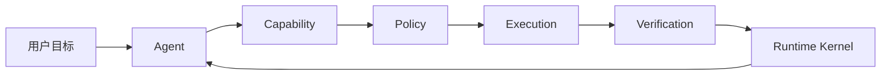

# 第二章 架构总览：物理三层与 Runtime 六概念

> 当前权威边界和完整类图见 [`../active/six-concept-runtime-architecture.md`](../active/six-concept-runtime-architecture.md)。

## 2.1 两个正交视角

Kite Code 使用两个互补视角：

1. `apps/kite` 与九个 runtime package 描述物理分层与依赖方向；
2. Agent、Runtime Kernel、Capability、Policy、Execution、Verification 描述跨 package 的业务职责与运行流水线。

六概念模型不是新增物理层。它把 Builtin、Kernel、SPI、Host 和 App 中各自分散的 Agent、工具、MCP、Skills、授权和验收职责统一到一套职责模型中。

## 2.2 物理三层

```text
apps/kite/                              唯一 composition root、Headless CLI、React Ink TUI
├── src/bootstrap/                      App 组装唯一 Host/Store/Kernel、Client、Server 与 carrier
├── src/cli/                            Headless CLI
└── src/tui/                            React Ink TUI

packages/runtime-contract/              中立 command/query/notification/projection 契约
packages/runtime-protocol/              严格、browser-safe、framing-neutral Protocol V1
packages/runtime-client/                framework-neutral Runtime Client、快照与 History Client seam
packages/runtime-server/                RuntimeAccess gateway、admission 与连接/订阅管理
packages/agent-kernel/                  无外部 I/O 的 Runtime State Kernel、Event、Reducer、Scheduler
packages/runtime-spi/                   Provider-neutral Capability/Model/Tool Pipeline SPI 与 registry snapshot
packages/runtime-host/                  通用 mailbox、lease、prepared dispatch、receipt 与 process lifecycle
packages/runtime-storage-sqlite/        SQLite Store SQLite storage adapter
packages/builtin-runtime/               Builtin operation、parser、effects、model、MCP、Skill、Subagent 语义
```

依赖方向为：

```text
runtime-contract ─────────────────────────────→ ∅
runtime-protocol ─────────────────────────────→ runtime-contract
runtime-client ───────────────────────────────→ runtime-contract + runtime-protocol
runtime-server ───────────────────────────────→ runtime-contract + runtime-protocol
agent-kernel ─────────────────────────────────→ ∅
runtime-spi ──────────────────────────────────→ runtime-contract
runtime-host ─────────────────────────────────→ agent-kernel + runtime-contract + runtime-spi
runtime-storage-sqlite ───────────────────────→ runtime-host
builtin-runtime ──────────────────────────────→ runtime-contract + runtime-spi
apps/kite ────────────────────────────────────→ client + server + host + builtin + sqlite
```

- `runtime-contract` 与 `agent-kernel` 不依赖其他 runtime package；
- `runtime-spi` 只依赖 `runtime-contract`；`builtin-runtime` 只依赖 contract/SPI，不能反向依赖 Host、Kernel 或 App；
- `runtime-host` 只提供通用 lifecycle/port，不导入 Builtin 领域语义；
- `runtime-protocol` 只冻结 Protocol V1 的 allowlist、codec、schema 与 limits；`runtime-server` 只通过
  `RuntimeAccess + App admission` 路由连接，二者均不是 Runtime owner；
- `runtime-client` 不依赖 Server concrete type、Host、SQLite 或 UI。它负责关联、重连/重订阅和快照，不会自动重放 mutation；
- `apps/kite` 是唯一 composition root，组合同一个 frozen registry snapshot、Builtin projection、MCP facts、Host port、
  SQLite Store adapter、Client/Server 与 App-owned carrier。不存在第二 Host、Store writer、reducer、dual execution 或 fallback。

## 2.3 Client/Server 访问路径

TUI 与 foreground CLI 不再绕过 Host 直接取得执行或存储句柄；它们共享一条经过同一 Protocol 校验的路径：

```text
TUI / foreground CLI
  → RuntimeClient
  → InProcess RuntimeServer
  → RuntimeAccess
  → Runtime Host（mailbox、lifecycle、recovery、receipt）
```

App 固定一个已信任的 canonical Workspace/session admission；请求体、client metadata 或 session display name
不能提升 authority。`RuntimeClient.history → RuntimeHistoryClient → App exhaustive closed-event projector → RuntimeLogQueryPort`
和 SQLite readonly reader 是独立只读面，不与实时 command/notification 混为一条 authority。

## 2.4 Core 六概念

| 概念 | 主要 package | 职责 |
| --- | --- | --- |
| Agent | `apps/kite` + `builtin-runtime` | 组装模型调用与 Builtin 语义，产生下一步决策 |
| Runtime Kernel | `agent-kernel` | 保存 Runtime State 事实，调度 Effect，通过 Event 推进状态 |
| Capability | `runtime-spi` + `builtin-runtime` | 统一 Builtin、MCP、Skill、Subagent 的身份、snapshot 与 binding |
| Policy | `agent-kernel` + `builtin-runtime` | Kernel 决定治理，Builtin 提供领域分类与 admission facts |
| Execution | `runtime-host` + `builtin-runtime` + App ports | 通用 lifecycle/receipt 与具体 capability execution 的组合 |
| Verification | `agent-kernel` + `builtin-runtime` | Kernel 决定完成/恢复，Builtin 提供领域 evidence 与 reviewer 语义 |



## 2.5 Runtime 事实循环

Runtime Kernel 是唯一状态转换权威：

```text
RuntimeState
  → agent-kernel Scheduler 选择 RuntimeEffect
  → App/Host coordinator 执行已治理 Effect
  → 产生 Runtime State RuntimeEvent
  → agent-kernel Reducer 更新 RuntimeState
  → runtime-storage-sqlite SQLite Store 持久化
```

Agent、Capability、Skill 和 Verification 都不能直接修改持久状态。需要恢复、审计或重放的变化必须进入 Runtime Event。

## 2.6 能力与执行边界

Tool、MCP、Skill 和 Subagent 都属于 Capability：

```text
runtime-spi frozen Registry snapshot
  → builtin-runtime catalog projection / dynamic MCP overlay
  → turn-scoped Binding
  → 参数与 revision 校验
  → Kernel Policy / Approval
  → Host lifecycle + Builtin/Provider Adapter
  → Execution Receipt
  → Verification
```

发现能力不代表获得授权，模型看到的临时工具名也不是稳定身份。权威身份是 `capabilityId + revision`。

## 2.7 完成语义

一次工具调用成功只表示 Execution 完成，不表示用户目标完成。Verification 根据风险使用 `not_required`、`best_effort` 或 `required`：required 验证未通过时，Runtime 只能修复、重规划、补偿或请求用户决定，不能发出 `run.completed`。

## 2.8 设计收益

| 收益 | 说明 |
| --- | --- |
| 多前端复用 | TUI、CLI 和未来前端共享同一个 Runtime Kernel |
| 动态扩展 | 新 MCP/Skill 通过 Capability Catalog 接入，无需扩展中心静态联合类型 |
| 安全一致 | Builtin、MCP、Skill 与 Subagent 经过同一 Policy 边界 |
| 可恢复 | Event、State、Invocation 和 Receipt 支持崩溃恢复与 reconciliation |
| 可信完成 | 高风险任务以证据和 Verification 决定完成，而不是依赖模型声明 |
