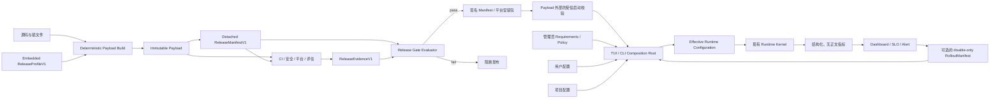
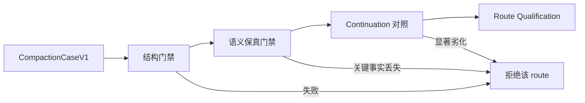

# Agent 生产就绪与渐进发布控制 RFC

状态：accepted
日期：2026-07-29
批准：2026-07-29
初始设计基线：`410b2c24717ab50f0cd7fe32d54942fa6fca9840`
当前实施复核基线：`a316a2df63e511f839d08aa72a20275afa8e3366`（2026-07-30）
范围：Runtime、内置工具、MCP、Skills、Plan、Verification、上下文压缩、日志、可观测性、发布与回滚

相关：

- [`../space/understanding/2026-07-29-agent-production-feasibility.md`](../space/understanding/2026-07-29-agent-production-feasibility.md)
- [`../active/six-concept-runtime-architecture.md`](../active/six-concept-runtime-architecture.md)
- [`../active/tool-gated-autonomy.md`](../active/tool-gated-autonomy.md)
- [`../active/feature-flags.md`](../active/feature-flags.md)
- [`../active/mcp-runtime-governance.md`](../active/mcp-runtime-governance.md)
- [`../active/verification-governance.md`](../active/verification-governance.md)
- [`../active/plan-state-reminder.md`](../active/plan-state-reminder.md)
- [`../active/model-provider-boundary.md`](../active/model-provider-boundary.md)
- [`../active/real-model-test-boundary.md`](../active/real-model-test-boundary.md)
- [`../space/plans/2026-07-29-agent-production-readiness-roadmap.md`](../space/plans/2026-07-29-agent-production-readiness-roadmap.md)
- [`../space/plans/2026-07-29-agent-production-local-data-privacy.md`](../space/plans/2026-07-29-agent-production-local-data-privacy.md)

> 本文是已批准的未来设计，不描述当前行为。实施入口为
> [`../space/plans/2026-07-29-agent-production-readiness-roadmap.md`](../space/plans/2026-07-29-agent-production-readiness-roadmap.md)
> 及其子计划；涉及架构决策时新增 ADR，不得改写既有 ADR。计划与 ADR 未完成前，本文仍
> 不得被当作当前行为依据。

2026-07-30 合并增量复核确认：新基线加入 effect-aware read scheduling、并发 shell/审批
调度、Runtime schema v17、`ask_user` canonical schema 与隔离默认测试 runner，但没有改变
本文发布控制面的总体架构、阶段顺序或任务 DAG。实施与 Release Evidence 必须绑定新基线
或其后继提交；旧基线的 live MCP/真实模型结果只保留为历史论证，不能为新制品放行。
本次完整 TUI suite 未复现原 Sub-agent read timeout，但仍出现 listener warning，因此只收窄
了 Task 1C.6 的调查范围，不构成稳定性关闭证据。

## 一、摘要

本 RFC 设计一套“发布控制面 + 现有 Runtime 数据面”的生产化架构，用来解决四个不同问题：

1. **某个制品包含什么成熟度的能力**：由不可被项目配置抬高的 `ReleaseProfile` 决定；
2. **这些能力实际发布给谁**：由与成熟度正交的 `RolloutStage`、cohort 和 operator policy 决定；
3. **某个能力是否已有足够证据晋级**：由 CI、真实 Provider 评估、canary 指标和用户任务基准组成的 `ReleaseEvidence` 决定；
4. **运行中的 Agent 如何继续安全执行**：继续由现有 Runtime Kernel、Capability、Policy、Execution 与 Verification 决定。

设计不增加一套平行 Runtime 状态机。发布控制面只约束组合根可以向 Runtime 注入哪些有效配置；模型、Workspace、MCP、Skill、用户配置和 CLI 临时 flag 都不能突破发布上限。

首个外部生产配置只开放：

- 内置文件、搜索与 shell 工具；
- Plan Artifact 与审核；
- Tool Search；
- 明确证明为只读的白名单 MCP；
- 受 sandbox、网络 allowlist 和受保护路径共同约束的 `accept_edits`/`auto` 交互模式。

首个外部生产配置默认关闭：

- MCP write/destructive/unknown；
- Skills activation/workflow；
- `full` interaction mode；
- 手动和自动上下文压缩；
- 任何“已验证完成”的产品声称，除非 `verificationV1` 实际开启并收敛。

前台本地交互可以在用户选择的 checkout 中修改文件，但必须提供 diff/review。任何后台、
定时、并发或委派的写任务默认使用独立 worktree、分支或等价隔离环境；Agent 的 final 文本
不是交付物边界，变更集、测试/验证结果和未解决风险才是。

首个 `limited-production` 只支持单用户本地 TUI 和由同一 OS 用户启动的前台 Headless
CLI。Web、多租户共享服务、远程托管执行、跨设备控制和服务端凭据托管不复用本 RFC 的
放行结论；这些形态必须另做身份、租户、密钥、网络、配额和数据生命周期设计。

上下文压缩保持现有单次 Markdown narrative 和单 checkpoint 契约。生产化新增的是**离线语义评估、真实模型 route 资格、continuation 对照、渐进 rollout 和结构化指标**，不把第二份 fact ledger 或 reviewer 结果写入 Runtime checkpoint。

## 二、背景与问题

当前工程已经有较强的 Runtime 状态机、工具治理、审批、sandbox、MCP revision binding、Plan Artifact 和压缩结构不变量，但“代码中存在能力”和“发布渠道允许能力”之间没有独立、不可抬高的边界。

现有 feature flag 主要解决代码迁移和快速回退问题，不能独立回答：

- 该能力是否经过当前目标平台和 Provider 验证；
- 项目配置是否可以把默认关闭能力重新开启；
- 哪些能力达到何种 maturity，以及实际 rollout 给 internal/canary/general 中的哪些人；
- release artifact 对应哪一组测试、配置和 schema；
- 线上发现风险后，如何只关闭高风险能力而不破坏基础 Agent；
- 压缩是否保留关键语义，而不仅仅是减少 token；
- 日志和遥测是否满足生产隐私边界。

生产可行性论证还发现五个直接阻断项：

1. 真实模型压缩存在 `Summary was truncated` 失败反例，现有 acceptance 不验证语义；
2. session log 默认记录大量正文，本机文件和目录权限不满足同机隔离；
3. TUI Sub-agent read flow 可复现 30 秒超时，并出现 listener 数量告警；
4. 缺少正式 release artifact、供应链门禁、多平台矩阵、SLO 和回滚证据；
5. 当前 macOS sandbox 允许 Workspace 外读写，network 只有
   `disabled/allow_all`，且后台/并发 writer 没有 worktree/branch 隔离。

本 RFC 的目标是让这些问题进入一个可执行、可审计且可逐项回滚的设计，而不是继续依赖“默认 flag + 一次测试通过”。

### 2.1 同类 Code Agent 的公开设计对照

本节只使用各产品公开文档判断控制边界，不推断其未公开的内部实现。对照基线为
2026-07-29：

| 维度 | Codex | Claude Code | GitHub Copilot cloud agent | Cursor | 对本 RFC 的约束 |
| --- | --- | --- | --- | --- | --- |
| 成熟度与 rollout | 用 Under development / Experimental / Beta / Stable 表达产品成熟度 | 实验能力单独标识并默认关闭 | 管理员、组织和仓库分别控制可用性 | Beta、默认值和后台产品形态分别发布 | 成熟度不能再用 `internal/canary` 表达；必须与 rollout cohort 拆开 |
| 执行安全 | sandbox、approval、managed requirements 分层 | permissions 与 OS sandbox 互补，deny 优先 | 临时 Actions 环境、仓库边界和默认网络 firewall | 本地审批/auto-review；后台 Agent 在隔离 VM 和独立分支运行 | `auto` 只是审批策略，不能替代 filesystem/network/credential 的技术边界 |
| 变更交付 | worktree、Git diff、验证与 review | worktree 隔离并发修改 | branch、commit、日志和 PR 是透明交付边界 | diff review、checkpoint、后台独立 branch | 生产可用性必须以变更集和验证结果验收，不能只以会话成功率验收 |
| 上下文 | 手动/自动 compact，状态与 durable policy 独立 | 手动/自动 compact，并明确哪些指令会重新注入 | 云任务以有界 session/仓库上下文执行 | 通过独立 Agent、规则和产品内上下文管理降低主会话压力 | 压缩不能承载权限、Plan、Verification 等权威状态；route qualification 是本项目额外的质量门禁 |
| MCP / Skills | 工具 allowlist、审批、Skill 渐进加载 | MCP 受统一权限约束；Skill 是按需知识/工作流 | Skill 可含脚本但必须继承工具审批；MCP/Hook 可独立配置 | Rules/Skills/MCP 分层 | Skill 不能获得额外授权；同时不应把只读 Skill 与有副作用 Skill 作为一个发布单元 |
| 结果与运营 | diff、验证、安全配置和 telemetry | 用户 review、hooks、权限状态 | PR merge、time-to-merge 等结果指标 | diff、checkpoint、Agent review | 除可靠性 SLO 外，还必须建立 task/diff/test/review 的产品结果指标 |

参考的官方公开资料：

- Codex：
  [Feature Maturity](https://learn.chatgpt.com/docs/feature-maturity)、
  [Agent approvals and security](https://learn.chatgpt.com/docs/agent-approvals-security)、
  [Managed configuration](https://learn.chatgpt.com/docs/enterprise/managed-configuration)、
  [Git worktrees](https://learn.chatgpt.com/docs/environments/git-worktrees)；
- Claude Code：
  [Permissions](https://code.claude.com/docs/en/permissions)、
  [Sandboxing](https://code.claude.com/docs/en/sandboxing)、
  [Context window](https://code.claude.com/docs/en/context-window)、
  [Worktrees](https://code.claude.com/docs/en/worktrees)、
  [Parallel agents](https://code.claude.com/docs/en/agents)；
- GitHub Copilot：
  [Cloud agent](https://docs.github.com/en/copilot/concepts/agents/cloud-agent/about-cloud-agent)、
  [Agent firewall](https://docs.github.com/en/copilot/how-tos/copilot-on-github/customize-copilot/customize-the-firewall)、
  [Agent Skills](https://docs.github.com/en/copilot/how-tos/copilot-on-github/customize-copilot/customize-cloud-agent/add-skills)；
- Cursor：
  [Background Agents](https://docs.cursor.com/background-agent)、
  [Diffs & Review](https://docs.cursor.com/en/agent/review)、
  [Checkpoints](https://docs.cursor.com/en/agent/chat/checkpoints)、
  [Auto-review Run Mode](https://cursor.com/changelog/auto-review)。

### 2.2 对照后的设计判断

方向正确且应保留的部分：

- Runtime 与 Release 正交；
- sandbox 与 approval 分离；
- MCP revision/effects/verification 治理；
- 压缩不拥有 durable policy，并以语义和 continuation 放行；
- metadata-first 日志、无正文遥测和 capability 级回滚；
- 真实 Provider 明确 opt-in，证据绑定具体制品。

原草案存在四处必须校正的设计问题：

1. `disabled/internal/canary/stable` 把产品成熟度和部署范围压成一条错误的状态轴；
2. 对所有配置使用数学“求交”过度简化，不同字段需要 deny-wins、allowlist
   intersection、denylist union、上下界或按 key 合并；
3. `limited-production` 虽列出 shell 和 `auto`，却没有把网络出口、sandbox
   不可用时的行为、受保护路径和本地/私网访问定义为一等发布边界；
4. 验收偏向 Runtime 事件和会话指标，缺少 Code Agent 最核心的 worktree/branch、
   diff、test、review、merge/revert 结果闭环。

本文后续设计已经按这四点修订。签名的远程 disable-only rollout 仍有价值，但不是首个
limited release 的 P0；没有远程控制面时，embedded profile 与本地/管理员策略足以构成
安全发布控制面，但仍必须先完成本文 P0 实现和证据门禁。

## 三、目标

### 3.1 发布控制

- 每个 release artifact 内嵌一个不可被 Workspace 或普通用户配置抬高的生产能力上限。
- feature flag、用户配置、项目配置和 CLI override 只能在发布上限内进一步收紧。
- 能力成熟度按 `under_development → experimental → beta → stable` 独立晋级；
  rollout 独立使用 `off/internal/canary/general`，不把二者混成一条状态轴。
- 任何远程 rollout 机制只能关闭、降级或缩小 cohort，不能开启新能力、提升授权或降低审批。

### 3.2 证据与验收

- 用机器可读 `ReleaseEvidence` 关联 commit、制品、配置、测试、真实 Provider 结果和例外。
- 把结构正确性、真实生成稳定性、语义保真和任务 continuation 分开评估。
- 安全、隐私、状态损坏和越权类门禁不可由普通 waiver 绕过。
- 真实 Provider 套件继续显式 opt-in，不混入默认 unit；release candidate 必须引用近期真实结果。

### 3.3 运行安全

- 保持 Runtime Kernel 为唯一持久状态转换权威。
- 保持 Capability discovery、binding、Policy、Execution 和 Verification 的现有边界。
- `auto` 只减少边界内的审批，不扩大 filesystem、network、credential 或 external-state 权限。
- 后台、并发、定时和委派写任务默认使用独立 worktree/branch 或等价隔离。
- 高风险能力被关闭时 fail closed，不回退到旧 MCP/Skill/工具执行路径。
- 已存在的 required verification 即使能力随后关闭也必须继续收敛。
- rollback 不删除 transcript、Execution Receipt、Plan Artifact 或 checkpoint。

### 3.4 隐私与运营

- 本地日志默认从“内容日志”收敛为“元数据日志”，内容记录必须显式 opt-in。
- 所有本地诊断文件使用 owner-only 权限、容量上限和保留期。
- 远程遥测只允许低基数结构化指标，不发送 prompt、summary、reasoning、工具参数、工具输出、文件内容或 Workspace 路径。
- 生产 canary 必须有可观测性、错误预算和独立 kill switch。

## 四、非目标

- 不重写 Runtime Kernel、Tool Controller、Capability Catalog 或 Plan Artifact。
- 不把发布成熟度持久化为新的 Runtime lifecycle。
- 不让模型决定 release profile、cohort、SLO 或 gate。
- 不承诺任意第三方 MCP 的 exactly-once。
- 不在本 RFC 中恢复任何旧 MCP adapter 或 Prompt Skill 注入路径。
- 不在 checkpoint 中增加第二份模型事实正文、JSON fact ledger 或 production reviewer 结论。
- 不使用模型名称硬编码 context window、tokenizer 或压缩兼容能力。
- 不让遥测或日志失败导致 Agent 主循环崩溃，也不允许它们静默降级到不安全写入。
- 不在本 RFC 中确定市场发布日、商业 SLA 或用户规模。
- 不把首个 `limited-production` 扩展为 Web 入口、共享多租户 Agent、远程托管 runner、
  跨设备控制面或服务端 credential custody。
- 不把本地单用户制品的安全与可用性证据直接外推到 hosted、enterprise multi-tenant 或
  无人值守 SaaS 运行形态。

## 五、设计原则与不变量

1. **Runtime 与 Release 正交。** Runtime 表达当前任务事实；Release 表达某个制品允许启用的能力上限。
2. **发布上限只可收紧。** capability availability 使用 deny-wins；其他字段按各自的组合代数求值，不能假定所有字段都能做集合求交。
3. **feature flag 不等于稳定性。** flag 只选择实现路径；能力 maturity 由证据和 release profile 决定。
4. **高风险默认关闭。** 新增 release capability 默认
   `maturity=under_development, maxRollout=off`，不能因代码 flag 默认值为 `true` 自动晋级。
5. **远程配置只可降级。** 远程 rollout manifest 不能授予 `full_access`、开启 MCP write、Skills、Verification 或压缩。
6. **项目来源不能控制发布。** Workspace 内的配置、`.env`、Skill 或 MCP server 都不能修改 release ceiling。
7. **执行成功不等于目标完成。** 未开启或未通过 Verification 时，UI 不得把模型 final 呈现为“已验证完成”。
8. **压缩质量是 release gate。** token 缩减是必要条件，不是语义正确性的充分条件。
9. **原始事实不被 rollout 改写。** 禁用能力不删除 transcript、Receipt、Verification、Plan 或 checkpoint。
10. **内容不进入生产遥测。** 所有远程字段必须由 allowlist serializer 产生，不能对事件对象做通用序列化。
11. **诊断 fail-safe。** 日志或 exporter 失败不能中断任务；权限、symlink 或 ACL 不安全时必须停止该诊断通道，而不是继续写入。
12. **证据绑定制品。** 不能用另一 commit、另一配置或另一 Provider route 的结果为当前 artifact 放行。
13. **审批不是隔离。** `accept_edits`/`auto` 不能替代 sandbox、网络控制、受保护路径和独立工作区。
14. **计划不是授权。** 审核 Plan 不等于批准其中每一个工具调用或外部副作用。
15. **结果以变更集为中心。** Code Agent 的交付至少包含 diff、验证证据、未解决风险和可回滚边界；模型 final 只作说明。

## 六、术语

| 术语 | 含义 |
| --- | --- |
| Release Capability | 可独立放行和回滚的产品能力，例如 `mcp_read`、`skills_readonly`、`manual_compaction` |
| Capability Maturity | `under_development`、`experimental`、`beta`、`stable`，表达产品支持程度 |
| Rollout Stage | `off`、`internal`、`canary`、`general`，表达能力实际提供给哪些用户 |
| Release Profile | 内嵌在制品中的能力上限、安全底线、日志策略和支持矩阵 |
| Rollout Manifest | 可选的 operator 签名配置，只能把 profile 进一步收紧 |
| Release Manifest | detached canonical JSON，描述版本、commit、payload、schema、profile 与实际行为 bundle digest |
| Release Evidence | 与 manifest 绑定的 CI、平台、真实 Provider、性能、安全和用户验证证据 |
| Gate Decision | 对 evidence 执行确定性规则得到的通过、阻断或需人工审核结果 |
| Cohort | 基于稳定匿名键选择的 canary 会话集合 |
| Route Qualification | 某个明确 Provider endpoint class、model 和 summary 配置通过压缩矩阵的资格 |
| Provider Data Policy | 某个模型/MCP route 可接收的数据分类、地域、保留/训练和内容使用边界 |

## 七、总体架构



边界说明：

- build 先生成 immutable payload 与 detached manifest，测试/evidence 再绑定该 identity，最后
  Gate 决定是否签名/发布；禁止先 Gate 再构建另一个 payload。
- 供应链真实性以平台签名的 installer/package 和其中的最小 pre-exec launcher 为信任根。
  launcher 在执行 versioned payload 前验证 canonical manifest signature 与
  `payloadSha256`；不能把 payload 内 Runtime loader 当作真实性信任根。
- payload 内 `manifest-loader` 只做启动后的 schema/profile/digest 一致性复核。平台无法提供
  pre-exec 验签与 launcher 完整性保证时，不进入 limited 支持矩阵。
- Gate Evaluator、manifest 生成、launcher 验签和 artifact 校验属于构建/发布控制面，不进入
  Agent Runtime。
- Composition Root 负责按字段组合规则求值和注入；`src/core/` 不读取 `src/app/` 类型。
- Runtime 只接收经过收敛的现有 feature flags、Policy、logging reporter 和 provider adapter。
- release profile 不进入模型 prompt，也不成为 Capability discovery 内容。

### 7.1 首个受支持部署形态

`limited-production` 的生产边界固定为：

- 单个本地 OS 用户、单个可信 Workspace、单个本地 TUI 或前台 Headless CLI invocation；
- Workspace trust、provider credential 和本地文件权限都归调用该制品的 OS identity；
- TUI 前台写任务可以使用用户明确选择的 checkout，但必须持续提供 diff、停止和 review；
- Headless CLI 的写任务在具备 worktree/branch、资源预算、取消和变更集 handoff 前，只支持
  用户在场的前台调用，不支持定时、队列或无人值守执行；
- 后台、并发、定时和委派 writer 在隔离 controller 未实现或创建失败时不可启动，不能回退
  到共享 checkout；
- 支持矩阵按 platform、sandbox backend、provider route 和交互入口分别出具证据，不能用
  TUI 通过代替 Headless CLI，也不能用 Linux sandbox 结果代替 macOS/Windows。

这不是“部署建议”，而是当前 RFC 结论成立的前提。若安装包包含其他入口，它们必须保持
不可达、标记 unsupported 或由独立 profile 明确关闭。

### 7.2 新部署形态的独立准入

Web、远程托管、多租户、跨设备和共享 CI runner 至少新增以下设计与证据后才能进入发布
评审：

- 身份认证、会话绑定、RBAC、租户隔离和管理员策略；
- 服务端 credential custody、轮转、吊销和最小权限；
- 每任务计算/存储隔离、network egress、配额、滥用防护和计费边界；
- 数据驻留、保留、导出、删除、审计和用户通知；
- worker 生命周期、队列重复投递、并发写隔离和灾难恢复；
- 独立威胁模型、SLO、事故响应、渗透测试和 tenant-crossing G0 门禁。

本地 profile、测试报告和 canary 数据只能作为参考，不能自动满足这些门禁。

## 八、发布能力模型

### 8.1 能力清单

首版 release capability 使用稳定枚举：

```typescript
type ReleaseCapability =
  | 'builtin_read_tools'
  | 'builtin_write_tools'
  | 'shell'
  | 'plan'
  | 'tool_search'
  | 'mcp_read'
  | 'mcp_write'
  | 'skills_readonly'
  | 'skills_effectful'
  | 'verification'
  | 'manual_compaction'
  | 'auto_compaction'
  | 'full_interaction_mode'
  | 'content_session_logging'
  | 'remote_telemetry';

type CapabilityMaturity =
  | 'under_development'
  | 'experimental'
  | 'beta'
  | 'stable';

type RolloutStage = 'off' | 'internal' | 'canary' | 'general';

interface CapabilityReleaseState {
  maturity: CapabilityMaturity;
  maxRollout: RolloutStage;
}
```

该枚举是 release 工具的治理视图，不替代 `CapabilityDescriptor`，也不进入模型可见工具面。

成熟度与 rollout 不是笛卡尔积中的任意组合：

- `under_development` 只能 `off`；
- `experimental` 最多进入显式 opt-in 的 `internal` 或小规模 `canary`；
- `beta` 可以进入受支持的 pilot/general testing，但 UI、文档和 evidence 必须保留 Beta 标识；
- `stable` 才能作无实验提示的 GA 承诺，但 stable 能力仍可因运营原因只 rollout 给 canary。

因此“扩大 rollout”不自动提升成熟度，“通过质量门禁”也不自动扩大 cohort。

### 8.2 能力与现有 flag 的关系

| Release Capability | 现有主要控制 | 额外发布条件 |
| --- | --- | --- |
| `plan` | `planLifecycleV2` | Plan Artifact/review/recovery required suite 绿色 |
| `tool_search` | `capabilityCatalogV1`、`toolSearchV1` | 大目录召回/延迟基准 |
| `mcp_read` | `capabilityCatalogV1`、`mcpRuntimeBindingV1` | effective effects 只能为 none/read；server allowlist |
| `mcp_write` | `mcpExecutionRecordV1`、`mcpProviderActionV1`、`verificationV1` | 三者必须共同开启；幂等/恢复/验证证据齐全 |
| `skills_readonly` | `skillActivationV2`、`skillWorkflowV1` | strict contract；effective effects 全部 none/read；activation、恢复和 UX 通过 |
| `skills_effectful` | `skillActivationV2`、`skillWorkflowV1`、`verificationV1` | write/destructive/unknown Skill 独立放行；provenance、审批、恢复和 verification 通过 |
| `verification` | `verificationV1` | 不能用关闭 flag 绕过已有任务 |
| `manual_compaction` | `contextCompactionV2`、`contextCompactionManualV1` | route qualification + semantic gate |
| `auto_compaction` | `contextCompactionV2`、`contextCompactionAutoV1`、`autoMode` | manual maturity 已 stable；shadow/canary/SLO 完成 |
| `full_interaction_mode` | interaction + authorization | sandbox 可用；artifact profile 允许；用户显式提升 |

求值规则：

```text
release ceiling 禁止
  → 无论 feature flag 为何，能力都 fail closed

release ceiling 允许
  → 再由现有 feature flag、用户/项目配置、Policy 与 Runtime 状态决定是否实际启用
```

CLI `--feature` 只能在 release ceiling 内切换。生产 artifact 中尝试越过 ceiling 必须在创建 Runtime、连接 MCP 或扫描 Skill 前返回结构化配置错误。

### 8.3 标准发布 Profile

| Profile | 用途 | 允许能力 | 明确禁止 |
| --- | --- | --- | --- |
| `internal-dogfood` | 团队内部采样和问题发现 | 内置工具、Plan、Tool Search、白名单 MCP read；单项 experimental capability | 未经批准的多能力同时 canary |
| `limited-production` | 首个外部白名单 | stable/beta 的内置工具、Plan、Tool Search、白名单 MCP read；受限 `accept_edits`/`auto` | MCP write、Skills、manual/auto compaction、`full`、无约束网络 |
| `capability-canary` | 单能力渐进验证 | `limited-production` + 一个指定 experimental/beta capability | 同时首次 rollout 两个尚未 stable 的高风险能力 |
| `general-availability` | 全量稳定渠道 | 只包含 maturity=stable 且 rollout=general 的能力 | experimental/beta 能力被表述为 stable |

`capability-canary` 必须声明唯一 `canaryCapability`。MCP write、effectful Skills 和
auto compaction 不得在同一 cohort 同时首次放行，否则无法归因失败。

### 8.4 用户可见性与降级语义

TUI/CLI 应提供不依赖模型的本地状态入口，展示：

- product version、release channel 和 profile ID；
- 各 Release Capability 独立的 maturity 与 rollout stage；
- capability 被关闭的固定原因，例如 `release_ceiling`、`operator_disabled`、`user_disabled`、`route_unqualified`；
- 当前 permission profile、filesystem scope、network mode、sandbox 状态和是否处于 worktree；
- 当前 session logging mode、retention 和 telemetry consent 状态；
- 当前结果是“Agent 已结束”还是“Verification 已通过”。

该入口不得展示 rollout 签名、cohort 原始键、credential、Workspace path 或远端配置正文。模型不接收完整 release profile，也不能根据用户问题自行推断或修改 maturity/rollout。

调用被 release ceiling 关闭的命令或能力时必须返回结构化、可操作的本地说明，不能静默 no-op，也不能要求模型反复搜索不存在的工具。Canary 加入必须明确告知实验能力、指标范围和退出方式；退出 canary 只降低能力，不影响已有 transcript 和 Artifact。

## 九、ReleaseProfile 与配置优先级

### 9.1 `ReleaseProfileV1`

```typescript
interface ReleaseProfileV1 {
  version: 1;
  profileId: string;
  channel: 'internal' | 'limited' | 'canary' | 'ga';
  capabilities: Record<ReleaseCapability, CapabilityReleaseState>;
  canaryCapability?: ReleaseCapability;

  safety: {
    requireWorkspaceTrust: true;
    requireSandbox: boolean;
    sandboxUnavailable: 'fail' | 'verified_in_process_read_only';
    maxInteractionMode: 'accept_edits' | 'auto' | 'full';
    maxFilesystemScope: 'read_only' | 'workspace_write' | 'full_access';
    networkMode: 'off' | 'allowlist';
    networkAllowlist: string[];
    allowLocalAndPrivateNetwork: false;
    protectedPathPolicy: 'deny' | 'prompt';
    allowUnsandboxedAutoExecution: false;
    allowProjectFeatureEscalation: false;
    allowCliFeatureEscalation: false;
    mcpProviderAllowlist: string[];
  };

  resources: {
    maxRunDurationMs: number;
    maxTurns: number;
    maxModelRequests: number;
    maxToolInvocations: number;
    maxRunInputTokens: number;
    maxRunOutputTokens: number;
    maxConcurrentSubagents: number;
    maxConcurrentWriters: number;
    maxConcurrentToolInvocations: number;
    maxConcurrentShellInvocations: number;
    maxProcessTreeSizePerShellInvocation: number;
    maxConcurrencyWaitMs: number;
    maxArtifactBytes: number;
  };

  data: {
    providerRouteAllowlist: string[];
    maxWorkspaceDataClassification: 'public' | 'internal' | 'confidential';
    allowRemoteMcpContentEgress: boolean;
    allowProductionContentEvaluation: false;
  };

  logging: {
    defaultMode: 'off' | 'metadata';
    allowContentOptIn: boolean;
    retentionDays: number;
    maxTotalBytes: number;
    maxSessionBytes: number;
  };

  telemetry: {
    allowed: boolean;
    requiresConsent: true;
    endpointPolicy: 'admin_only' | 'user_configured';
  };
}
```

约束：

- profile 由 artifact 内嵌或随 artifact 以 hash 绑定，不从 Workspace 读取。
- `profileId` 不是安全身份；完整 canonical profile digest 才进入 release manifest。
- project/user config 可禁用 capability、减小预算、提高审批、缩短日志保留期，不能反向提升。
- `auto` 只能自动执行 sandbox 内且 network/filesystem policy 允许的动作；sandbox 不可用时不能自动回落为 unsandboxed。
- `verified_in_process_read_only` 不是通用降级开关：它只允许已经过 conformance 的
  Workspace-bound 进程内只读工具，强制 `networkMode=off`，并关闭 shell、writer、Skill
  child 和 local stdio MCP；不存在该实现时等同 `fail`。
- `full` 同时要求 profile 允许、用户/config 可追溯授权、独立隔离环境和现有 Policy 通过。
- MCP allowlist 使用本地稳定 provider identity，不使用模型可见别名或远端自然语言名称。
- 资源预算统计父 Agent 与全部 Sub-agent 的累计消耗；项目、用户和 CLI 只能把上限调低。
- 调度器内建并发常量只是实现硬上限；实际有效并发取代码上限、Release Profile、管理策略
  与用户收紧值的最小值。当前 read batch 上限 `4` 不能代替
  `maxConcurrentToolInvocations`，shell sibling overlap 不能绕过
  `maxConcurrentShellInvocations`。
- `run_tools`/并行 batch 只是调度单元，每个成员必须以自己的 invocation ID 原子申请 tool
  reservation；每个顶层 `shell_execute` invocation 还要独立申请 shell invocation
  reservation。不能把整个 batch 记为一次调用，也不能在后续 sibling 等待审批时释放仍在
  运行的 shell reservation。shell 所需的 tool + shell invocation permit 必须在同一事务
  全有或全无，不能先持有一种 permit 再等待另一种。
- `maxConcurrentShellInvocations` 只统计顶层 shell 工具调用，不伪装成 OS process 数量。
  每次调用的 shell、管道和 descendants 构成一个 process tree，由 sandbox backend/cgroup/
  Job Object/等价强制机制执行 `maxProcessTreeSizePerShellInvocation`；平台无法执行该上限时，
  production profile 必须关闭 shell，不能只依赖 Runtime 计数。
- token 使用以 Provider usage 为准；Provider 不返回 usage 时使用版本化的保守估算，并在
  evidence 中标为 `estimated`，不能把估算值宣传为账单金额。
- 预算 admission 使用可执行上界而不是均值估算：已 reconcile 累计量加所有 active
  reservation 上界不得超过 budget。模型输入在 dispatch 前计量，`maxOutputTokens` 不得高于
  剩余预算；无法接受该上限的 route 不具备 production qualification。artifact/工具输出按
  写入前可计算上界或有界 streaming limit admission。
- 达到任一预算必须停止创建新的 model/tool/sub-agent invocation，执行有界取消并以
  `budget_exhausted` 结束；不得把该终态展示为“已完成”。
- 并发上限不足时不得先 dispatch 再排队记账；先缩小/拆分 batch，剩余 invocation 进入按
  资源 FIFO 的可取消队列。需要多种 permit 的 waiter 使用同一 sequence 加入各资源队列，
  只有同时位于所有所需队列队首且全部额度可用时，才能在同一事务原子晋升；不允许部分
  reservation。等待期限取 `maxConcurrencyWaitMs` 与 run deadline 的较早者；permit 到期前
  可用则继续，等待超时且 run deadline 尚未到达时以
  `resource_saturated(tool_concurrency_saturated|shell_concurrency_saturated)` 结束本轮，
  未 dispatch sibling 保持零副作用并有界取消运行中 sibling；若 run deadline 先到则仍为
  `budget_exhausted`，清理失败升级为 `cancel_incomplete`。迟到 terminal event 不得恢复已
  释放 permit 或改写终态。
- production profile 强制要求 durable resource budget；关闭 budget implementation 必须
  拒绝 production run，不能描述成“较严格 legacy fallback”而没有实际实现和 conformance。
- 若未来增加货币成本上限，必须同时绑定 currency、pricing source/version 和更新时间；
  在价格不可验证时仍以 token/request/time 硬预算兜底。
- Provider route 和数据分类同样按 allowlist/更严格上限组合；项目可以把某目录或文件标为更
  高敏感级别并阻断外发，不能自行把 artifact/admin 禁止的数据降级为 `public`。

### 9.2 配置求值顺序

```text
Embedded ReleaseProfile
  + optional disable-only RolloutManifest
  + admin requirements
  + user preferences
  + trusted project config
  + one-run CLI restriction
  -- field-specific composition -->
Effective Runtime Configuration
```

每一层只能保持或降低 artifact 的安全与能力上限。项目配置仍可提供 MCP/Skill 定义，但定义
存在不代表 release profile 允许激活或执行。具体组合规则必须写入 schema，而不是由通用
deep merge 或集合求交猜测：

| 字段类型 | 组合规则 |
| --- | --- |
| capability enabled / content logging allowed | deny-wins；任一适用层禁止即关闭 |
| allowlist（Provider、MCP identity、network host） | 对已声明边界求交；空集保持空集 |
| denylist / protected path | 取并集；deny 优先于 allow |
| 最大权限、最大预算、最长 retention | 取更严格的上限/更短值 |
| 数据分类、remote MCP 正文外发、content evaluation | route allowlist 求交；分类取更严格上限；正文用途 deny-wins |
| 最低审批、最低 verification | 按风险偏序取更严格值 |
| rollout percentage / cohort | 只能缩小，不能由项目或 CLI 扩大 |
| 按名称的 policy table | 按 key 合并，每个 value 再应用本表对应规则 |
| 普通用户偏好 | 在上述边界内按既有配置 precedence 选择，不伪装为安全求交 |

安全敏感的新字段在旧 evaluator 中必须 fail closed；非安全展示字段可以忽略，但要产生
schema/version 诊断。所有组合规则都需要 property test：交换顺序不应导致权限扩大，增加
限制层不应使结果更宽松。

### 9.3 Rollout Manifest

可选 rollout manifest 只支持：

- 把 rollout stage 降低或设为 `off`，但不改写 artifact 声明的 maturity；
- 把 canary 百分比调低；
- 缩小 provider/model/platform allowlist；
- 强制关闭 content logging 或 telemetry；
- 设置过期时间和撤销原因。

它不支持：

- 打开 artifact 中 `maxRollout=off` 的能力；
- 提升 interaction/authorization；
- 降低 approval 或 verification；
- 修改 Workspace trust；
- 注入 provider credential、prompt、Skill 或 MCP 配置。

Manifest 必须 canonical serialize、带版本、签名、issuedAt、expiresAt 和 keyId。签名失败、过期或 schema 未知时忽略远程内容并保留 artifact 本地上限。缓存的旧 manifest 只能继续执行尚未过期的**降级**决定。

该机制实现时还必须包含：内嵌 trust bundle、重叠轮转窗口、单调 sequence、identity-bound
缓存、重放/降序拒绝、规范字节测试和有界 clock-skew。远程 key 不能签发比 artifact ceiling
更高的权限；trust root 或紧急吊销列表的替换通常需要新 artifact。没有这些能力时，不得把
普通 HTTPS 下载称为“已签名 kill switch”。

首个 `limited-production` artifact 不依赖该服务上线。只有进入需要分钟级 kill switch 的
外部 canary 后，签名 rollout manifest 才成为 G4 门禁。若某个企业部署把远程管理员
requirements 声明为 mandatory，则没有有效的 identity-bound 缓存时必须拒绝启动受管
session，不能静默绕过管理员策略；普通可选 rollout 服务不可用时则保留 embedded profile。

### 9.4 执行权限与变更隔离

`limited-production` 的默认执行边界必须具体化为：

- filesystem 为 `workspace_write`，不是全盘写入；
- 网络默认关闭；确需下载依赖时只开放明确 host allowlist，本地、link-local 和私网目标
  默认拒绝。只有执行代理确实能检查 URL path 时才允许声明 path 规则，不能把仅按域名
  放行的 TLS proxy 表述成 path 级隔离；
- allowlist 必须在 DNS 解析后和每次 redirect 后重新校验 IP/host，拒绝 IP literal
  编码绕过、DNS rebinding、loopback/link-local/private destination 和代理旁路；shell、
  Skill、MCP 子进程及其 descendants 都必须继承同一出口边界。未通过这些 conformance
  测试的平台只能使用 `networkMode=off`；
- `.git`、Agent 配置、MCP 配置、shell profile、credential/secret 文件和 Workspace
  外路径对模型工具为 protected，按 profile `deny` 或重新向用户确认。App 自身的 typed
  Git/worktree controller 走独立、可审计的授权入口，不能靠放开模型 shell 获得权限；
- sandbox 启动失败或 `ExecutionBoundaryV1` 不可用时，production profile 禁止启动 shell、
  writer、Skill child 和 local stdio MCP；逐次审批不能恢复这些进程型能力；
- 可选 restricted fallback 只能暴露已通过 conformance 的 Workspace-bound 进程内只读工具，
  强制 `networkMode=off`，并以新的受限 run 启动。提示/审批只确认用户接受降级，不授予更宽
  filesystem/network 权限；
- `auto`/`accept_edits` 不改变 MCP effects、Verification、Workspace trust 或受保护路径；
- 内置工具、shell、Skill 启动的本地进程和本地 stdio MCP 继承同一网络/filesystem
  技术边界，不能只约束内置 shell；
- 远程 HTTP MCP 的服务端执行不在本地 sandbox 内，必须通过精确 server identity、endpoint
  allowlist、tool effects、approval 和 Verification 治理；其返回的 URL 或后续 fetch
  仍重新进入本地网络策略，UI 不得把远程 MCP 标成“已 sandbox”；
- repo 文件、网页、工具输出和 MCP content 一律按不可信数据处理，不能借其中的自然语言
  修改 release/profile/policy。读取 secret 与向外部网络发送数据必须是可分别阻断的权限，
  不能因 host 已 allowlist 就自动允许上传 Workspace 内容。

变更隔离按运行形态选择：

| 运行形态 | 默认边界 |
| --- | --- |
| 前台单会话、本地配对 | 用户选择的 checkout；必须有实时 diff、停止和逐文件 review |
| 后台、定时或无人值守写任务 | 独立 worktree/branch 或临时隔离环境 |
| 并发会话或并发 Sub-agent 写入 | 每个 writer 独立 worktree；共享 checkout 只允许只读 worker |
| 外部托管任务（本 RFC 不支持） | 必须另过 7.2 准入；临时环境、单 repo/branch、有界时长和明确网络策略只是最低条件 |

一次任务的交付对象至少包含：

1. 基线 commit/worktree identity；
2. 完整变更集或“无变更”的可核验证据；
3. 执行过的测试、lint、build、Verification 及其结果；
4. 未执行验证、已知风险和外部副作用；
5. 用户可 review、reject、revert 或继续修改的入口。

本地 checkpoint/preimage 只用于快速撤销 Agent 变更，不替代 Git 的长期历史，也不能声称
回滚已经发生的外部副作用。push、PR、merge、deploy 等边界继续由现有授权策略决定。

### 9.5 模型 Provider 与第三方数据边界

“生产遥测无正文”不代表模型调用或远程 MCP 不传正文。产品必须把这些接收方分别披露和
治理，不能在一个宽泛的 network consent 下混为一体。

每个 production-qualified model/provider route 必须有版本化 `ProviderDataPolicy`，至少
记录：

- 精确 endpoint/operator identity、region/data residency 和 credential owner；
- 允许的数据分类，以及 prompt、文件片段、工具结果是否可发送；
- Provider 的 retention、training/content-use、abuse monitoring 和删除边界；
- 是否存在 subprocessors、企业 DPA/admin approval 或用户必须接受的披露；
- 请求/错误日志的内容策略，以及本产品侧可执行的最小化和删除范围。

规则：

- Release Profile 只允许已审核 route；管理员、用户和 Workspace 分类只能进一步收紧；
- credential、secret 文件、shell profile、私钥和受保护路径默认禁止进入 model/MCP 请求，
  即使 endpoint 已 allowlist；用户在对话中主动粘贴 secret 也不自动获得转发授权；
- 只发送完成当前任务所需的最小文件片段和工具结果；完整仓库上传、后台索引或跨 Workspace
  复用需要独立 capability、披露和证据；
- 把 Workspace 内容发送给远程 MCP 是不同接收方和不同副作用，默认关闭；
  `allowRemoteMcpContentEgress` 只定义 profile ceiling，不是调用授权。每次调用还必须签发
  单次、短时、不可重放的 `RemoteMcpEgressPermitV1`，绑定 run/invocation、server identity、
  endpoint、tool revision、规范化参数 digest、Workspace 数据分类和允许的 payload kind；
  任一字段变化、过期或重放都必须在发出网络请求前拒绝。该 permit 不能继承模型 Provider
  consent，也不能被普通 tool approval 替代；
- 真实用户 prompt、源码、summary 或工具正文不得进入 secondary evaluator、benchmark
  corpus 或人工 review，除非用户/管理员对明确用途、保留期和接收方另行 opt-in；
- 自定义 endpoint 缺少可验证 data policy 时只能 internal experimental，不能进入
  `limited-production` 支持矩阵；
- UI 状态入口必须显示当前 route、可发送的数据分类、remote MCP content egress 和 content
  evaluation 是否允许，但不得显示 credential 或敏感 endpoint 参数。

route data policy snapshot/digest、审批状态和 privacy conformance 必须进入 Release Evidence。
当 Provider 条款、region、retention/training policy 或 endpoint identity 改变时，原 route
资格失效；不能只因 model 名称相同继续沿用。

## 十、Release Manifest、Evidence 与 Gate

### 10.1 `ReleaseManifestV1`

每个可分发 release bundle 必须由以下相互独立的对象组成：

1. 不包含 manifest 的 immutable payload artifact；
2. detached、canonical JSON `ReleaseManifestV1`；
3. 需要签名时，对 canonical manifest 生成的 detached signature/provenance。

manifest 通过 `payloadSha256` 绑定 payload。不得把“包含 manifest 的外层目录/压缩包”的 hash
写回该 manifest，否则会形成自引用。分发系统可以再为整个 release bundle 生成外部存储
identity，但该 identity 不属于 `ReleaseManifestV1`，也不能替代 payload 校验。

```typescript
interface ReleaseManifestV1 {
  version: 1;
  productVersion: string;
  commitSha: string;
  buildTimestamp: string;
  bunVersion: string;
  payloadSha256: string;
  releaseProfileDigest: string;
  lockfileDigest: string;
  agentContractDigest: string;
  modelVisibleToolRegistryDigest: string;
  defaultConfigDigest: string;
  providerDataPolicyDigest: string;
  releaseGatePolicyDigest: string;
  runtimeSchedulingPolicyDigest: string;
  buildRecipeDigest: string;
  runtimeSchemaVersion: number;
  supportedPlatforms: string[];
  supportedProviderTypes: string[];
}
```

`runtimeSchedulingPolicyDigest` 的规范输入不是任意源码文件或手工版本号，而是 Runtime
根据实际打包配置导出的 canonical snapshot：

```typescript
interface RuntimeSchedulingPolicyV1 {
  version: 1;
  parallelRead: {
    toolNames: string[];
    maxBatchSize: number;
    requiresReadOnlyClassification: true;
    requiresApprovalFree: true;
    barrierKinds: Array<
      'interaction' | 'write' | 'unknown_effect' | 'approval_required' | 'dynamic_capability'
    >;
  };
  shellOverlap: {
    scope: 'same_task_and_model_message';
    approval: 'per_invocation';
    rejection: 'abort_turn';
  };
  concurrencyAdmission: {
    queue: 'per_resource_fifo';
    compoundAcquire: 'atomic_all_or_none';
    toolLimitField: 'maxConcurrentToolInvocations';
    shellLimitField: 'maxConcurrentShellInvocations';
    waitLimitField: 'maxConcurrencyWaitMs';
    timeoutTerminal: 'resource_saturated';
  };
  lateEventPolicy: 'reject_stale_lease_or_terminal_turn';
}
```

该 snapshot 由 1C 的 Runtime owner 生成并随 payload 打包，2A 只负责 canonical serialize、
hash 和 manifest/evidence 校验。tool allowlist、barrier、overlap、admission 或 late-event
实现发生语义变化时必须先更新 snapshot/schema；artifact smoke 从实际 Runtime 重新导出并
比对，禁止由 release script 复制一份平行配置。未知 schema/value 对 production fail closed。

构建时间不能参与 capability revision 或 Runtime replay，只用于制品身份和诊断。
`payloadSha256` 只覆盖 manifest 之外的 immutable payload bytes；启动器先验证 detached
manifest schema/signature，再按该字段验证 payload，最后才允许加载 production profile。
上述 digest 必须基于规范化、实际打包或运行时解析后的内容生成，而不是只 hash 源目录。
`agentContractDigest` 覆盖系统 prompt、`ask_user` canonical contract 和压缩
prompt/policy；tool registry digest 覆盖模型实际可见的工具名、schema、effect 分类和内置
Skill contract；default config digest 覆盖会影响行为的默认 flag、预算和权限；
`runtimeSchedulingPolicyDigest` 覆盖上述 Runtime 导出的 canonical snapshot；provider data
policy digest 覆盖制品内建 route 的数据治理快照。`buildRecipeDigest` 还必须覆盖
`package.json` 的默认测试入口及实际打包的 `scripts/run-default-tests.ts`/隔离测试清单。
任何一项变化都产生新的 evidence identity，不能沿用上一制品的真实模型、任务评估或 gate
结果。

### 10.2 `ReleaseEvidenceV1`

Evidence 是 CI 产物，不提交包含用户内容的原始日志。至少包含：

- manifest identity；
- clean install 结果；
- required job 名、commit、开始/结束时间和结果；
- 各平台 smoke 结果；
- unit/contract/E2E/PTY 计数和失败摘要；
- lint warning budget；
- dependency audit、license、SBOM 和 artifact provenance；
- 真实 MCP/provider route 的测试日期与匿名 route identity；
- 与 manifest 一致的 agent contract、tool registry、default config、Runtime scheduling
  policy 和 gate policy digest；
- provider data policy snapshot/digest、route 审批和 privacy conformance；
- 版本化 Agent task suite、oracle/scorer 与运行配置 digest；
- compaction case suite、semantic rubric、continuation policy 与 route qualification digest；
- soak/performance/resource 报告；
- 资源预算、tool/shell invocation permit/saturation、process-tree enforcement、
  batch/cancel/late-event 与统一 failure-mode matrix 的 conformance 报告；
- Runtime schema、系统/工具契约、调度策略和实际默认测试 runner 的 identity；
- 未关闭风险和批准的有限例外；
- canary SLO 观察窗口和样本量。

Evidence 只引用安全、脱敏的 CI artifact URI 和 digest，不嵌入密钥、prompt、summary 或用户配置。
Gate Evaluator 必须先验证所有 digest、commit、artifact 和 route identity 一致，再读取测试
结论；发生 mismatch、缺失或 schema 未知时为 G1 阻断，不能选择“最近一次绿色结果”补位。

### 10.3 Gate 分类

| Gate | 例子 | 是否可普通 waiver |
| --- | --- | --- |
| G0 安全与状态完整性 | 越权、sandbox escape、日志权限、checkpoint/tool pair 损坏 | 否 |
| G1 Required CI | typecheck、unit、contract、runtime E2E、TUI system | 否 |
| G2 平台与供应链 | clean install、audit、license、SBOM、三平台 smoke | limited 前否 |
| G3 能力质量 | MCP route、Skill workflow、压缩语义/continuation | 只影响对应 capability，不影响基础 profile |
| G4 运营 | SLO、告警、kill switch、rollback/事故响应演练 | 外部 canary/general 前否 |
| G5 产品可用性 | 代表性任务成功率、纠正次数、用户反馈 | GA 前需产品负责人审核 |

Gate Evaluator 必须输出具体失败项，不能只返回总分。一个 capability 的 G3 失败应把该
capability 的 rollout 降为 `off`，而不是阻断已经稳定的基础能力；G0/G1 失败阻断整个
artifact。

## 十一、上下文压缩生产质量设计

### 11.1 边界

现有 Runtime compactor 保持：

- 单次、无工具、零 SDK retry 的 Markdown narrative；
- 原始 transcript 不变；
- checkpoint 只有一份模型内容 `summary: string`；
- safe settled turn 和 tool pair fail-closed；
- before/after 使用同一 projection environment；
- manual/auto 共用结构 acceptance；
- 不增加 chunk、merge、repair 或 production fact ledger。

同时明确：system contract、工具 schema、Workspace trust、authorization、active Plan、
Verification、Capability binding 和 approval 不是需要“总结保留”的普通会话事实。它们必须
从各自权威状态重新投影或注入；summary 即使遗漏或误述这些状态也不能扩大权限或改变
Runtime lifecycle。该边界与主流 Agent 在 compact 后重新注入 durable instructions 的方向
一致，但本项目还要求 Runtime 权威状态不依赖 summary 文本。

本 RFC 新增的是 release evaluation 和 rollout，不直接改变 checkpoint schema。若未来要在每次真实用户压缩后调用第二模型 reviewer 或写入第二份事实结构，必须另提 ADR/RFC，单独评估隐私、成本和错误语义。

### 11.2 三层质量门禁



#### 层一：结构门禁

继续验证：

- safe boundary、tool call/result pairing；
- transcript 不变；
- checkpoint digest/revision/replay；
- stale lease 和 environment drift；
- empty、truncated、tool call、oversized 和 insufficient reduction；
- direct、incremental、reset 和多次增量；
- 失败后原状态可继续使用。

任何 invalid checkpoint、orphan tool result 或状态损坏样本都为 G0，数量必须为 0。

#### 层二：语义保真门禁

新增受版本控制的 synthetic `CompactionCaseV1`：

```typescript
interface CompactionCaseV1 {
  version: 1;
  caseId: string;
  transcript: SyntheticTranscript;
  rounds: 1 | 2 | 3 | 4 | 5;
  requiredFacts: Array<{
    factId: string;
    category:
      | 'goal'
      | 'hard_constraint'
      | 'decision'
      | 'artifact'
      | 'failure'
      | 'approval'
      | 'verification'
      | 'plan_state'
      | 'pending'
      | 'next_step';
    criticality: 'critical' | 'important';
    matcher: 'exact' | 'normalized' | 'semantic';
    expected: string;
  }>;
  forbiddenClaims: string[];
  continuation?: ContinuationSpec;
}
```

匹配规则：

- 文件路径、ID、错误码、命令、版本、审批决定和验证结果优先使用 `exact`/`normalized`；
- 自然语言目标和约束可使用独立 semantic evaluator；
- semantic evaluator 不得读取主模型的自评，必须使用固定 rubric；
- release 报告同时给出确定性分数和 semantic evaluator 分数，不能用总平均掩盖 critical fact 丢失；
- fixture fact ledger 只存在于测试语料，不写入 production checkpoint。

固定硬门槛：

- critical fact 丢失为 0；
- forbidden claim 命中为 0；
- approval/verification/plan 状态反转为 0；
- 多轮增量后旧 hard constraint 仍须保留。

#### 层三：Continuation 对照

语义摘要最终要用“能否继续完成任务”验证。每个 continuation case 分为：

- control：使用未压缩历史继续执行；
- treatment：使用 summary + live tail 继续执行。

两组使用相同 provider route、模型配置、工具 fixture、随机种子策略和预算。结果由确定性 artifact/verification 检查优先评分，必要时再使用盲评。Release Gate 检查：

- treatment 任务成功率相对 control 的下降不超过批准阈值；
- critical safety violation 为 0；
- 工具调用、token、时延和成本没有无界增长；
- 失败分类可解释，不能只比较 final 文本相似度。

非劣阈值、样本量和置信区间在实施计划中依据内部 baseline 固化；在没有 baseline 前不得伪造为已达到的 SLO。

### 11.3 真实 Provider Route 资格

压缩资格绑定：

```text
provider type
  + endpoint class / deployment route identity
  + model identity
  + resolved capability sources
  + maxSummaryTokens
  + maxSummaryInputTokens
  + maxNarrativeTokens
  + summary prompt/policy digest
  + estimator kind/version
```

资格不从模型名推断。用户自定义 endpoint 或配置变化产生新的 route identity；没有 qualification 时：

- auto compaction 必须关闭；
- limited/GA profile 中 manual compaction 关闭；
- internal profile 可显式 opt-in，并清楚标记实验性。

Live runner 仍使用 `*.live.ts` 和显式 opt-in package script。输出只包含 case ID、route 的非敏感标识、计数、分数、failure kind 和 digest，不输出 prompt、transcript 或 summary。

### 11.4 压缩 rollout

顺序固定：

```text
off
  → internal manual
  → internal auto shadow
  → internal auto live
  → external manual canary
  → external auto shadow
  → external auto live canary
  → maturity stable + rollout general
```

规则：

- `shadow` 只计算 eligibility，不调用 summary model、不写 checkpoint。
- manual maturity 未达到 stable 前，auto 不得进入 external live。
- 每次只扩大一个 provider/model/platform cohort。
- 任一 critical fact loss、checkpoint corruption、同 turn 错误继续执行或敏感内容泄露
  立即把 rollout 降为 `off`。
- generation failure、truncation、oversized、insufficient reduction 和 user reset 分桶观察，不能合并成一个失败率。
- 真实用户的 transcript/summary 不发送到远程 semantic evaluator；critical fact loss 只能来自 synthetic/live evaluation 或经用户确认的安全事件。

当 limited profile 因 route 未通过而关闭压缩时，产品仍必须提供可用的降级路径：

- 提前显示可信的 context remaining/pressure，而不是等 Provider 拒绝后才提示；
- 禁止 silent auto-compaction，明确说明当前 route 未获资格；
- 允许用户保存 diff、Plan、验证结果和待办，启动新 session 继续；
- 原 transcript 保留，`/clear`/新 session 不得伪装成成功压缩；
- limited 的代表性任务集必须证明在无压缩预算内可完成，超长任务则明确不在该 profile
  的支持范围内。

## 十二、MCP、Skills、Plan 与 Verification 发布设计

### 12.1 MCP

`mcp_read` 只允许同时满足：

- provider 在 artifact/operator allowlist；
- effective effects 全部为 `none|read`；
- schema、revision、turn binding 和 Provider availability 当前有效；
- `minimumApproval` 没有要求更高授权；
- live/local route evidence 仍在有效观察窗口内。

unknown、write 或 destructive 不得被 `mcp_read` 包含。`mcp_write` 晋级前必须：

- `mcpExecutionRecordV1`、`mcpProviderActionV1`、`verificationV1` 共同开启；
- intent 在副作用前持久化；
- unknown 终态不盲目重放；
- read-after-write/reconciliation、waive 和 compensation 通过；
- provider action 只恢复 control plane，不重放旧 Tool Call；
- 外部系统不支持幂等时明确采用 at-most-once 自动重放。

### 12.2 Skills

所有 Skill 继续是严格、versioned Workflow Contract，不恢复 prompt body 注入路径。与
Claude Code、Copilot 等产品相比，这一边界更严格，但它避免 Skill 形成绕开 Runtime 的第二
执行面，应保留。需要修正的是把全部 Skill 作为同一个 rollout 单元。

`skills_readonly` 只有在以下条件同时满足时才能开启：

- `skillActivationV2` 与 `skillWorkflowV1` 同时开启；
- effective ceiling、dependency revision、minimum approval 和 effects 保守合并；
- effective effects 只能为 `none|read`，依赖中出现 write/destructive/unknown 即转入
  `skills_effectful`；
- project Skill 仍受 Workspace trust，且不能扩大 release ceiling；
- inline/fork、reference、output schema、recovery 和 verification 均有 required E2E；
- 恶意指令、冲突依赖、symlink、预算耗尽和 invalid shadowing 测试通过。

`skills_effectful` 另行要求 `verificationV1`、provenance/review、effects 对应审批、恢复和
compensation 证据，不能因 `skills_readonly` 已 stable 自动放行。任何 Skill 的
`allowed-tools`/dependency 只表达 ceiling，不能预批准原本需要审批的工具。

首个 Skill canary 只允许内置或管理员 allowlist 的 read-only Workflow Contract，不直接
开放任意项目 Skill 或 effectful Skill。

### 12.3 Plan

Plan 在 limited profile 可保持开启，但产品语义必须区分：

- Plan step 被模型标记为 completed；
- Plan Artifact 已提交并通过用户审核；
- Runtime task 已完成；
- required Verification 已通过。

UI 不得把上述状态合并成单一“已验证完成”。压缩不能覆盖 Plan Artifact，release rollback 也不能删除 Plan 版本。

Plan 不是所有任务的强制前置流程：简单只读问答或小型、低风险修改可以直接执行；多步骤、
高风险、后台或长任务应要求 Plan。用户审核 Plan 只确认方向，不预授权其中未来的 shell、
MCP、网络或外部副作用；每一步仍经过执行时 Policy。

### 12.4 Verification

`verificationV1` 关闭时：

- 新任务不创建对应验证门禁；
- 已持久化 required verification 继续收敛；
- 产品只可显示“Agent 已结束/模型已报告完成”，不得显示“已验证”。

`verification` capability 晋级后，所有 write/destructive/unknown 治理能力必须使用 risk-derived required mode；用户 waiver 保持结构化、带理由并可审计，模型没有生成 waiver 的入口。

Code Agent 的基础验证不只依赖 `verificationV1`：无论该 capability 是否开启，交付对象都要
列出实际运行的 test/lint/build、diff review 状态和未运行项。`verificationV1` 为高风险
任务增加 durable lifecycle，不替代仓库 CI 和人工 review。

## 十三、本地会话日志隐私设计

### 13.1 新策略

```typescript
type SessionLoggingMode = 'off' | 'metadata' | 'content';

interface SessionLoggingPolicy {
  mode: SessionLoggingMode;
  retentionDays: number;
  maxTotalBytes: number;
  maxSessionBytes: number;
  includeReasoning: false;
  includeFileContent: false;
  includeToolContent: false;
}
```

生产默认：

- `mode: metadata`；
- reasoning、文件正文、工具参数/输出正文全部不记录；
- `content` 只能由用户或管理员在 release profile 允许时显式 opt-in；
- 项目配置不能开启 content logging；
- content 模式仍要脱敏、截断和执行容量/保留策略。

### 13.2 Metadata 模式字段

允许：

- event type、时间、duration、状态；
- tool/capability kind 和稳定的低敏 failure kind；
- token 计数、重试次数、审批是否发生和决定类型；
- compaction before/after/token saved/failure kind；
- verification mode/result；
- 匿名 release version/profile/cohort。

禁止：

- user task、model text、reasoning、summary；
- tool arguments、stdout、stderr、MCP content；
- 文件 path、preview、workspace path；
- API key、base URL、header、credential reference；
- Plan 正文、Skill 正文和 MCP description；
- 原始异常栈或 provider response body。

字段由 mode-specific allowlist mapper 构造，不能先序列化完整事件再删除敏感字段。

### 13.3 文件系统安全

POSIX：

- 根目录和会话目录显式 `0700`；
- 文件显式 `0600`；
- 使用安全 open/create 语义，拒绝 symlink；
- 原子写 summary/索引，append 文件也要验证目标为 owner-owned regular file。

Windows：

- 使用 owner-only ACL；
- 拒绝 reparse point；
- 临时文件和 rename 保持同一安全目录。

权限或 owner 校验失败时：

1. 不写入目标；
2. 当前进程禁用该日志通道；
3. 向用户显示一次脱敏诊断；
4. Agent 主循环继续运行。

### 13.4 保留、轮转和迁移

- 启动时和有界周期内执行 retention/size cleanup；
- cleanup 只处理规范日志根目录内、符合命名和 owner 约束的 regular file；
- 单 session 达到上限后停止内容记录，保留 bounded metadata 终态；
- 总容量按最旧完成会话回收，不删除 active session；
- 首次升级先收紧现有目录/文件权限，再读取或追加；
- 无法安全收紧的旧日志隔离并提示用户，不静默继续使用；
- 不因升级立即删除未过期旧日志，除非用户明确请求。

建议初始默认值为 7 天、总量 256 MiB、单 session 16 MiB；实施计划应通过真实日志体积 baseline 审核后固化。

## 十四、生产可观测性设计

### 14.1 数据源

生产指标优先消费：

- durable Runtime Event；
- `ExecutionReceipt`/structured result metadata；
- `ClassifiedFailure`；
- model/compaction duration 和 token estimate；
- App lifecycle 的启动、退出和资源指标。

不得通过解析用户可见错误字符串推导 failure kind。旧 session logger classifier 只用于兼容历史记录，新的生产指标使用结构化字段。

### 14.2 最小指标

| 领域 | 指标 |
| --- | --- |
| Run/Turn | started、completed、cancelled、fatal、duration |
| Model | request、success、failure kind、retry、first-token/total duration、token |
| Tool | queued、approved/rejected、started、finished、failure kind、duration |
| MCP | provider availability、discovery、binding drift、call、recovery、timeout |
| Skill | disclosure、activation、frame close、schema failure、recovery |
| Plan | drafted、reviewed、progressed、completed，不包含正文 |
| Verification | mode、passed、failed、inconclusive、repair、waive |
| Compaction | eligibility、attempt、completed、failure kind、before/after、saved、reset |
| Runtime | replay、migration、checkpoint failure、stale lease、hard block |
| Resource | budget used/exhausted、RSS、listener count、FD/handle count、event-loop lag、log/artifact bytes |

### 14.3 隐私与基数

- 不导出 thread ID、workspace、绝对 path、command、tool args、MCP URI 或用户标识。
- cohort 使用 install-local random salt 生成的短期匿名 bucket，不导出原始输入。
- provider/model 使用受控 route alias；用户自由填写的 endpoint/model 不直接作为 label。
- error message 不作为 metric label；只使用有限枚举 `FailureKind`/diagnostic code。
- 每个 exporter 有字段 allowlist、大小上限和 cardinality 测试。

### 14.4 可靠性

- exporter 由 App composition root 注入，Core 不持有全局 singleton。
- 未配置或未同意 telemetry 时为 no-op。
- 使用 bounded memory queue；满时丢弃最旧低优先级指标并增加本地 `telemetry_dropped` 计数。
- 默认不把 telemetry spool 写盘；未来若需要持久 spool，必须另行设计加密、权限和保留期。
- exporter 的网络、序列化和 shutdown 失败不传播到 Runtime。
- canary 用户必须明确加入结构化 telemetry；无法获得 SLO 数据的用户不计入可观测 canary cohort。

## 十五、CI、平台与发布流水线

### 15.1 CI 分层

```text
每次 PR
  quality
  unit
  compaction-contract
  runtime-e2e
  tui-system
  security-static

每日或 nightly
  platform-smoke (Linux/macOS/Windows)
  soak/resource
  dependency/license/SBOM
  live MCP matrix
  live model compaction matrix

Release candidate
  clean build per platform
  artifact smoke
  migration/rollback rehearsal
  compaction semantic + continuation
  evidence bundle + gate evaluation
```

### 15.2 必须新增或强化的门禁

- 所有构建从 clean checkout + `bun install --frozen-lockfile` 开始。
- Required CI 出现 Runtime warning 视为失败；lint 建立逐步下降且不可回升的 warning budget。
- PTY timeout 不允许仅通过自动重跑转绿；重跑结果单独记录，原失败仍计入稳定性。
- 平台 smoke 覆盖启动、Workspace trust、文件工具、shell、sandbox、session recovery、MCP auth 和 TUI。
- supply-chain job 必须在 registry 不可用时 fail closed，不能把网络错误表述为“无漏洞”。
- artifact smoke 使用实际分发制品，不直接从源码启动。
- live model/MCP 不进入默认 `bun test`，但 release evidence 必须引用未过期的成功结果。

### 15.3 Soak 与故障注入

至少覆盖：

- 长会话、多次 model/tool/approval/compaction；
- Sub-agent 创建、读取、写入、审批、取消和恢复；
- listener/FD/handle/RSS 斜率；
- model partial stream、断线、rate limit 和 server error；
- MCP HTTP 重连、stdio 退出、auth required 和 catalog revision drift；
- 磁盘满、只读目录、日志权限错误和 SQLite busy；
- kill -9 后 RuntimeStore、invocation intent、Verification 和 Plan 恢复；
- 当前版本升级和前一稳定版本 rollback。

### 15.4 Code Agent 任务评估

仅有 Runtime 测试全绿不能证明 Agent “好用”。Release candidate 必须维护版本化的
`AgentTaskCaseV1`，至少按 bug fix、small feature、refactor、test、documentation 和
repository research 分层，并覆盖简单/复杂、短/长上下文、需要/不需要工具的任务。

每个 case 的验收以仓库结果为主：

- 允许修改和禁止修改的文件范围；
- 必须出现/禁止出现的 diff 事实；
- test/lint/build/static/security check 的确定性 oracle；
- 是否遵守项目指令、Plan/approval 和验证边界；
- 无关改动、回归、虚假完成、重复副作用和残留进程；
- 总时延、token/tool 次数、用户纠正次数和审批次数。

任务集还必须包含恶意 repository instructions、工具/MCP 返回 prompt injection、依赖安装
诱导外传、伪造测试成功和 symlink/path traversal 等 adversarial case；这些 case 的
未授权副作用和敏感信息外传门槛为 0。

非确定性模型任务要运行多次并报告分布、置信区间和 failure taxonomy，不能只保留最好的一次。
同一任务必须区分：

1. `attempted`：Agent 开始过；
2. `produced_change`：产生了变更；
3. `checks_passed`：声明的确定性检查通过；
4. `human_accepted`：用户接受变更；
5. `integrated`：进入 commit/PR/merge；
6. `reverted`：后来被撤销或引发回归。

本地/隐私模式无法上报集成结果时，`ReleaseEvidence` 使用受控 dogfood、匿名聚合或人工验收
记录，不能把“没有数据”记为成功。任务集、oracle 和评分器要版本化并防止 benchmark
contamination；新增模型或重大 prompt/tool schema 变化必须重跑代表性分层。

## 十六、SLO 与晋级规则

SLO 由 release profile 和 capability policy 版本化，不能散落在代码常量和 dashboard 中。固定的零容忍项：

- 未授权副作用：0；
- sandbox escape：0；
- Workspace trust 绕过：0；
- credential/正文进入远程 telemetry：0；
- checkpoint/tool pair/Runtime replay 损坏：0；
- critical compaction fact loss：0；
- required verification 被绕过：0。

其余 SLO 在内部 baseline 后固化，例如：

- run/turn 成功率；
- tool/MCP 成功率和恢复率；
- p50/p95/p99 latency；
- model retry、TUI timeout 和资源增长；
- compaction generation failure/truncation/oversized；
- continuation 非劣阈值；
- task checks passed/human accepted/integrated/reverted；
- 无关 diff、虚假完成、用户纠正次数和审批负担。

晋级必须同时满足：

1. 最小样本量；
2. 最小连续观察窗口；
3. 错误预算未耗尽；
4. 无未关闭 G0/G1；
5. rollback 演练通过；
6. capability owner 和 release owner 双重批准；
7. 对应 maturity 的任务评估和用户 review 证据满足门槛。

降级不需要等待观察窗口。任何 G0 或明确数据泄露立即 disable。

### 16.1 责任角色与决策闭环

进入实施计划前必须把以下角色绑定到可联系的具体负责人，不能只写“团队负责”。多维护者模式
还必须绑定真实 backup；单人维护模式必须显式写 `none (single-maintainer)`，不得把同一人的
另一个账号当作 backup：

| 角色 | 最小职责 |
| --- | --- |
| Capability Owner | 能力范围、测试矩阵、maturity 晋级和 capability 级回滚 |
| Release Owner | artifact/evidence 完整性、gate 决策、cohort 和最终放行 |
| Security & Privacy Owner | 执行边界、G0、日志/遥测、threat model 和例外审核 |
| Platform Owner | sandbox、network、worktree、平台支持矩阵和资源预算 |
| Evaluation/Product Owner | 任务集、oracle、用户试用、成功阈值和 benchmark contamination |
| Incident Commander | 事故分级、遏制、沟通、恢复批准和 postmortem |

同一人可以承担多个角色，但 G0 例外不存在。多维护者模式的外部发布至少要求 Release Owner
与 Security & Privacy Owner 由不同真人独立确认；按 ADR-0060 登记的单人维护模式允许同一
维护者完成 Phase 0/M0，但 `MS:LIM-APPROVED` 前必须取得由不同真人完成、绑定 candidate
behavior identity 的第三方安全评审。维护者不能批准自己的 G0 例外，第三方评审缺失、过期或
identity mismatch 时 external release fail closed。每个待确认决策必须记录 `owner`、`due
milestone`、`blocking phase`、结论、证据链接和 ADR/RFC 影响；到期未决按最严格默认值处理，
不允许实施者现场猜测。

### 16.2 事故响应

外部 canary 前必须有可执行 runbook，并至少演练一次：

1. **检测与分级**：未授权副作用、sandbox/tenant boundary 绕过、credential/正文外传、
   Runtime 状态损坏和 critical compaction fact loss 均按最高级安全事件处理；
2. **遏制**：停止新的高风险 invocation，把对应 cohort/capability 置 0 或撤回 artifact；
   无分钟级远程 kill switch 时，cohort 必须足够小且用户可直接联系；
3. **保全证据**：只保留许可范围内的 metadata、digest、receipt 和版本身份，不因事故自动
   扩大正文日志；外部终态不明进入 reconciliation；
4. **通知与轮转**：按影响范围通知 owner/用户，必要时吊销 token、轮转 credential/key，
   但不得由 Agent 自动读取更多 secret 来“自救”；
5. **恢复**：修复后使用同一 failure fixture、artifact smoke、迁移/回滚和受影响平台重新
   验证，由 Incident Commander 与对应 Owner 明确批准；
6. **复盘**：记录时间线、影响面、根因、检测缺口、永久控制、文档/测试变更和重新放量条件。

演练结果进入 `ReleaseEvidence`。只存在 dashboard 而没有值班入口、联系人、遏制动作和恢复
标准，不满足 G4。

## 十七、运行时降级与回滚

### 17.1 生效时机

- artifact profile 在进程启动时固定；
- 普通 rollout 变更在下一个 turn/run safe boundary 生效；
- emergency disable 可立即禁止新的高风险 invocation；
- 已开始且不可安全取消的外部调用不伪造取消成功，终态不确定时记录 `unknown` 并进入 reconciliation；
- 已存在 required verification 不因 rollback 被删除。

### 17.2 回滚单位

优先顺序：

1. 关闭单个 release capability；
2. 把 canary cohort 调为 0；
3. 回退 release profile；
4. 回退 artifact；
5. 只有 Runtime schema 或数据损坏时才执行数据恢复流程。

rollback 不清理用户 transcript、Plan Artifact 或本地文件变更。文件恢复继续使用现有 rewind/preimage 机制，不能由 release updater 直接修改 Workspace。

### 17.3 Schema 兼容

Release manifest 声明 Runtime schema。涉及新 schema 的实施计划必须提供：

- 从前一 stable 版本升级的 fixture；
- rollback 是否仍可读取；
- 不可逆迁移前的安全备份；
- migration 失败的 fail-closed 隔离；
- 新版本禁用 feature 后对已有状态的继续收敛。

当前实施复核基线是 Runtime schema v17，已持久化 turn lifecycle
`active/completed/aborted`。Phase 1C/2A 的首批 fixture 至少覆盖 v16→v17，以及 v17→本次
实施引入的新 schema；并验证 ADR-0049/ADR-0050 所约束的调度、取消和客户端投影语义。
artifact/profile rollback 不得重新打开已 `aborted`/`completed` turn、丢失 pending
interaction，或把 late tool terminal 重新投影为 active。

不允许仅因为“当前还没有正式用户”而跳过发布后的兼容设计。

### 17.4 失败与降级矩阵

实现不得在各入口各自发明 fallback。以下矩阵是最低统一语义，TUI、Headless CLI、恢复路径
和 Sub-agent 必须通过同一 conformance suite：

| 失败 | 必须行为 | 禁止行为 |
| --- | --- | --- |
| artifact/profile/digest 校验失败 | 拒绝以生产 profile 启动；给出本地诊断 | 继续使用上次绿色 evidence 或开发默认值 |
| Workspace 未信任 | 不加载项目 MCP/Skill/config，不允许写执行 | 通过 CLI、prompt 或模型确认绕过 |
| sandbox 不可用或强度不满足 | 关闭全部进程型/写能力；只有 profile 明示且 conformance 通过时，才能新建 `networkMode=off` 的进程内只读 run | 静默运行 unsandboxed shell；用逐次审批恢复进程型能力 |
| network allowlist 无法技术执行 | 强制 `networkMode=off`，依赖网络的能力显示 unavailable | 退回 `allow_all` 或仅靠 prompt 约束 |
| worktree/branch 创建或校验失败 | 阻断后台、并发、定时或委派 writer | 回退到共享 checkout |
| model timeout、rate limit 或服务错误 | 有界 retry/backoff；保留 Runtime 状态；耗尽后结构化失败 | 无限重试、重复副作用或显示完成 |
| MCP/Skill discovery、auth、revision 或 transport 失败 | 只关闭受影响 binding；必要步骤进入 blocked/recovery | 搜索旧 adapter、猜工具名或绕过 Policy |
| intent/receipt/checkpoint 因磁盘满、SQLite 或权限错误无法持久化 | 在新副作用前 hard block；允许安全的只读诊断/导出 | 先执行副作用再补记录 |
| 预算耗尽或取消超时 | 停止新 invocation、有界取消、记录 `budget_exhausted`/`cancel_incomplete` | 继续生成、遗留无 owner 进程或报告成功 |
| 并发 permit 等待超时 | 不 dispatch 等待中的调用；有界取消运行中 sibling；记录 `resource_saturated` 和 tool/shell 稳定 reason code | 无限等待、把临时饱和记为累计预算耗尽、或在 permit 前执行 |
| shell process tree 超限 | 由平台强制终止完整 tree，记录 `process_limit_exceeded`，本轮为 `budget_exhausted`；无法确认清理则 `cancel_incomplete` | 只停止父 shell、遗留 descendants 或把顶层 invocation 数冒充实际 process 限制 |
| compaction 不合格、失败或 route 未获资格 | 保留原 transcript；关闭本次压缩；提供新 session handoff | 写入候选 checkpoint 或 silent `/clear` |
| Verification failed/inconclusive | 保留 required 状态并显示未验证/失败 | 因 Agent final、rollback 或 capability 关闭而变成完成 |
| metadata logger/可选 telemetry 失败 | 禁用对应诊断通道、计本地有界错误，主循环按安全边界继续 | 写入不安全路径、改记正文或阻塞 Runtime |
| mandatory audit/admin policy 不可验证 | 拒绝启动受管 session 或新副作用 | 按普通可选 telemetry/rollout 继续 |
| 可选 rollout 服务不可用 | 使用 embedded profile 和未过期的 disable-only 缓存 | 扩大 cohort、提升权限或使用未知 schema |

所有 terminal/degraded 结果都必须包含稳定 reason code、已知外部副作用、可安全重试与否、
恢复入口和未完成验证；用户可见文案不能把 `blocked`、`unknown`、`cancel_incomplete` 或
`budget_exhausted`、`resource_saturated` 合并为普通“结束”。

## 十八、安全威胁模型

| 威胁 | 主要控制 |
| --- | --- |
| 恶意 Workspace 通过配置/.env 开能力 | artifact ceiling；Workspace trust；项目配置只可收紧 |
| 恶意 Skill/MCP 声明低风险 | effective effects 保守合并；revision binding；Policy/approval |
| 模型猜测工具名或旧 binding | turn-scoped binding；schema/revision fail closed |
| 外部写入终态不明 | intent first；unknown；不盲目重放；reconciliation |
| 压缩遗漏约束后错误执行 | semantic/continuation gate；route qualification；默认关闭；独立 kill switch |
| `auto` 在无 sandbox 或开放网络下放大误操作 | sandbox required；network off/allowlist；protected paths；禁止 unsandboxed auto fallback |
| 并发 Agent 修改同一 checkout | writer 独立 worktree/branch；共享 checkout 仅只读；diff/review handoff |
| runaway Agent 消耗无限 token/时间/工具或遗留进程 | 累计资源预算；有界取消；descendant 追踪；budget terminal reason |
| Skill 通过脚本或依赖扩大授权 | read-only/effectful 分级；effective ceiling；统一 Policy/approval/verification |
| 把远程 MCP 误认为本地 sandbox 内执行 | 精确 endpoint identity；effects/approval/verification；UI 明示 remote boundary |
| repo/web/tool/MCP 内容进行 prompt injection | 不可信数据边界；secret read 与 egress 分离；network allowlist；Policy/approval |
| 模型/MCP route 接收超范围源码或把内容用于未披露用途 | Provider Data Policy；数据分类；最小化；接收方独立 consent；route 资格失效 |
| 同机用户读取会话日志 | 0700/0600 或 owner-only ACL；metadata default；retention |
| 遥测泄露 prompt/源码 | allowlist serializer；无正文；consent；cardinality tests |
| rollout 服务被入侵 | 签名；过期；disable-only；artifact ceiling 不可提升 |
| 供应链包或制品被替换 | frozen lockfile；audit/SBOM；artifact digest/provenance |
| 把本地单用户控制复用于 hosted/multi-tenant | 首发拓扑硬边界；独立 RFC；identity/RBAC/tenant/secret/egress 门禁 |
| UI 误报已完成 | Verification 状态与模型 final 分离；明确文案 |

## 十九、拟议模块与文件影响

以下只是目标落点，实施计划可以在保持边界的前提下调整：

| 模块 | 拟议职责 |
| --- | --- |
| `src/core/config/release-profile.ts` | profile schema、maturity/rollout 正交模型、按字段单调组合、资源预算和 effective capability 计算 |
| `src/core/config/execution-boundary.ts` | filesystem/network/protected path/sandbox fallback 的平台无关策略 |
| `src/core/config/provider-data-policy.ts` | route identity、数据分类、内容外发上限和 policy digest |
| `src/core/runtime/resource-budget.ts` | 父/子 Agent 累计预算、并发 permit、取消和稳定 terminal reason |
| `src/core/runtime/runtime-scheduling-policy.ts` | 导出 `RuntimeSchedulingPolicyV1` canonical snapshot；不得由 release script 平行定义 |
| `src/core/observability/` | 无正文结构化 metric 类型、reporter 接口和 allowlist serializer |
| `src/core/session-logger/` | logging mode、权限、rotation、retention、metadata mapper |
| `src/app/cli/`、`src/app/tui/` composition root | 加载 embedded profile/rollout，注入 effective config/reporter |
| `scripts/release/` | behavior digest、manifest/evidence 生成、gate evaluator、artifact verify |
| `tests/release/` | precedence、字段组合单调性、manifest、gate、failure matrix、rollback、worktree/branch 隔离 |
| `tests/evals/agent-tasks/` | 分层任务、确定性 oracle、重复运行和产品结果报告 |
| `tests/evals/compaction/` | synthetic case、semantic matcher、continuation 对照 |
| `tests/e2e/live/model/` | route qualification live runners |
| `.github/workflows/` | security、platform、nightly、release candidate evidence |

`src/core/` 不能导入 artifact builder、GitHub workflow 或 App 类型。Release tool 可以读取 Core 导出的 schema，但不能成为 Runtime 依赖。

## 二十、迁移阶段

### Phase 0：设计批准与 ADR

- 审核首发本地单用户部署形态、release capability 列表、maturity/rollout 拆分、字段组合
  规则、执行边界、资源预算、Provider 数据边界和日志隐私。
- 为所有责任角色指定具体 owner；真实 backup 不存在时按 ADR-0060 显式登记
  `none (single-maintainer)`，给待确认决策设置 blocking phase 和到期时间。
- 新增必要 ADR。
- 将本 RFC 拆为多个 `docs/space/plans/`，每个计划有独立验证和 rollback。

### Phase 1：生产安全与 Runtime P0

- 修复 session log 权限、metadata 默认、retention 和 opt-in。
- 修复 Sub-agent PTY timeout 与 listener 告警。
- 固化 sandbox/network/protected-path 的 limited 默认值和 fail-closed 行为。
- 为后台/并发 writer 建立 worktree/branch 隔离和 diff review handoff。
- 实现累计资源预算、有界取消和统一 failure-mode conformance suite。
- 此阶段不启用新高风险 capability。

### Phase 2：Release Foundation、任务评估与最终 RC

- 先完成 2A-F：实现 profile schema、maturity/rollout 拆分、字段组合规则、CLI/项目不可抬高、
  deterministic payload layout、detached manifest、evidence/Gate contract；
  manifest 必须绑定 agent contract、model-visible tool registry、default config、gate policy 和
  build recipe/provider data policy digest。
- 建立首版分层 Agent task benchmark 和变更集验收报告。
- 建立 clean install、security/SBOM、artifact identity、平台签名 trust root 和三平台 artifact
  smoke。
- Phase 3 运营 evidence 完成后再执行 2A-RC，生成 candidate payload/manifest，完成 actual
  artifact smoke、rollback rehearsal 和最终 Gate；Phase 3 前不得生成可发布结论。
- 2A-RC 通过只产生 limited candidate；还必须经过人工发布评审，核对 artifact identity、
  Owner、支持矩阵、已知限制和可联系 cohort。single-maintainer 模式还必须附加不同真人完成的
  第三方安全评审；完整批准后才能进入基础 external limited cohort。

### Phase 3：结构化可观测性

- 建立无正文 metrics、dashboard、alert 和 canary cohort。
- 用内部 dogfood 形成 SLO baseline。
- limited candidate 经人工发布评审后，仅以基础能力运行预注册的 limited SLO 窗口；
  single-maintainer 模式的评审必须包含第三方安全评审。无数据、样本不足或 G0/G1 时保持
  blocked。只有该窗口通过，Phase 4/5 的 external canary 才能开始。
- 明确 telemetry consent 和 enterprise admin policy。
- 完成事故 runbook、联系人/值班入口、遏制/credential rotation/恢复演练并写入 evidence。
- 只有需要分钟级外部 kill switch 时才实现签名的 disable-only Rollout Manifest。

### Phase 4：压缩质量与 manual canary

- 实现 compaction case、semantic gate、continuation benchmark 和 route qualification。
- 固定顺序为 internal manual → internal auto shadow → internal auto live → external manual
  canary → manual maturity Gate。
- external manual canary 必须同时等待独立 limited 发布批准和基础 limited SLO Gate。
- 不在该阶段开启 external auto live。

### Phase 5：MCP write、Skills 与 Verification

- 三项分别经过 internal → external canary → beta → stable maturity Gate，不并行首次放行。
- 每条 external canary 都必须同时等待独立 limited 发布批准和基础 limited SLO Gate；
  internal evidence 不能替代这两个前置。
- MCP write 必须先完成 execution record/provider action/verification 闭环。
- Skills 先放行内置/管理员 allowlist 的 read-only contract，effectful 独立 canary。

### Phase 6：可选 Auto Compaction 与 GA

- Phase 4 已完成 internal auto shadow/live 与 external manual canary；manual stable 后，
  可选 Phase 6A 只从 external auto shadow 开始，不重复执行 internal rollout。
- 逐 provider/model/platform 扩大 cohort。
- Phase 6B 只把选入 GA 且 maturity=stable、rollout=general 的 capability 写入 profile；
  Auto 未选入时保持 off，不阻塞基础 GA。

## 二十一、备选方案

### 方案 A：只使用现有 feature flags

拒绝。现有 flag 可以回退代码路径，但项目/CLI 可覆盖，且不携带平台、Provider、SLO、隐私和 release evidence 语义。

### 方案 B：所有测试通过后一次性全开

拒绝。不同能力的失败面、外部依赖和回滚单位不同；一次全开无法归因，也会把压缩、MCP write 和 Skills 风险耦合。

### 方案 C：把 release maturity 写入 RuntimeState

拒绝。发布成熟度不是任务事实，会污染 replay/schema，并形成与 Runtime Kernel 平行的控制状态。

### 方案 D：给每个 production summary 增加 fact ledger/reviewer

首版拒绝。它改变单一 narrative 契约，增加第二模型内容、成本、隐私和新失败路径。先用离线 semantic/continuation gate 和受控 rollout 验证当前架构。

### 方案 E：默认保留全量本地内容日志

拒绝。本地文件仍可能被同机用户、备份、恶意软件或误上传读取。生产默认应是 metadata，内容记录显式 opt-in。

### 方案 F：远程 rollout 可以开关任意能力

拒绝。远程控制只能降级；允许远程提升能力或授权会扩大供应链和控制面攻击半径。

### 方案 G：所有配置统一做集合求交

拒绝。布尔开关、allowlist、denylist、数值预算、审批偏序和按名称 table 的组合语义不同。
统一求交会在空值、缺省值或新 schema 字段上产生不可预测的权限扩大。

### 方案 H：所有 Agent 共用当前 checkout

拒绝作为生产默认。前台单会话可由用户明确选择当前 checkout；后台、并发或委派 writer
共用目录会造成相互覆盖、错误归因和不可可靠回滚，必须使用 worktree/branch 或等价隔离。

## 二十二、需要新增的 ADR

RFC 批准后至少评估：

1. Release Profile 的 maturity/rollout 正交模型、字段组合规则和 artifact 绑定；
2. disable-only signed Rollout Manifest；
3. 本地 session logging 的 metadata 默认、权限和保留策略；
4. 生产 telemetry 的无正文与 consent 边界；
5. compaction release quality gate 不改变单一 checkpoint 内容契约；
6. release manifest/evidence/gate 的制品身份和不可 waiver 门禁；
7. sandbox/network/protected path 与 worktree/branch 的执行隔离边界；
8. Code Agent task/diff/test/review 作为产品验收主结果。
9. 首发本地单用户部署形态及 hosted/multi-tenant 另行准入的支持边界；
10. 父子 Agent 累计资源预算、tool/shell invocation permit、process-tree 上限、有界取消和
    统一 failure-mode terminal 语义。
11. 模型 Provider/远程 MCP 的数据分类、接收方独立 consent 与 route data policy 资格。
12. 单人维护模式的角色合并、显式无 backup 和 external release 前第三方安全评审。

若既有 ADR 已覆盖其中部分，只新增补充或替代 ADR，不改写历史结论。

## 二十三、RFC 验收条件

### 23.1 进入实施执行的准入

本 RFC 已完成设计评审并拆分到 production roadmap。任一子计划从 `draft` 转为 `active`
并开始改变生产行为前，必须满足：

- 首发只支持本地单用户 TUI/前台 Headless CLI 的部署边界获得确认，其他部署形态明确另行评审；
- Runtime/Release 正交、maturity/rollout 拆分和字段组合单调性获得确认；
- limited production 的能力清单获得产品与安全确认；
- limited 的 sandbox、network、protected path 和 worktree/branch 默认值获得确认；
- 单次 run/父子 Agent 累计资源预算、有界取消和 failure-mode matrix 获得确认；
- manifest 对 agent contract、tool registry、default config、gate policy 和 build recipe 的
  digest 绑定获得确认；
- production model/MCP route 的数据分类、retention/training、接收方 consent 与最小化边界
  获得安全和隐私确认；
- session logging 默认模式和建议保留上限获得确认；
- compaction 三层门禁和 route qualification 获得确认；
- rollout manifest 的 optional、disable-only 和 mandatory-admin fail-closed 原则获得确认；
- telemetry consent 与 canary 纳入条件获得确认；
- 分层 Agent task benchmark、diff/test/review 结果门禁获得确认；
- 每个 Phase 有具名 owner、真实 backup 或显式 single-maintainer 缺席声明、测试、failure
  fallback、rollback、事故 runbook 和文档影响；
- P0 不被后续 feature 开发插队绕过。

### 23.2 需求—设计—证据追踪

| 原始关切 | 设计控制 | 最终验收证据 |
| --- | --- | --- |
| “整体是否稳定、可用” | Release Profile、支持矩阵、资源预算、failure matrix | required CI、三平台 artifact smoke、soak/fault、SLO 窗口 |
| “是否好用” | 任务分层、diff/test/review handoff、明确完成语义 | task checks/human accepted/integrated/reverted、用户纠正与时延分布 |
| 工具执行是否安全 | sandbox/network/protected path、Policy、预算、有界取消 | boundary conformance、adversarial task、未授权副作用为 0 |
| MCP 是否可控 | read/write 分级、identity/revision/effects、intent/receipt/reconciliation | 白名单 route matrix；write capability 独立 G3/G0 |
| Skills 是否会绕过授权 | readonly/effectful 分级、strict contract、继承统一 Policy | activation/workflow/recovery/provenance/adversarial suite |
| 压缩是否丢事实 | 结构、语义、continuation 三层门禁和 route qualification | critical fact loss=0、对照非劣、真实 route evidence |
| Plan 是否等于完成 | Plan/Runtime/Verification 状态分离 | Plan recovery、required verification、UI 文案和任务 oracle |
| 日志/遥测是否泄密 | metadata-first、owner-only、allowlist serializer、consent | 权限/ACL、敏感 corpus、cardinality 与无正文测试 |
| 模型/MCP 正常请求是否越界 | Provider Data Policy、数据分类、接收方独立 consent、最小化 | route policy digest、privacy approval、egress conformance |
| 制品证据是否串包 | behavior digests、artifact identity、deterministic gate | manifest/evidence digest match、artifact smoke、provenance |
| 出故障能否止损 | capability rollback、kill switch、统一 fallback、事故 runbook | rollback/incident rehearsal、稳定 reason code、恢复复测 |
| 谁来决定和负责 | Owner/真实 backup 或 single-maintainer 声明、blocking phase、双人批准或 external 前第三方评审 | 决策记录、批准记录、reviewer identity、联系人和值班/通知入口 |
| 结论适用于哪里 | 本地单用户 TUI/前台 Headless CLI 支持边界 | 入口/platform/route 分项 evidence；其他拓扑保持 No-Go |

实施计划拆分后，每一行必须能反向定位到具体 plan、测试 job、evidence 字段、owner 和
rollback。若出现“设计有章节但没有证据输出”或“测试有结果但没有 gate 使用”，视为追踪
断链，不能把本 RFC 标为 accepted。

## 二十四、待确认决策

| # | 决策 | Required Owner | Blocking Phase |
| --- | --- | --- | --- |
| 1 | `limited-production` 完全关闭 manual compaction，还是允许用户显式实验 opt-in | Capability + Product | Phase 4 |
| 2 | session metadata 默认保留期是否采用 7 天、总量是否采用 256 MiB | Security & Privacy | Phase 1 |
| 3 | 外部 canary 是否强制加入匿名结构化 telemetry | Security & Privacy + Release | Phase 3 |
| 4 | 首批正式支持的平台、sandbox backend、入口和 provider route | Platform + Evaluation | Phase 2 |
| 5 | `full` interaction mode 是否在首个 GA 仍保持独立实验能力 | Security + Product | Phase 6 |
| 6 | release evidence/artifact 的签名、provenance 和托管方式 | Release + Security | Phase 2 |
| 7 | 用户任务 benchmark 的目标人群、任务集、重复次数和产品成功阈值 | Evaluation/Product | Phase 2 |
| 8 | limited 的 network allowlist、protected path 列表，以及 sandbox 不可用时是否仅允许已验证的进程内只读 run | Security + Platform | Phase 1 |
| 9 | 前台 Headless CLI 的写入限制，以及哪些运行形态必须 worktree | Platform + Product | Phase 1 |
| 10 | `skills_readonly` 与 `skills_effectful` 的精确 effects/provenance 分界 | Capability + Security | Phase 5 |
| 11 | limited/internal 各自的 time/turn/model/tool/token/sub-agent/artifact 硬预算 | Platform + Release | Phase 1 |
| 12 | 行为 digest 的 canonicalization、生成时机和证据失效规则 | Release + Platform | Phase 2 |
| 13 | 各 Owner/backup、事故联系人、用户通知渠道和 runbook 演练方式 | Release + Security | Phase 0 |
| 14 | 首批 model/MCP route 的数据分类、region、retention/training、DPA/consent 和失效条件 | Security & Privacy + Product | Phase 2 |

每项决策还必须填写具体人名、到期 milestone、证据链接和结论；本表中的角色不是 owner
assignment。Phase 0 的第 13 项未完成时不能把任务拆成无人负责的并行计划。其余决策在各自
blocking phase 前必须完成；未决时使用最严格默认值。所有外部 `limited-production`
artifact 仍要求 1–14 的适用项全部关闭。
