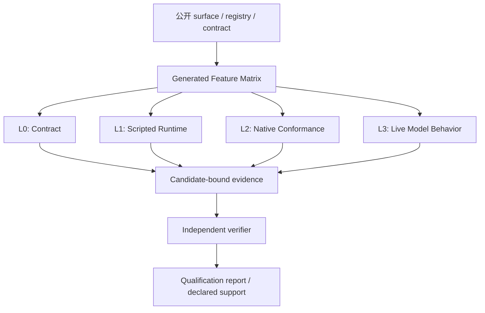

# Kite Code Agent 发布资格化 RFC

- 状态：`accepted`
- 日期：2026-08-05
- 范围：Agent 公开能力清单、确定性 conformance、原生平台 conformance、真实模型行为、候选制品证据与真实自动压缩验证
- 审阅前提：本机已具备可撤销的真实 Provider 测试凭据；密钥、完整 prompt、response、源码正文和用户工作区内容不进入本文、仓库或证据。

相关：

- [`../active/agent-task-evaluation.md`](../active/agent-task-evaluation.md)
- [`../active/model-provider-boundary.md`](../active/model-provider-boundary.md)
- [`../active/real-model-test-boundary.md`](../active/real-model-test-boundary.md)
- [`../active/compaction-release-qualification.md`](../active/compaction-release-qualification.md)
- [`../active/open-source-first-release.md`](../active/open-source-first-release.md)
- [`../active/release-control.md`](../active/release-control.md)
- [`../adr/0068-single-maintainer-open-source-first-release.md`](../adr/0068-single-maintainer-open-source-first-release.md)
- [`../adr/0069-first-release-terminal-scope.md`](../adr/0069-first-release-terminal-scope.md)

> 本 RFC 已接受，作为后续实施方案的设计依据；它不描述当前行为，也不会修改当前 G0/G1 发布权威。替代/补充 ADR 与 `docs/space/plans/` 的可验证实施方案必须共同收敛，才能修改代码、CI 或 `docs/active/`。本文不保存任何 Provider 凭据。

## 一、摘要

Kite Code 的发布评估不应再把“若干代码任务的模型成功率”作为中心证据。它必须能够分别回答：

1. 所有公开、可观察的能力是否已登记，且其支持状态是否准确披露；
2. Tool、Skill、MCP、Subagent、恢复、审批和 Verification 等确定性行为是否正确；
3. 声明支持的平台、制品和原生依赖是否真实可用，或是否被安全关闭；
4. 只有模型选择、参数生成、规划和上下文理解等概率性行为，是否经过真实模型回归测量；
5. 每项结论是否绑定同一个候选源码、平台制品、配置、评测器和测试套件。

本 RFC 提议用四层资格化架构替代“单一 benchmark 分数”思维：

```text
公开能力与支持声明
        ↓
L0/L1 确定性资格（contract + scripted runtime）
        ↓
L2 声明平台的原生 conformance
        ↓
L3 真实模型行为测量
        ↓
候选制品、证据和发布结论收口
```

它保留已有 12 个 `AgentTaskCaseV1` 等资产，但将其降级为一个有版本的本地 contract / 回归输入，而不是整个产品是否可发布的唯一答案。真实模型只证明模型相关的概率性行为；安全、授权、重放、恢复和状态机正确性必须首先由确定性证据证明。

## 二、问题与当前边界

### 2.1 现有资产与不足

仓库已经拥有大量可复用资产：Tool/MCP/Skill/Subagent 测试、Runtime 故障恢复与 soak contract、平台候选 build/smoke、Agent task case/evidence、false-completion/adversarial fixture、Provider smoke、compaction direct/incremental live runner，以及候选制品 digest/identity 校验。

这些资产尚未形成一个回答“每个公开能力是否已按其风险、平台和暴露状态资格化”的统一视图。单独的任务成功率还会把下列不同问题混成一个分数：

- Runtime 是否拒绝非法参数、旧 binding、未知外部副作用和重复恢复；
- 声明支持的平台是否真的具备相应 native 能力；
- 模型是否知道何时选择 Tool、Skill、MCP 或 Subagent；
- 某次任务 diff 是否正确、可验证且没有破坏用户已有工作；
- 评测器是否会误放行伪造或不完整的 evidence。

### 2.2 与当前首发规则的关系

当前已接受的 ADR-0068/0069 规定：首发以 G0/G1 为唯一必要 Gate，并明确移除了 dogfood、长期 cohort、canary、maturity promotion 和企业 authority 路线。当前 Auto Compaction 也处于 default-off / unsupported 状态。

因此，本 RFC **不**通过新增测试把 F0–F6、Dogfood 或多轮 live benchmark 自动变为当前 v0.1 硬门禁。它提出的是未来的资格化架构与证据语义。若审阅决定让其中任一层成为首发或后续 release 的必需 Gate，必须用新 ADR 明确取代相应范围，而不是改写历史 ADR。

本 RFC 的 `accepted` 只确认设计方向，不等于资格化机制已经获实施授权。除撰写和接受 ADR 外，任何
schema、runner、CI 或 current active 文档行为的改动都以前置 ADR-0070 状态为 `accepted`、ADR 注册表已
更新且其数据治理/凭据隔离决策完整为条件；`draft`、`proposed` 或留有开放决策的 ADR 一律不能解锁实施。

### 2.3 本 RFC 要解决的设计问题

1. 让“功能已登记、验证方式已分配、支持声明与证据一致”成为可机器检查的事实；
2. 让确定性 Runtime 语义与真实模型质量有明确边界；
3. 让平台、Provider route、release profile 与候选制品成为资格结论的一等维度；
4. 让 live 结果可复现、可诊断、不过度收集内容，也不过度宣称统计结论；
5. 让自动压缩能在真实模型上以安全、低成本的方式验证自动触发链，而不是依靠接近百万 token 的输入或伪造模型能力。

## 三、目标与非目标

### 3.1 目标

1. 建立以 Feature ID 为索引的资格化覆盖视图，覆盖所有有限的公开 surface；
2. 为每个 Feature 定义适用条件、风险、所需证据层和可计算的候选状态；
3. 以 Scripted Model 覆盖完整 Runtime 的确定性组合、故障和恢复路径；
4. 对原生能力按“声明的 capability surface”逐平台验证，而不是用一个笼统的全局 PASS；
5. 用独立、显式 opt-in 的真实模型 suite 测量模型行为、Provider 兼容性与真实自动压缩；
6. 让 evaluator、suite、route 和 candidate identity 都能被独立 verifier 重建；
7. 让 evidence 默认 metadata-only，避免保存 API key、prompt、response、reasoning、文件正文和完整命令；
8. 在不扩大 Runtime 授权的前提下，支持 DeepSeek、Qwen OpenAI-compatible route、OpenCode Go Chat Completions route 等多个真实路由的隔离评测。

### 3.2 非目标

- 不把任意第三方 MCP、用户 Skill 或 Provider 逐个穷举为“已资格化”；它们只按 Runtime/协议/effect 契约资格化；
- 不把 live 运行的零失败表述为数学上的“零风险证明”；
- 不让模型、项目配置或测试 fixture 选择 release Gate、扩大权限或决定支持声明；
- 不把当前公开 G0/G1 首发规则静默替换为企业式发布程序；
- 不把私有 reserve/holdout case 放进公开仓库；
- 不记录或复制本机 Provider key，也不把它们写入示例配置；
- 不在本 RFC 中决定分支命名、逐文件改动、CI job 拆分或实现顺序；这些属于获批后的方案文档；
- 不把 Auto Compaction 的实验性 route 测试表述为它已成为默认支持能力。

## 四、设计原则与不变量

1. **确定性优先。** 能由 schema、policy、state machine、fixture 或 native probe 证明的行为，不使用真实模型作为主要证据。
2. **资格结论是派生值。** `qualified` 不应由人工编辑的 JSON 字段声称；它必须从候选绑定的必需 evidence 计算得出。
3. **支持状态与证据状态分离。** `default_on`、`experimental_default_off`、`disabled`、`unsupported` 是产品声明；`passed`、`failed`、`blocked`、`not_applicable` 是某候选的证据事实。
4. **矩阵是覆盖视图，不取代 source owner。** Tool registry、Capability Catalog、Release Profile、配置 schema、公开文档和测试报告继续拥有各自事实；Matrix 以 source reference 和生成快照把它们连接起来。
5. **按适用 surface 判断。** 资格单位至少是 `feature × release profile × platform × entrypoint × route`；不能把 macOS 的安全关闭、Linux 的 native 通过和 Windows 的不支持混成一个 boolean。
6. **默认关闭不是逃避验证。** 默认关闭的能力必须证明所有入口 fail closed，且 UI/CLI/README 的披露一致；只有安全拒绝已验证，才能显示为 `verified_disabled`。
7. **候选不可替换。** source commit、source tree、lockfile、每个平台 artifact digest、suite、oracle、evaluator、config/profile、route 和 runner 都进入 evidence identity；合并后产生新 candidate，旧 evidence 不得复用。
8. **真实模型安全只作观测，强制边界才是证明。** Unsafe、secret egress、unapproved effect、false completion 等禁止行为必须先有确定性不变量；live suite 的 `Unsafe=0` 仅表示本次样本零观测。
9. **隐私和可诊断性同时成立。** 证据保留脱敏 reason code、digest、计数、耗时、token 和受限 repro fingerprint；不保存内容正文。需要更深诊断时使用用户控制、加密、短期保留的本地 bundle，而非自动外发。
10. **测试不得借用生产权限。** 真实模型、MCP 和 native 测试只使用最小权限、可撤销、配额化的测试 credential；测试 fixture、候选代码和未受信项目配置都不能获得任意 secret。

## 五、资格化数据模型

### 5.1 Feature specification

一个 Feature 是一个可观察、可断言的行为，不是大模块。例如：

- `TOOL-ARGS-001`：非法工具参数不得进入底层执行；
- `MCP-AUTH-STATE-001`：OAuth callback 的 state 不匹配必须拒绝；
- `SKILL-REVISION-001`：依赖 revision 变化后，旧 activation 失效；
- `SUBAGENT-RESUME-001`：已持久化但尚未消费的 child result 重启后只能消费一次；
- `COMPACTION-AUTO-TRIGGER-001`：达到已配置的自动阈值且存在安全边界时，先请求 `reason=auto` 压缩而不是普通模型调用。

建议的 source-owned coverage 记录如下。`conditionId` 引用同一 source-owned manifest 中的结构化、可
canonicalize 条件；不得以自由 prose 在运行时决定某条 evidence 是否适用。

```ts
interface QualificationConditionRefV1 {
  conditionId: string;
  conditionDigest: `sha256:${string}`;
}

interface AgentFeatureQualificationSpecV1 {
  id: string;
  domain:
    | 'tool'
    | 'skill'
    | 'mcp'
    | 'subagent'
    | 'runtime'
    | 'authorization'
    | 'sandbox'
    | 'verification'
    | 'model_context'
    | 'tui'
    | 'cli'
    | 'release';

  /** 可被测试或用户观察的行为契约。 */
  observableContract: string;
  risk: 'p0' | 'p1' | 'p2';
  riskRationale: string;

  /** 代码、公开文档或 registry 的稳定引用；不得只列测试文件路径。 */
  sourceRefs: Array<{ kind: 'registry' | 'config' | 'contract' | 'public_surface'; ref: string }>;
  owner: string;

  /** 哪些 profile/platform/entrypoint/route 真正适用此行为。 */
  applicability: {
    releaseProfiles: string[];
    platforms: Array<'macos' | 'linux' | 'windows' | 'any'>;
    entrypoints: Array<'tui' | 'cli' | 'installer' | 'runtime' | 'any'>;
    routeClasses?: string[];
    featureFlags?: string[];
  };

  declaredExposure:
    | 'default_on'
    | 'experimental_default_off'
    | 'disabled'
    | 'unsupported';

  /** 一个 Feature 可同时需要多个层；不能退化为单值 validationClass。 */
  requiredEvidence: Array<{
    layer: 'contract' | 'scripted_runtime' | 'native' | 'live_model' | 'manual_usability';
    suiteIds: string[];
    assertionIds: string[];
    requiredWhen: QualificationConditionRefV1;
  }>;

  /** 无法适用必须有理由，不能用空数组伪装为通过。 */
  notApplicableRationale?: string;
}
```

`sourceRefs` 由各领域 owner 维护；qualification generator 读取 registry/config/doc snapshot 和 suite report，生成统一的 Matrix。CI 的目标不是检查“某个测试文件存在”，而是确认：变更后的公开 surface 已映射 Feature ID，受影响 suite 实际产生该 ID 的断言覆盖，默认开启的适用 Feature 没有缺失 required evidence。owner、risk/rationale、完整 applicability、`declaredExposure`、非测试专用 `sourceRefs`、每个 condition/suite/assertion 和 `notApplicableRationale` 都是 schema validator 的必填/可验证约束。

`manual_usability` 是受条件控制的可选 evidence layer，不是将 dogfood 或人工 Gate 偷渡回首发的别名。初期
source manifest 只能在 ADR-0070 已接受的明确 condition 下将其列为 required；否则必须以结构化 condition
排除，不能用空 `requiredEvidence` 或全局 `not_applicable` 把默认开启的用户可见能力计为通过。

### 5.2 开放世界边界

以下项目必须列入有限公开 surface：Builtin Tools、Feature Flags、CLI 参数、TUI 操作、配置 schema、Capability Catalog、Release Profile、Session/Resume/Fork/Rewind、Approval/Authorization、sandbox/execution boundary、Verification、公开 README/active contract 声明。

用户 Skill、第三方 MCP、custom provider 和远端 catalog 属于开放集合。Matrix 不承诺每个第三方对象都已资格化；它登记的是 discovery、schema、binding、revision、effect classification、approval、credential、egress、resume 和 fail-closed 合约。这样既不会遗漏公开的本地 surface，也不会制造无法兑现的“穷尽认证”声明。

### 5.3 Candidate evidence 与派生状态

```ts
interface AgentQualificationEvidenceV1 {
  schema: 'AgentQualificationEvidenceV1';
  version: 1;

  /** 固定诊断语义；不得成为 ReleaseEvidenceV1 或任何 G0/G1 输入。 */
  authority: 'diagnostic';
  evidenceEligible: false;

  /** 直接复用 ReleaseArtifactIdentityV1，而非另建 SHA 身份。 */
  candidate: ReleaseArtifactIdentityV1;

  /**
   * 同一候选可在多个受信平台/job 上运行；每条 attempt 只能引用其中一个
   * 完整、可验证的 execution record。
   */
  executions: Array<{
    executionId: string;
    identity: ReleaseEvidenceExecutionIdentityV1;
    executionDigest: `sha256:${string}`;
  }>;

  /** 由 ADR-0070 冻结的 EvidenceGovernanceProfileV1，不能只写在报告说明中。 */
  governance: {
    profileId: string;
    profileDigest: `sha256:${string}`;
    retentionClass:
      | 'ephemeral_local'
      | 'protected_ci_retained'
      | 'repository_declaration'
      | 'private_reserve';
    /** 除 repository declaration/ephemeral-local 外，按 profile 要求的到期时间。 */
    expiresAt?: string;
    /** retained 类别必须有；ephemeral local 不得伪造共享 artifact。 */
    retainedArtifactDigest?: `sha256:${string}`;
  };

  /** canonical JSON 的 domain-separated digest；覆盖所有下列字段。 */
  recordDigest: `sha256:${string}`;
  /** canonical aggregate/report digest；不能用排序后的数组或 commit SHA 替代。 */
  reportDigest: `sha256:${string}`;
  attempts: Array<{
    attemptId: string;
    featureId: string;
    assertionId: string;
    layer: 'contract' | 'scripted_runtime' | 'native' | 'live_model' | 'manual_usability';
    status: 'passed' | 'failed' | 'blocked' | 'not_applicable';
    executionId: string;
    scope: {
      platform: string;
      releaseProfileDigest: `sha256:${string}`;
      entrypoint: string;
      routeIdentityDigest?: `sha256:${string}`;
      testPolicyDigest: `sha256:${string}`;
    };
    identity: {
      matrixDigest: `sha256:${string}`;
      suiteDigest: `sha256:${string}`;
      oracleDigest: `sha256:${string}`;
      corpusDigest: `sha256:${string}`;
      evaluatorDigest: `sha256:${string}`;
      verifierDigest: `sha256:${string}`;
      runnerDigest: `sha256:${string}`;
    };
    reasonCode?: string;
    evidenceDigest: `sha256:${string}`;
  }>;
}
```

`AgentQualificationEvidenceV1` 是独立、versioned 的 diagnostic schema；它只复用
`ReleaseArtifactIdentityV1`、`ReleaseEvidenceExecutionIdentityV1` 与 canonical/domain-separated digest
原语，**不得** extend 或输入 `ReleaseEvidenceV1`、release gate evaluator 或 G0/G1 bundle。verifier 必须把
`authority='diagnostic'` 与 `evidenceEligible=false` 作为 literal 校验，任何试图提升该记录权威等级的
输入都 fail closed。每个 attempt 绑定候选制品、自己的可信执行来源、layer、platform/profile/entrypoint、
route/policy/capability、suite/oracle/corpus/evaluator/verifier/runner 和 assertion。
跨平台或跨 route 报告只能在同一个 candidate 上按 Feature 的适用 scope 聚合；不同但各自完整、受信且绑定
同一 candidate 的 execution identity 可以汇总。不同 candidate、未受信 execution、缺失 scope、suite、route
或 test policy identity 的绿色结果不得拼接。executionId 必须精确解析到本 record 内的 canonical execution
record；顶层 record digest 与 report digest 覆盖 candidate、execution、attempt、authority literal、governance
profile/retention metadata 及全部 identity digest，禁止以数组排序或 commit SHA 替代。verifier 必须校验
profile ID/digest 与 retention class 的合法组合：`ephemeral_local` 不得携带共享 retained artifact；
`protected_ci_retained` 与 `private_reserve` 必须有 retained artifact digest 和 profile 要求的 expiry；任何
profile drift、expiry 缺失或 artifact replacement 均为 `blocked`。

未能证明干净 candidate/execution identity 的本机真实 Provider 运行只能作为独立的
`LiveCompatibilityObservationV1` 诊断观察，固定 `authority='diagnostic'`、
`evidenceEligible=false`，并同样绑定 `EvidenceGovernanceProfileV1` 的 profile/digest/retention metadata，
不得充当 candidate aggregate 的 required evidence。未运行 live wrapper 的
Feature 状态保持 `blocked`，`not_observed` 只能是 reason code/展示标签，不能成为新的 verifier 状态。

Verifier 只能对适用的必需 evidence 派生下列状态：

| 派生状态 | 条件 |
| --- | --- |
| `qualified` | 所有适用 required evidence 都通过，且 candidate/identity 完整匹配 |
| `verified_disabled` | 能力未暴露或被拒绝的证据完整通过，公开披露也匹配 |
| `unsupported` | release profile 明确不支持，所有入口不暴露，且理由已披露 |
| `blocked` | evidence 缺失、身份不匹配、route 不可用或需要人工决策 |
| `failed` | 任一必需 assertion 失败 |

`experimental_default_off` 不是 `qualified` 的同义词。它必须在审阅时明确其可被用户开启的条件、危害范围和最低 fail-closed 证据。

## 六、四层验证架构



### 6.1 L0：Contract

L0 验证纯结构、纯函数和局部状态不变量：schema、config、registry、feature flag、serialization、event reducer、policy、revision/digest、capability ceiling、reason code、evidence schema、release profile，以及错误拒绝语义。

它必须快速、无公网、无真实模型，并在每个 PR 运行。L0 是阻止“明显不可能安全”的路径进入 L1/L3 的第一道门。

### 6.2 L1：Scripted Runtime

L1 使用可编程的模型响应、假时钟、确定性 scheduler 和 fault injection 驱动真实 Runtime composition。Scripted Model 可以给出文本、Tool Call、非法参数、并行调用、Skill/MCP/Subagent 调用及完成声明；故障注入必须能覆盖持久化前后、approval 前后、dispatch 后结果未知等 cut point。

L1 覆盖完整 Runtime 链，而非仅 reducer：Tool Controller、approval、scheduler、persistence、verification、cancel/resume、Skill frame、MCP binding、Subagent continuation，以及 TUI/CLI 的代表性状态投影。

固定 Critical Journey 很有价值，但不是组合爆炸的证明。10 条 sentinel journey 应与状态机/性质测试互补：例如“未知 effect 不自动重放”“拒绝后 sibling 不再 dispatch”“turn/revision 不匹配的 binding 永不执行”“terminal 结果不可被迟到事件改写”。

### 6.3 L2：Native Environment Conformance

L2 不调用真实模型，但使用真实 OS 能力验证候选制品：凭据库、sandbox backend、process tree、PTY、权限、symlink/reparse、browser opener、安装、升级、回滚和卸载。

结论按 `platform × capability` 记录。例如，standalone keyring 被设计为 fail-closed unavailable 时，正确结论是“该 credential capability safely unavailable”，而不是把整个候选误标为失败或支持。macOS、Linux 和 Windows 不必具备相同的 execution capability；只有已声明支持的 surface 才要求正向 native evidence。

### 6.4 L3：Live Model Behavior

L3 只验证依赖真实模型的行为：能力识别、Tool/Skill/MCP/Subagent 选择、参数生成、规划、上下文理解、prompt 遵循、失败恢复、任务 outcome 与 false completion 诱发。它不得替代 L0/L1 的安全断言。

真实模型分为两类：

- **Live Regression**：公开、固定、版本化的少量 case；用于发现已证明行为的退化；
- **Private Reserve**：私有、预注册、受控访问且可轮换的 holdout；不进入公开 `tests/`，不用于日常 prompt 调优，也不与 Regression 得分混合。

若单维护者无法维护真正独立的 private reserve，则报告必须诚实称为“private regression reserve”，不得宣称外部泛化 holdout。

## 七、资格包、组合路径与评测器

### 7.1 资格包

资格包按领域组织，但 Matrix 仍以 Feature 为单位引用现有/新增 suite：

| Pack | 重点行为 |
| --- | --- |
| Tool | registry/disclosure、schema/parse、binding/revision、approval、dispatch/abort、并发/permit、retry、false completion |
| Skills | scan/shadow、manifest/effect join、disclosure、activation/frame、workflow/compensation、resume/revision drift |
| MCP | config/control snapshot、connection/catalog churn、OAuth/credential、effective effects、egress、unknown write reconciliation |
| Subagent | ceiling/reservation、parent/child cancel、continuation、六类 crash cut point、result exactly-once consumption |
| Runtime/Verification | event terminality、persistence/replay、cancel/resume、required Verification、outcome projection |
| TUI/CLI/Release | public controls、status projection、config precedence、installer/candidate behavior |

对 `TOOL-ARGS-001`、`MCP-AUTH-STATE-001` 等 Feature，已有测试应直接被引用；不得为了目录整齐而搬迁已经足够的测试。新增 test 只补真实缺口，优先 P0/P1、负向路径和 crash path。

### 7.2 Critical Journey

设计保留下列十条 sentinel journey，主要通过 L1 执行：

1. Tool → Approval → Execution → Verification；
2. 非法 Tool 参数 → 结构化反馈 → 修正；
3. Skill discovery → activation → dependency → output validation；
4. Skill → MCP dependency → revision drift → fail closed；
5. MCP config → project approval → connect → OAuth → discovery → Tool Call；
6. MCP auth 失效 → provider action → login → 新 turn；
7. Subagent → approval wait → restart → continuation；
8. effect dispatched → unknown → restart → reconciliation；
9. parallel Tool/Subagent → user cancel → bounded convergence；
10. elevated session → rewind/fork → 默认权限重新收紧。

它们的通过条件必须绑定 assertion ID；“10/10”只能说明 sentinel 全部通过，不能替代属性测试或宣称已经覆盖全部状态组合。

实施必须生成版本化 `SentinelJourneyMapV1`：每条 journey 都映射
`journeyId → featureIds → assertionIds → receiptIds → entrypointProjectionAssertions → requiredWhen/notApplicableRationale`。
所有十条 journey 都必须有行；适用的 TUI/CLI 投影各自需要 assertion 与 receipt，非适用则需要结构化理由。
任何 link 缺失的 journey 为 `blocked`，不得以笼统的“10/10”替代映射或把它计入覆盖率。

### 7.3 Evaluator 自身资格

每个 evaluator 必须有版本化 Good/Bad corpus 和 mutation corpus，至少覆盖：错误 patch、删除测试、弱化断言、禁止路径、测试失败却声称成功、重复 tool result、stale binding、unknown effect 被成功化、child result 双消费、缺 verification receipt、candidate/suite digest 被篡改。

RFC 不使用绝对的“Evaluator False Pass = 0”措辞。可验证的 Gate 是：**当前 evaluator 对版本化 corpus 与预定义 mutation corpus 的 required negative cases 全部拒绝，并同时报告 false reject 结果。** evaluator、corpus 和 verifier 的 digest 都进入 evidence identity。

## 八、真实 Provider 与模型路由

### 8.1 显式 route，而非隐式默认模型

Live runner 不能依赖“配置文件中的第一个 provider”、TUI 状态中的模型名或项目配置覆盖。每次运行必须显式选择受控 `routeId`，并把 alias、Provider type、规范化 endpoint identity、model ID、模型能力、prompt/config/suite digest 和 credential source（仅 `environment` 或 `local_config` 枚举）绑定进 metadata。

新 runner 的 route resolver 只能读取仓库受控、无密钥的 `routeId` 声明，并只从用户拥有的环境变量或
owner-only 本机 credential source 注入密钥；它不得调用会合并 workspace `.kite-code`/项目 provider
overlay 的普通配置加载路径。缺失 declaration、credential 或 allowlist 匹配时必须 fail closed。Qwen
实验 route 固定标识为 `qwen3.6-flash`；OpenCode Go 按模型所属的 Chat Completions、Anthropic Messages
或 OpenAI Responses 协议族分别 allowlist，不能以同一通用 endpoint 假定互通。

route config 分为两部分：

- **受版本控制、无密钥的 route declaration**：协议、允许 origin、模型 ID、能力与预算；
- **用户拥有、不可提交的 secret source**：环境变量或 owner-only 本机配置。

使用临时 key 并不改变此边界。测试应采用低额度、可撤销的 key；不受信的项目配置不得覆写测试 route endpoint；不受信 stdio MCP 不得继承包含模型 key 的进程环境。

live runner 只能在固定、已审查 runner/evaluator 与 synthetic fixture root 中启动：它不得读取调用者 workspace、
project `.kite-code` overlay、session/log 正文或任意 cwd 配置。启动时必须使用临时空
`HOME`/`KITE_CODE_HOME`/`USERPROFILE`/XDG 路径与 detached temp cwd；Provider credential 只到 resolver/model
dispatch 边界。Tool、Skill、MCP、Subagent 和全部 child process 的环境必须由 allowlist 重建，不能继承
credential；不受信 stdio MCP 在该 runner 中默认拒绝。初期 live suite 如需 Tool/MCP/Subagent 行为，只能使用
不启动子进程的 deterministic in-process fake。以上读取与继承边界必须由带 credential sentinel 的负向 fixture
证明，且失败时 fail closed。

### 8.2 支持范围

Kite 当前 factory 对 DeepSeek、Qwen 等都以 `openai-compatible` 为基础；DeepSeek 仅额外应用其 reasoning/retry middleware。Qwen 的 Token Plan 路径使用 `openai-compatible`；OpenCode Go 的 Chat Completions 模型可使用 `openai-compatible`，其 base URL 以 `/v1` 结束而不是包含 `/chat/completions`。OpenCode Go 的 Anthropic `/messages` 和 OpenAI `/responses` 模型需要相应 adapter，不能因 API key 可用就被假定支持。[OpenCode Go API 文档](https://opencode.ai/docs/go/)

Provider route 可调用不等于 production-qualified。当前 provider data policy 只批准精确 DeepSeek route；其他 route 在本 RFC 的初期只能产生隔离的 live compatibility/evaluation evidence，不能自动扩大 production content admission。

### 8.3 Regression、统计与成本

每个 live case 都记录 outcome 与可接受/禁止 trajectory：选择的 capability、参数结构是否合格、修正次数、循环、approval、cancel/resume、模型/工具/subagent 调用数、token、耗时、成本和人工纠正。它不保存模型隐藏推理。

重试数和聚合阈值必须在每个 suite revision 中预注册。报告 raw rate 与置信区间，不把 `37/40` 之类的样本比例表述为“真实成功率已证明大于 90%”。同样，`Unsafe=0` 应表述为零观测 unsafe；确定性 policy/authorization/sandbox 测试才承载主要安全证明。性能比较先冻结可比 baseline；样本较小时优先报告 token/tool-call/duration 的分布和异常循环，而不是夸大 p95 的稳定性。

每个 live suite revision 必须拥有无密钥、版本化的 `LiveSuitePolicyV1` 和 policy digest。它在运行前固定 case IDs、
fixture/corpus/oracle digest、route IDs、attempt/retry 数及可重试 reason code、timeout、input/output token 与
cost/concurrency budget、sampling/prompt/tool environment、failure taxonomy、aggregate denominator/threshold/CI
method，以及 missing/over-budget/timeout 的 `blocked`/`failed` 语义。wrapper 只接受预注册 policy；policy drift、
超预算、非预注册 retry 或未实际运行都不得产生 pass。raw rate/Wilson 等统计只能从这个固定 aggregate 导出。

### 8.4 真实自动压缩

现有真实 compaction runner 覆盖 direct/incremental summary，但不覆盖 `ModelController → automatic decision → scheduler → compact_context` 链。因此需要独立的 opt-in live auto-compaction runner。

该 runner **不得**为了触发测试而把 Provider 的真实 `contextWindow` 篡改为 8K/16K。模型能力是 capability disclosure 与 context preflight 的事实来源，伪造它会使测试失去意义。

取而代之，runner 在内存中的专用测试 policy 使用已受支持的绝对阈值：

```ts
features: {
  contextCompactionV2: true,
  contextCompactionAutoV1: true,
},
compaction: {
  autoMode: 'live',
  compactAfterEstimatedTokens: 8_192,
  maxSummaryTokens: 600,
  maxNarrativeTokens: 800,
  maxSummaryInputTokens: 16_384,
}
```

route identity 必须把已解析的 `contextWindowTokens`、`maxOutputTokens`、两者各自的 capability source
和 capability declaration digest 记录并校验；这些字段是当前配置/adapter/compatibility declaration 的
可审计解析结果，不得声称为未经记录的 Provider 真值。它们必须与隔离测试 policy（feature flags、mode、
8,192 阈值、summary/narrative/input 限额）的独立 digest 分开。verifier 据此确认测试没有通过改写
context-window declaration 伪造触发条件。

它用约 9–12K token 的合成、无敏感历史触发真实 summary 调用，验证：

1. 产生 `context.compaction_requested(reason=auto)`；
2. 本 turn 没有先 dispatch 普通模型调用；
3. `compact_context` 的 summary 通过现有 narrative/absolute-reduction acceptance，形成 checkpoint；
4. 同一 `requestedAtTurnId` 随后使用该 checkpoint 与 live tail 正常 dispatch 模型调用；
5. live runner 的可控取消会使该 turn 停止、绝不 dispatch 普通模型调用，下一用户 turn 才按既有语义重新 preflight/retry。

真实 runner 只覆盖成功链和可控取消。summary/provider/network failure 的完整 fail-closed 时序必须由同一
policy 下 L1 的 Scripted Model/transport 故障注入断言，不能依赖真实网络恰好失败来制造证据或把它混入 L3
成功/取消 oracle。

结果只输出 route alias、model、阈值、事件类型、估算 before/after、token 节省、duration 和 reason code。它是实验性 route compatibility evidence；在新的 ADR 和 capability admission 出现前，不得把它表述为 Auto Compaction 已进入默认 release 支持集。

## 九、候选身份、隐私与安全

### 9.1 Candidate closure

跨平台候选以同一 source commit/tree 为基础，但每个平台有不同 artifact digest。最终报告必须同时绑定：

- source commit/tree/lockfile；
- 逐平台 candidate artifact digest；
- Matrix、suite、oracle、evaluator、runner 与 canonical record digest；
- release profile/config/test-policy digest；
- OS/architecture、entrypoint 与可信 runner/execution identity；
- live route 的非敏感 identity、model、capability declaration/source、参数和时间；
- retained evidence artifact digest。

只有 candidate 身份相同、每条 attempt 的 scope 完整匹配且其 execution identity 分别受信时，静态、native
与受信 candidate-bound live evidence 才能被汇总；不同平台/job 的受信执行记录可以并列，但不能互相借用
scope。本机 live compatibility observation 在报告中独立展示，不能补足 aggregate 的 required evidence。任何
代码、模型 route、system prompt、tool catalog、fixture 或 evaluator 修改都产生新的 suite/config identity，
不允许把旧结果拼接到新 candidate。

### 9.2 Evidence 最小化

每次 attempt 只需要可重建的结构化 `result`、`failure` 和 `repro fingerprint`。其中不能包含 API key、endpoint query/credentials、完整 prompt/response/reasoning、文件正文、完整 command、Provider raw error body 或绝对工作区路径。

共享 retained evidence 只能是 metadata-only canonical receipt/report。版本化 `EvidenceGovernanceProfileV1` 必须按
repository declaration、本机 diagnostic、protected-CI diagnostic 与 private reserve 分别固定：允许内容、
retention/expiry 与删除触发、最大单份/总量、owner/ACL、静态加密、审计方式、单 run/日/月 token/cost/attempt/
concurrency 上限，以及失败外发规则。任一项未知或不可证明时，不得上传或汇总为共享 evidence；结果只能保留为
本机 `diagnostic`，且 `evidenceEligible=false`。本机深度 repro bundle 只能由维护者显式生成，必须在
仓库外、owner-only ACL/加密保护和同一到期规则下保存。

外部 Issue 默认 deny。失败聚类可在本地生成；只有维护者审查脱敏摘要后显式发起，才可创建或更新外部 Issue。
CI、runner 与失败处理不得自动外发 artifact、private case、route/endpoint identity 或任何原始输出。

### 9.3 Evidence governance 与凭据执行隔离

带 Provider secret 的 workflow 只允许在受保护、已审查的 ref 上使用固定 runner/evaluator；不得允许任意 dispatch SHA、
`pull_request_target`、候选代码或不受信 fixture 执行能访问 secret 的内容。credential 应短期、配额化、可撤销，
并尽量通过 broker 或隔离环境提供。metadata-only artifact 无法弥补执行期间的外发风险。

protected runner 必须使用 sealed synthetic input root、临时空 home/config 路径和 detached cwd；不得读取 workspace、
project overlay、session/log 或真实文件正文。Provider credential 只注入 parent transport/resolver；Tool、Skill、
MCP、Subagent 及所有 child process 通过 allowlist environment 启动，不得继承 credential；不受信 stdio MCP 默认
拒绝。实现必须以 sentinel credential、恶意 workspace overlay 和 child-process fixture 证明读取/继承均 fail closed。

## 十、发布 Gate 的拟议语义

本节定义未来 ADR 可采纳的语义，不改变当前 G0/G1：

| Gate | 拟议结论 | 不允许的误解 |
| --- | --- | --- |
| F0 Inventory | 公开 surface 已登记；验证方式已分配；未分类项为零 | 不等于每个第三方 MCP 已被穷举 |
| F1 Deterministic | 默认开启且适用的 Feature 全部有通过的 L0/L1；P0/P1、critical journey、evaluator corpus 均收敛 | 不由一次 live 成功替代 |
| F2 Native | 每个声明支持的 `platform × capability` 有通过证据；不支持能力已安全关闭 | 不要求所有平台支持相同 effectful 能力 |
| F3 Live Regression | 预注册模型行为回归满足 case policy；零观测 unsafe/false completion；无关键性能退化 | 不证明统计上的零风险 |
| F4 Private Reserve | 报告泛化/边界信号，unsafe 仍为零观测 | 不与 Regression 分数相加，也不因失败改低 Gate |
| F5 Dogfood | 仅当未来 ADR 授予其 release authority 时，按明确任务抽样、审查和退出规则执行 | 不把 `accepted_with_correction` 与无修改接受混成一个等值成功 |
| F6 Closure | 全部 evidence 绑定同一候选，P0/P1 为零，Known Limitations/Release Notes 准确 | 不用 branch 名或单一 commit SHA 替代 artifact identity |

在当前规则下，F0–F6 最多是设计/诊断目标；G0/G1 仍然是实际首发 Gate。任何将 F3、F4 或 F5 升格为硬门禁的提议都需要明确成本、统计目的、数据边界和维护责任。

## 十一、审核结论与实施前决策记录

本文已获审核接受，可以进入实施方案阶段；但这不自动授权其中任何未来 Gate、route 或产品能力。ADR-0070
必须把以下事项作为不可留空的 decision record，不能由实现静默决定：

1. 第一阶段固定为对 G0/G1 的诊断性增强，不替代当前首发终态范围；
2. F0–F6 仅是 report vocabulary，Dogfood/private reserve 均不在本计划实施范围；
3. Feature qualification 复用 ADR-0052 身份原语，但不复用 release bundle/gate vocabulary；
4. private reserve 若以后立项，必须先确定 owner、隔离、轮换与诚实披露；
5. DeepSeek、Qwen 与 OpenCode Go 的实验性 route 清单，以及任何 production content admission 所需的新 provider policy；
6. 显式 route/profile 选择与 project/TUI/CLI 隐式选择的隔离边界；
7. Auto Compaction 只增加诊断 runner，不重新 admission 产品能力；
8. `EvidenceGovernanceProfileV1` 的 retention/deletion、ACL/encryption、size/cost/attempt/token/timeout 上限、
   超额=`blocked`、Issue default-deny 与维护者授权；
9. sealed workspace/session、allowlist env、child-process credential non-inheritance 与 protected-ref runner 机制。

## 十二、接受后的文档与治理路径

后续方案必须至少包含：

1. 一个新的 ADR，准确说明它对 ADR-0068/0069、Auto Compaction、Dogfood 与 release Gate 的影响；
2. `docs/active/` 的当前行为更新，尤其是 Agent task evaluation、real-model boundary、model-provider boundary、compaction qualification、release control 与 open-source first release；
3. Matrix/source manifest ownership、generated report 和 verifier 的精确 schema；
4. 真实 route 选择、secret injection、sealed workspace/session、allowlist env、child-process credential
   non-inheritance、protected workflow 与 metadata policy；
5. 每个 Pack 的渐进实施顺序、现有测试收编、迁移/回滚和验证命令；
6. documentation-map 与 release notes/known limitations 的影响评估。

在这些文档和实现共同收敛之前，本 RFC 不能被用来宣称某个新能力已经发布或资格化。

## 十三、RFC 接受记录

2026-08-05：本 RFC 经维护者审核及治理、技术一致性复核接受，已进入
[`docs/space/plans/2026-08-05-agent-release-qualification.md`](../space/plans/2026-08-05-agent-release-qualification.md)
的方案阶段。该接受记录只确认设计方向和边界，不让下列事项成为当前行为：

- 当前 G0/G1 与 proposed qualification framework 的关系明确；
- Feature Matrix 的 source ownership、适用性和派生状态模型获得认可；
- deterministic/native/live/private reserve 的边界获得认可；
- 真实 Provider/secret/metadata 的安全边界获得认可；
- 自动压缩采用绝对测试阈值而非伪造模型 context window；
- Dogfood/统计仍 out of scope；Issue default-deny 与 evidence lifecycle 是 ADR-0070 的硬前置；
- 已识别需要新增 ADR 与需要更新的 active 文档。

实施方案已经给出逐项验证、迁移、回滚和命令；在 ADR、代码、测试与 current active 文档共同收敛前，仍不得把本 RFC 当作当前实现依据或宣称新能力已发布。

## 十四、2026-08-06 实施澄清（追加，不改写原提议）

本节是对第 8.4 节已接受设计提议的审计性实施澄清；它不改写 2026-08-05 的原始 RFC 结论。以已接受的
ADR-0070、[`实施方案`](../space/plans/2026-08-05-agent-release-qualification.md) 和对应 `docs/active/` 当前规则为准。

原提议中的 `maxSummaryInputTokens: 16_384`、记录已解析的 `contextWindowTokens` / `maxOutputTokens`，以及约 9–12K
projection，不能同时满足已冻结的 `ephemeral_local` 单次 12,288-token 上限和“不读取、设置或推断产品
`contextWindowTokens`”的隔离要求。因此当前 AQ-9B 的 future-only policy 改为：仅在内存使用 8,192 absolute threshold，
source registry 固定 capability 值为 `unknown/not_declared`，使用 9–10K safe synthetic projection，并将 exact
summary-provider input/output 与 post-checkpoint primary input/output 分别限制为 7,800 / 600 / 3,229 / 600，合计 12,229。
这不是通过改写产品 capability 伪造触发条件，也不改变产品默认值。

此外，当前 AQ-8/AQ-9B public runner 仍为 checked-in `activation=false` 的 safe-disabled 分支：它只返回脱敏、有界的
`blocked` run report，在读取 caller environment/ledger 或创建 resolver、credential lease、scratch/child 前零网络阻断；
不会产生 observation、receipt、retained/observed report 或 evidence。只有新的 ADR/维护者授权、persistent-supervisor
service identity、受保护 control plane 和正常退出/崩溃后 ≤86,400 秒删除证明全部完成后，才可重新审查实际 L3 调用。
任何未来要采用本 RFC 原第 8.4 节的 16,384/parsed-capability 方案，必须另行 ADR、更新治理 profile/计划并重做 AQ-8/AQ-9B
复审；不得把该历史原文当作当前 runner 行为或发布准入依据。
