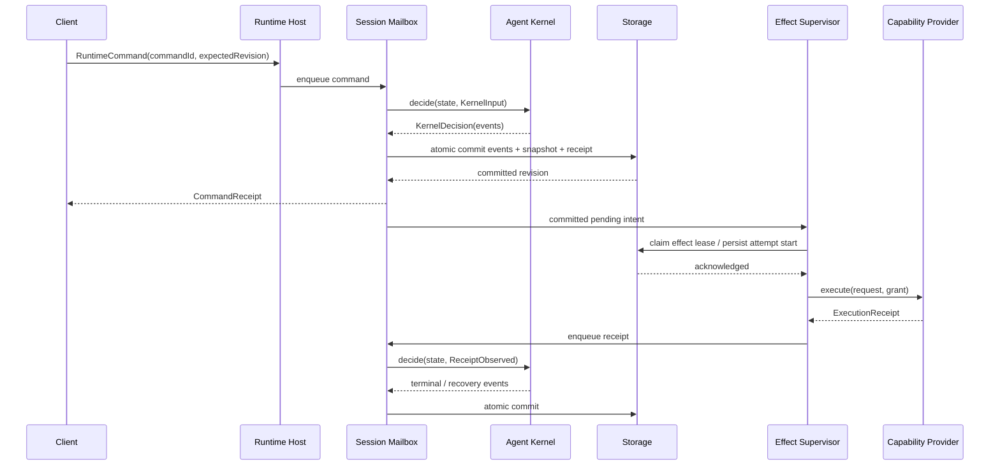
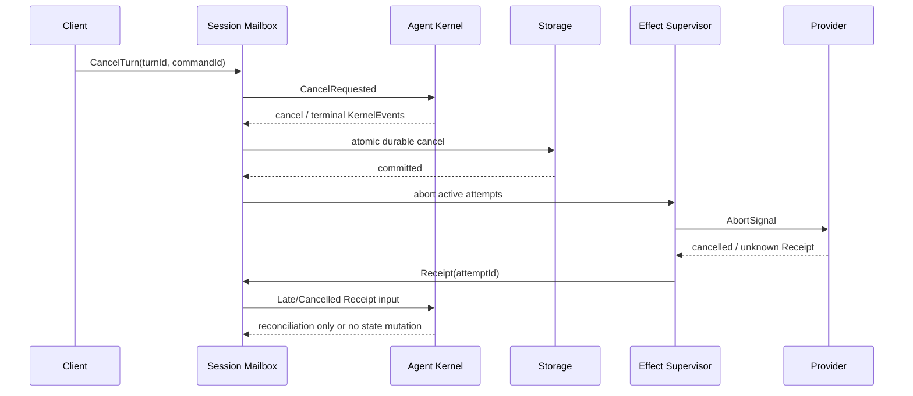

# Kite Runtime Modularization V1 RFC

状态：accepted

日期：2026-08-19

最后修订：2026-08-20（按 ADR-0124 的 RMV1/RAV1 分期清理过时实施信息）

Owners：`github:@ferqx`

Reviewers：三方独立架构/安全/迁移评测与六方实施复核（advisory）；用户于 2026-08-20 直接接受并批准分期修订

基线：`main@af5a512305207dcaaeb40c334d0b914befbc3598`

相关：[`Kite Code 六概念 Runtime 架构`](../active/six-concept-runtime-architecture.md)、
[`Authorization Traceability`](../active/authorization.md)、
[`Production execution boundary contract`](../active/execution-boundary.md)、
[`Runtime resilience qualification`](../active/runtime-resilience-qualification.md)、
[`ADR-0105`](../adr/0105-pre-release-runtime-format-and-convergence-boundary.md)、
[`ADR-0109`](../adr/0109-model-invocation-evidence-and-replay.md)、
[`ADR-0110`](../adr/0110-tool-pipeline-commit-boundaries.md)、
[`ADR-0111`](../adr/0111-governed-local-provider-seams.md)、
[`ADR-0117`](../adr/0117-production-runtime-format-cutover.md)、
[`ADR-0119`](../adr/0119-acknowledged-host-shell-availability-fallback.md)、
[`ADR-0123`](../adr/0123-runtime-modularization-authority-cutover.md)、
[`ADR-0124`](../adr/0124-runtime-modularization-staged-delivery.md)、
[`ADR-0125`](../adr/0125-accepted-rfc-staged-revision.md)、
[`Runtime Modularization V1 实施方案`](../space/plans/2026-08-19-kite-runtime-modularization-v1-implementation.md)、
[`Runtime Authority & Format V1 实施方案`](../space/plans/2026-08-20-kite-runtime-authority-format-v1-implementation.md)。

> 本文是已接受的最终目标架构，不描述当前已实现行为。ADR-0124 将交付拆为两个连续计划：RMV1 只完成物理模块化并保持 State 25、Store 4 与当前 epoch；RAV1 在 RMV1 完成后实施 identity、authority、cross-Host coordination 与 State 26/Store 5/new epoch。实施以两个独立 plan 为唯一入口，每个垂直 slice 仍必须通过自动化 Gate并同步当前文档。

## 1. 状态、Owner 与审阅门禁

本文于 2026-08-20 由用户直接接受，不要求 Runtime、Security、Storage 或 TUI 人工 reviewer 签署。2026-08-19 的三方独立评测分别给出 `reject`、`blocked / not ready for acceptance` 和 `conditional fail / blocked for acceptance`；这些 finding 已由第 33 节和 ADR-0123 转为冻结决策、实施契约与自动化 negative gates。随后六方实施复核确认目标方向成立，但要求把物理模块化与 authority/format 重建拆开；ADR-0124 与本次修订落实该分期，不恢复人工接受门禁。

现有 ADR 记录当前实现历史，不是本次大重构的方案否决依据。ADR-0123 建立新的目标架构权威，并明确替代 ADR-0110、ADR-0111 与 ADR-0119 的冲突范围。当前 production path 在对应垂直 slice 切换前仍以源码、测试和 active 文档为准。

接受和修订动作本身不修改生产代码、不创建 package、不切换 Runtime format。当前只允许从 RMV1-01 精简 baseline/manifest 开始；RAV1 在 RMV1 completion record 存在前保持 blocked。

## 2. 执行摘要

Kite 当前已经拥有强度较高的 Runtime Kernel、Tool Pipeline、Model Invocation Gateway、受治理 Local Provider seam、严格 Runtime format、Recovery Journal、Verification 与可靠性测试。问题不在于“缺少一套新 Runtime”，而在于这些权威仍被组合在单体物理边界内，并且 Client、Host、Kernel、Provider 的控制面没有完全分开。

本 RFC 决定逐步形成六个私有 workspace package 与一个应用：

```text
apps/kite
packages/runtime-contract
packages/agent-kernel
packages/runtime-spi
packages/runtime-host
packages/runtime-storage-sqlite
packages/builtin-runtime
```

设计只冻结四条权威边界：

1. Client 只通过 Runtime Contract 提交 Command、Query 与 Subscription，不能修改 Agent State 或制造 Kernel Event；
2. Agent Kernel 只作确定性决策、状态转换和安全不变量判断，不执行任何外部 I/O；
3. Capability Provider 只执行已获得 Execution Grant 的请求并返回 Execution Receipt，不能接触 Store、Agent State 或 Kernel Event；
4. Runtime Host 拥有 Session、Mailbox、事务、持久化、Capability Arbitration 与 Effect supervision，但不能扩大 Kernel / Policy Runtime 已确定的授权。

目标不是按现有目录机械搬迁，而是让依赖检查、contract tests、fault injection 与 replay 自动证明以上边界。现有成熟的 Tool Pipeline、Model Gateway、MCP、Skill、Sandbox、Subagent、Recovery 与 Verification 语义应迁移和收口，不重新发明。

## 3. 当前架构证据

### 3.1 物理与组合现状

当前仓库是单 package：根 `package.json` 没有 Bun workspace；`tsconfig.json` 只提供 `@/* -> ./src/*`。物理依赖由 `scripts/check-core-boundary.ts` 约束为 `app -> core -> protocol`，并已有 Model dispatch、Tool Provider、Filesystem、Sandbox 与 Subagent no-bypass 检查。

当前六概念架构在逻辑上已经成立：

| 当前职责 | 当前事实入口 | 已有强项 | 尚未闭合的边界 |
| --- | --- | --- | --- |
| Kernel | `src/core/runtime/kernel.ts`、`reducer.ts`、`scheduler.ts`、`state.ts` | event + snapshot 原子提交、effect lease、严格 restore、late event guard | Kernel 类仍直接持有 `RuntimeStore`，`processEvent(RuntimeEvent)` 是公开控制面，没有显式 `KernelDecision` 值 |
| Runtime loop | `src/core/runtime/agent.ts`、`runner.ts`、`executor.ts` | cancel、resource budget、effect execution、completion | Clock、Store、Provider、日志与 Kernel orchestration 仍在同一 Core 组合链 |
| Tool Pipeline | `src/core/execution/tool-pipeline/*` | resolve -> validate -> classify -> authorize -> admit -> dispatch -> receipt -> verify；no-intent-no-dispatch | 类型仍携带 `RuntimeState` / `RuntimeEvent` persistence，Host、Kernel 与 Provider API 尚未成为物理边界 |
| Model | `src/core/model/invocation-gateway.ts`、`response-source.ts` | 五类 purpose 统一 Gateway；attempt ack before dispatch；strict replay 无 live fallback | Gateway persistence 直接以 `RuntimeState` / `RuntimeEvent` 表达，尚未作为 Provider + Host effect 生命周期组合 |
| MCP | `src/core/mcp/runtime-provider.ts`、`manager.ts`、`transport-boundary.ts` | revision binding、per-invocation transport admission、remote egress、write governance | Tool composition 仍需专门传入 transport binding；统一 Execution Grant 尚未覆盖 discovery 到 execution 全链 |
| Local Providers | `src/protocol/*-provider.ts`、`src/core/execution/workspace-filesystem/*`、`sandbox-execution/*`、`src/core/subagent/*` | sealed grant、single-use、bounded receipt、fake 不回退 Local | 三条 seam 各有专用 grant，尚未共享最小通用 Provider lifecycle contract |
| Context | `src/core/model/context-projection.ts`、`project-instructions.ts`、`src/core/skills/*` | canonical projection、project instruction budget、Skill workflow | Context source 自行读取与候选内容、最终 authority / ordering / egress 还没有 Host-owned contract |
| Storage | `src/core/runtime/store.ts`、`src/core/persistence/*` | SQLite v4、snapshot checksum、fork/rewind、effect lease、私有 immutable artifacts | Port 与 SQLite 实现同文件；Session metadata、artifact namespaces 和 Runtime transaction 没有 Host storage 边界 |
| Verification | `src/core/verification/*`、`completion-guard.ts` | Tool success 不等于完成；required verification fail closed | 外部 check 执行与最终 completion decision 需要分别归 Provider 与 Kernel |

### 3.2 `SessionRuntime` 是当前隐藏的 Runtime Host

`src/app/tui/session-manager.ts` 不是纯 Presenter。它直接导入并组合：

- `bun:sqlite` 与 `createRuntimeStore()`；
- `createAgentKernel()`、`runRuntimeAgent()`、`RuntimeKernelControl`、`RuntimeEffect`、`RuntimeState` 与 `decideNextEffect()`；
- Sandbox、Git Broker、Model Invocation Runtime、MCP、Skills 与 Runtime Effect Executor。

`SessionRuntime` 自身持有 run serialization、`AbortController`、live generator、Kernel control、manual compaction barrier、foreground/background routing、pending interaction、presentation buffers 与 cleanup barrier。`runTask()` 负责 Sandbox preparation、Model / MCP / Skill composition、generator ownership、事件消费、cancel 和 teardown。`SessionManager` 还直接打开 SQLite 保存 token stats、fork RuntimeStore、创建 standalone Kernel 执行 compaction / Plan command，并管理 Session registry。

因此当前真实结构是：

```text
TUI SessionRuntime
  -> Session ownership / run serialization / cancel
  -> Store / Kernel / effect executor composition
  -> Sandbox / Model / MCP / Skill lifecycle
  -> durable + ephemeral event routing
  -> presentation buffering
```

其中前四项属于目标 Runtime Host；只有最后一项及 selected-session / viewport / input state 属于 TUI。

### 3.3 Client 当前可以制造 Runtime fact

`src/core/runtime/agent.ts` 暴露：

```ts
export interface RuntimeKernelControl {
  getState(): Readonly<RuntimeState>;
  processEvent(event: RuntimeEvent): void;
  processEventBatch(events: RuntimeEvent[]): RuntimeEvent[];
  cancelRun(reason?: string): RuntimeEvent[];
}
```

`SessionRuntime.setInteractionMode()` 直接构造 `interaction_mode.changed`；`abort()` 可直接构造 `context.compaction_failed`；Plan enter/exit 与 manual compaction 路径还会直接构造 `task.started`、`planning.entered`、`planning.exited`、`task.cancelled`、`context.compaction_reset` 等事实并送入 Kernel。

这些调用大多最终经过 reducer，而不是直接写字段，但 Client 仍拥有“宣称事实已经发生”的 authority。目标链路必须改为：

```text
Client RuntimeCommand
  -> Host mailbox
  -> Kernel decide
  -> KernelEvent
```

### 3.4 `RuntimeEvent` 混合了事实与展示流

`src/core/runtime/events.ts` 的同一个 `RuntimeEvent` union 同时包含：

- durable facts：`tool.queued`、`approval.granted`、`capability.execution_succeeded`、`turn.completed` 等；
- 明确不持久化的 stream：`model.text_delta`、`model.reasoning_delta`、`model.reasoning_completed`、`tool.progress`；
- Client-facing status / diagnostics。

`SessionRuntime` 因而维护 `DISPOSABLE_EVENT_TYPES`、50ms 合并、后台淘汰和 terminal barrier。目标必须拆成：

```text
RuntimeCommand       外部意图
KernelEvent          durable reducer fact
RuntimeNotification  Client projection（durable 或 ephemeral）
```

### 3.5 Kernel 与 Scheduler 的当前泄漏

`AgentKernel` 当前同时持有 `RuntimeStore` 与 `RuntimeState`，在 `processEvent()` / `processEventBatch()` 内完成 reduce + persist。这个实现有强原子性，但阻止 Kernel 成为无 I/O 的确定性 package。

`src/core/runtime/scheduler.ts` 当前硬编码 `PARALLEL_READ_TOOL_NAMES`，包括 `read_file`、`search_content`、`shell_execute` 等，并用 `call.name === 'task'` 决定 Subagent batching；它还依赖 `toolCallBelongsToCurrentWork()` 等 root-state filter。这证明 Scheduler 尚未完全消费 effect/resource metadata，Active Work ownership 也尚未结构化。

### 3.6 当前 Authority 与恢复事实

当前实现已经证明以下基础，不应在迁移中倒退：

- Tool、Model、Filesystem allocate/prepare、Sandbox 与 Subagent dispatch 前均有 durable ack；
- Tool receipt 失败收敛为 `unknown`，不盲目重放；
- `RUNTIME_STATE_SCHEMA_VERSION = 25`、format epoch 为 `kite-runtime-2026-08-18`，旧格式 fail closed；
- RuntimeStore effect lease 跨连接互斥，但 lease 不替代 intent；
- Model strict replay miss 不回退 live；fake Provider 不回退 Local；
- Verification 与 CompletionGuard 不把单次 Tool success 或 final text 解释为任务完成。

当前 Shell grant 仍有一个目标模型无法接受的耦合：`src/core/harness/tool-runner.ts` 以单个 `hasExecutionGrant` 推导 `networkMode = allow_all`，而 filesystem scope 另由 effects 决定。这是当前 active 文档明确记录的 development 语义，不是本文可以偷偷改掉的实现细节；第 17、30、33 节将说明替代要求和 ADR 门禁。

### 3.7 当前测试与 Harness

仓库已经拥有：

- Kernel / reducer / scheduler / store：`tests/runtime/*`；
- Tool Pipeline 与 Provider seam：`tests/execution/*`；
- MCP transport / egress / write：`tests/mcp/*`；
- Model Gateway / replay：`tests/model-invocation-*.test.ts`、`tests/evals/agent-tasks/*`；
- Subagent：`tests/subagent-*.test.ts`；
- Verification：`tests/verification/*`；
- Runtime journey：`tests/evals/runtime-journey-baseline.test.ts`；
- fault injection / soak：`tests/runtime/fault-injection.test.ts`、`fault-soak-*`、`scripts/runtime/*`；
- TUI session / PTY system tests：`tests/session-manager.test.ts`、`tests/tui-system/*`；
- static architecture gate：`scripts/check-core-boundary.ts`。

目标 Harness 是对这些资产分类、补齐 contract / fault / live / soak 维度，而不是先移动所有测试目录。

## 4. 问题陈述

当前架构的主要风险是 authority boundary 依靠约定和同包调用纪律，而不是物理依赖与窄接口：

1. Client 可以接触 `RuntimeState`、`RuntimeEvent`、Kernel 与 Store，未来新增 Client 会复制或绕过会话语义；
2. Kernel 直接持有 Store，确定性决策、事务与 I/O 无法独立证明；
3. Provider seam 虽然局部受治理，但没有统一的 Execution Request / Grant / Receipt contract；
4. Host 职责分散在 TUI、Runtime Agent、Runner、Executor、Store 与 App Sandbox composition；
5. Observation、Mutation、Egress、Credential 仍未成为一套贯穿 discovery、approval、dispatch、receipt 和 context admission 的权限模型；
6. Scheduler 认识 Tool name，不能仅凭 resource scope / access / isolation 证明并发安全；
7. Session仍使用`threadId`，没有`projectId`与分层Runtime identity；
8. durable fact、Client projection 与 ephemeral stream 共用一个事件 union；
9. 当前 ADR-0119 的 post-approval host-shell availability 语义与目标冲突；ADR-0123 已决定最终架构采用 approval 前 environment selection、无 post-approval fallback。ADR-0124 要求 RMV1 迁移 owner 时保持当前行为，该语义只在 RAV1 的 authority cutover 中原子切换。

仅把 `src/core/*` 搬到多个目录不会解决任何一项。

## 5. 目标

本 RFC 的最终目标是：

1. 建立可由 import graph 和 contract tests 证明的 Client / Host / Kernel / Provider 四边界；
2. 把 Runtime Command、Kernel Event 与 Runtime Notification 分离；
3. 把 Agent Kernel 收敛为纯确定性状态机；
4. 把 Session、Mailbox、事务协调、Effect supervision、Recovery、notification projection 与 module lifecycle 收敛到 Host；具体 Context/Prompt/Model/Skill/Capability 语义留在 builtin runtime，并通过 port 交给 Host；
5. 统一私有 Runtime SPI、Provider registration、Execution Grant、Execution Receipt 与 Context Source contract；
6. 明确 Observation、Mutation、Egress、Credential 四类 authority，并在 approval 前完成 platform projection；
7. 以新Runtime format epoch持久化`projectId`、`sessionId`、分层Runtime identity与新的effect lifecycle；
8. 复用并增强当前 Tool / Model / MCP / Skill / Sandbox / Subagent / Verification / Recovery 语义；
9. 按可独立验证的垂直 slice 迁移，每个 operation 同时只有一个 production handler；
10. 建立 package、contract、journey、fault、live-model、soak 的 Agent Reliability Harness。

交付分为：

- **RMV1 / Runtime Modularization**：完成 package、App/Contract、Host、pure Kernel、Runtime SPI、builtin runtime、ExecutionTraits Scheduler、静态领域 reducer 与 legacy 删除；全程保持 State 25、Store 4、当前 epoch 和当前安全行为；
- **RAV1 / Runtime Authority & Format**：在 RMV1 完成后实施 Project/分层 composition identity、Grant/Receipt authenticity、DataOrigin/Egress/Credential、Project resource fence、approval 前 environment selection、State 26、Store 5 与新 epoch。

## 6. 非目标

V1 明确不做：

- Runtime Server 或网络协议；
- 多租户认证、远程托管、服务端 credential custody；
- 公开 Plugin ABI、第三方进程内兼容承诺或运行时热装卸；
- 通用 Hook Bus、Service Locator、Ports/Adapters 平台；
- 通用 Actor Framework、Mailbox supervisor tree、动态 State Slice 或 reducer injection；
- Provider policy override、Provider 直接访问 Store、Provider 直接调用其他 Provider；
- 在线 legacy Runtime migration、静默 rebind 或 try-new-then-fallback-old；
- 微服务化；
- 以 LOC、目录数量或 package 数量作为成功指标；
- 用 Compaction narrative 承担长期 Project Knowledge；
- 第一阶段把每个 builtin 拆成独立 package。

Sub-agent V1 继续共享父 Session storage，以 `actorId` / `contextLineageId` 区分执行主体，不建设 Project Runtime 或 Actor Framework。

## 7. 术语

| 术语 | 定义 |
| --- | --- |
| Agent Runtime | Host、Kernel、Storage 与 Capability Providers 的完整组合 |
| Runtime Contract | Client 可调用的 Command、Query、Subscription 与投影契约 |
| Runtime Host | Session、Mailbox、事务协调、持久化 port、并发、Effect supervision、Recovery、Notification 与 module lifecycle 的通用机制 owner |
| Agent Kernel | 纯确定性状态机，拥有 Agent State、Policy Runtime、Recovery 与 Completion decision |
| Agent State | Kernel 唯一可归约状态；Client、Host 与 Provider 不可直接修改 |
| Runtime Command | Client 对 Runtime 的意图，不是已发生事实 |
| Action Proposal | 模型提出、尚未授权的下一步行动；Tool Call 只能成为 Proposal |
| Kernel Decision | Kernel 对输入返回的 `applied / rejected / conflict / idempotent_replay` 值 |
| Kernel Event | Kernel 已确认的 durable reducer fact |
| Observation Intent | 读取或获知某资源的意图 |
| Effect Intent | Kernel 已决定需要尝试的外部操作描述 |
| Required Authority | Platform projection 后、在审批 UI 展示的完整实际权限需求 |
| Execution Grant | Policy 决定允许且不宽于 Required Authority 的执行权限 |
| Execution Receipt | Provider 对一次 attempt 返回的 bounded、JSON-safe 结果 |
| Observation | Host 从 Receipt 规范化并提交给 Kernel 的新事实 |
| Evidence Model | Receipt、Artifact、Observation 与 Verification Evidence 的统一关系 |
| Policy Runtime | 对 Proposal、Required Authority 与 Session Policy 作纯决策的 Kernel 子系统 |
| Recovery Engine | 根据 failure、dispatch certainty 与 Evidence 决定恢复方式 |
| Completion Engine | 根据目标、Evidence 与 Verification 决定是否完成 |
| Capability Provider | Model、Filesystem、Shell、MCP、Skill、Verification、Sub-agent 等能力实现 |
| Capability Arbitration | 解析 Capability ID、Binding、Provider 与 Executor；不作授权 |
| Context Source | 向 Host 提供带 provenance 的候选 Context Fragment |
| Context Compiler | `builtin-runtime` 实现的领域编译器；Host 只持有 `ContextCompilerPort`、预算与生命周期协调，不拥有 Prompt/Skill/Model Context 语义 |
| Skill Runtime | 把 `SKILL.md` 编译为 revisioned workflow / Context / Capability candidate 的 builtin provider |
| Sub-agent Protocol | 共享 Session 中 child actor / lineage / continuation / receipt 的受治理协议 |
| Agent Reliability Harness | Contract、Journey、Fault、Live Eval、Soak 与 architecture gate 的统一体系 |

## 8. 权威边界

### 8.1 Client boundary

Client 只依赖 `@kite/runtime-contract`，只可：

```text
command(RuntimeCommand)
query(RuntimeQuery)
subscribe(RuntimeSubscription)
```

Client 不得 import 或获得：`AgentState`、`KernelInput`、`KernelEvent`、`EffectIntent`、`ExecutionGrant`、`RuntimeStore`、`AgentKernel`。

### 8.2 Kernel boundary

Kernel 接受普通 JSON-safe 值：Command-derived input、Execution Receipt-derived observation、时间、ID、platform facts、composition digest。它只返回 Decision / Event / pending intent，不调用外部系统。

Kernel 禁止依赖：

```text
node:
bun
process
Date.now()
crypto.randomUUID()
SQLite
Runtime Host
Runtime SPI
具体 Model / MCP / Filesystem / Sandbox implementation
```

### 8.3 Provider boundary

Provider 只能接收 `ExecutionRequest + ExecutionGrant + AbortSignal + ExecutionEnvironmentRef + AttemptIdentity`，只能返回 `ExecutionReceipt` 或候选 `ContextFragment`。

Provider 不得获得 `AgentState`、Kernel、Kernel Event、Runtime Store、Session Registry、Host 或另一个 Provider。Provider 的 follow-up 只能作为 Proposal 放入 Receipt，由 Host 重新送入 Mailbox / Kernel。

### 8.4 Host boundary

Host 可以持有 Session、Mailbox、Storage Port、Runtime module registry、Effect supervisor、ContextCompilerPort 和 notification projector，但不能：

- 改写 Agent State；
- 制造未经 Kernel decision 的 Kernel Event；
- 把 Observation 当作已授权的新 Effect；
- 扩大 Kernel grant；
- 根据 provider convenience 添加 network / filesystem / credential scope；
- 在一个 production operation 失败后静默调用旧 handler。

## 9. 目标 package 结构

```text
kite-code/
├─ apps/
│  └─ kite/
│     └─ src/
│        ├─ bootstrap.ts
│        ├─ cli/
│        └─ tui/
├─ packages/
│  ├─ runtime-contract/
│  ├─ agent-kernel/
│  ├─ runtime-spi/
│  ├─ runtime-host/
│  ├─ runtime-storage-sqlite/
│  └─ builtin-runtime/
└─ tests/
   ├─ contract/
   ├─ scripted-e2e/
   ├─ fault-injection/
   ├─ live-model/
   ├─ long-horizon-soak/
   └─ reliability-harness/
```

测试目录是最终分类目标；迁移期先按 Harness identity 和命令分类，不为整齐目录机械搬动稳定测试。

每个 package 只有在同一变更中具备真实代码、consumer、`package.json`、`tsconfig`、exports、README、build/typecheck/test 时才创建，不允许空包。

## 10. 依赖规则

箭头表示“依赖于”：

```text
runtime-host
  |-> runtime-contract
  |-> agent-kernel
  `-> runtime-spi

runtime-spi
  `-> runtime-contract

runtime-storage-sqlite
  `-> runtime-host/storage

builtin-runtime
  |-> runtime-spi
  `-> runtime-contract

apps/kite/bootstrap.ts
  |-> runtime-contract
  |-> runtime-host
  |-> runtime-storage-sqlite
  `-> builtin-runtime
```

强制规则：

| Package | 允许依赖 | 禁止依赖 |
| --- | --- | --- |
| `runtime-contract` | 第三方 schema/标准库中无环境副作用的最小依赖 | 其他 `@kite/*`、Node/Bun、UI |
| `agent-kernel` | 无其他 `@kite/*`；纯 TS helper | Node/Bun、Store、Provider、Host、App |
| `runtime-spi` | `runtime-contract` | Kernel、Host implementation、Store、App、具体 builtin implementation |
| `runtime-host` | Contract、Kernel、Runtime SPI | SQLite、具体 builtin、TUI |
| `runtime-storage-sqlite` | Host storage exports | Kernel internals、builtin、App |
| `builtin-runtime` | Runtime SPI、Contract | Host、Store、AgentState、KernelEvent、TUI |
| `apps/kite` 非 bootstrap | Contract 与 App-local presentation/config | Kernel、Host internals、Store adapter、Provider implementation |
| `apps/kite/bootstrap.ts` | 四个具体组合 package | 业务状态转换 |

跨 package 只允许 package exports，禁止相对 deep import。依赖环必须为零。

`agent-kernel`不依赖Contract，意味着Host显式翻译`RuntimeCommand -> KernelInput`；Client DTO与Kernel domain type不共享authority。Kernel输出完整的`KernelExecutionGrant`值，Host只能机械物化为Runtime SPI的`ExecutionGrant`，并用schema/subset contract test防止翻译扩权。

## 11. Runtime Contract

Runtime Contract 是同进程私有应用契约，不是网络协议，不承诺跨进程、跨版本或第三方兼容。

```ts
export interface RuntimeAccess {
  command(command: RuntimeCommand): Promise<RuntimeCommandReceipt>;
  query(query: RuntimeQuery): Promise<RuntimeQueryResult>;
  subscribe(subscription: RuntimeSubscription): AsyncIterable<RuntimeNotification>;
}
```

V1 Commands：

```text
CreateSession
ResumeSession
StartTurn
CancelTurn
RespondInteraction
SetInteractionMode
CompactSession
RewindSession
ForkSession
CloseSession
```

所有可重试Command必须携带`commandId`。RMV1的CreateSession沿用当前可信Workspace/Session bootstrap identity并通过LegacyRuntimeAccess映射；RAV1再切换为bootstrap签发的ProjectHandle。其他命令始终使用既有Session identity。以下是RAV1完成后的目标形状：

```ts
interface RuntimeCommandBase {
  readonly commandId: string;
}

interface CreateSessionCommand extends RuntimeCommandBase {
  readonly type: 'create_session';
  readonly projectHandle: ProjectHandle;
}

interface SessionCommandBase extends RuntimeCommandBase {
  readonly sessionId: string;
  readonly expectedRevision: number;
}
```

`CancelTurn`绑定`turnId / runId`；`RespondInteraction`绑定`interactionId`；`Rewind / Fork`绑定source revision/checkpoint与阶段对应的identity。Host为Create/Fork/Rewind分配target sessionId，并把它写入idempotent command receipt。

身份层级：

```text
Project -> Session -> Work -> ContextLineage / Actor -> Turn
```

本RFC不建设Project Runtime。RMV1保持当前Project/Workspace identity语义；RAV1 cutover后，`projectId`从Session创建时即为必填、持久、不可变的opaque identity，由Host从ProjectHandle解析和验证，Client不能自由选择。`sessionId`是Contract的唯一目标名称；v25内部legacy identity由RMV1 adapter继续映射，直到RAV1 format cutover才删除。

```ts
export type RuntimeCommandReceipt =
  | {
      readonly status: 'applied';
      readonly commandId: string;
      readonly sessionId: string;
      readonly revision: number;
    }
  | {
      readonly status: 'conflict' | 'rejected' | 'not_found';
      readonly commandId: string;
      readonly code: string;
      readonly currentRevision?: number;
    }
  | {
      readonly status: 'idempotent_replay';
      readonly commandId: string;
      readonly sessionId: string;
      readonly originalRevision: number;
    };
```

正常业务拒绝使用值，不用异常。异常只表示 transport/programming/storage unavailable 等不能形成正常 receipt 的故障。

Query 默认读取最后一次 committed projection。Client projection 只包含显示所需的 Session / Work / Turn / Interaction / Evidence summary，不泄露 internal state。

Notification 分两类：

```ts
export type RuntimeNotification =
  | {
      readonly durability: 'durable';
      readonly sessionId: string;
      readonly revision: number;
      readonly projection: RuntimeProjectionDelta;
    }
  | {
      readonly durability: 'ephemeral';
      readonly sessionId: string;
      readonly workId: string;
      readonly turnId: string;
      readonly actorId: string;
      readonly attemptId: string;
      readonly compositionRevision: string;
      readonly streamId: string;
      readonly sequence: number;
      readonly payload: ModelDelta | ReasoningDelta | ToolProgress;
    };
```

`RuntimeSubscription` 接受 `sessionId / afterRevision? / AbortSignal`。revision 可连续时发送后续 durable delta；无法连续时先发送 full committed projection snapshot。iterator `return()` 或 AbortSignal 只释放 subscriber，不取消 Runtime work；过慢 subscriber 可被断开并通过 Query 重建。

Ephemeral notification 允许 bounded coalescing/drop，不承诺重放；reconnect 创建新 `streamId`，late attempt delta 必须丢弃。切换 Client 后以 Query + 后续 durable notification 恢复，不能把 stream delta 补造成 Kernel fact 或模型上下文。

## 12. Runtime Command 与 Kernel Event

三类对象严格分离：

| 对象 | 生产者 | 含义 | 持久化 |
| --- | --- | --- | --- |
| Runtime Command | Client | 希望 Runtime 做什么 | command idempotency record；不是事实日志 |
| Kernel Event | Kernel | 已确认发生的 domain fact | durable event log + reducer |
| Runtime Notification | Host projector / Effect stream | Client 应知道什么 | durable projection 可重建；ephemeral 不持久 |

例子：

```text
SetInteractionMode Command
  -> Host validates expectedRevision
  -> KernelInput.SetInteractionMode
  -> KernelDecision.applied
  -> KernelEvent.InteractionModeChanged
  -> atomic commit
  -> RuntimeNotification.SessionPolicyChanged
```

Client 永远不能提交 `InteractionModeChanged`、`CompactionFailed`、`TaskStarted` 或 `TurnAborted` Event。Host 也不能根据 Provider 返回值直接构造 Kernel Event；Receipt 必须先规范化为 Kernel Input，再由 Kernel decision 产生事实。

## 13. Agent Kernel

目标目录：

```text
packages/agent-kernel/src/
├─ agent-state.ts
├─ active-work.ts
├─ kernel-input.ts
├─ kernel-event.ts
├─ action-proposal.ts
├─ observation-intent.ts
├─ effect-intent.ts
├─ authority.ts
├─ kernel-decision.ts
├─ reducer.ts
├─ scheduler.ts
├─ policy-runtime.ts
├─ evidence-model.ts
├─ recovery-engine.ts
├─ completion-engine.ts
└─ invariants.ts
```

公共 API 草案：

```ts
export type KernelDecision =
  | {
      readonly status: 'applied';
      readonly events: readonly KernelEvent[];
      readonly pendingEffects: readonly PendingEffectRef[];
    }
  | {
      readonly status: 'rejected';
      readonly code: string;
      readonly events?: readonly KernelEvent[];
      readonly pendingEffects?: readonly PendingEffectRef[];
    }
  | { readonly status: 'conflict'; readonly code: string; readonly currentRevision: number }
  | { readonly status: 'idempotent_replay'; readonly originalRevision: number };

export function decide(
  state: AgentState,
  input: KernelInput,
  facts: DecisionFacts,
): KernelDecision;

export function reduce(
  state: AgentState,
  events: readonly KernelEvent[],
): AgentState;

export function selectPendingEffects(
  state: AgentState,
): readonly PendingEffect[];
```

`DecisionFacts` 只包含 Host 提供的 versioned、canonical 普通值；Kernel 不主动读取这些事实。RMV1 先精确投影当前等价的 allocated IDs、monotonic time、Workspace、policy/provider、protected-path、network、execution-boundary 与 attempt facts，不改变当前 identity 或安全语义。RAV1 再加入 ProjectIdentity、分层 identity 与 sealed platform facts。Host projection 只能报告或收紧事实，不能代替 Policy decision。

`decide()` 不持久化；Host 对 Decision 中的 Events 先 `reduce()` 并检查 invariant，再原子提交 Event + Snapshot + command receipt。提交失败时内存 state 不前移，外部执行为零。

Scheduler 最终只消费：

```ts
export interface SchedulableEffect {
  readonly sessionId: string;
  readonly workId: string;
  readonly turnId: string;
  readonly actorId: string;
  readonly intentId: string;
  readonly causalGroup: string;
  readonly resourceScopes: readonly ResourceScope[];
  readonly access: 'read' | 'write' | 'unknown';
  readonly isolation: 'shared' | 'exclusive_workspace' | 'worktree';
  readonly conflictKeys: readonly string[];
  readonly interactionBarrier: boolean;
  readonly concurrencyGroup?: string;
  readonly leaseFenceRequired: boolean;
}
```

规则是 `read + read -> parallel`；可证明 scope 不冲突的 write 可并行；`unknown` 或无法证明则串行。`scheduler.ts` 禁止具体 Capability / Tool name 字符串。

## 14. Agent State 与 Active Work ownership

目标状态：

```ts
export interface AgentState {
  readonly session: SessionState;
  readonly activeWork: ActiveWorkState | null;
  readonly history: WorkHistoryState;
}

export interface ActiveWorkState {
  readonly work: WorkState;
  readonly turn: TurnState;
  readonly interactions: InteractionState;
  readonly capabilities: CapabilityBindingState;
  readonly effects: EffectRuntimeState;
  readonly recovery: RecoveryState;
  readonly verification: VerificationState;
  readonly children: ChildExecutionState;
  readonly context: ContextRuntimeState;
}
```

该目标形状属于 RAV1 的 State 26 设计输入，不是 RMV1 的持久格式要求。RMV1 保持 State 25、Event codec、Snapshot shape 与 replay digest不变，只把现有 central reducer 按编译期固定领域拆为 `core/{lifecycle,authorization,intent,lease,completion}` 与 `domains/{work,interaction,capability,context,verification,recovery}`。统一 reducer 只组合固定领域，不建设动态 State Slice、Plugin Runtime 或 namespaced persisted module state。

RAV1 设计 State 26 时再决定如何把 Work-local state 收入 `ActiveWorkState`、如何持久化分层 identity，以及何时删除现有 `work-scope.ts` filters；不能把这些结构变化夹带进 RMV1 pure Kernel 抽取。

## 15. Runtime SPI

这是私有内部实现契约，不是公开 Plugin ABI：

```json
{
  "name": "@kite/runtime-spi",
  "private": true
}
```

Runtime SPI 包含 module lifecycle、registry、Capability definition/binding/executor、ContextSource/ContextCompilerPort、effect handler、normalizer 与受控 execution adapter。它是私有编译边界，不是公开 Extension SDK。

核心注册点保持窄而固定：

```ts
export interface CapabilityProvider {
  readonly manifest: CapabilityProviderManifest;
  register(registry: CapabilityRegistry): void;
  start?(): Promise<void>;
  dispose(): Promise<void>;
}

export interface CapabilityRegistry {
  registerCapability(definition: CapabilityDefinition): void;
  registerExecutor(executor: CapabilityExecutor): void;
  registerContextSource(source: ContextSource): void;
}
```

启动完成后 Registry 冻结。重复 Provider ID、Capability ID、revision 或同一 production Executor 冲突均使 bootstrap 失败；不采用“最后注册者覆盖”。

```ts
export interface CapabilityExecutor<
  TRequest extends ExecutionRequest = ExecutionRequest,
  TReceipt extends ExecutionReceipt = ExecutionReceipt,
> {
  readonly providerId: string;
  readonly capabilityId: string;
  readonly revision: string;
  execute(request: TRequest, context: CapabilityExecutionContext): Promise<TReceipt>;
}

export interface CapabilityExecutionContext {
  readonly grant: ExecutionGrant;
  readonly requestDigest: string;
  readonly signal: AbortSignal;
  readonly environment: ExecutionEnvironmentRef;
  readonly attempt: EffectAttemptIdentity;
}
```

通用 Receipt：

```ts
export interface ExecutionReceipt<T = unknown> {
  readonly invocationId: string;
  readonly attemptId: string;
  readonly providerId: string;
  readonly executorRevision: string;
  readonly requestDigest: string;
  readonly status: 'succeeded' | 'failed' | 'cancelled' | 'timed_out' | 'unknown';
  readonly dispatchCertainty: 'none' | 'attempted' | 'unknown';
  readonly cleanupCertainty: 'not_required' | 'confirmed' | 'unknown';
  readonly failure?: ClassifiedProviderFailure;
  readonly reconciliation?: ReconciliationEvidence;
  readonly value?: T;
  readonly observations?: readonly Observation[];
  readonly artifacts?: readonly ArtifactRef[];
  readonly dataOrigins?: readonly DataOrigin[];
  readonly diagnostics?: readonly Diagnostic[];
  readonly followUpProposals?: readonly CapabilityRequestProposal[];
}
```

`register()` 与 `start()` 必须为 zero-external-effect：不得读写 filesystem、建连、认证、spawn、访问 ambient credential 或调用另一个 Provider。Provider readiness / discovery / authentication 是普通的、带 intent/grant/receipt 的 lifecycle capability。`dispose()` 必须有界并可验证；partial startup 不能形成隐式 degraded fallback。

Model、Filesystem、Sandbox、MCP、Subagent、Verification 与 Credential 的专用 JSON-safe request / grant / receipt 必须作为 Runtime SPI 子路径冻结，保留现有 route、endpoint、Workspace、preimage、continuation、replay、boundary 与 policy digest；它们不能增加新的 registry kind，也不能让专用 Provider 取得 Host / Kernel authority。

RMV1 信任 Kernel、Host 与 builtin runtime 为同一进程内的可信代码。Package export、deep-freeze 与 static import gate 是工程约束，不是恶意同进程代码的安全隔离。第三方进程内扩展不受支持；cryptographic authenticity 只在 RAV1 针对真实持久化、序列化或进程外 execution boundary 引入。

## 16. Observation、Mutation、Egress 与 Credential Authority

本节描述 RAV1 的目标 authority model。RMV1 只迁移 owner并保持当前 Filesystem、MCP、Model、Sandbox、Egress 与 Credential 行为，不引入通用 DataOrigin/Egress IR 或 Credential Broker。

### 16.1 Observation

读取不是“无 Effect”。Kernel 必须为 filesystem、network response、MCP resource、database / external state 生成 Observation Intent：

```ts
export interface ObservationIntent {
  readonly resource: 'filesystem' | 'network' | 'external_state';
  readonly scope: ResourceScope;
  readonly sourceClassification?: 'project' | 'external' | 'sensitive';
}
```

### 16.2 Mutation

```ts
export interface EffectIntent {
  readonly intentId: string;
  readonly filesystem?: FilesystemEffectIntent;
  readonly network?: NetworkEffectIntent;
  readonly process?: ProcessEffectIntent;
  readonly externalState?: ExternalStateEffectIntent;
  readonly credentials?: readonly CredentialRequirement[];
  readonly resources: readonly ResourceScope[];
  readonly isolation: 'shared' | 'exclusive_workspace' | 'worktree';
}
```

### 16.3 Egress

```ts
export interface DataOrigin {
  readonly originId: string;
  readonly resource: 'filesystem' | 'mcp' | 'network' | 'user' | 'runtime';
  readonly scope: 'project' | 'external' | 'sensitive' | 'unknown';
  readonly observationId: string;
  readonly resourceDigest?: string;
  readonly classification: 'public' | 'internal' | 'confidential' | 'secret' | 'unknown';
  readonly parentOriginIds: readonly string[];
}
```

Provider 只能返回原始 observation metadata；最终 DataOrigin 由 Host 根据 committed Observation / Artifact 与 Policy classification 密封，Provider 或 ContextSource 不能降低 classification。缺失或 `unknown` provenance 使用 deny-wins。Provider data admission 必须接收冻结的 `Content + DataOrigin[]`。来源必须从 Observation Receipt 贯穿 Artifact、Context Fragment、Model/MCP payload 和 egress receipt，不能在 Tool Result 扁平化成字符串后重新猜测。

### 16.4 Credential

Credential authority 独立于 network、filesystem 和 external-state grant。Execution Grant 只引用 credential handle / requirement identity，不携带 secret material；Provider 只能通过 execution environment 中受限 broker 使用被授权 handle。

CredentialGrantRef 必须绑定 project/workspace、provider/server/endpoint、profile、purpose、expiry、revocation 与 single-use identity；每次 broker access 产生无 secret 的 receipt。Provider 禁止直接读取 ambient `process.env` 或用户 credential 文件。

四类权限不能相互蕴含：

```text
Observation != Mutation
Network != Filesystem
Approval != Credential
Read permission != Egress permission
```

## 17. Platform Capability Projection

本节由 RAV1 实施。RMV1 内部先使用类型严格、持久 intent/attempt 绑定的最小 `AuthorizedEffect`，要求 single-use CAS、identity equality、过期/撤销与 request digest 匹配，但不为全部可信进程内 builtin 建立统一 RFC 8785/HMAC seal：

```ts
export interface AuthorizedEffect {
  readonly grantId: string;
  readonly intentId: string;
  readonly sessionId: string;
  readonly workId: string;
  readonly attemptId: string;
  readonly authority: RequiredAuthority;
  readonly requestDigest: string;
  readonly compositionRevision: string;
  readonly expiresAt?: string;
  readonly revocationRevision?: string;
}
```

现有 Filesystem、Sandbox 与 Subagent sealed seam 不得降级。RAV1 根据 threat model、serialization boundary 与 key custody 决定哪些 persisted/out-of-process grant/receipt需要 canonical codec与authenticity evidence。

正确流程：

```text
Effect Intent
  -> Host AuthorityProjector（纯 projection + platform facts）
  -> Required Authority
  -> Kernel / Policy Runtime
  -> RuntimeNotification.InteractionRequested（展示完整权限）
  -> RespondInteraction Command
  -> KernelExecutionGrant
  -> Host exact materialization
  -> Provider ExecutionGrant
```

核心 invariant：

```text
Granted Authority subset-of Displayed Required Authority
Materialized Provider Grant == KernelExecutionGrant
Host cannot add scope
```

`ExecutionGrant` 草案：

```ts
export interface ExecutionGrant {
  readonly grantId: string;
  readonly intentId: string;
  readonly sessionId: string;
  readonly workId: string;
  readonly turnId: string;
  readonly actorId: string;
  readonly attemptId: string;
  readonly sessionCompositionDigest: string;
  readonly providerId: string;
  readonly executorRevision: string;
  readonly capabilityId: string;
  readonly capabilityRevision: string;
  readonly canonicalWorkspaceDigest: string;
  readonly requestDigest: string;
  readonly executionEnvironmentDigest: string;
  readonly providerBindingDigest: string;
  readonly policyRevision: string;
  readonly executionBoundaryDigest: string;
  readonly approvalInteractionId?: string;
  readonly approvalSource: AuthorizationSource;
  readonly displayedAuthorityDigest: string;
  readonly observation: readonly ObservationGrant[];
  readonly mutation: readonly MutationGrant[];
  readonly egress: readonly EgressGrant[];
  readonly credentials: readonly CredentialGrantRef[];
  readonly environmentProfile: string;
  readonly expiresAt: string;
  readonly nonce: string;
  readonly singleUse: true;
  readonly revocationRevision: string;
  readonly authenticity?: ExecutionAuthenticityEvidence;
}
```

Platform projector 可以收紧或报告 unavailable，不能扩大 abstract intent。若平台实际需要额外 filesystem、network 或 credential 权限，必须在 approval 前进入 `RequiredAuthority`；不能先显示“执行命令”，再在 Runtime 内把 network 改为 `allow_all`。

RAV1 的 `PlatformCapabilityFacts` 由 bootstrap 从 sealed execution-boundary qualification 生成，至少绑定 canonical Workspace、OS/Bun/backend/entrypoint、capability surface、network policy、protected-path revision、qualification registry/evidence digest；production constructor 不接受任意 Client/Host object，test fake 使用独立 test-only API。

执行环境选择同样必须在 approval 前完成。RAV1 cutover 后不允许“先选择 native，批准后 Provider unavailable，再自动改走 host shell”的 production handler fallback。若产品仍需要 `host_shell`，它必须作为 approval 前已投影、明确展示的独立 execution environment 被选择；否则本次 invocation typed fail。RMV1 只迁移 Shell/Sandbox owner并保持当前 active 行为；ADR-0123 的目标变化由 RAV1 原子切换。

## 18. Runtime Host 与 Mailbox

目标目录：

```text
packages/runtime-host/src/
├─ runtime-host.ts
├─ command-router.ts
├─ session-registry.ts
├─ session-runtime.ts
├─ session-mailbox.ts
├─ runtime-coordinator.ts
├─ capability-registry.ts
├─ capability-arbitrator.ts
├─ authority-projector.ts
├─ execution-environment.ts
├─ effect-supervisor.ts
├─ context-compiler-port.ts
├─ provider-egress-gate.ts
├─ receipt-normalizer.ts
├─ notification-projector.ts
├─ projections/
└─ storage/
```

核心 API：

```ts
export interface RuntimeHost extends RuntimeAccess, AsyncDisposable {
  start(): Promise<void>;
}

export function createRuntimeHost(input: {
  readonly storage: RuntimeStorage;
  readonly modules: readonly RuntimeModule[];
  readonly contextCompiler: ContextCompilerPort;
  readonly clock: HostClock;
  readonly ids: HostIdAllocator;
  readonly projects: ProjectIdentityResolver;
  readonly platform: PlatformCapabilityFactsProvider;
}): RuntimeHost;
```

RMV1中的`projects`与`platform`输入由保持当前语义的adapter实现；RAV1再替换为ProjectIdentity与sealed Platform Facts port。Host factory始终只依赖port，不导入具体store、builtin或legacy implementation。

不要为 `CapabilityArbitrator`、`AuthorityProjector`、`ContextCompilerPort` 或 `ReceiptNormalizer` 再拆 package。Arbitration、projection coordination、receipt validation是Host通用机制；具体Context selection、Prompt assembly、Skill/Model语义由`builtin-runtime/model-context`实现并注入，不进入Host。

### 18.1 Host-owned 与 Kernel-owned Commands

对外统一为 `RuntimeCommand`，Host 内部分流：

| Host-owned | Kernel-owned Session Command |
| --- | --- |
| CreateSession | StartTurn |
| ResumeSession | CancelTurn |
| ForkSession | RespondInteraction |
| RewindSession | SetInteractionMode |
| CloseSession | CompactSession |

RMV1 的 Contract沿用当前Workspace/Session identity，由Host分配`sessionId`并通过v4 adapter恢复既有Session，不新增ProjectHandle。RAV1 cutover后，CreateSession接受bootstrap签发的`ProjectHandle`，Client不能提交任意`projectId`；Resume及普通Session Command只引用既有`sessionId`，Host从Session identity解析project。Fork/Rewind的target `sessionId`同样由Host分配。

Host-owned command 可以读写 Session metadata / checkpoint / fork storage，但不能修改 Agent State 内容。Fork/Rewind 中 Host 只验证 source 并编排 storage transaction；Agent State transformation 必须由 Kernel 接受 canonical `ForkSource` / `RewindSource` 后决定。Kernel-owned command 必须进入 Session Mailbox并由 Kernel decision 产生 events。

### 18.2 Mailbox 规则

```text
RuntimeCommand / ExecutionReceipt / Host fact
                  |
                  v
            Session Mailbox
                  |
                  v
             Kernel decide
                  |
                  v
              Atomic commit
              /           \
   Notification outbox   Pending Effect
                              |
                       Effect Supervisor
                              |
                         Provider execute
                              |
                         Receipt -> Mailbox
```

规则：

1. 同一 Session 的 Command、Receipt、platform fact 串行归约；
2. 不同 Session 可以并行；
3. Mailbox 不等待 Model、Shell、MCP 或其他 Provider；
4. Effect 在 Mailbox 外执行；
5. Cancel 可以在 Effect 运行时进入 Mailbox，先 durable settle，再发 AbortSignal；
6. Query 默认读最后 committed projection，不读取一半决策；
7. Provider Receipt 必须回到 Mailbox；Provider callback 不直接更新 projection；
8. late Receipt 由 intent / session / work / turn / actor / attempt identity 校验，并交 Kernel 决定 no-op / reconciliation / reject；
9. Notification 只在 commit 成功后发布；ephemeral stream 也必须验证当前 attempt ownership。

### 18.3 Command concurrency 与幂等

RMV1 把当前可表达的command identity与receipt映射进v4 transaction；重复command返回原receipt，包括原Host分配的target sessionId，不重新执行。RAV1的CreateSession再以`(projectHandleId, commandId)`查询，其他命令以`(sessionId, commandId)`查询。`expectedRevision` conflict返回值，不进入Kernel。Host-owned fork/rewind使用source revision/checkpoint与阶段对应的identity作CAS。

Kernel decision、event envelopes、snapshot、command receipt、Effect intent/settlement 和 projection revision 必须在一次 storage transaction 中提交。V1 不建立 durable notification outbox；commit 后使用内存广播，掉线或 revision gap 的 Client 必须通过 Query / full projection snapshot 重建，再订阅后续 revision。

## 19. Capability Arbitration

Capability lifecycle 分为：

```text
Catalog -> Disclosure -> Binding -> Proposal -> Intent
        -> Required Authority -> Grant -> Execution -> Receipt
```

各阶段不能合并：

- Catalog 表示启动时已注册能力；
- Disclosure 表示本次 Context 可让模型知道什么；
- Binding 把模型可见 name 绑定到稳定 Capability ID / revision；
- Proposal 是模型请求，不是 grant；
- Arbitration 只解析 binding、provider、executor、revision、environment compatibility；
- Policy Runtime 才能授权；
- Provider 只执行 grant。

`CapabilityArbitrator` 输入 immutable registry snapshot 与 exact binding，输出 `ResolvedCapability` 或 typed failure。它不读取 Session approval state，不调用 Provider，不生成 Execution Grant。

Provider registry digest 包含：

```text
Provider ID / Version
Capability ID / Revision
Executor Revision
Context Source Revision
```

Registry冻结后不支持运行期热装卸。动态MCP的discovery变化形成新的catalog candidate；已绑定Session不会静默使用新revision。RMV1保留当前revision/mismatch行为；RAV1按第23节分层identity定义session-wide与effect-local mismatch。两个阶段都不预留`RebindSessionComposition` Command。

## 20. Context Source 与 Context Compiler

Context Source 只能提供候选 Fragment：

```ts
export interface ContextSource {
  readonly sourceId: string;
  readonly revision: string;
  collect(request: ContextSourceRequest): readonly ContextFragmentCandidate[];
}

export interface ContextFragment {
  readonly fragmentId: string;
  readonly kind:
    | 'project_instruction'
    | 'capability_disclosure'
    | 'skill_instruction'
    | 'runtime_fact'
    | 'tool_evidence'
    | 'external_content';
  readonly authority: 'runtime' | 'project' | 'user' | 'external';
  readonly content: string | ArtifactRef;
  readonly provenance: {
    readonly providerId: string;
    readonly sourceId?: string;
    readonly revision: string;
  };
  readonly dataOrigins: readonly DataOrigin[];
  readonly tokenEstimate: number;
  readonly disclosure: 'always' | 'selected' | 'on_demand';
}
```

ContextSource 是纯、同步、无外部 I/O 的 projector，只能消费静态 registration 或 committed Observation / Artifact metadata。它不得读取 filesystem、连接 MCP、访问 network/process/ambient credential；Provider `register/start` 同样不能借 ContextSource 做外部 I/O。Source 输出 candidate，Host执行schema/provenance/origin验证后交给注入的ContextCompilerPort。

`builtin-runtime/model-context` 的Context Compiler唯一决定：是否选入、排序、最终prompt role / authority、token budget、truncation、dedupe与Capability disclosure。Host只调用port、施加运行预算并协调生命周期，不解释Prompt/Skill/Model Context语义。Compiler不能自行授权Provider egress；选定payload后必须生成EgressIntent，由Kernel/Policy决定grant，Host只做exact materialization。Source不得返回SystemMessage、直接修改prompt、覆盖Runtime policy或把external content标成runtime authority。

当前实现按职责迁移：

- `project-instructions.ts` 的文件扫描/读取成为 builtin filesystem Observation capability，project-instruction Context Source 只投影已提交 Artifact；
- Skill catalog / workflow 提供 Skill Context Fragment 与 Capability candidate；
- MCP discovery / resource read 先经过 lifecycle / Observation intent 与 receipt，再由 Context Source 提供 external candidate；
- `context-projection.ts`、frame builder、serializer 与 compaction checkpoint 语义迁入 `builtin-runtime/model-context`；Host只保留port和生命周期协调；
- Kernel 只持久化 Context lifecycle、selected fragment identity、checkpoint / evidence decision，不读取文件或拼 prompt。

Compaction 只管理 Conversation Context，不成为长期 Project Knowledge store。User-visible async notification、Agent State 与 Model Context 是三个不同投影；任何一条都不能自动注入另外两条。

## 21. Execution Receipt 与 Evidence Model

Evidence flow：

```text
Provider ExecutionReceipt
  -> Host schema / identity validation
  -> private Artifact publication（必要时）
  -> ReceiptNormalizer
  -> KernelInput.ReceiptObserved
  -> Kernel Decision / KernelEvent
  -> Evidence Model / Recovery / Completion
```

Receipt 是“Provider 声称并由 Host 验证的一次 attempt 输出”；Observation 是 Kernel 可消费的新事实；Artifact 是正文或大对象的私有不可变引用；Verification Evidence 是针对目标断言的证据。四者不可互换。

Execution success 只说明本次调用成功。Completion Engine 必须根据当前 Work goal、canonical receipts、Artifact identity、Observation 和 required Verification 决定完成。Provider、Host notification projector 和 Client final text 均不能绕过 Completion Engine。

`ReceiptNormalizer` 只能执行 schema、identity、boundedness、digest 与 DataOrigin preservation；不能把 Provider follow-up proposal 直接变成 Effect，不能因字符串包含“success”产生完成事实。

### 21.1 Observation 到 egress 的完整信息流

```text
ObservationIntent(resource, scope, classification)
  -> Kernel grant
  -> Provider read
  -> ExecutionReceipt(value, origin metadata)
  -> Host-sealed DataOrigin + private Artifact / Observation
  -> ContextSource candidate
  -> Host-validated ContextFragment(dataOrigins)
  -> ContextCompiler selection
  -> EgressIntent(content digest + origins + destination + purpose)
  -> Kernel RequiredAuthority / egress grant decision
  -> Host ProviderEgressGate exact materialization
  -> durable attempt / egress receipt
  -> Model or remote MCP Provider
```

该完整DataOrigin/Egress链由RAV1逐operation实施。RMV1迁移Context/MCP/Model owner时保留当前provider-data、egress与compaction行为。RAV1中任何扁平化、摘要或compaction都必须保留classification的deny-wins上界；摘要不能降低`confidential / secret`。不同接收方（Model Provider、remote MCP、secondary evaluator）独立授权。

## 22. Storage Ports 与 SQLite Adapter

Storage Port 定义在 `@kite/runtime-host/storage`。Host 不依赖 SQLite；SQLite adapter 不依赖 Kernel internals。

```ts
export interface RuntimeStorage {
  readonly sessions: SessionStore;
  readonly transactions: RuntimeTransactionPort;
  readonly effects: EffectLeasePort;
  readonly checkpoints: CheckpointPort;
  readonly artifacts: ArtifactPort;
  close(): Promise<void>;
}

export interface RuntimeTransactionPort {
  load(sessionId: string): Promise<CommittedRuntimeRecord | null>;
  commit(input: {
    sessionId: string;
    expectedRevision: number;
    compositionRevision: string;
    commandId: string;
    causationId: string;
    events: readonly SerializedKernelEventEnvelope[];
    snapshot: SerializedAgentState;
    commandReceipt: RuntimeCommandReceipt;
    effectChanges: readonly SerializedEffectTransition[];
    evidenceRefs: readonly ArtifactRef[];
    projection: SerializedProjection;
  }): Promise<CommitResult>;
}
```

Event envelope 必须保留 `eventId / sessionId / revision / causationId / occurredAt / command / intent / attempt identity`。Effect port分别表达intent、attempt start acknowledgement、lease claim/renew/release与当前fencing token、receipt/cleanup/reconciliation；Host只有等待对应transaction ack后才能dispatch。

`SessionStore` 负责 create/load/list/metadata/close；`CheckpointStore` 负责 source validation 与 fork/rewind material；`ArtifactStore` 负责 Model Surface/response、Capability receipt、Filesystem preimage、Subagent continuation、Evidence 等强类型 namespace。Artifact ref 必须 opaque、owner-bound、installation-keyed，adapter 保留 no-follow、hardlink/reparse rejection、0700/0600、fsync、atomic rename、byte bounds、key identity、reachability GC 与 cross-namespace denial。

RMV1 的 SQLite adapter 公共 API：

```ts
export function createSqliteRuntimeStorage(input: {
  readonly databasePath: string;
  readonly storagePolicy: PlatformStoragePolicy;
  readonly artifactRoot: string;
  readonly keyProvider: ArtifactIntegrityKeyProvider;
}): RuntimeStorage;
```

RMV1 使用 `LegacyV4StorageAdapter` 映射上述 port，物理数据、DDL、marker、State codec与epoch继续是Store 4、State 25和`kite-runtime-2026-08-18`。如果某类target transaction不能无损映射到v4，就保持legacy owner并在该Gate停止；不得偷加表、列、index或双写新库。

RAV1 才扩展 ProjectIdentityStore、可选 ProjectResourceFenceStore、credential/egress ledger与分层identity字段，并在独立conformance path实现Store 5/State 26。目标路径为`<checkpoint basename>.runtime-modularization-v1.db`；旧`<checkpoint basename>.runtime.db`不打开写、不rename、不import。Store 5在RAV1 cutover前不可从production bootstrap到达。

必须保留当前的 expected-revision、event + snapshot atomicity、snapshot checksum、strict event decode、fork / rewind source validation、effect lease/fencing 与 crash reopen 语义。Token stats 等 App projection 不能绕过 Storage Port 直接与 Runtime DB 争用 writer；它要么成为明确 metadata port，要么使用独立 App storage。

## 23. 分层 Runtime Identity

RMV1 保持当前 Session、Workspace、execution boundary、MCP、Model Surface与Artifact identity语义，不建立新的全局composition digest。RAV1再按实际作用域持久化以下分层identity：

```ts
export interface SessionCompositionIdentity {
  readonly runtimeFormatEpoch: string;
  readonly runtimeStateSchemaVersion: 26;
  readonly runtimeStoreSchemaVersion: 5;
  readonly kernelRevision: string;
  readonly policyRevision: string;
  readonly projectIdentityDigest: string;
  readonly capabilityCatalogRevision: string;
}

export interface ExecutionEnvironmentIdentity {
  readonly platformQualificationDigest: string;
  readonly sandboxProfileDigest: string;
  readonly networkPolicyRevision: string;
  readonly protectedPathRevision: string;
  readonly canonicalWorkspaceDigest: string;
}

export interface ProviderBindingIdentity {
  readonly providerId: string;
  readonly executorRevision: string;
  readonly capabilityRevision: string;
  readonly endpointOrRouteDigest?: string;
  readonly requestSchemaDigest: string;
  readonly transportBoundaryDigest: string;
}

export interface CredentialGrantIdentity {
  readonly credentialProfileDigest: string;
  readonly purpose: string;
  readonly expiry: string;
  readonly revocationRevision: string;
}

export interface ArtifactNamespaceIdentity {
  readonly keyId: string;
  readonly namespace: string;
  readonly schemaRevision: string;
  readonly ownerDigest: string;
  readonly retentionPolicyRevision: string;
}
```

每个Effect只绑定实际相关identity。MCP配置变化不能无条件作废纯本地Filesystem read；Model route变化不能作废Sandbox cleanup；Artifact key rotation按Artifact policy处理。Session-wide mismatch、effect-local mismatch与可恢复revision change必须分别定义，不能用一个monolithic digest把无关配置变化升级成整个Session失效。

Resume、fork source与rewind snapshot至少验证SessionCompositionIdentity；dispatch再验证当前Effect关联的Environment/Provider/Credential/Artifact identity。任何必需identity不兼容都在Kernel reduce或external dispatch前fail closed。所有digest只包含稳定identity/revision，不包含secret、原始Workspace path或正文。

## 24. 并发、Cancel 与 Late Receipt

### 24.1 正常执行时序



关键不变量：intent 未 durable commit，Provider 调用数必须为零；attempt start 未 durable ack，Provider 调用数也为零。Effect lease 只表示 execution ownership，不是 intent 或 grant。

### 24.2 Cancel



Cancel 不等待 Provider。若 cleanup certainty 未知，Work terminal 为 `cancel_incomplete / unknown`，保留 reconciliation，不伪造成 `cancelled` success。

### 24.3 Late Receipt

Receipt identity 至少绑定 `sessionId + workId + turnId + actorId + intentId + attemptId + composition digest`。不匹配当前 active attempt 的 late receipt：

- 不能修改新 Work / Turn；
- 不能启动 sibling 或 model；
- 可在 Kernel 明确允许时只做 resource / cleanup reconciliation；
- 其他情况记低信息 diagnostic 并拒绝。

### 24.4 并发 writer

并发不是由 Tool name 决定。Effect 必须声明 ResourceScope、access、conflictKeys 与 isolation。无法证明 scope 不冲突的 writer 使用 `exclusive_workspace`；需要真正并行时使用 Host / App 分配的 `worktree` environment。Worktree identity 是 execution environment，不是授权扩张。

## 25. Recovery、Rewind 与 Replay

### 25.1 Crash window

| Crash 点 | durable 状态 | 恢复决定 |
| --- | --- | --- |
| intent commit 前 | 无 intent | 外部调用必须为 0 |
| intent committed，attempt start 前 | pending intent | 可重新 claim 并开始首个 attempt |
| attempt start ack 后，Provider receipt 前 | attempted | 默认 `unknown`，先 reconcile；除非协议证明幂等且 policy 允许 |
| receipt 得到，terminal commit 前 | attempted + 可能外部结果 | `unknown`，不得从内存 receipt 猜 success |
| terminal commit 后 | canonical receipt / events | deterministic restore，不重复 dispatch |

Recovery Engine 只根据 durable dispatch certainty、Receipt / Artifact identity、Provider reconciliation 能力和 Policy decision 恢复。`idempotencyKey` 不是 receipt，不能自动证明成功。

### 25.2 Rewind / Fork

Rewind、Fork是Host-owned storage orchestration command。Host验证Source revision、checkpoint、snapshot checksum与阶段对应的Session identity，并把canonical `ForkSource` / `RewindSource`交给Kernel；Kernel决定target Agent State/bootstrap events，Host不能调用任意state mutator。SQLite row复制与target transaction仍由Host/Storage执行。

RMV1保持当前单-Store lease/fence与unknown cleanup语义。RAV1启用multi-Host时，Source存在attempted/unknown Effect、未确认cleanup或Project resource fence时，同一Workspace的Fork、Rewind与successor必须blocked，直到Recovery Engine产生durable reconciliation；若产品仍是严格single-Host，则bootstrap和Gate必须机械强制该不变量，不引入假想的双数据库协议。不能通过“不复制 pending authority”绕过旧进程或未知外部写入。

Fork 默认：

- 新`sessionId`；RMV1保留当前Workspace/Project关联，RAV1保留已验证的`projectId`；
- authorization / interaction grant / pending lease 不继承；
- pending cleanup / unknown effect authority 不复制；
- actor / context lineage 按明确 fork rule 重新签发；
- source Session 不修改。

文件恢复继续是独立 mutation capability，不能因 Session fork 自动获得 Workspace 写 authority。

### 25.3 Replay

Kernel replay、Model replay、Effect tape replay 是三种不同证据：

- Kernel replay：相同 State + Input + Facts 得到相同 Decision / Events；
- Model replay：相同 frozen Model Surface / route / actor cursor 得到批准 cassette outcome；
- Effect replay：只用于 Harness 的冻结 Receipt / fault tape，不授予 production 外部执行权限。

任何 replay miss / drift / corruption 都 fail closed，不回退 live Provider。

## 26. 迁移策略

迁移采用垂直 slice，不按目录批量搬运。每个阶段必须有唯一 production path、明确 Adapter 删除条件和回滚到阶段前代码的方式；不得出现“新路径失败就调用旧路径”。

交付分为两个连续计划。

RMV1 保持 State 25、Store 4 与当前 epoch：

```text
RMV1-00 design/RFC/ADR staged closure（已完成）
   |
RMV1-01 baseline + owner/delete/source manifests
   |
RMV1-02 Bun workspace + package gates
   |
RMV1-03 Runtime Contract + apps/kite relocation
   |
RMV1-04 RuntimeStore Port + LegacyV4StorageAdapter
   |
RMV1-05 RuntimeHost + SessionRegistry + Mailbox
   |
RMV1-06 Host lifecycle + cancellation + recovery
   |
RMV1-07 Pure Kernel extraction
   |
RMV1-08 Runtime SPI + Registry + LegacyRuntimeModule
   |
RMV1-09 Capability binding + ExecutionTraits scheduler
   |
RMV1-10 tool_search pilot slice
   |
RMV1-11 Skills + Context ports + MCP read
   |
RMV1-12 Filesystem read/write
   |
RMV1-13 Shell + Sandbox
   |
RMV1-14 Verification + Subagent
   |
RMV1-15 Model + Context + Compaction + Reviewer
   |
RMV1-16 static domain reducers + Legacy deletion + graph closure
```

`LegacyRuntimeAccess`与`LegacyRuntimeModule`只允许位于`apps/kite/src/bootstrap/legacy/`并由composition root注入。它们是明确选择的单一production handler，不是failure fallback；`runtime-host`、`runtime-spi`与`builtin-runtime`不得反向依赖root legacy code。每个operation切换后立即删除旧branch，Legacy owner只缩小不增长。

RAV1 只有在 RMV1 completion record存在后解除blocked：

```text
RAV1-00 Authority contract / threat model
   |
RAV1-01 Project + layered identities
   |
RAV1-02 Grant/Receipt authenticity + environment authority
   |
RAV1-03 DataOrigin/Egress/Credential
   |
RAV1-04 single-Host invariant or Project resource fencing
   |
RAV1-05 State 26 / Store 5 isolated conformance
   |
RAV1-06 new epoch production cutover
```

RMV1-01、02、04、07、10、13、15、16以及每个RAV1 Task都是自动stop-and-report Gate，不要求人工reviewer签署。

## 27. 兼容性与 Format Cutover

当前production是Runtime schema v25 / Store schema v4 / `kite-runtime-2026-08-18`。

RMV1全程保持该格式、数据库路径与旧Session restore行为；它只通过Storage Port和LegacyV4StorageAdapter迁移owner，不创建Store 5、不双写、不修改marker/DDL/codec/epoch。

RAV1-05才允许在production不可达的独立路径设计State 26、Store 5与`kite-runtime-modularization-v1-2026-08-19`。RAV1-06 cutover遵守：

- 不双写旧、新格式；
- 不在线迁移、不保留historical decoder；
- 旧Session显式`incompatible_runtime_format`；
- 源数据库/Artifact不修改、不删除；
- 如确有保留需求，另做离线迁移工具与ADR；
- Store 5在首次production cutover前只允许isolated conformance constructor；
- 必需的format/session/effect-local identity mismatch在Kernel或external dispatch前fail closed。

这延续 ADR-0105 / ADR-0117 的预发布严格格式原则。

## 28. 测试与 Agent Reliability Harness

### 28.1 Package / Contract

- 每包独立 build、typecheck、test；
- Runtime Contract schema / receipt / notification conformance；
- Kernel deterministic decision + reducer replay；
- Provider registry freeze、duplicate ID / revision rejection；
- Execution Grant exact-materialization / subset proof；
- Storage adapter conformance；
- Context Source provenance / authority / token budget contract。

### 28.2 Scripted journey

冻结用户可见 projection、外部调用序列、Receipt / Artifact digest、Session revision，而不是冻结内部目录或 LOC。至少覆盖：普通问答、文件 read/write、Shell approval、MCP read/write、Skill、Subagent suspend/resume、Verification、compaction、cancel、fork、rewind。

### 28.3 Fault injection

覆盖：

- intent commit failure -> zero provider calls；
- attempt ack failure -> zero provider calls；
- crash after dispatch；
- receipt artifact failure -> unknown；
- mailbox commit conflict；
- effect lease loss / duplicate owner；
- cancel during preparation / execution / receipt commit；
- late receipt after new Work；
- Provider fake deny/crash/stale/leak 无 Local fallback；
- composition / epoch mismatch fail closed。

### 28.4 Authority matrix

跨平台矩阵至少包含：observation read、Workspace write、external write、network、credential、incompatible platform profile、host-shell environment、cancel、late receipt、crash after dispatch。每格验证 displayed authority、grant、实际 platform request 与 external call count。

### 28.5 Live model / replay / soak

继续使用当前explicit opt-in live Provider smoke；Required CI使用keyless strict replay，不把live结果当稳定gate。RMV1使用fault与CI profile soak验证架构迁移；正式56-probe qualification仍是Release Qualification Gate，不阻塞RMV1架构完成，也不得在未运行时登记为通过。RAV1新format生产cutover必须运行正式qualification。Soak覆盖mailbox backlog、Session并行、effect lease、artifact/handle boundedness、process cleanup和long-horizon resource ledger。

### 28.6 Oracles

- Invariant Observer：无未授权 Effect、无重复外部调用、无 late receipt mutation；
- Workspace Oracle：目标文件结果、越界变更、preimage / stale；
- Verification Oracle：目标断言与 Evidence；
- Completion Oracle：Tool success / final text 不能冒充任务完成；
- Projection Oracle：Client 永远看不到 AgentState / KernelEvent / ExecutionGrant。

## 29. Architecture Gates

Implementation 必须新增或扩展静态门禁：

1. `runtime-contract` 不导入任何 `@kite/*`；
2. `agent-kernel` 不导入 `node:`、Bun、process、Host、Runtime SPI、Store、App；禁止 `Date.now()` / `crypto.randomUUID()`；
3. `runtime-spi` 只依赖 Contract；
4. `runtime-host` 不导入 SQLite 或具体 builtin；
5. `builtin-runtime` 不导入 Host、Store、AgentState、KernelEvent、App；
6. TUI / CLI 非 bootstrap 不导入 Kernel、RuntimeState、KernelEvent、Store、具体 Provider；
7. `apps/kite/src/bootstrap.ts` 是唯一 concrete composition root；
8. `scheduler.ts` 禁止具体 Tool / Capability name 字符串；
9. Provider 依赖闭包禁止 Runtime persistence、policy、approval、App 与其他 Provider concrete implementation；
10. 只通过 package export import，禁止跨包 deep import；
11. package dependency cycle 为零；
12. 同一 operation 只能解析到一个 production Executor；
13. 禁止 `try new -> catch -> old` 与 Fake -> Local fallback；
14. intent / attempt durable ack 失败的 fault test 机械断言 provider call count 为零；
15. Host materialized grant 与 Kernel grant exact-equal，并证明 subset of displayed authority；
16. `bun run check:docs-impact`、`bun run check:docs`、相关 package / journey / fault tests 全部通过。

每个 gate 要检查依赖闭包，不只检查单文件直接 import。

这些Gate通过包边界、静态检查、运行时契约、负向测试与资格测试共同强制执行。它们可以验证forbidden import、dependency closure、唯一composition root、单一operation owner与zero-call counter，但不能单靠TypeScript静态扫描证明不存在closure capture、dynamic I/O、ambient global访问或恶意同进程代码绕过。

## 30. 安全分析

| 威胁 | 当前暴露 | V1 控制 |
| --- | --- | --- |
| Client 制造事实 | App 可 `processEvent(RuntimeEvent)` | Client 只有 Command；Event type 不在 Contract export |
| Kernel 发生外部 I/O | Kernel 持有 Store，Core 同包可见 Provider | 纯 package + import closure gate + deterministic tests |
| Provider 修改状态 | 专用 seam 已限制，但通用 pipeline 仍传 persistence callback | Provider API 无 State/Event/Store；Receipt 回 Mailbox |
| Host 扩大授权 | Shell scalar grant 可推导 network allow_all | RMV1保持当前治理并迁移唯一owner；RAV1执行approval前platform projection与exact grant materialization |
| Observation 外泄 | external read 与 flattened Tool result 来源可能断裂 | RMV1保持当前provider-data/egress行为；RAV1让DataOrigin贯穿Receipt/Fragment/Egress Gate |
| Credential 横向复用 | network / credential 易被合并描述 | RAV1使用独立、destination/purpose-bound CredentialGrantIdentity |
| 未提交 intent 仍 dispatch | 当前主要路径已有 ack，但边界分散 | Host EffectSupervisor 单一 dispatch gate + fault call-count oracle |
| 重复 / late execution | 当前 effect lease + event checks | attempt identity + mailbox serialization + Kernel rejection |
| Provider 嵌套调用绕过 | Skill/Subagent / MCP composition 可形成特殊调用链 | follow-up proposal 重入 Host/Kernel；Provider-to-Provider import gate |
| Composition drift | 主要比较 epoch、部分 route / binding | RAV1持久化Session/Environment/Provider/Credential/Artifact分层identity，Effect只绑定相关层 |
| Context authority injection | Source 与 compiler 责任未物理分离 | Source候选 + builtin ContextCompiler唯一领域owner；Host只持有port和生命周期 |
| Artifact 正文泄露 | 当前 private store 已较强 | 保留 namespace / opaque ref / no-content observability；Contract 不投影正文 |
| 并发 writer 冲突 | Scheduler 按 name / class，scope 不完整 | ResourceScope / conflictKeys / isolation / worktree |
| fallback 绕过 | 当前路径仍按 ADR-0119 允许严格条件的 host-shell switch | RMV1保持当前行为；RAV1-02按ADR-0123原子切换approval前environment selection并删除post-approval fallback |

任何被批准的 authority 仍只是上限，不伪造 OS 成功、Provider success、Verification passed 或 Completion accepted。

## 31. 备选方案

| 方案 | 结论 | 原因 |
| --- | --- | --- |
| 保持单包 | 拒绝 | 当前权威边界继续依赖调用纪律，Client / Host / Kernel / Provider 无法由依赖图证明 |
| 只拆 app/core 两包 | 拒绝 | TUI Host authority 可能原样移入 core；Provider / Store / Kernel 仍互相可见 |
| 六包 + 一个 app | 采用 | 足以表达四条权威边界，同时保持本地单用户、单进程和私有 API 的克制性 |
| 现在做 Runtime Server | 拒绝 | 本地 Runtime Host 已是当前问题；Server 会引入身份、网络、租户与兼容承诺 |
| 现在做公开 Plugin ABI | 拒绝 | 当前只需受控 builtin / MCP provider seam；稳定 ABI 会冻结过早接口 |
| Actor Framework | 拒绝 | Session Mailbox + child actor identity 已满足 V1，不需要 supervisor tree / dynamic actors |
| 每个 builtin 单独 package | 拒绝 | 没有独立发布、依赖体积、团队 owner 或可选安装证据；会制造 package 噪声 |
| 通用 Ports/Adapters 平台 | 拒绝 | 只定义真实Storage Port、Runtime SPI与Runtime Contract，不抽象所有内部调用 |
| Host 直接接收 Provider KernelEvent | 拒绝 | Provider 会取得事实制造 authority |
| Agent Kernel 依赖 Contract 或 Runtime SPI | 拒绝 | Client/execution transport DTO会反向污染纯domain state machine |
| 在线迁移旧 Session | 拒绝 | 项目预发布且已有 strict epoch 原则；维护收益低于权威复杂度 |

## 32. 风险与缓解

| 风险 | 缓解 |
| --- | --- |
| 重复建模 Client DTO、Kernel domain type、Provider grant | Host 显式 translation；canonical schema、exact equality 与 subset contract tests；禁止共享 authority object shortcut |
| 抽 Host 时改变当前 TUI background / cancel / compaction 语义 | 先冻结 `tests/session-manager.test.ts` 与 TUI system journeys，再用 LegacyRuntimeAccess 保持单一生产路径 |
| 纯 Kernel 抽取同时重写 State 导致 replay 漂移 | RMV1保持State 25并只做静态领域reducer拆分；ActiveWork/State 26只在RAV1独立设计 |
| Legacy Adapter 永久存在 | 每个 Adapter 绑定删除 gate；最终 cutover 阻止 Legacy symbol / import |
| 新 Registry 变成 Service Locator | 只允许 Capability / Executor / Context Source 三个注册点；启动后冻结；Provider 不查询其他 Provider |
| Host 逐渐拥有 policy | Policy decision 保持 Kernel input/output；Host projector 只报告 platform facts，grant exact materialization gate |
| Platform 差异迫使 approval 后扩权 | environment 与真实 RequiredAuthority 在 approval 前投影；不支持 profile 直接 unavailable |
| Observation authority 使现有 unrestricted read 行为产生 UX 变化 | RMV1不切该语义；RAV1中Authority与approval分离，并逐operation迁移DataOrigin/egress gate |
| 新 epoch 丢失旧 Session | 只在RAV1切换；明确incompatible、源数据保留；如需保留另做离线工具 |
| 测试机械搬目录造成大 diff | 先加 suite identity / scripts，只有 package owner 清楚时迁移物理位置 |
| 文档与历史 ADR 冲突 | ADR-0123建立最终目标权威；ADR-0124规定RMV1/RAV1分期；旧ADR只约束尚未切换的当前production path |

## 33. 冻结决策与实施默认值

### 33.1 用户直接冻结的架构决策

1. Governed Invocation Pipeline是Kernel/Host/execution module跨边界生命周期；Kernel拥有纯Policy/approval/grant decision，Host只持久化、精确物化和监督，executor只执行。
2. Runtime Host只拥有通用Session/Mailbox/transaction/effect/recovery/notification/module lifecycle机制；具体Context/Prompt/Skill/Model/Capability语义在builtin runtime。
3. Egress authority由Kernel决定；Context Compiler只选择payload，Host只物化egress grant。
4. ContextSource和module startup均为zero-external-effect；所有新数据acquisition/readiness都走Effect lifecycle。
5. Fork/Rewind的storage orchestration归Host、State transformation归Kernel；unknown cleanup和阶段对应的writer fence阻止不安全继续执行。
6. Kernel Policy只消费versioned canonical projections，不导入Node/Bun/fs/path/process或execution implementation。
7. Execution environment最终必须在approval前选择；`native` unavailable不再post-approval自动切`host_shell`。
8. ProjectIdentity最终由bootstrap/Host的安装级store根据canonical Workspace生成和验证；Client不提交任意`projectId`。
9. Runtime identity采用第23节分层模型；每个Effect只绑定相关identity，不采用无差别全局composition digest。
10. 最终格式为State 26、Store 5和独立新数据库路径；transaction使用完整event/attempt/lease/receipt/projection envelope。

### 33.2 RMV1 实施默认值

11. 全程保持State 25、Store 4、epoch `kite-runtime-2026-08-18`、当前Project/Session identity及当前Egress/Credential/Sandbox行为。
12. 目标包名为`runtime-contract`、`agent-kernel`、`runtime-spi`、`runtime-host`、`runtime-storage-sqlite`与`builtin-runtime`，全部`private: true`。
13. Kernel/Host/builtin runtime是可信进程内代码；package/static gate不声称提供恶意代码隔离，第三方进程内扩展不支持。
14. 人工manifest只维护operation owner、legacy delete、source migration与architecture exceptions；State/Event/Store/package/export事实从源码自动生成。
15. 第一条垂直slice固定为`tool_search` catalog observation；不得新增测试专用production capability。
16. reconnect创建新`streamId`；sequence只在单个stream内单调，旧attempt delta丢弃。
17. RMV1不建立durable notification outbox；Query/full projection snapshot + commit后内存广播是恢复契约。
18. ArtifactStore是一个port的强类型多namespace，沿用当前owner/schema/retention与安全行为。
19. 正式56-probe qualification属于Release Qualification Gate；RMV1完成要求fault与CI soak，但不得把未运行的正式qualification登记为通过。

### 33.3 RAV1 实施默认值

20. RAV1在RMV1 completion record存在前保持blocked。
21. Project identity、分层identity、Grant/Receipt authenticity、DataOrigin/Egress/Credential、environment/no-fallback与format按RAV1-00至06逐项切换。
22. Cryptographic authenticity只部署到真实持久化、序列化或进程外边界；同进程typed call使用严格schema、identity equality、single-use CAS、expiry与revocation。
23. 如果产品仍严格single-Host，bootstrap和Gate机械强制该不变量；只有确认multi-Host需求后才引入ProjectResourceFenceStore。
24. State 26、Store 5与epoch `kite-runtime-modularization-v1-2026-08-19`先在production不可达的isolated conformance path验证，再一次切换新Session格式。

## 34. Acceptance Criteria

RFC已由用户直接接受。以下自动Gate不需要额外人工reviewer签署。

RMV1完成必须证明：

- 六包与`apps/kite`物理边界成立，Client只依赖Runtime Contract；
- Host只拥有通用机制，具体Context/Prompt/Skill/Model/Capability语义在`builtin-runtime`；
- Kernel无外部I/O、返回显式KernelDecision，并按静态领域reducer拆分；
- Runtime SPI/Builtin无Store/State/Event authority，不能直接调用另一个executor；
- Scheduler只消费Effect/ResourceScope/ExecutionTraits，不含具体Tool name；
- operation owner/delete/source manifest闭合，Legacy和central duplicate executor全部删除；
- State 25、Store 4、当前epoch、当前安全行为与旧Session restore保持不变；
- package、journey、replay、fault、CI soak与docs gates全部通过。

RAV1完成后，本RFC的最终目标还必须证明：

- Host不扩权，Platform Projection在approval前，post-approval handler fallback已删除；
- Observation、Mutation、Egress、Credential显式建模，DataOrigin与secret边界不丢失；
- ProjectIdentity与分层identity由可信bootstrap/Host产生，Client不可伪造；
- Grant/Receipt authenticity只部署在真实boundary并通过replay/revocation/negative fixtures；
- single-Host invariant或ProjectResourceFenceStore存在唯一、可验证authority；
- State 26、Store 5和新epoch成为唯一新Session格式，旧DB不被target binary修改；
- full journey、strict replay、fault、正式qualification与docs gates通过。

两个计划共享的不变量：

```text
intent commit failure -> provider calls = 0
attempt ack failure -> provider calls = 0
granted authority subset-of displayed authority
late receipt -> no new Work/Turn mutation
incompatible required identity -> fail closed before dispatch
one operation -> exactly one production executor
package dependency cycles = 0
```

通过RFC不等于实现完成。RMV1与RAV1 plan是实施范围、顺序和Gate的权威入口；RFC revision digest与implementation baseline HEAD共同标识当前接受版本。

## 附录 A：当前到目标的责任映射

| 当前文件 / 责任 | 目标位置 | 迁移原则 |
| --- | --- | --- |
| `src/app/tui/session-manager.ts` Session registry / run serialization / cancel / compaction serialization | `runtime-host` SessionRegistry / SessionRuntime / Mailbox | 第一优先级；TUI 只保留 presentation buffering、selected session、input |
| `src/app/tui/session-manager.ts` direct KernelEvent construction | Contract Command + Host router + Kernel decision | 删除 Client event write authority |
| `src/app/tui/session-manager.ts` `bun:sqlite` stats / Store fork | Host metadata port / SQLite adapter；App stats 可独立存储 | TUI 不直接打开 Runtime DB |
| `src/app/tui/hooks/useRewindHandler.ts` Store access | Runtime Contract `ForkSession / RewindSession` + Query preview | 文件恢复作为独立授权 mutation |
| `src/app/cli/index.ts` direct `runRuntimeAgent()` | RuntimeAccess Command / Subscription | CLI 不认识 generator / RuntimeEvent |
| `src/core/runtime/agent.ts` loop composition | `runtime-host` coordinator + builtin model provider | 拆 orchestration，不重写 Model semantics |
| `src/core/runtime/agent.ts` `RuntimeKernelControl` | 删除；由 RuntimeAccess 替代 | App 不获得 State / Event surface |
| `src/core/runtime/kernel.ts` decision / lease / Store | decision/reduce -> `agent-kernel`; transaction/lease -> `runtime-host` | 保留 atomic semantics，去 I/O |
| `src/core/runtime/state.ts` | `agent-kernel` AgentState；identity projection进入 Contract | 先等价抽取，再 ActiveWork |
| `src/core/runtime/events.ts` | durable domain facts -> KernelEvent；Client-facing -> RuntimeNotification | Ephemeral delta 不进入 KernelEvent |
| `src/core/runtime/effects.ts` | `agent-kernel` EffectIntent / pending effect | 具体 executor handle 不进入 Kernel |
| `src/core/runtime/scheduler.ts` | `agent-kernel` scheduler | 删除 Tool name / current-work filter 依赖 |
| `src/core/runtime/reducer.ts`、`completion-guard.ts`、Recovery Journal | `agent-kernel` | 保留 deterministic replay / completion truth |
| `src/core/runtime/store.ts` | Port -> `runtime-host/storage`; implementation -> `runtime-storage-sqlite` | 保留 strict v25 baseline 语义，目标新 epoch |
| `src/core/persistence/private-immutable-artifacts.ts` 及各 Artifact store | Host ArtifactStore port + SQLite/filesystem adapter | 保留 namespace / key / no-follow / fsync |
| `src/core/execution/tool-pipeline/stages.ts` resolve | `runtime-host` CapabilityArbitrator | resolution 不作 policy |
| 同文件 classify / policy / authorize | `agent-kernel` Proposal / Policy Runtime | 纯 decision，不读 Provider |
| `tool-pipeline/dispatch.ts` / `receipt.ts` | `runtime-host` EffectSupervisor / ReceiptNormalizer | Provider 仅收 grant，receipt 回 mailbox |
| `src/core/controllers/tool-controller.ts` | Host coordinator + Legacy Provider，最终删除中央 dispatcher | 按垂直 slice 缩小，不创建第二 Pipeline |
| `src/protocol/capabilities.ts` Client-safe projection | `runtime-contract` | 只保留 Client 可见 catalog/projection |
| `src/protocol/capabilities.ts` execution / artifact / provider DTO | `runtime-spi` | 不向 Client export |
| `src/core/model/invocation-gateway.ts` | Host effect lifecycle + builtin model executor | 保留 frozen Surface、attempt ack、strict replay |
| `src/core/model/response-source.ts`、`transport.ts` | `builtin-runtime/model-runtime` | 只能由 model executor 使用 |
| `src/protocol/model-surface.ts` | `runtime-spi/model` | 私有 provider-neutral request/receipt |
| `src/core/model/context-projection.ts`、frame / serializer | `builtin-runtime/model-context` + Host `ContextCompilerPort` | 保留 canonical pairing / budget / compaction；领域语义不进入Host |
| `src/core/model/project-instructions.ts` | builtin project instruction ContextSource | Source 提供候选，不决定 authority |
| `src/core/mcp/runtime-provider.ts`、`manager.ts`、`supervisor.ts` | builtin MCP provider / ContextSource / executor | control plane 仍由 bootstrap 组合；runtime call 走 grant |
| `src/core/mcp/transport-boundary.ts`、egress、write governance | Provider API typed receipt + Host authority / egress gates + builtin transport | 保留 per-invocation endpoint identity |
| `src/core/skills/*` | builtin Skill Runtime + ContextSource | workflow 不直接拼 System Prompt，不直调 Provider |
| `src/protocol/workspace-filesystem-provider.ts` + local implementation | Provider API filesystem subpath + builtin filesystem | 保留 sealed grant、preimage、descriptor-relative commit |
| `src/protocol/sandbox-execution-provider.ts` + execution implementation | Provider API sandbox subpath + builtin shell/sandbox | Host owns environment / supervisor；Provider 不扩权 |
| `src/protocol/subagent-provider.ts` + `src/core/subagent/*` | Provider API subagent subpath + builtin subagent runtime | 共享 Session、稳定 actor / lineage、follow-up 重入 pipeline |
| `src/core/verification/executor.ts` | builtin verification executor | 只执行 checks，返回 Receipt |
| `src/core/verification/policy.ts`、Kernel completion | `agent-kernel` | final verification / completion decision 不给 Provider |
| `src/app/sandbox/*`、`src/app/git/*` concrete composition | `apps/kite/bootstrap.ts` + builtin provider factories | bootstrap 唯一 concrete composition root |
| `tests/runtime/*`、`tests/execution/*`、`tests/evals/*`、`tests/tui-system/*` | Reliability Harness 分类 | 先按 suite / command 分类，再按 owner 迁目录 |

## 附录 B：六个 package 的最小公共面

| Package | V1 公共 export | 不 export |
| --- | --- | --- |
| `@kite/runtime-contract` | RuntimeAccess、Commands、Queries、Subscriptions、Notifications、Client projections / errors / schemas | AgentState、KernelEvent、EffectIntent、Grant、Store |
| `@kite/agent-kernel` | AgentState、KernelInput、KernelEvent、KernelDecision、decide/reduce/selectPendingEffects、authority/evidence domain types | Host、Provider executor、Store、Node/Bun handles |
| `@kite/runtime-spi` | RuntimeModule/Registry、CapabilityDefinition/Binding DTO、Executor、ExecutionRequest/Grant/Receipt、ContextSource/ContextCompilerPort、lifecycle/normalizer/adapter | Kernel state/event、Host implementation、Store、具体builtin |
| `@kite/runtime-host` | createRuntimeHost、RuntimeHost、storage ports、Host config / diagnostics | Concrete SQLite、Builtin implementations、TUI |
| `@kite/runtime-storage-sqlite` | createSqliteRuntimeStorage、SQLite-specific config / typed open errors | Kernel / Provider types、raw DB authority to Client |
| `@kite/builtin-runtime` | createBuiltinRuntimeModules、按`filesystem / shell / mcp / skill-runtime / verification / subagent-runtime / model-runtime / model-context`的module factory子路径 | Host、Store、AgentState、KernelEvent |

`apps/kite/src/bootstrap.ts` 组合这些 factory，向 CLI / TUI 只传 `RuntimeAccess` 与 App-local presentation/config dependencies。

## 附录 C：独立评测与分期复核

### C.1 2026-08-19 三方独立评测

本轮由三个相互独立的只读评测视角抽查 RFC、当前源码、测试、active 文档与 accepted ADR。评测是 advisory evidence；用户于 2026-08-20 明确取消人工审阅门禁，并指示本次大重构不以现有 ADR 兼容性作为方案否决依据。

| 评测视角 | 原始 Verdict | 主要通过项 | 转入实施契约的 finding |
| --- | --- | --- | --- |
| 架构边界 | `reject` | 当前源码映射、四边界方向、strict format、zero-call 与垂直迁移方向准确 | ADR-0110/0111 authority 转移、Egress authority、Composition identity、ContextSource I/O、Fork/Rewind、纯 Policy projection |
| 安全与权限 | `blocked / not ready for acceptance` | Command/Event 分离、Kernel 无 I/O、Receipt 回 Mailbox、late receipt、no fallback 方向正确 | ADR-0119、Client 可伪造 projectId、unsealed platform facts、Grant/credential/MCP/Model/Filesystem/Subagent identity 与 unknown cleanup 不完整 |
| 迁移、存储与可靠性 | `conditional fail / blocked for acceptance` | 17 阶段宏观顺序、单一生产路径、strict cutover、crash window、Harness 分类合理 | 三个原 Open Question、Fork authority、SQLite schema/shape、operation 删除矩阵、完整 State/Event/Receipt mapping 与 qualification binding |

### C.2 2026-08-20 六方实施复核

六方复核确认四条目标边界、owner/delete matrix、安全不变量与垂直迁移方向成立，但判定原单一P0同时承担物理分包、Host/Kernel/SPI迁移、authority体系、cross-Host coordination和format重写，执行与回滚面过大。用户接受“不推翻、拆两期”的裁决：RMV1保持v25/v4/current epoch完成模块化，RAV1随后完成authority与format。

复核同时冻结：Host只拥有通用机制；同进程builtin是可信代码而非密码学隔离边界；人工manifest与自动生成源码事实分离；Reducer按静态领域拆分；正式56-probe属于Release Qualification Gate；包名改为`runtime-spi`与`builtin-runtime`。

合并评测确认本文不需要推倒重写。以下finding已在正文、第33节、ADR-0123、ADR-0124和两个implementation plan中冻结：

1. ADR-0123 处理 ADR-0110、ADR-0111 与 ADR-0119 的目标权威变化；
2. RAV1冻结Host-issued ProjectIdentity、sealed PlatformCapabilityFacts与分层Runtime identity；RMV1保持当前identity行为；
3. 让 Egress、Context acquisition、Provider readiness 全部进入 intent / grant / receipt 生命周期；
4. 将 specialized Model、MCP、Filesystem、Sandbox、Subagent、Credential 与 Artifact 安全字段提升为正式 contract，而不是只留在迁移说明；
5. 定义 Kernel-owned fork/rewind state transformation、lease fencing、unknown cleanup / source Workspace hard block；
6. RMV1使用v4 adapter保持State 25/Store 4；RAV1再冻结Store 5、State 26、event envelope、transaction与旧库fail-closed规则；
7. 在RMV1中提供operation-level old/new owner、Legacy Adapter删除矩阵与generated source-fact manifests，并绑定fault、replay、CI soak与TUI/CLI journey gate。

这些finding不再要求人工签署；它们由两个implementation plan的contract、negative test、dependency、journey、replay、fault、soak与文档Gate验证。RMV1现为`active`，只允许从RMV1-01精简baseline/manifest开始；RAV1保持`blocked`。
