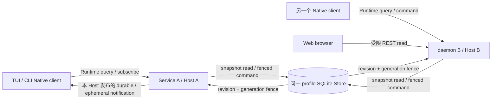

# 身份、状态与数据归属

本页解释对象之间的关系，不复制其完整字段。字段定义分别在 Kernel、Runtime contract、SPI 和 Storage。

| 对象 | 用途 | 决定/保存者 | 常见误解 |
| --- | --- | --- | --- |
| Workspace | 信任与执行范围 | Service 准入、Store 记录 | 不是必然一个进程或数据库 |
| Session | 可继续的历史与状态 | Store/Kernel，Host 协调 | 不是窗口或 transport connection |
| Task | 目标、计划与完成关系 | Kernel/运行事实 | 不等于 Markdown 仓库计划 |
| Run / Turn | 执行与输入推进的准确身份 | Service/Host/Kernel/Store 各在规定边界处理 | 正文显示完不意味着 Run 已结束 |
| Command | 一次请求及幂等范围 | Client 提供、Host 复核持久回执 | wire requestId 不能替 commandId |
| Attempt / Effect | 外部执行尝试及结果状态 | Host 组织、Store 持久、Builtin 执行 | retry 不代表可以重复副作用 |
| Interaction | 审批/问答/审核身份 | Kernel facts、Store、client-safe projection | 面板消失不构成已批准 |
| Connection generation | 当前连接有效性 | transport/client | 不能授予 Session writer |
| Message / Step | 展示事实对应 | 持久 identity 与 client projector | 不按正文或工具名去重 |
| RenderEpoch | 物理视图重绘边界 | TUI | 不改变业务 Run 或权限 |

## 状态如何配合

持久事件/快照记录业务事实，Run 索引支持查询，writer generation 防止旧进程提交；客户端只维护交互与显示所需投影。TUI pending echo、输入队列、Web 页面状态和连接状态不自动成为新的业务事实。

收到迟到事件时先检查它所属的 identity 与 revision，再决定是否更新。不能用“当前会话”“最后一个块”或相同文本补足缺失身份。

数据关系深入[Storage 事务](../../../packages/runtime-storage-sqlite/docs/transactions-and-state.md)，显示身份深入[TUI 投影](../../../apps/kite-cli/docs/message-projection.md)，请求身份深入[Host 命令](../../../packages/runtime-host/docs/commands-mailbox.md)。

## 同一会话被多个客户端或进程访问

箭头分别表示运行时调用、数据读取和持久写入裁决，不表示客户端之间共享内存。Native 的 subscribe 接收 Host 的 Session projection 和活动事件；Web 通过受限 REST 读取持久 History。普通 Native daemon 连接断开或 Web 页面关闭不删除业务 Session、不取消别人的 Run；parent-owned stdio 的父进程退出/EOF 会关闭自有 child 并进入清理，Desktop 页面 detach 与应用退出也不同，见[进程拓扑](topology.md)。[Service composition](../../../apps/kite-service/src/composition.ts)把 history 读取包入 Store 的 `readSnapshot`；[Web adapter](../../../apps/kite-web/src/transport/client.ts)消费分页 REST；[Host projector](../../../packages/runtime-host/src/host/notification-projector.ts)负责 subscribe/replay/snapshot 交接。

多连接可读取同一 profile。当前 App Server 的[入口](../../../apps/kite-service/src/app-server.ts)按 `environment.runtimeRoot` 定位 SQLite 文件并调用 `createKiteSessionAppServerStorageComposition`；[Service 组合](../../../apps/kite-service/src/bootstrap.ts)打开 `openKiteSessionRuntimeStorage`；[Store 组合](../../../packages/runtime-storage-sqlite/src/kite-session-runtime-storage.ts)创建持久 execution authority 并将 `acquire`、`renew`、`detach`、`release` 接入 execution control。写入权由[SQLite execution authority](../../../packages/runtime-storage-sqlite/src/kite-session-execution-authority.ts)的 `acquire` 和 `assertActive` 判定：同 Session 有未过期 active/detached lease 时返回 busy；过期但 cleanup 未确认时进入 `recovery_required`；旧 revision、controller generation、host/client/connection identity 或 lease 不满足时拒绝旧 binding。进程 registry 或连接 generation 本身不授予 Store writer。不同 Session 可分别取得执行权；真实进程竞争断言见[authority 测试](../../../packages/runtime-storage-sqlite/test/isolated/kite-session-execution-authority.test.ts)。这些约束不代表对任意外部工具副作用的 exactly-once 保证。

共享 Store 不构成跨进程实时事件总线。[Host.subscribe](../../../packages/runtime-host/src/host/runtime-host.ts)在本地缺少该 Session projection 时加载初始投影；[notification projector](../../../packages/runtime-host/src/host/notification-projector.ts)的订阅与 replay 使用本 Host 的 registry、通知历史及 publish。图中的通知箭头只描述该 Host 的发布，不保证另一个 Host 写入 Store 后会自动推送到当前 Native 订阅。主动 History/查询读取与订阅推送应分别核对；Web 的 REST 轮询也不能作为 Native 跨进程推送的证据。隔离的当前 release paired App Server 探针已实跑：A 订阅既有会话并收到 revision 0；B 修改交互模式取得 applied revision 1；随后 2200ms 内 A 未收到新通知，主动查询读到 revision 1 后原订阅才收到该 revision 的通知。这确认了该场景的外部写入不会在观察窗口内自动推送，不证明任意时长、运行中流式事件或全部客户端的行为。方法见[风险验证记录](../architecture.md#风险定向验证)；前述 authority 测试仍只证明写入裁决。
