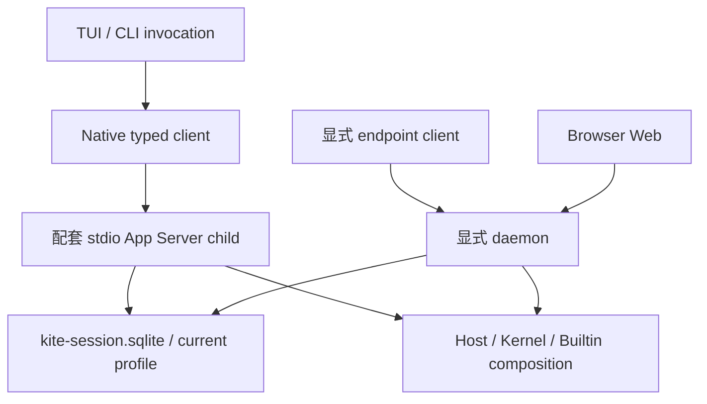

# 系统组成与运行拓扑

产品入口包含交互 TUI、只读 Web、CLI 与本机服务，详见[能力对照](../../handbook/capabilities.md)。界面不是 Runtime owner。

图中 Host/Kernel/Builtin 表示相同的组装职责，不表示两个进程共享同一内存对象。默认 child 和显式 daemon 是不同的进程所有权模式：TUI 默认不发现 daemon，不开启 HTTP listener；daemon 提供 Native endpoint 和同源 Web。

同一 profile 可多连接访问 Store，但同一 Session 的执行权限由持久 generation/revision fence 裁决，不由 PID、socket 或窗口判断。source checkout 与 installed profile 不应混为一个数据位置。

## 请求的三个平面

| 平面 | 入口 | 负责什么 |
| --- | --- | --- |
| Runtime | Native Runtime client → Runtime Server → Host | command/query/subscribe、执行生命周期 |
| App Control | Native typed App Control → Service | 信任、配置、Provider/MCP 等应用管理 |
| Browser API | Web → agent-api-client → Agent API | 能力受限的 REST 读取与诊断 |

三个平面不共享任意权限；能打开网页不等于能执行 Runtime mutation。Store 和业务 Session 在进程退出后仍有持久语义，客户端断开不等于删除数据。

实现：[Service composition](../../../apps/kite-service/docs/composition-and-execution.md)、[Native](../../../packages/kite-local-runtime/docs/native-client-and-control.md)。准确生命周期契约：[App Server](../../active/app-server-local-runtime.md)。
