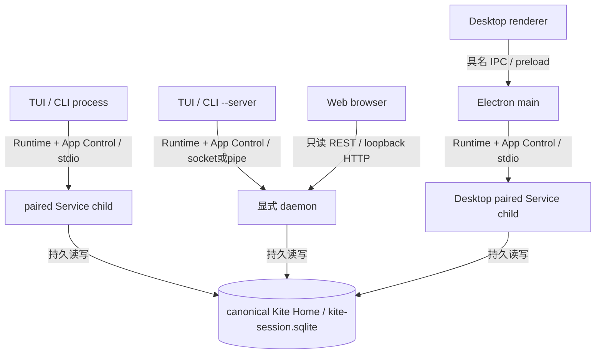

# 系统组成与运行拓扑

产品入口包含交互 TUI、只读 Web、CLI 与本机服务，详见[能力对照](../../handbook/capabilities.md)。界面不是 Runtime owner。

图中箭头为运行时请求或持久数据访问，不是 package import；三类 Service 各自在自身进程组装 Host/Kernel/Builtin，不共享内存。默认 TUI/CLI child 不发现 daemon、不启用 HTTP listener；显式 daemon 提供 Native endpoint 与同源 Web；Desktop 是开发验证中的独立宿主，不能从 Web 共用页面推导其权限。

| 图中连接 | 调用与接收依据 |
| --- | --- |
| TUI/CLI → child 或 daemon | release [TUI](../../../scripts/release/entrypoints/tui.ts)、[CLI](../../../scripts/release/entrypoints/cli.ts)选择 `createManagedLocalAppServerComposition` 或 daemon connector；[App Server](../../../apps/kite-service/src/app-server.ts)的 `runKiteAppServerMain` 组装 `createRuntimeStdioCarrier` |
| Web → daemon | [Web transport](../../../apps/kite-web/src/transport/client.ts)调用 typed API client；[daemon 的 createDaemonWebOwners](../../../apps/kite-service/src/app-server-daemon.ts)将 `createAgentApiRouteHandler` 注入 `createWebGatewayCarrier`，承接 HTTP 读取；Browser principal 限制见[Web 查询](../flows/web-queries.md) |
| Desktop renderer → main → child | [client](../../../apps/kite-desktop/src/client.ts)、[transport](../../../apps/kite-desktop/src/transport.ts)消费受限 bridge；[preload](../../../apps/kite-desktop/electron/preload.ts)、[IPC](../../../apps/kite-desktop/electron/ipc.ts)路由至[host](../../../apps/kite-desktop/electron/host.ts)，后者使用 `ServiceProcess.start` |
| Service → 同一 Store | `createKiteAppServerRuntimeOwner` 拼接 `runtimeRoot/kite-session.sqlite` 并调用[bootstrap](../../../apps/kite-service/src/bootstrap.ts)的 `createKiteSessionAppServerStorageComposition`；source/installed 数据入口依据见[Store 契约](../../active/app-server-local-runtime.md#store-与版本) |

此图中的共享数据库以选择了同一 canonical Kite Home 为条件；显式选择另一 home 则是另一数据范围。source 与 installed 不再因 checkout 自动分库。同一 Session 的执行权限由持久 generation/revision fence 裁决，不由 PID、socket 或窗口判断，详见[多客户端访问](identities-state.md#同一会话被多个客户端或进程访问)。配置、凭据和信任仍由本机配置 owner 管理，不等同于会话数据库；[Desktop 偏好与草稿](../../../apps/kite-desktop/docs/new-conversation.md)也不成为执行 authority。

## 请求的三个平面

| 平面 | 入口 | 负责什么 |
| --- | --- | --- |
| Runtime | Native Runtime client → Runtime Server → Host | command/query/subscribe、执行生命周期 |
| App Control | Native typed App Control → Service | 信任、配置、Provider/MCP 等应用管理 |
| Browser API | Web → agent-api-client → Agent API | 能力受限的 REST 读取与诊断 |

三个平面不共享任意权限；能打开网页不等于能执行 Runtime mutation。Store 和业务 Session 在进程退出后仍有持久语义，客户端断开不等于删除数据。

实现：[Service composition](../../../apps/kite-service/docs/composition-and-execution.md)、[Native](../../../packages/kite-local-runtime/docs/native-client-and-control.md)。准确生命周期契约：[App Server](../../active/app-server-local-runtime.md)。

## 设计依据与边界

[App Server 契约](../../active/app-server-local-runtime.md)明确默认 same-build child、显式 daemon、单 Session writer 与 unknown 不重放的约束；其具体含义是客户端升级不能悄悄替换别人的服务，旧执行者不能在执行权转移后补交结果。[ADR-0184](../../adr/0184-electron-desktop-runtime-host.md)记录 Electron 宿主取舍。更早为何选择全部包拆分及所有传输方式的原始理由，本次未找到完整依据；不能把当前实现自动解释成历史决策。旧 Worker/Coordinator 和 legacy Store 代码不在本图默认发布路径，维护它们时按对应 owner 与实际消费者核实。
