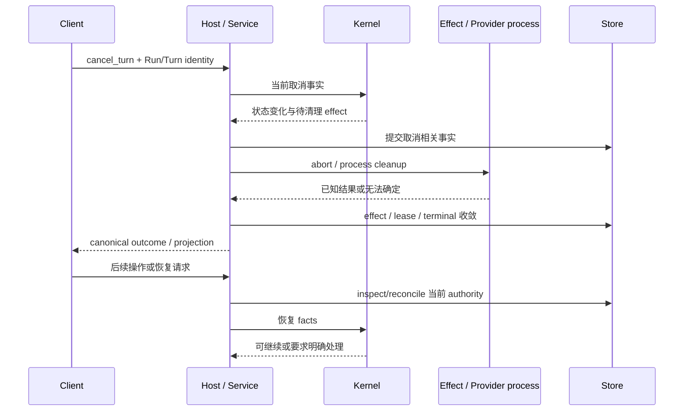

# 取消、清理与未知结果恢复

触发：用户取消、外部执行失败、进程退出或重新打开需要恢复的 Session。

| 情况 | 不能做什么 | 正确交接 |
| --- | --- | --- |
| start receipt 前取消 | 用旧 Run identity 取消 | receipt 后对准已接受 Run/Turn |
| 用户已看到 cancelled | 立即越过 Provider cleanup | 后继等待 authoritative 可调度边界 |
| Host 崩溃 | 假定进程或外部调用没有执行 | 持久 effect 检查及平台进程清理 |
| unknown effects | 直接重复副作用命令 | 核实/reconcile，再按 Kernel 决策恢复 |
| takeover | 让旧 writer 继续提交 | generation fence 拒绝 stale handle |

客户端本地 Cancelling 只是反馈，不产生虚假工具终态。事务与回执保证已发生事实可追溯；清理不能撤销已经完成的文件修改。

底层：[Host lifecycle](../../../packages/runtime-host/docs/execution-lifecycle.md)、[Storage recovery](../../../packages/runtime-storage-sqlite/docs/authority-and-recovery.md)、[Kernel recovery](../../../packages/agent-kernel/docs/completion-recovery.md)。验证：[effect supervisor](../../../packages/runtime-host/test/effect-supervisor.test.ts)、[effect persistence](../../../packages/runtime-storage-sqlite/test/kite-session-effects.test.ts)、[取消后继 PTY](../../../tests/tui-system/scenarios/cancel-successor-render.test.ts)。
