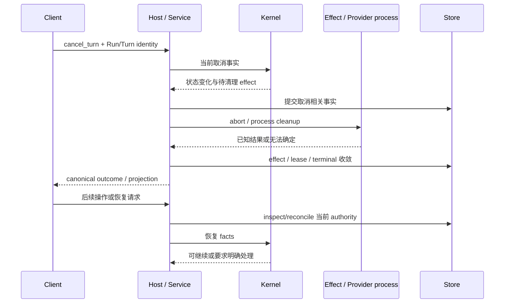

# 取消、清理与未知结果恢复

触发：用户取消、外部执行失败、进程退出或重新打开需要恢复的 Session。

## 已核实的停止与后继提交（TUI → 本机 Service）

TUI 的 [NativeTuiRuntimeClient.#requestCancel](../../../apps/kite-cli/src/service-mode/tui-client.ts) 对同一 Session 的在途取消共用 Promise；[#cancelRuntime](../../../apps/kite-cli/src/service-mode/tui-client.ts) 在 `start_turn` 回执前记下 `cancel_after_accept`，取得已接受的 Run/Turn 身份后才提交带 `runId`、`turnId` 和 `expectedRevision` 的 `cancel_turn`。`Cancelling` 是本地反馈，不能当成持久终态。服务端 [CliRuntimeBridge.inspectCommand](../../../apps/kite-service/src/bootstrap/runtime/CliRuntimeBridge.ts) 核对当前 active Turn 和 Run；[RuntimeSessionCoordinator.commitCancelTurnCommand](../../../apps/kite-service/src/bootstrap/runtime/RuntimeSessionCoordinator.ts) 提交取消事实。[DefaultRuntimeHost.command](../../../packages/runtime-host/src/host/runtime-host.ts) 先确认持久回执，再经 lifecycle abort 当前执行。因而收到取消回执与 Provider、子进程或子 Agent 清理结束是两个边界。

后继输入在 TUI 的 [#runTask](../../../apps/kite-cli/src/service-mode/tui-client.ts) 先等待 readiness 和 `commandBarrier`，再申请 mutation 准入并提交 `start_turn`。收到明确未执行的 `revision_conflict` 时，等待同 Session 权威 idle 后使用原 command ID 和更新后的 revision 重试；`runtime_busy` 则保留输入并退避，下一次尝试分配新 command ID。这不是所有提交前都先查询 idle。Service 的 [CliRuntimeBridge.inspectCommand](../../../apps/kite-service/src/bootstrap/runtime/CliRuntimeBridge.ts) 在活动 Turn 或待清理的子 Agent/Provider 事实存在时拒绝后继。[Host lifecycle](../../../packages/runtime-host/docs/execution-lifecycle.md) 再约束实际调度必须越过清理边界；关闭的 Session 不调度已排队后继。准入等待超过 deadline 或明确拒绝会通过 `runTask` 失败通道报告；执行已接受后的完成等待也有 deadline，超时不能一概解释为“未发送”。结果未知时仍按原命令回执和当前状态核对，不应把前一轮的迟到 terminal 当成新 Run 完成。

| 情况 | 不能做什么 | 正确交接 |
| --- | --- | --- |
| start receipt 前取消 | 用旧 Run identity 取消 | receipt 后对准已接受 Run/Turn |
| 用户已看到 cancelled | 立即越过 Provider cleanup | 后继等待 authoritative 可调度边界 |
| Host 崩溃 | 假定进程或外部调用没有执行 | 持久 effect 检查及平台进程清理 |
| unknown effects | 直接重复副作用命令 | 核实/reconcile，再按 Kernel 决策恢复 |
| takeover | 让旧 writer 继续提交 | generation fence 拒绝 stale handle |

客户端本地 Cancelling 只是反馈，不产生虚假工具终态。事务与回执保证已发生事实可追溯；清理不能撤销已经完成的文件修改。

适用范围：上述按键与排队行为只核实到 TUI；`cancel_turn`、命令回执、Host/Service 清理是共享 Runtime 路径。CLI 的继续是新任务输入，Web 只读；Desktop 的停止入口需另按其调用链核对，不能从 TUI 测试推定。进程退出、未知副作用和多进程 takeover 的持久判断由 [Storage recovery](../../../packages/runtime-storage-sqlite/docs/authority-and-recovery.md) 负责，不能靠本地 UI 状态推断。此处原始设计理由未找到；可证实的约束是前驱取消提交后仍可能有执行资源，后继必须等待可调度边界。

验证层级：已阅读 [Native TUI facade 测试](../../../apps/kite-cli/test/service-mode/tui-client.test.ts) 中排队后继、`runtime_busy`、revision conflict 与取消断言，以及 [Host 测试](../../../packages/runtime-host/test/runtime-host.test.ts) 中“取消先持久化再 abort”“清理后至多启动一个后继”的断言；本页所述 TUI facade 与 Host lifecycle/continuation 套件本次未执行（其他共享机制的实跑见[验证记录](../architecture.md#本次实际执行)），其他客户端和真实多进程时序不由这些断言证明。

底层：[Host lifecycle](../../../packages/runtime-host/docs/execution-lifecycle.md)、[Storage recovery](../../../packages/runtime-storage-sqlite/docs/authority-and-recovery.md)、[Kernel recovery](../../../packages/agent-kernel/docs/completion-recovery.md)。验证：[effect supervisor](../../../packages/runtime-host/test/effect-supervisor.test.ts)、[effect persistence](../../../packages/runtime-storage-sqlite/test/kite-session-effects.test.ts)、[取消后继 PTY](../../../tests/tui-system/scenarios/cancel-successor-render.test.ts)。
