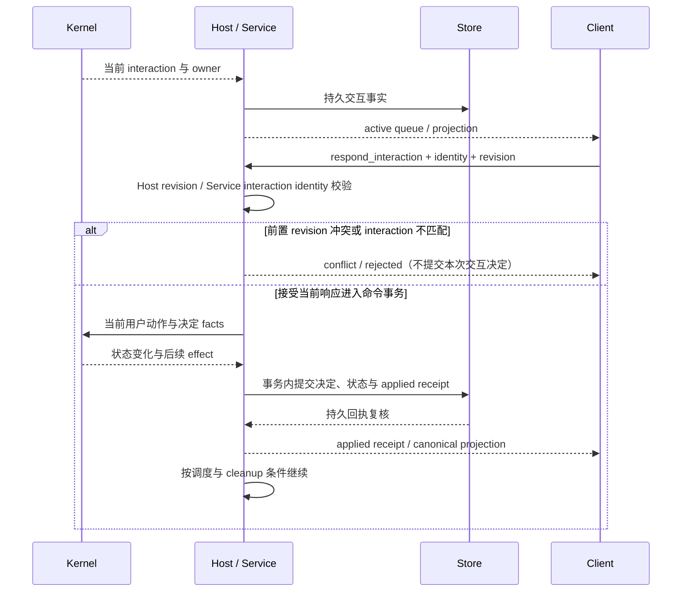

# 审批、问答、方案审核与继续

触发：Kernel/执行流程产生需要用户处理的 interaction。产品入口见[TUI 交互](../../handbook/clients/tui/guides/approvals-and-questions.md)。

## 当前交接与身份

执行侧的 [CliRuntimeBridge.inspectCommand](../../../apps/kite-service/src/bootstrap/runtime/CliRuntimeBridge.ts) 从当前 pending interaction 或 State 恢复 effect，核对完整 interaction identity，并由 `mapRuntimeInteractionResponseToUserAction` 把 `respond_interaction` 转成用户动作。检查通过后才由 [RuntimeSessionCoordinator.commitInteractionCommand](../../../apps/kite-service/src/bootstrap/runtime/RuntimeSessionCoordinator.ts) 在命令事务中提交事件及回执；[DefaultRuntimeHost.command](../../../packages/runtime-host/src/host/runtime-host.ts) 只在 applied 回执持久化后 activation，并把同一 command/revision 绑定的 prepared continuation 交给执行调度。这里的 queue/projection 是持久状态的客户端视图，面板关闭不是执行继续的证据。

TUI 的 [interactionCommandForAction](../../../apps/kite-cli/src/service-mode/tui-client.ts) 发送 interaction、`expectedRevision` 与按类型编码的 response；同文件的 Native client 等待 applied/idempotent 回执。revision 竞态时重新读取权威 projection，只有稳定 identity 仍相同才用同一 command ID 重建交互与 CAS revision；不存在、已结算或身份不匹配的交互不能继续提交。`#submitUserAction` 按 interaction ID 在已登记 Session 中查找唯一所属记录，不以当前前台 Session 重新归属；后台仍有效的交互不能等同于过期交互。隔离探针已验证：生产 provider/facade 在切换前台至 B 后仍会将 A 的有效交互提交给 A，不会改投 B；生产 App 重渲染至 B 后再按 Enter/Esc，只提交 B 当前交互，无交互时不提交 A。后者覆盖四种组合，不覆盖按键与切换发生在同一事件循环的竞态；不能由 facade 可接受后台动作推断 UI 必然误提交。运行方法见[风险验证记录](../../../docs/development/architecture.md#风险定向验证)。问答的结构化选项 ID 用于内部校验，投给模型与历史的是问题和选项文案，见[客户端 owner 说明](../../../apps/kite-cli/docs/approvals-and-interactions.md)。

[Host 命令处理](../../../packages/runtime-host/src/host/runtime-host.ts)在前置 revision 冲突或 bridge 返回 terminal inspection 时直接返回；[Service bridge](../../../apps/kite-service/src/bootstrap/runtime/CliRuntimeBridge.ts)可在用户动作映射前返回 `interaction_mismatch`。图中的前置拒绝是请求校验结果，与用户有效提交“拒绝工具”的持久决定不同。事务本身也可能失败，未取得 applied 回执不能宣称决定已提交；此图不把恢复准入等其他事实概括为“整个请求绝无写入”。[持久命令测试](../../../packages/runtime-host/test/persistent-command-host.test.ts)的 `does not persist terminal non-applied receipts` 断言该 terminal 路径不保存命令回执、不调用决定 commit。

| 交接 | 要求 |
| --- | --- |
| 展示 | 只对当前 active interaction 取焦点，后台 pending 不抢占 |
| 用户提交 | interactionId、generation、owner、Session/revision 对应当前请求 |
| 提交结果 | receipt 未接受前保持交互；错误不伪装已回答 |
| 继续 | 以 Kernel 决定与真实执行状态为准，不以关闭面板为准 |

重复 projection 不追加第二个相同问题；旧交互回答不能作用于新会话。snapshot 按完整 queue 替换本地集合，不能把旧 pending 永久并入。方案批准同时确定相应执行方式，不用前置模式切换破坏审核身份。

拒绝与 Ctrl+C 整轮取消分别记录语义，但都需要真实 terminal 和清理。回答提交失败保留诊断与原请求，不能补发无关 cancel。

适用范围：审批、问答和方案审核的上述客户端动作核实到 TUI；Service/Host/Kernel 的提交语义是共享路径。CLI 也有 [respondInteractionCommand](../../../apps/kite-cli/src/cli/index.ts) 入口，但其呈现和重试不由 TUI 断言覆盖；Web 只读。Desktop 交互需按其 UI 调用与回执处理单独核实。原始设计理由未找到；现有明确约束是回答必须匹配当前交互身份、回执和 revision，避免过期回答作用于新请求。

验证层级：已阅读 [Native TUI facade 测试](../../../apps/kite-cli/test/service-mode/tui-client.test.ts) 的 snapshot queue 替换、交互冲突重试及 stale cancel 断言，以及 [Host 测试](../../../packages/runtime-host/test/runtime-host.test.ts) 的 recovered interaction continuation 断言；本页所述 TUI facade 与 Host lifecycle/continuation 套件本次未执行（其他共享机制的实跑见[验证记录](../architecture.md#本次实际执行)）。当前产品手册已记录 [Esc 拒绝提交态差异](../../handbook/clients/tui/guides/approvals-and-questions.md)，客户端 owner 文档给出实现证据；不能把 Enter 的等待反馈推广到 Esc。

底层：[客户端交互](../../../apps/kite-cli/docs/approvals-and-interactions.md)、[Kernel](../../../packages/agent-kernel/docs/scheduling-authorization.md)、[Host](../../../packages/runtime-host/docs/commands-mailbox.md)。验证：[approval queue](../../../packages/agent-kernel/test/approval-queue.test.ts)、[交互治理](../../../packages/agent-kernel/test/interaction-governance.test.ts)、[问答 PTY](../../../tests/tui-system/scenarios/ask-user-esc.test.ts)。
