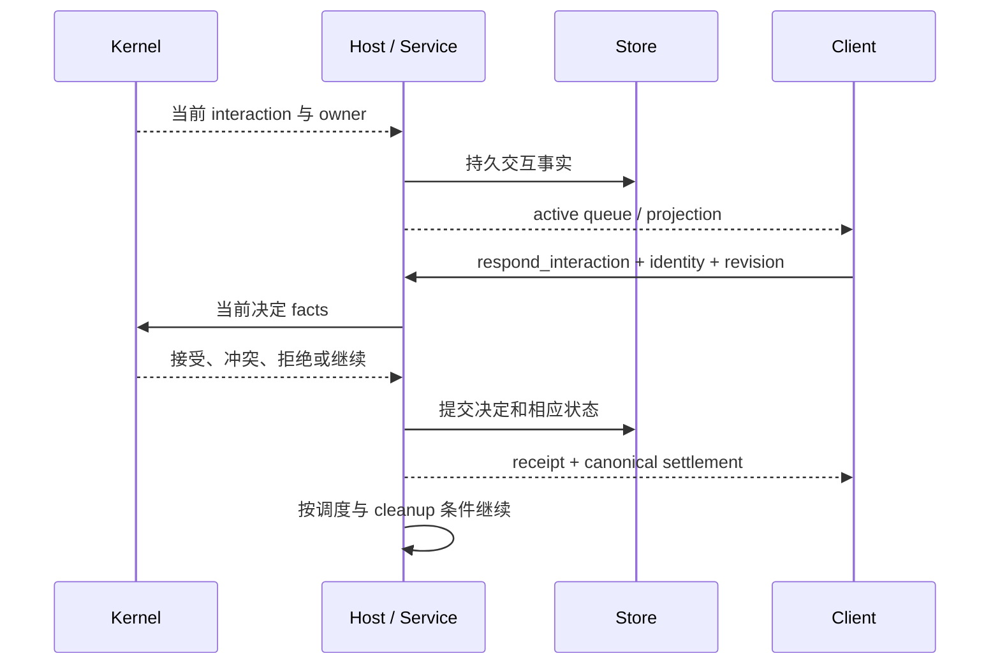

# 审批、问答、方案审核与继续

触发：Kernel/执行流程产生需要用户处理的 interaction。产品入口见[TUI 交互](../../handbook/clients/tui/guides/approvals-and-questions.md)。

| 交接 | 要求 |
| --- | --- |
| 展示 | 只对当前 active interaction 取焦点，后台 pending 不抢占 |
| 用户提交 | interactionId、generation、owner、Session/revision 对应当前请求 |
| 提交结果 | receipt 未接受前保持交互；错误不伪装已回答 |
| 继续 | 以 Kernel 决定与真实执行状态为准，不以关闭面板为准 |

重复 projection 不追加第二个相同问题；旧交互回答不能作用于新会话。snapshot 按完整 queue 替换本地集合，不能把旧 pending 永久并入。方案批准同时确定相应执行方式，不用前置模式切换破坏审核身份。

拒绝与 Ctrl+C 整轮取消分别记录语义，但都需要真实 terminal 和清理。回答提交失败保留诊断与原请求，不能补发无关 cancel。

底层：[客户端交互](../../../apps/kite-cli/docs/approvals-and-interactions.md)、[Kernel](../../../packages/agent-kernel/docs/scheduling-authorization.md)、[Host](../../../packages/runtime-host/docs/commands-mailbox.md)。验证：[approval queue](../../../packages/agent-kernel/test/approval-queue.test.ts)、[交互治理](../../../packages/agent-kernel/test/interaction-governance.test.ts)、[问答 PTY](../../../tests/tui-system/scenarios/ask-user-esc.test.ts)。
