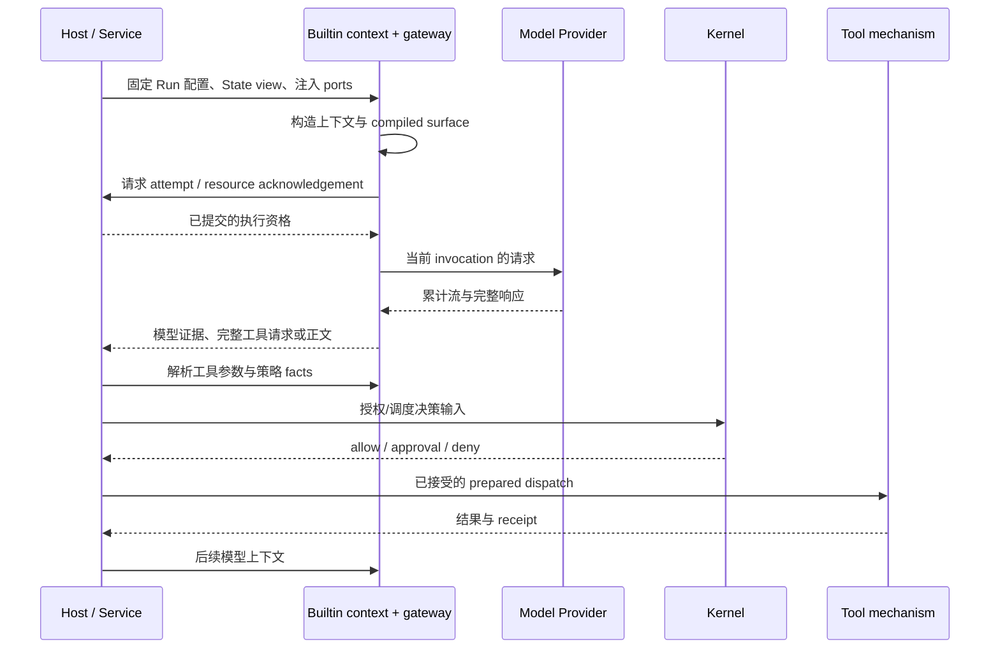

# 模型输入、响应与工具循环

触发：调度器选择模型工作，或工具结果需要后续模型处理。

| 交接 | 对象 | 负责位置 |
| --- | --- | --- |
| 配置到上下文 | 当前 Run 的 model route 与 State view | Service 准入、Builtin compiler |
| 上下文到 Provider | surface digest、invocation、attempt | Gateway 与 Host acknowledgement |
| 响应到工具 | 完整 arguments、binding、effects/traits | Builtin parser/policy facts，Kernel 决策 |
| 工具到下一轮 | 已提交结果、Artifact 与状态 | Host/Store，再构造后续输入 |

partial tool call 不进入真实执行。活动 Run 配置不因选择器保存了新模型而改变。Provider 错误、流中断与外部工具 unknown 不能合并成同一种可安全重试错误。末尾正文不是验证和整轮完成的替代。

底层：[模型上下文](../../../packages/builtin-runtime/docs/model-and-context.md)、[工具流水线](../../../packages/builtin-runtime/docs/tool-pipeline.md)、[调度授权](../../../packages/agent-kernel/docs/scheduling-authorization.md)。验证：[Host context](../../../packages/runtime-host/test/context-compilation.test.ts)、[pipeline](../../../packages/builtin-runtime/test/tool-pipeline-callbacks.test.ts)、[effect admission](../../../packages/agent-kernel/test/effect-admission.test.ts)。
