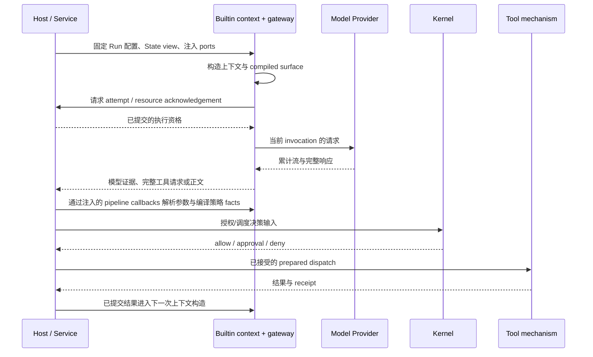

# 模型输入、响应与工具循环

触发：调度器选择模型工作，或工具结果需要后续模型处理。

| 交接 | 对象 | 负责位置 |
| --- | --- | --- |
| 配置到上下文 | 当前 Run 的 model route 与 State view | Service 准入、Builtin compiler |
| 上下文到 Provider | surface digest、invocation、attempt | Gateway 与 Host acknowledgement |
| 响应到工具 | 完整 arguments、binding、effects/traits | Builtin parser/policy facts，Kernel 决策 |
| 工具到下一轮 | 已提交结果、Artifact 与状态 | Host/Store，再构造后续输入 |

partial tool call 不进入真实执行。活动 Run 配置不因选择器保存了新模型而改变。Provider 错误、流中断与外部工具 unknown 不能合并成同一种可安全重试错误。末尾正文不是验证和整轮完成的替代。

调用方与接收方：[CliRuntimeBridge.#runTurn](../../../apps/kite-service/src/bootstrap/runtime/CliRuntimeBridge.ts)向 [RuntimeSessionCoordinator.executeTurn](../../../apps/kite-service/src/bootstrap/runtime/RuntimeSessionCoordinator.ts)传入当前配置、模型、取消信号及注入的 model/tool ports；[executeRuntimeTurn](../../../apps/kite-service/src/bootstrap/runtime/turn-coordinator.ts)将 gateway 与 tool pipeline composition 交给 effect executor。[ModelInvocationGateway.invoke](../../../packages/builtin-runtime/src/model/invocation-gateway.ts)负责 invocation/attempt 与证据持久交接，[response source](../../../packages/builtin-runtime/src/model/response-source.ts)负责 Provider 单次响应；工具声明、参数与准备身份由 [pipeline callbacks](../../../packages/builtin-runtime/src/tool-pipeline-callbacks.ts)和 [prepared dispatch](../../../packages/builtin-runtime/src/builtin-prepared-dispatch-adapter.ts)提供，Kernel 通过[授权与调度](../../../packages/agent-kernel/docs/scheduling-authorization.md)决定是否可执行。这些是运行时调用与决策，不能把图中的 `H->>B` 误读为 Host 自己解析 JSON 或执行工具。

已读断言：[pipeline callbacks 测试](../../../packages/builtin-runtime/test/tool-pipeline-callbacks.test.ts)检查统一 entry 的 parser/schema/effects/policy/traits、解析错误诊断和 prepared identity 被篡改时拒绝；[effect admission 测试](../../../packages/agent-kernel/test/effect-admission.test.ts)检查只接受当前 Model retry/terminal batch。本次实跑见[验证记录](../architecture.md#本次实际执行)。它们不证明真实 Provider 的网络行为、所有工具机制或各客户端的呈现。历史原始理由未在本页所核对的产品页和 owner 文档中找到；当前约束依据为 owner 文档、源码及所列断言。

底层：[模型上下文](../../../packages/builtin-runtime/docs/model-and-context.md)、[工具流水线](../../../packages/builtin-runtime/docs/tool-pipeline.md)、[调度授权](../../../packages/agent-kernel/docs/scheduling-authorization.md)。验证：[Host context](../../../packages/runtime-host/test/context-compilation.test.ts)、[pipeline](../../../packages/builtin-runtime/test/tool-pipeline-callbacks.test.ts)、[effect admission](../../../packages/agent-kernel/test/effect-admission.test.ts)。
