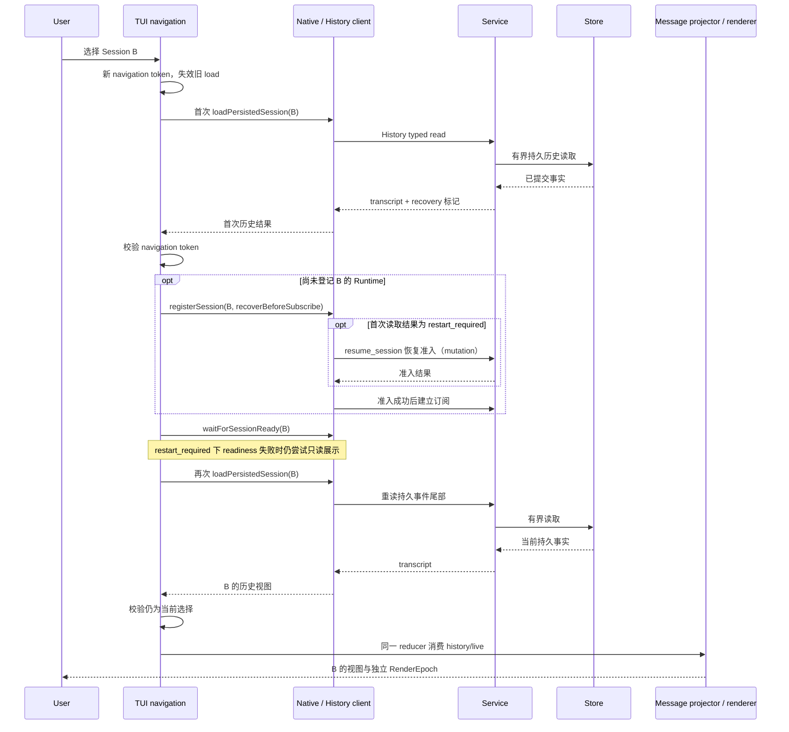

# 会话切换、历史与展示

触发：选择已有会话，或连接后重建当前视图。产品预期是打开历史只读取、不自动重放写操作。下图区分首次历史读取、Runtime 登记与 readiness、再次读取的交接；TUI 的 `restart_required` 恢复准入例外与预期差异见[源码交接](#从选择到持久历史)。

| 交接 | 边界 |
| --- | --- |
| 选择到 load | token 仅管理本地导航，不是 Session 执行身份 |
| history 到 projector | closed durable events，同一 message/step identity 幂等 |
| snapshot 到交互 | 当前活动状态，不能替代完整 transcript |
| projector 到 renderer | 业务 seal 与物理 Static 所有权分开 |

A 的迟到加载成功或失败不能覆盖 B；相同文本的不同消息不能被去重。切换前台不取消后台 Run，队列仍属于提交时的 Session。历史缺少瞬时 reasoning 不等于持久消息丢失。

Web 走 REST 与 Web presentation reducer，不使用 Native HistoryClient 或 TUI Static，见[Web 查询](web-queries.md)。

## 从选择到持久历史

TUI 的[选择回调](../../../apps/kite-cli/src/tui/index.tsx)先以 `SessionNavigationAuthority.beginLoad` 取得本地 token，再由 `sessionManager.loadPersistedSession` 读取历史；[History facade](../../../apps/kite-cli/src/runtime-client/tui-history-facade.ts)调用 `RuntimeHistoryClient.loadSession`，[Service history adapter](../../../apps/kite-service/src/runtime-client/history-adapter.ts)以 Session ID 分页读取持久事件并投影为 transcript。Service 的[组合入口](../../../apps/kite-service/src/composition.ts)在 Store 可用时将该读取包在 `readSnapshot` 中。普通已有会话由 [TUI Native client](../../../apps/kite-cli/src/service-mode/tui-client.ts)连接并订阅，打开历史本身只作 Observer，不取得 Controller；下一次 mutation 才提交 `resume_session`。例外需要同时满足该 Session 尚未登记 Runtime（`!sessionManager.hasRuntime(threadId)`）且首次历史结果标为 `restart_required`：选择回调明确要求 `recoverBeforeSubscribe`，Native client 在订阅前走 `resume-mutation`，尝试执行恢复准入，随后 TUI 重读已推进的事件尾部。已登记 Runtime 时跳过该注册分支，不因本次选择重新传入恢复标记；只等待既有 readiness。首次结果为 `restart_required` 时，readiness 失败会进入只读历史展示回退（不只限于某一种 effect lease 错误），不合成执行终态。最终仅在 token 仍有效时切换前台及投影；迟到加载和失败的本地防护由[导航 token](../../../apps/kite-cli/src/tui/session-navigation.ts)负责，它不赋予持久执行权。

上述 `restart_required` 分支与[共享恢复手册](../../handbook/features/recovery.md)“历史读取只读、继续执行命令才核验旧执行”的预期存在边界差异：用户仅选择历史也可能发起 `resume_session`。这是当前源码可见的条件调用，不意味着每次读取都会恢复或重放；隔离 Native facade 探针已执行：首次登记并指定恢复时恰好发送一次 `resume_session`，普通首次登记不发送，已登记后即使再次指定恢复也不发送。该证据不是完整导航 UI 或真实 Service 恢复持久影响的验证；实际持久影响仍须按 Service recovery 条件核实，不能改写手册掩盖差异。方法见[风险验证记录](../architecture.md#风险定向验证)。

显式连接重建后，由 [RuntimeClient](../../../packages/runtime-client/src/client.ts)恢复订阅；[重连测试](../../../packages/runtime-client/test/runtime-client.test.ts)断言恢复订阅且不重放 mutation。[TUI Native client](../../../apps/kite-cli/src/service-mode/tui-client.ts)消费 Session 通知，并在应用通知前核对 `connectionGeneration`；发送下一次 mutation 前用 `resume_session` 重新取得准入。Host 的[notification projector](../../../packages/runtime-host/src/host/notification-projector.ts)先登记订阅者再同步补种；`afterRevision` 后的保留事件若不连续，则补当前 projection snapshot。因此 subscription 的 replay/gap snapshot 是活动状态交接，不等同于完整 transcript。连接代际、前台导航 token 和 Store writer generation 的职责见[身份与状态](../architecture/identities-state.md)。

Web 的[REST adapter](../../../apps/kite-web/src/transport/client.ts)通过 `listHistory` 按 `afterSequence` 和 cursor 分页读取，单次读取有 32 页上限；所选活动会话由页面生命周期约两秒增量轮询。Browser session 到期时同源续建并将原读取重试一次；失败保留最后快照和错误，适用范围与已知首次直达显示差异见[Web 更新](../../handbook/clients/web/guides/updates-and-connection.md)。Web 不取得 Runtime mutation 权限。CLI 的继续入口与输出另见[CLI 任务](../../handbook/cli/running-tasks.md)；本页的 TUI 导航和 Web 页面时序不推广到 CLI 或开发中的 Desktop。

验证层级：已读[导航测试](../../../apps/kite-cli/test/session-navigation.test.ts)的旧成功、旧失败和同目标第二次加载断言，以及[Store authority 测试](../../../packages/runtime-storage-sqlite/test/isolated/kite-session-execution-authority.test.ts)的 stale writer 与真实进程竞争断言；相关 PTY、Web lifecycle 与连接测试有文件入口，但本次未逐项读取其断言；本次导航与 authority 的实跑结果见[建图验证记录](../architecture.md#本次实际执行)，未列入实跑记录的部分仍仅为验证入口。原始设计理由：本地导航防串会话、连接防旧通知和 writer fence 的具体理由可由对应源码注释及[authority 契约](../../active/runtime-authority-boundary.md)定位；更早的原始取舍依据未找到。

源码与验证：[TUI 导航](../../../apps/kite-cli/docs/session-navigation.md)、[消息投影](../../../apps/kite-cli/docs/message-projection.md)、[终端输出](../../../apps/kite-cli/docs/terminal-output.md)、[导航竞态](../../../apps/kite-cli/test/session-navigation.test.ts)、[PTY 切换](../../../tests/tui-system/scenarios/session-switch.test.ts)。
