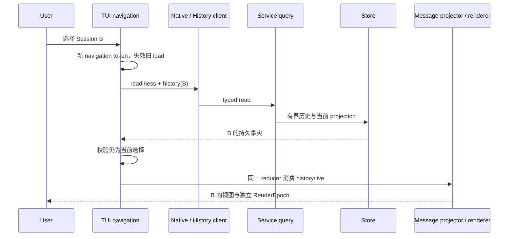

# 会话切换、历史与展示

触发：选择已有会话，或连接后重建当前视图。打开历史只读取，不自动重放写操作。

| 交接 | 边界 |
| --- | --- |
| 选择到 load | token 仅管理本地导航，不是 Session 执行身份 |
| history 到 projector | closed durable events，同一 message/step identity 幂等 |
| snapshot 到交互 | 当前活动状态，不能替代完整 transcript |
| projector 到 renderer | 业务 seal 与物理 Static 所有权分开 |

A 的迟到加载成功或失败不能覆盖 B；相同文本的不同消息不能被去重。切换前台不取消后台 Run，队列仍属于提交时的 Session。历史缺少瞬时 reasoning 不等于持久消息丢失。

Web 走 REST 与 Web presentation reducer，不使用 Native HistoryClient 或 TUI Static，见[Web 查询](web-queries.md)。

源码与验证：[TUI 导航](../../../apps/kite-cli/docs/session-navigation.md)、[消息投影](../../../apps/kite-cli/docs/message-projection.md)、[终端输出](../../../apps/kite-cli/docs/terminal-output.md)、[导航竞态](../../../apps/kite-cli/test/session-navigation.test.ts)、[PTY 切换](../../../tests/tui-system/scenarios/session-switch.test.ts)。
