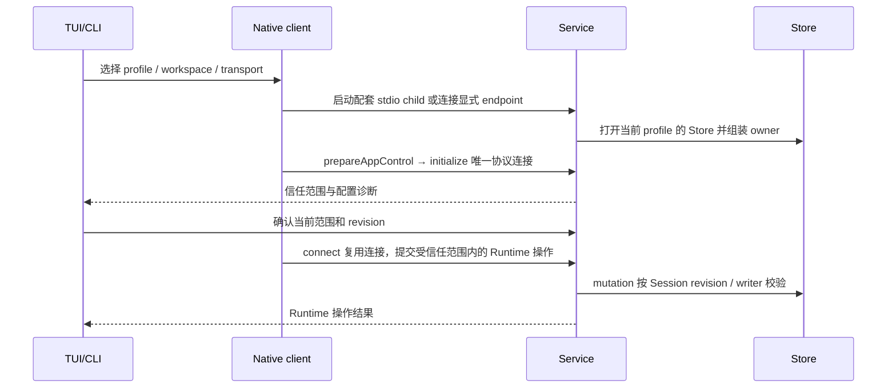

# 启动、连接与工作区准入

触发：TUI/CLI 启动或用户显式启动 daemon。产品步骤见[Server 生命周期](../../handbook/server/lifecycle.md)。

| 交接 | 负责模块 | 必须保持 |
| --- | --- | --- |
| 入口到连接 | release composition / Native | 默认 child 与显式 daemon 区分，不隐式发现替代进程 |
| Trust request/decision | App Control / Service | canonical workspace、external-read scope 和 revision 一致 |
| Runtime initialize | carrier / Server | 协议和绑定范围已验证，不以客户端字符串自报兼容 |
| Store 访问 | Service / Storage | profile 与真实数据范围一致，读取不等于取得 writer |

默认 child 配对失败在 UI 可用前失败；显式 daemon 的 endpoint、workspace 或协议不匹配明确返回诊断。initialize 与工作区执行准入不同：prepareAppControl 已调用 RuntimeClient.connect，确认信任后的 connect 复用这条连接；拒绝信任时不得提交 Runtime mutation，不 fallback 到内嵌 Runtime。Store 可在信任确认前由 Service 打开，这不授予工作区工具执行权限。结束条件是取得经过验证的访问对象，不是进程出现或浏览器页面打开。

源码：[release entrypoints](../../../scripts/release/entrypoints/)、[Native connection](../../../packages/kite-local-runtime/src/client/app-server-client.ts)、[Service App Control](../../../apps/kite-service/src/app-control/)。底层：[Native](../../../packages/kite-local-runtime/docs/native-client-and-control.md)、[Service](../../../apps/kite-service/docs/composition-and-execution.md)。验证：[Native tests](../../../packages/kite-local-runtime/test/)、[App Server 基线](../../../tests/release/app-server-decoupling-baseline.test.ts)。
