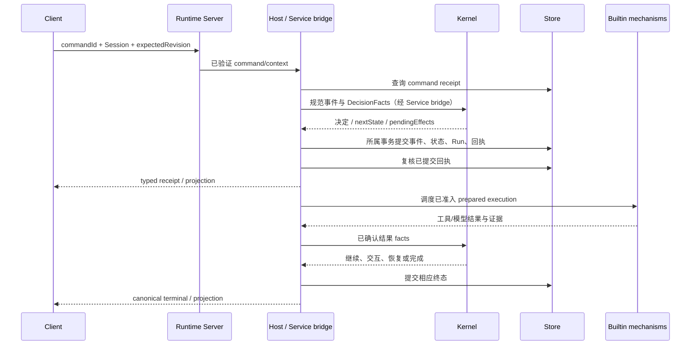

# 提交任务到正式完成

触发：客户端提交 `start_turn`（TUI 对话、CLI run/resume；Desktop 也消费 Runtime 命令，但本页未核实其独立 UI 提交时序；Web 只读，无任务提交入口）。产品预期见[执行结果](../../handbook/features/execution.md)；该页区分模型正文、工具终态和整轮终态，并规定失败、取消、阻塞、未知的含义。下图描述 Service 采用 Runtime Host 的执行路径，不以一端的界面表现代表其他客户端。

| 阶段 | identity 与状态 | 持久边界 |
| --- | --- | --- |
| Client 提交 | commandId、Session；本地 echo/queued 不等于 Run | 无权直接写 Store |
| Host 准入 | request digest、revision、scope、mailbox | 相同命令查回执，冲突不重复执行 |
| 业务提交 | Kernel State/Event、Run 与 receipt 对应 | 由 injected bridge/Storage 所属事务完成 |
| prepared work | operation/attempt 与已提交 revision | 外部执行前 acknowledgement |
| 完成 | canonical task/run/turn 与证据 | terminal 原子推进后再展示 |

一次 applied receipt 只说明命令提交，不说明模型/工具已完成。runtime_busy、revision conflict、执行失败及 unknown 有不同处理；不能把网络重试直接变成业务重跑。取消和后继排队见[取消链路](cancellation-recovery.md)。

客户端提交由 [NativeTuiRuntimeClient.#runTask](../../../apps/kite-cli/src/service-mode/tui-client.ts)构造 `start_turn`；[Runtime Server.#command](../../../packages/runtime-server/src/server.ts)先调用 admission，再将 wire command 映射为 Runtime command，并将冻结的 connection/request/client context 传给注入的 backend。

实现交接可从 [DefaultRuntimeHost.command / #executeCommand](../../../packages/runtime-host/src/host/runtime-host.ts) 进入：它先查持久回执，再进入 Session mailbox，执行检查与 bridge inspection；`commit` 后复查 Store 回执，完成 activation 才调度 prepared execution。[CliRuntimeBridge.#preparedStart / #runTurn](../../../apps/kite-service/src/bootstrap/runtime/CliRuntimeBridge.ts)把已提交的 Run identity、冻结配置和本次 command context 交给 [RuntimeSessionCoordinator.executeTurn](../../../apps/kite-service/src/bootstrap/runtime/RuntimeSessionCoordinator.ts)，后者校验 Session、workspace、user identity 并调用 [executeRuntimeTurn](../../../apps/kite-service/src/bootstrap/runtime/turn-coordinator.ts)。这是调用关系；State/Event、Run 与回执的持久关系由[事务专题](../../../packages/runtime-storage-sqlite/docs/transactions-and-state.md)负责解释。

已读的[持久命令断言](../../../packages/runtime-host/test/persistent-command-host.test.ts)验证 lookup→recover→inspect→commit→activation→schedule 顺序，以及新 Host 重放同一回执时不再 inspect、commit 或 schedule；本次实跑见[验证记录](../architecture.md#本次实际执行)。它是 Host 测试，不证明所有客户端展示或真实 Provider 执行。当前流程图的历史设计理由未在本页所核对的产品页和 owner 文档中找到原始记录；事务回执与执行隔离的当前约束以对应 owner 文档和源码为准。

源码与底层：[Host 命令](../../../packages/runtime-host/docs/commands-mailbox.md)、[Kernel 转换](../../../packages/agent-kernel/docs/state-transitions.md)、[Store 事务](../../../packages/runtime-storage-sqlite/docs/transactions-and-state.md)。验证：[持久命令](../../../packages/runtime-host/test/persistent-command-host.test.ts)、[Run Store](../../../packages/runtime-storage-sqlite/test/run-store.test.ts)、[完成](../../../packages/agent-kernel/test/completion.test.ts)。
