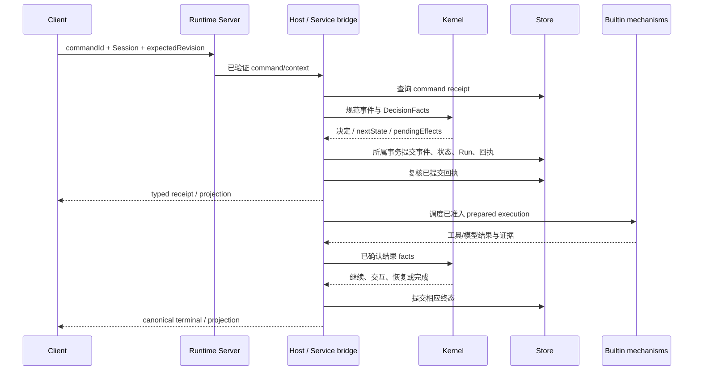

# 提交任务到正式完成

触发：TUI 输入或 CLI run/resume。产品预期见[执行结果](../../handbook/features/execution.md)。

| 阶段 | identity 与状态 | 持久边界 |
| --- | --- | --- |
| Client 提交 | commandId、Session；本地 echo/queued 不等于 Run | 无权直接写 Store |
| Host 准入 | request digest、revision、scope、mailbox | 相同命令查回执，冲突不重复执行 |
| 业务提交 | Kernel State/Event、Run 与 receipt 对应 | 由 injected bridge/Storage 所属事务完成 |
| prepared work | operation/attempt 与已提交 revision | 外部执行前 acknowledgement |
| 完成 | canonical task/run/turn 与证据 | terminal 原子推进后再展示 |

一次 applied receipt 只说明命令提交，不说明模型/工具已完成。runtime_busy、revision conflict、执行失败及 unknown 有不同处理；不能把网络重试直接变成业务重跑。取消和后继排队见[取消链路](cancellation-recovery.md)。

源码与底层：[Host 命令](../../../packages/runtime-host/docs/commands-mailbox.md)、[Kernel 转换](../../../packages/agent-kernel/docs/state-transitions.md)、[Store 事务](../../../packages/runtime-storage-sqlite/docs/transactions-and-state.md)。验证：[持久命令](../../../packages/runtime-host/test/persistent-command-host.test.ts)、[Run Store](../../../packages/runtime-storage-sqlite/test/run-store.test.ts)、[完成](../../../packages/agent-kernel/test/completion.test.ts)。
