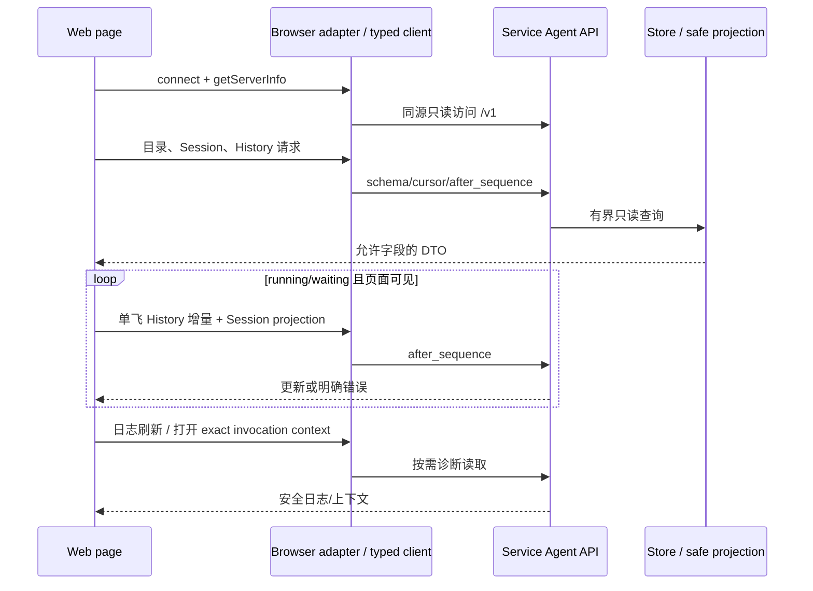

# Web 查询、更新与诊断

触发：打开页面、切换会话/标签、页面可见时的活动更新或显式刷新。

| 交接 | owner 与限制 |
| --- | --- |
| Browser session | index shell/Service；不是 Native 凭据 |
| DTO 校验 | agent-api-contract/client；不能直读 Store |
| 自动更新 | Web App 页面 effect 管理调度；transport adapter 负责一次读取与分页，typed client 不自带 scheduler |
| logs/context | 按需请求；不继承 History 自动更新策略 |
| route/document 结束 | route 停对应工作，pagehide 清访问会话；不取消产品任务 |

旧 generation 或 Session 结果不得覆盖新页面。请求失败保留已读快照和错误，不伪装空历史。API Docs 可读取规范但不提升 capability；只读访问不提供审批或写控制。

底层：[API client](../../../packages/agent-api-client/docs/browser-requests.md)、[Public wire](../../../packages/agent-api-contract/docs/public-wire.md)、[Web 数据](../../../apps/kite-web/docs/data-and-updates.md)、[诊断](../../../apps/kite-web/docs/diagnostics.md)。验证：[transport](../../../apps/kite-web/test/transport.test.ts)、[routing](../../../apps/kite-web/test/routing.test.tsx)、[API client](../../../packages/agent-api-client/test/client.test.ts)。

实际轮询测试覆盖及缺口见[Web 验证](../../../apps/kite-web/docs/testing.md)。
