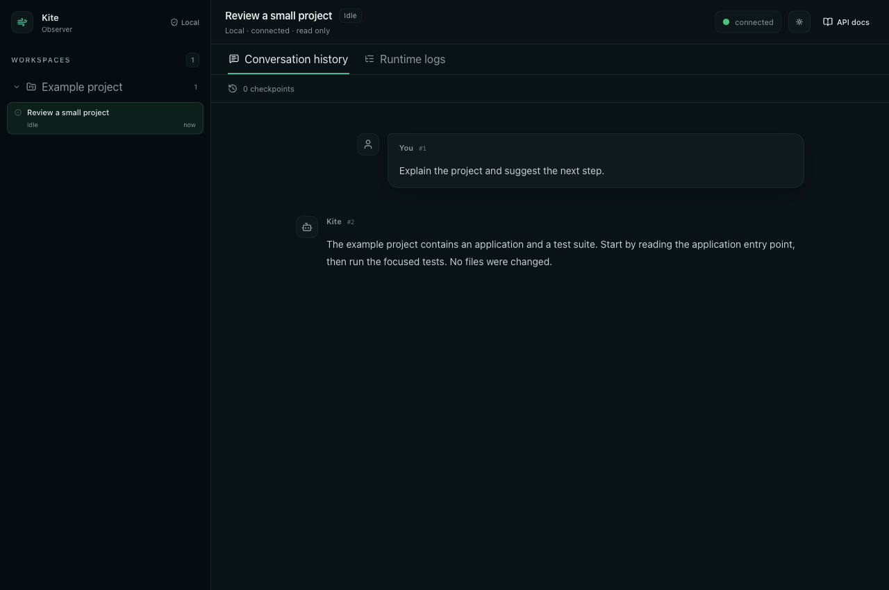

# Web 界面导览

Web 由工作区/会话目录、会话详情和 API Docs 页面构成。它与 TUI 共享部分数据含义，但没有终端式输入区、斜杠命令或审批快捷键。

| 区域 | 用途 |
| --- | --- |
| 工作区目录 | 展开工作区并浏览其已有会话 |
| 会话内容 | 查看用户消息、回答与工具结果 |
| History | 阅读会话历史和当前可展示内容 |
| Runtime logs | 按需查看诊断日志，显式刷新 |
| Model Context Inspector | 从特定模型调用日志查看该次请求上下文 |
| API Docs | 阅读本版本附带的接口规范 |

加载、空结果、错误和当前选择都有文字说明。空结果不等于加载失败；连接失败不应把已取得的内容替换成“没有会话”。

浏览器后退、直接会话链接和页面切换见[工作区与会话](guides/workspaces-and-sessions.md)。不同页面的更新行为见[更新与连接](guides/updates-and-connection.md)。

## 页面实例

真实 Web 组件截图，使用隔离的确定性示例 transport，不读取真实会话。左侧是工作区与会话目录；右侧顶部是所选会话及只读连接状态；标签切换 History 和 Runtime logs；正文区显示用户与回答。该图不证明真实服务已连接，连接与轮询由对应测试独立验证。

## 页面配色与窄屏

顶部太阳/月亮按钮切换当前 Web 页面 dark/light 主题。当前默认 dark，选择保存在页面组件状态中，不与 TUI 配色或用户配置同步；重新加载后不承诺保留。窄屏使用目录开关查看侧栏，选择会话后回到内容区域；这不改变会话数据或访问权限。
