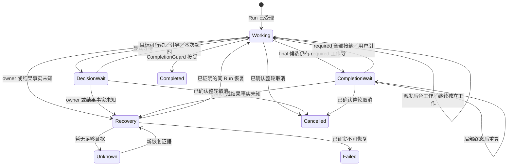

# 后台 Agent 与 Shell 的会话协调方案

状态：阶段 A–C 的等待修复及真实 DeepSeek 验证已完成。阶段 D0 的独立子 Session、三子正式入口、父作用域审批代理、父结果一次接纳与原 Run 续轮已通过受控验证；待审批／已决定审批以及排队中 revision0 子线程的真实 SIGKILL 重启窗口已验收。实际打包 Electron 的 `--execution-recovery` 组合 smoke 通过，使用隔离 HOME 和模拟 Provider。阶段 D2 的跨 Session QueueOnly 邮箱、`list_agents` 与 `wait_agent` 已通过正式入口受控验证。D3 的 `followup_task`、`interrupt_agent` 正式 App Server 成功路径已验收；`current_turn` 零 Tool 旧 grant 的内部在线与两种真实 SIGKILL 窗口通过，来源 mode revision 独立于子 Session 初始 revision 时亦可通过准确授权事实验证；正式 App Server 定向回归与 2026-09-26 合成隔离真实 DeepSeek 用例均验证非零 Tool 旧 grant 的静态只读 Surface 在原 Run 下一次 Model 消费邮件，且没有新 Run。原 Run 的工具 Surface 与派发限制为 `read_file`／`search_content`／`search_files` 和旧 grant 的交集；其他安全条件改走 `new_turn`。完成、派发前失败及取消的 `new_turn` followup 已凭目标终态与来源资金 ACK 生成跨 Session 回复，并由 Store 幂等恢复；已受理且尚未路由／派发的续任务可凭持久证据结算 `expired`、`context_unavailable`、`authorization_changed`、来源 Tool 确定失败或来源 Run 用户取消；取消在原事务记录释放原因，准备后过期的目标终态与来源备付恢复也已通过真实竞态测试。已尝试但不确定的结果继续失败关闭。备付 `queued`、准确槽获取与有界等待 `capacity_timeout` 已有 Store／Host／正式 App Server 定向验证，满位超时不启动目标 Provider。`after_turn` 独立子 Session 的旧父 Run 完成后继续派发、后续人类 Run 显式 `current_turn`／`new_turn`、自动汇报抑制与预算释放已通过正式入口受控验收。旧会话必须在新客户端兼容展示：Store10／11 合成旧会话经候选转换保留原 ID、Event 与 History 回放；当前用户库曾被错误重置，不能把未来兼容测试视为其完整恢复。日期：2026-09-26。适用：Native Runtime、TUI、CLI、开发中的 Desktop，以及只读观察的 Web。

本阶段补充验收：正式 App Server 的 `current_turn` 边界 5/5，包括原 Run 下一次只读模型消费消息，以及 Provider 返回未公布的 Shell Tool 时被拒绝；两处真实 SIGKILL 恢复 2/2；满位排队／有位后启动的容量回归 2/2。另有 queued 容量真实 SIGKILL 恢复 1/1：两个占槽 child 的在途 Provider 尝试在崩溃后成为 unknown，来源备付保持 queued 并报告 `followup_recovery_required`；没有目标路由／派发或来源释放，不能在该不确定状态结算 `capacity_timeout`。Store 的 queued 后备证明已收紧为两种准确事实：仍 queued 且无槽获取事件，或已转 reserved 且有准确 `resource_budget.child_slot_acquired`；不再凭状态单独推断槽已取得。这些是本地受控 Provider 和进程恢复证据，D3 的 `new_turn` 与 `current_turn` 各有独立合成隔离环境下的真实 DeepSeek 定向验收；不以模型是否回显提示词标记作为通过条件。

本方案面向真实会话中多个后台子 Agent 与有限 Shell 的派发、等待、部分结果、用户引导和停止。原“一个 child 回复后本轮回复失败”已从本机持久事件和结果 Artifact 定位为 child `suspended` 结果在 Kernel 接纳前被 Service 投影为 `unavailable` 的窗口；准确失败时序和仍需补验范围见第 7 节。Codex 的 Agent 通信只作为目标行为依据，不能用工具改名替代 Kite 的接纳与恢复验证。

## 1. 参考依据与 Kite 现状

[Codex Responses Multi-agent 指南](https://developers.openai.com/api/docs/guides/responses-multi-agent)区分创建、查询、等待、排队消息、显式续轮和中断。固定源码提交 `40eac3ce8a0c10cbcb9db910d529355eb2f8fc09` 中，[V1 定向等待](https://github.com/openai/codex/blob/40eac3ce8a0c10cbcb9db910d529355eb2f8fc09/codex-rs/core/src/tools/handlers/multi_agents/wait.rs)对指定目标做 wait-any；[V2 `wait_agent`](https://github.com/openai/codex/blob/40eac3ce8a0c10cbcb9db910d529355eb2f8fc09/codex-rs/core/src/tools/handlers/multi_agents_v2/wait.rs)等待调用者邮箱更新、用户引导或超时。`wait_agent` 不承诺每次返回所有 Agent 的全量状态；整体状态由 [`list_agents`](https://github.com/openai/codex/blob/40eac3ce8a0c10cbcb9db910d529355eb2f8fc09/codex-rs/core/src/tools/handlers/multi_agents_v2/list_agents.rs)查询。成功等待回执与消息正文进入下一模型上下文也是两个事实。

Kite 已有[执行手册](../handbook/features/execution.md)、[Builtin 工具契约](../../packages/builtin-runtime/docs/tool-pipeline.md)、[CompletionGuard](../active/completion-guard.md)和 [Service owner](../../apps/kite-service/docs/runtime-application.md)：`task(background=true)` 返回 task ID；`task_wait` 对指定 1–8 个 task ID 做有限 wait-any；`task_read` 补读状态或报告。`shell_execute(yield_ms)` 返回 Shell 句柄，`shell_read` 按游标读取或等待，`shell_stop` 精确停止。required 子任务结果仍属于原 Run：唯一 watcher 先写结果 Artifact，Kernel 接纳后以低权限具名内容进入主模型输入。阶段 A–C 沿用这套权威，不另建结果收件箱、生命周期 registry 或 `await_agent`／`wait_shell` 同义工具。

当前代码还有四个关键事实：

- [CompletionGuard](../../packages/agent-kernel/src/completion.ts)先判断未终态工具／required Shell，再判断 required 子 Agent。子 Agent 的 `wait_for_background` 有独立无纠错等待；Shell 的 `wait_for_tool` 仍可能进入普通纠错路径。混合运行的局部终态必须以真实 Service/Host 时序验证。
- [运行器](../../apps/kite-service/src/bootstrap/runtime/state-runner.ts)在自动等待中重算条件。A 终态而 B/C 仍 required 时，A 的结果可已接纳，主模型通常等全部 required 解除后才再调用；需要首个结果决策时应显式使用 `task_wait`。完成等待 port 在生产入口已接线，缺失时现明确报错而不落入 `Completion blocked...` 通用终态；用户原故障的根因另见第 7 节的 watcher 提交间隙。
- 用户→活动主 Agent 的 [`steer_turn`](../handbook/features/execution.md)已存在。当前[子 Agent 模型循环](../../packages/builtin-runtime/src/subagent/model-loop-engine.ts)只维护本次任务的局部消息；普通终态结果没有可续轮的完整对话。现有审批 continuation 不能冒充普通 Agent 续轮。
- 现有[部分完成测试](../../apps/kite-service/test/isolated/runtime-server-required-background-partial-wait.test.ts)覆盖两个 child 的错峰完成，没有覆盖三个 child、多个有限 Shell、真实 Provider 或实际 Desktop 的组合。

原失败 Run 的 `completion.blocked`、`run.error`、task 身份和结果 Artifact 时序已在第 7 节记录；持久库未保存可证明的 App binary version。原判断依据是持久事件与源码提交顺序，不是截图或先前的条件风险推断。

## 2. 产品行为与不变量

1. **四个事实分开。** 工具已接受、后台执行已终态、结果已被 Kernel 接纳、结果已进入主模型输入分别表达。最后一项只能证明已提供给模型，不能证明模型理解或采纳。一个 child 的成功、失败或取消不得由等待设施直接映射为父 `run.error`；主 Agent 仍可依据具名失败结果决定自身答复。
2. **身份准确。** 当前 `task_id` 标识一次 child 执行及其原 Run 结果，Shell ID 标识一次命令；等待、读取、停止都针对准确执行 ID。阶段 D 以稳定 `agent_id` 标识 Agent，以独立 `agentThreadId` 标识其会话线程，以逐轮 `task_id` 标识执行；三者不得互相代用。
3. **等待是观察。** `task_wait`／`shell_read` 的一次等待窗口到期只表示暂无新事实；不改变任务总期限、授权、父 Run 身份或纠错次数。用户引导让等待返回，不取消已派发工作。
4. **局部终态不是整轮终态。** A 已结算、B/C 仍 required 时，父 Run 非终态；A 的具名结果只接纳一次，B/C 的义务仍在。心跳、重复 `running` 快照和无关 revision 不唤起主模型。
5. **真实在途等待不算模型错误。** live admitted attempt 的工具、required Shell 和 child 均不因等待或局部唤醒增加 CompletionGuard 的 correction attempt。未知 owner／外部副作用走有证据的恢复或 unknown，不伪造成功或无限等待。
6. **停止以清理证据为准。** 精确停止一个 child 或 Shell 与取消父 Run 分开；停止受理、执行退出和清理确认也分开。未知副作用不得自动重放。
7. **低权限交付。** 子 Agent 结果和阶段 D 的 Agent 间消息保留来源，不视为用户授权；运行中消息不能扩大原任务权限、预算或 deadline，新轮重新校验授权。
8. **主、子引导分开。** Kite 现有 `steer_turn` 由活动主 Run 处理。Codex 式 `send_message` 只排队，`followup_task` 才触发目标继续；回执均不等于模型已读或已执行。已发模型请求、已启动工具和已展示 final 不追溯改写；停止另走独立操作。

## 3. 阶段 A–C：当前工具的合理调用

| 意图 | 主 Agent 动作 | Runtime 必须保证 |
| --- | --- | --- |
| 独立子任务 | 并发 `task(background=true)`，取得各 `task_id`；写入冲突时串行 | 分别准入、执行和保留原 Run 的 required 义务 |
| 首个子结果会改变后续动作 | 对准确 ID 调一次 `task_wait` | 指定 1–8 个目标的有界 wait-any；返回当时快照，不取消其余 child |
| 已无独立工作，只需等齐 | 提交完成候选 | CompletionGuard 在同一 Run 等 required 结果；局部终态只重算，不反复请求模型 |
| 查询或补读截断报告 | `task_read(task_id)` | 读状态／Artifact，不把读取当成生命周期确认 |
| 用户引导活动主 Agent | 现有 `steer_turn` | 同 Run 持久受理并按当前 Kite 规则处理未派发的旧动作 |
| 停止一个 child | `task_cancel(task_id)` | 只停止准确目标，观察真实终态，兄弟任务继续 |
| 运行有限命令 | `shell_execute`，超过 `yield_ms` 后持有 shell ID | `timeout_ms` 是总执行期限；命令继续受管 |
| 需要 Shell 输出／终态 | `shell_read(shell_id,cursor,wait_ms 或 wait_until)` | 增量读取与有限等待；重复读不重复执行，等待超时不杀进程 |
| 停止一个 Shell | `shell_stop(shell_id)` | 精确停止并核对执行与清理事实 |
| 显式 service | `shell_execute(mode=service)`，再实际验证服务 | `running` 不等于业务 ready；service 存活不构成父 Run 永久未完成义务 |

`task_wait` 用于**中间决策**，自动 CompletionGuard 等待用于**最终依赖**；前者不是所有子 Agent 的全局收件箱。两者观察同一 canonical task 状态，只有 watcher 与 Kernel 接纳的终态解除 required 义务。`shell_read` 已承担即时读取和等待，不增设 `wait_shell`。模型工具描述和示例应阻止反复 `task_read`、Shell sleep 或空说“正在等待”的模型轮询。

`result_disposition=after_turn` 仍遵循现有结构化授权、预算预留、原 deadline 和 `human_start_preferred` 规则，不算本轮 required。阶段 D 的显式 `followup_task` 使用第 4 节单独定义的邮箱与后备预算协议，不借用 after-turn 的自动汇报 Run。

典型当前会话：主 Agent 派发 A/B/C 和一个有限 Shell，继续独立工作。若 A 的结论影响下一步，它对 A/B/C 的 task ID 调 `task_wait`；A 先终态则处理 A，B/C 和 Shell 继续。若只需最终汇总，提交完成候选，Runtime 等齐剩余 required 工作。用户在等待时发引导，由原 Run 处理；每次局部终态只更新事实，最终才恢复模型形成答复。

## 4. Codex 式 Agent 通信：Kite 接线决定

[OpenAI 官方 Multi-agent 文档](https://developers.openai.com/api/docs/guides/responses-multi-agent)将 `send_message`（排队）、`followup_task`（启动或恢复非根 Agent）、`wait_agent`（调用者邮箱等待）、`list_agents`（Agent 树状态）和 `interrupt_agent`（独立中断）分开。固定源码提交 `40eac3ce8a0c10cbcb9db910d529355eb2f8fc09` 中，[`send_message = QueueOnly`](https://github.com/openai/codex/blob/40eac3ce8a0c10cbcb9db910d529355eb2f8fc09/codex-rs/core/src/tools/handlers/multi_agents_v2/send_message.rs#L35-L47)、[`followup_task = TriggerTurn`](https://github.com/openai/codex/blob/40eac3ce8a0c10cbcb9db910d529355eb2f8fc09/codex-rs/core/src/tools/handlers/multi_agents_v2/followup_task.rs#L35-L47) 的[共同处理器](https://github.com/openai/codex/blob/40eac3ce8a0c10cbcb9db910d529355eb2f8fc09/codex-rs/core/src/tools/handlers/multi_agents_v2/message_tool.rs#L57-L93)成功时返回空工具结果，不返回新 task ID；[`wait_agent`](https://github.com/openai/codex/blob/40eac3ce8a0c10cbcb9db910d529355eb2f8fc09/codex-rs/core/src/tools/handlers/multi_agents_v2/wait.rs#L35-L163)只返回唤醒／超时摘要，不是结果正文或所有 Agent 快照。这些是交互依据；Kite 的现行会话边界见 §4.0，后续标为待替换的章节保留原单 Session 设计记录。

### 4.0 会话线程边界：阶段 D 的新前提

[Codex CLI 的 Subagents 文档](https://learn.chatgpt.com/docs/agent-configuration/subagents)把子 Agent 的工作场所称为 Agent thread，CLI 可用 `/agent` 切换并查看各线程；主线程汇总子线程结果。该文档证明独立上下文的产品语义，不规定 Kite 或 Codex 的数据库布局。Kite 在阶段 D 选择更明确的运行边界：每个 Agent 拥有独立的持久会话线程（`agentThreadId`／Store Session ID）、State revision、模型 transcript、轮次与执行 owner。子线程可继承工作区与受限配置，创建时记录 `parentAgentId`／`parentThreadId`，但不能直接在父线程 State 上提交自己的生命周期、模型或进度事件；兄弟线程的正常写入也不能使彼此的 effect lease 失效。同一 SQLite 文件可以保存多个 Session，独立线程不要求独立数据库文件或工作树。

子线程是内部 Agent 执行会话，不是空间下的顶层会话。Store 须持久记录根／子线程类型及父线程血缘；旧会话迁移时按已证实的原有顶层会话身份标记为根线程。空间会话列表及其搜索、最近会话等同源查询须在排序、游标和 `LIMIT` 之前过滤子线程，不能仅靠客户端或取页后隐藏。子线程的状态和历史由父线程的 Agent 树入口或授权的 Agent 详情访问；已知子线程 ID 也不绕过父子血缘与权限校验。重启、迁移和分页后均保持这一可见性边界。

父子之间只通过有来源和幂等身份的跨线程协议联系：父工具受理创建意图并建立准确的 required 义务；子线程独立运行，其委派任务从私有 Artifact 读取并作为低权限 Agent 输入准备，不冒充人类 `user.message_appended`；子终态先在自己的线程结算，再以确定性结果通知交给父线程，由父线程单独接纳、解除原 Run 义务并准备低权限模型输入。`send_message` 的成功只证明持久受理，目标读取和模型输入各有独立事实；`followup_task` 为目标线程创建或继续一轮，不复用旧 `task_id`、授权或预算。取消父 Run、停止一个子 Agent、子线程自身结束是不同操作，不暗中停止兄弟线程。

上述 required claim 只适用于 `result_disposition=required`。`after_turn` 已接入独立子 Session：原 `task` Tool 回执同事务保存非必需子创建意图、有界委派额度和一次自动汇报模型后备，不建立 required claim；原父 Run 正常结束后，子凭 retained funding ledger、原 deadline、封存 grant 和 child owner 证据继续派发。子终态先封存，再由父 Session 按原血缘一次导入具名结果，不注入后来的人类 Run。自动汇报仅在原后备及 `human_start_preferred` 条件成立时至多启动一次，抑制时释放后备；原任务仍活动期间，父 Session 的新 Run 可按现行直接子授权与独立资金约束发送 `followup_task`。创建失败、取消、预算 unknown 与重启保留准确意图及释放／恢复事实；正式入口跨 Run 验收见阶段 D。

跨线程不能借用“所有 Agent 共用一个 Session revision”取得原子性。Host/Store 须明确消息 outbox／inbox、命令 receipt、投递确认与崩溃重放的唯一 owner；允许共享事务存储，但父子 State 分别按各自 Session revision 提交。资金仍由准确来源 Run 授权并可在发送方 Run 结束后结算，子线程只使用有界委派额度；结果和邮件正文保留私有引用。任何跨线程步骤失败，必须保留可查询的待交付或恢复事实，不能返回成功后静默丢失，也不能重放未确认的外部副作用。

首轮创建与结果桥接按以下提交顺序收敛：父线程在原 `task` Tool 受理事务中写确定性 `agent_id`／`agentThreadId`、创建意图、原 Run required claim、有限委派预算和工具 receipt；原 Tool 的短期预算在同批事务中按已发生的一次调用调和，再建立贯穿子生命周期的委派预留。Host 按该意图幂等初始化子 Session：revision 0 仅预绑定准确来源，预算未配置；子线程首次启动事务同时接纳委派任务 Artifact、配置不超过父委派上界的预算、创建自己的 Run 与 Turn。父线程再次确认原 Run／required claim 有效并记录委派 dispatch ACK 后，子 Provider 才能派发。重启前仍可能用到的受限 grant 必须有不可变私有证据及准确摘要；原 grant 过期、策略收紧或绑定不可用时具名失败，不能重发更宽的授权。若子 Session 确证无法创建，或已创建但尚未激活／派发而被放弃，父线程以同一意图身份结算具名失败和原 required claim，不留下永久 `running`。子线程先将不可变结果 Artifact、终态及带原父 Run／Turn／Tool attempt 的待投递结果记录在自己的事务中结算。桥接器只凭这条已结算记录，在父线程事务中一次性接纳原 `subagent.background_result_persisted`、解除准确 required claim，并写投递确认；相同结果身份重试只返回已有确认，摘要冲突拒绝。若子事务已提交而父事务未提交，记录保留待投递，重启后继续桥接；父事务已提交而确认回传丢失时只重放确认，不再执行 child 或再注入结果。父 Run 已取消时按取消事实结束原 claim，保留子终态供历史读取，不重开父 Run 或注入后续人类 Run；桥接器只有在父线程对该结果或取消已持久结算后才确认投递。任一中间状态都可查询和恢复，不能从子线程的成功直接推断父线程已收到。

#### D0 的记录、事务与 owner

| 记录／动作 | 唯一写入 owner | 提交与校验边界 |
| --- | --- | --- |
| 子线程身份及创建意图 | 父 Session | `agentThreadId` 从准确父 Session、Tool invocation 与稳定 `agent_id` 按域分隔确定；原 Run／Turn／Tool attempt、grant digest、required claim、Tool receipt 与创建意图同一父事务。模型参数或客户端不能自行指定子 Session ID。|
| 子 Session 初始化与启动确认 | 子 Session；确认回写父 Session | Store 以父意图和相同创建 identity 幂等创建独立 Session／Controller，绑定 `parentSessionId`、Workspace/project digest 和受限 grant；子执行只能在子创建回执持久后启动。父确认丢失时从创建回执恢复，不创建第二个子 Session。|
| 子终态与待投递结果 | 子 Session | 唯一 watcher 在子执行清理证据齐全后封存不可变结果 Artifact 与终态；外部尝试已持久而清理无法确认时，仅 fenced recovery generation 可封存 `unknown/cleanupConfirmed=false`。单有 Artifact 不得解除父 claim。|
| 父结果接纳与投递回执 | 父 Session | 桥接器读取已结算的子终态，核对父意图、原 claim、grant/result digest 和父 Run 状态；在一个父事务中接纳原结果并结算 claim，同时保存按 delivery ID 唯一的回执。子 outbox 的已确认标记可在随后子事务中写入，以父持久回执为准重放；摘要冲突拒绝。|
| 消息与续轮 | 发送 Session／接收 Session | 发送方事务保存命令 receipt、私有正文 ref 与有界预算意图；跨线程 outbox 经目标血缘和授权检查投递，接收方自己的事务才推进 inbox／模型输入水位。`followup_task` 在子 Session 继续或创建下一轮，不让子模型事件写入父 State。|

所有子 Session 仍属于原 Workspace，但不是顶层会话。目标 Store 以 `runtime_sessions.parent_session_id` 的 NULL／准确父 Session ID 为单一根／子判据，旧会话迁移时回填 NULL；子 Session 创建须检查父链、Workspace/project 一致、无环和当前授权。`agent_id`、`agentThreadId`、初始 `task_id` 的一对一映射留在父创建意图与子创建回执，旧历史 task 没有子 Session 时只保留其原结果可读性，不凭相似 ID 伪造线程。`parent_session_id` 的确切物理格式与 Store 10→候选格式转换须按 schema/epoch 完整验证；未发布的 Store11 可以修订候选，但不得静默原位升级用户现有 Store10。

父 Session 的 close/delete、Fork 和 Rewind 不能只处理父 State 后留下不可发现的子线程，亦不能由外键级联无证据地删除已接纳的子结果。在具体 child 清理／历史保留策略和投递 outbox 结算得到验证前，这些操作遇到子线程血缘时 fail closed；后续决定须同时更新产品会话语义与 Store/Host owner。

| 崩溃／竞态窗口 | 恢复时的唯一可执行动作 |
| --- | --- |
| 父创建意图已提交，子 Session 未创建 | 按同一 identity 重试子 Session 创建；确证永久失败时父线程提交具名失败和 claim settlement，重放原 Tool receipt。|
| 子 Session 已创建，父启动确认丢失 | 从子创建回执核对并回写确认；不得再创建或再派发已确认的外部 attempt。|
| 结果 Artifact 已写，子终态事务未提交 | 结果仍未交付；子 owner 依清理和 dispatch 证据恢复或标记 unknown，不能从 Artifact 猜测成功或重复 Provider 操作。|
| 子模型／工具尝试已持久，进程中断且清理不能确认 | 子恢复 generation 将原 Run 标 unknown、封存 unknown 结果，再以 cleanupConfirmed=false 释放 owner；父事务在验证子 owner 为 recovery_required 后一次性结算 required 结果，原委派预算保持 unknown，不重放外部尝试。|
| 子终态／outbox 已提交，父结果尚未接纳 | 桥接器按 delivery ID 重试父事务；父 Run 仍 required 时才接纳原结果。|
| 父结果／receipt 已提交，子确认丢失 | 只查询父 receipt 并确认子 outbox；父结果帧和 claim 不再写第二次。|
| 父 Run 已取消或在途取消 | 先核对父取消与原 claim settlement；子结果保留历史，桥接只记录取消投递结果，不唤醒旧 Run 或注入新的人类 Run。|

D0 验收至少覆盖：三个子 Session 并发注册、handle、模型和终态写入时各自 revision／lease 只随自身事实变化；上述每个崩溃点重启后仅一次外部执行和父结果；子线程创建永久失败与父取消均无永久 required；空间列表、搜索、最近会话、分页和直接 ID 查询在排序、游标与 `LIMIT` 前排除内部子线程，父 Agent 树授权读取仍可见；Store10 旧根会话转换后仍可见，内部子线程在排序和分页前保持隐藏。客户端后过滤、单测中的同 Session Agent 行或 Artifact 存在都不足以通过这些验收。

阶段 D 的 D0 设计核对定义身份映射、事务 owner、崩溃窗口与列表过滤边界。Store10／11 旧根会话经候选转换保持原 ID、State、Event 与 History 回放；三子正式入口验证彼此独立的 revision／lease、准确父结果与根列表可见性；真实 SIGKILL 验证创建、排队、审批决定、原 Run 续接和一次接纳。消息的跨线程受理／投递由 D2 QueueOnly 验收覆盖；D3 的资金授权、`new_turn`、受限 `current_turn` 与直接子停止另由各自 Store/Host/Service 事务及正式入口验收支持，不能仅凭 D0／D2 的证据推断。

用户已澄清：开发数据可重置，不等于旧会话兼容要求可以取消。[会话连续性方案第27节](session-store-compatibility-and-continuity.md#27-旧会话兼容回放要求2026-09-25当前有效)要求新客户端保留旧根会话原 ID、已提交 State/Event 与 History 回放；本机当前库曾被错误清空，需将其数据恢复问题与未来兼容实现分别报告。

正式入口的启动恢复还须在持久意图扫描后允许父 Session 查询与命令继续进行；长时间运行的子模型不能让父会话入口一直等待。后台恢复结果必须可观察，`recovery_required` 不得作为未处理的 Promise 丢失。正式入口已将恢复扫描的调度与完成分开，父会话入口不等待长时间运行的子模型，失败按准确子意图写入需恢复诊断；正式 App Server 进程崩溃重启用例已验证持久意图恢复、子模型在途时父查询响应和一次父结果导入；父模型在结果导入后消费准确具名 `<subagent_result>` 并恰好一次完成原 Run 的崩溃重启验收已通过。

独立子 Session 的审批由父 Session 受控代理交互展示与提交决定，私下绑定准确 child intent、grant、Tool、interaction 和 owner generation；子 Session 单独接纳决定，再从已持久的 Model／Tool 点恢复。正式入口的批准和拒绝测试，以及待审批、已决定两处真实 SIGKILL 测试，均核对原父子 Run 续接、已尝试外部动作不重放、工具只派发一次、父结果只接纳一次。缺少恢复证据继续 fail closed；客户端只使用父 Session ID 与 revision，不开放直接子 Session 命令。

#### 4.0.1 跨线程邮箱的下一实施边界

阶段 D 的稳定 Agent 目录以现有 `runtime_sessions.parent_session_id` 和每个线程的 Agent 身份为基础，一个 Agent 只拥有自己的 Session；不在父 Session 另建可写的子 Agent 生命周期副本。未发布 Store11 中 `agent_nodes`／`agent_mail` 当前按同一 `session_id` 外键约束源与目标，不能直接打开其工具。D2 应将其改为来源线程 outbox 与目标线程 inbox：发送方的准确 Tool 回执、私有正文引用、消息身份和待投递记录在来源 Session 事务中原子受理；接收方仅在自己的 Session 事务中按相同消息 ID 写一次 inbox 与接收事件。父子血缘、Workspace 身份、当前执行授权和目标状态在受理及投递时分别复验；知道 Agent ID 或子线程 ID 不形成权限。

当前 Store13 继承 Store12 的来源 outbox／目标 inbox 的有界 `QueueOnly` 记录、来源 Tool 身份、跨 Session 血缘核对、私有正文和各自 fenced 事务。正式 App Server 的 `send_message` 从准确来源 Tool 受理，经目标 Event／inbox 投递，在目标后继模型输入中产生一次低权限 `<agent_message>`；空闲目标只排队。冷启动按未确认来源索引重放，重复扫描不产生第二条目标消息。`followup_task` 已由来源 Tool 受理并在子 Session 中准确路由；完成态终态 ACK 可生成确定性的 `reply` 邮件，待投递邮件按同一来源索引恢复。旧同 Session 表暂留，其工具开关保持关闭。

正文只在来源私有 Artifact 保存一份。目标 inbox 以受限引用读取它：接收时若目标有准确活动 Run，保存该 Run 作为可投向模型的收件归属；若目标空闲，保留未绑定的排队消息，不能在后来任意人类 Run 中自动注入。目标只为归属当前 Run 的消息按自己的顺序推进 `mail_input_prepared` 水位；读列表、`wait_agent` 唤醒及 outbox 投递确认均不推进模型已读水位。来源 outbox 仍可枚举未有目标接收回执的消息；进程在任一步骤退出时按消息 ID 查询目标 inbox 后重试投递，不能重新执行发送 Tool 或生成第二条成功回执。跨线程步骤不要求父子 State 同时提交，但每一步都有明确 Session revision、幂等键和可查询的待恢复事实。QueueOnly 不申请目标模型预算，也不唤醒空闲目标；TriggerTurn 在来源资金 Run 锁定有界后备预算后，才允许目标按 §4.0 的新轮协议接纳。

以下 §4.1–4.5 记录原单 Session 设计，保留供迁移核对；其中共享 Session revision、同 Session 邮箱事务及 Store11 发布流程均不是阶段 D 的当前实施依据。其交互语义须按 §4.0 重新落到跨线程协议。

| 模型操作 | Kite 目标契约 |
| --- | --- |
| `list_agents` | 授权范围内只读 Agent 树、状态与有界最近消息摘要；不消费邮箱、不启动执行 |
| `wait_agent(timeout_ms?)` | 有界等待调用者邮箱新事实或用户引导；超时只结束本次等待；返回原因摘要，消息正文以独立低权限帧进入后继模型输入 |
| `send_message(agent_id,message)` | 持久 QueueOnly；活动目标在下一个可用模型输入边界读取，空闲目标保持排队；成功回执不证明已读，也不触发模型 |
| `followup_task(agent_id,message)` | 持久 TriggerTurn；活动目标在安全边界继续，若可见 final 先成立则同一 Agent 启动新轮；模型可见成功输出为空，调用者通过 `wait_agent`／`list_agents` 观察 |
| `interrupt_agent(agent_id)` | 精确中断目标活动轮，保留 Agent 身份与已结算历史；与现有 `task_cancel` 共享底层执行停止和清理证据，不取消其他 Agent |
| 用户→主 Agent `steer_turn` | 保留现有同 Run 用户引导，不转成 Agent 间 QueueOnly 消息 |

### 4.1 原单 Session 身份、轮次与结果草案（待替换）

Root Agent 的身份绑定 Session，不绑定某一个 Run。首轮 child 的稳定 `agent_id` 直接使用现有 `childInvocationId`：它已按父模型调用、父工具、attempt 和 role 确定性签发，并由 [ADR-0114](../adr/0114-stable-subagent-actor-identity-for-strict-replay.md)定义为 actor lineage，而非权限。每个 child 模型工作轮次另有 `task_id` 和 `turnOrdinal`：首轮为兼容现有结果，可保持 `task_id == agent_id`；后续轮从 `agent_id` 与已受理 followup 的命令身份确定性生成新 `task_id`，绝不重用旧 task ID、Tool attempt、result Artifact 或执行 grant。Agent 树记录父 Agent 身份；联系目标须通过同 Session、树可见性与当前调用者授权校验，知道 ID 不产生权限。`followup_task` 不接受根 Agent 作为目标；子 Agent 发给主 Agent 的消息走 `send_message`，用户发给主 Agent 仍走 `steer_turn`。

当前 `task_read`、`task_wait`、`task_cancel` 和原 required CompletionGuard 义务继续针对准确 `task_id`；`send_message`、`followup_task`、`wait_agent` 与 `interrupt_agent` 针对 `agent_id`／调用者邮箱。`list_agents` 可展示最近 `task_id` 供诊断，但 `followup_task` 不把它作为成功工具输出。活动轮收到 followup 时仍属于当前 `task_id`；final 先提交而需要新轮时才创建新 `task_id`。首轮 `task(background=true)` 的终态仍由唯一 watcher 写一次不可变结果 Artifact 并按原 Run／Turn／Tool／attempt 交给 Kernel；Agent 身份不替代这个结果血缘。后续由 followup 新建的轮次以准确 submission 为来源，由同一 watcher 写独立结果 Artifact，并在 Agent tree 中提交 `agent.task_settled`（Agent／task／submission／owner generation／状态／结果与 checkpoint 引用）；它不伪装成旧 `task` 工具的 `subagent.background_result_persisted`，也不为发送方 Run 建立 required 义务。

终态 child 的可续轮上下文使用私有不可变 checkpoint。Builtin child runtime 在仍持有完整 transcript 与模型 invocation ordinal 的位置生成 checkpoint；Provider/Service 只传递引用、摘要和版本。Service watcher 先验证并保存 checkpoint，再把其引用与该轮结果 Artifact 一并纳入 canonical terminal settlement；Agent 的 latest checkpoint 指针只随该 settlement 前进。checkpoint 保存历史模型消息、角色、来源与恢复游标，不保存可复用的旧授权、审批 continuation 或工具 grant。新轮从已结算 checkpoint 取得上下文，并重新签发本轮 capability、phase、sandbox、工具策略、预算与 deadline；审批专用 continuation 不充当普通续轮。checkpoint 写入失败仍须准确结算已完成任务结果，并把 Agent 标记为不可续轮。若写入仍可恢复，已受理消息保持 queued 并暂拒新消息；若确证永久不可恢复，则在同一 terminal settlement 把尚未进入模型输入的消息标为 `context_unavailable`，保留回执、正文引用与原因供查询，并从待投递容量中移除。旧会话缺可信 checkpoint 时，历史结果可读，空闲消息／续轮明确返回 `context_unavailable`，不伪造上下文。

### 4.2 原单 Session 邮箱草案（待替换）

Host/Store 使用现有 Session 事务、command receipt 与 owner generation 维护 Agent tree、每个 Agent 的有序 inbox 和调用者 mailbox；Service 的 `BackgroundSubagentRuntime` 仍只持有活执行句柄、waiter 和终态观察，不另设持久 registry 或调度器。正文保存在 Session 私有 Artifact，canonical 事件只放引用、摘要和身份；客户端投影及诊断日志不复制正文。最小持久事实如下：

| 事实 | 必需字段与唯一权威 |
| --- | --- |
| `agent.mail_accepted` | 从准确 Tool call identity 派生的确定性 `messageId/submissionId`、源／目标 `agent_id`、源执行 scope（主 Agent 的 Run/Turn/Tool attempt，或子 Agent 的活 grant 与所据 Run）、`QueueOnly/TriggerTurn/reply`、正文 ref/digest、Session 顺序；TriggerTurn 另引用不可变 `followupAdmission`（原调用身份、授权／能力／effects digest、phase ceiling、workspace/mode/policy revision、资金 Run、后备 reservation ID、deadline）。工具发送时与成功 receipt 同事务提交；terminal 派生回复只在准确 settlement 后发布，exact 重试去重、摘要冲突拒绝 |
| `agent.followup_routed` | 同一 submission 只能绑定一次 `current_turn` 或 `new_turn`、目标 `task_id`、准确模型 reservation／输入水位和资金来源；路由不是模型已采纳证明 |
| `agent.mail_input_prepared` | 收件 Agent、准确模型 invocation、从／至 mailbox revision、消息 ID 列表及低权限来源；只有准确模型 Surface 的预算准入与输入批次都持久绑定后才前进消费水位，wait 醒来或 UI 查看不消费 |
| 子任务 terminal 与 checkpoint 引用 | 唯一 watcher 提交：首轮 `task` 沿用原 Kernel 结果 admission；followup 新轮使用由 submission 绑定的 `agent.task_settled`，两者均只写一次 task 结果与 checkpoint。邮箱通知引用已结算 task/result revision，不取代 terminal |

`send_message` 在同一 Session 的授权 Agent 树内受理，最多 8 条未进入目标模型输入的消息、单条正文最多 4 KiB UTF-8，超限在受理前拒绝。活动目标的在途 Provider 请求与已启动工具先收尾，后继模型输入按 Session 顺序纳入消息；如果当前轮没有下一模型输入，普通消息留给以后显式续轮。空闲目标仅保存消息，不分配模型预算、不启动新轮。目标已删除、无可信续轮上下文、跨 Session、无权或 owner 身份不可信时返回准确拒绝／恢复状态，不返回成功后静默丢弃。用户→主 Agent 的 `steer_turn` 保留用户权限和当前 Run 排序；Agent→主 Agent 的 `send_message` 是低权限 Agent 内容，不借用 `user.message_appended` 或用户审批。

`followup_task` 在同一受理事务写入 TriggerTurn 消息与执行意图，成功模型工具输出保持空。Host 以 Agent lane 的 Session revision 序列化消息受理、当前轮 final 与新轮激活：活动轮仅在权限兼容且下一准确模型 Surface 已从目标原预算准入的安全边界提交 `agent.followup_routed(current_turn)`；可见 final 先结算、权限不兼容或本轮无法再合法采样时，等待原轮终态并从最新已结算 checkpoint 提交 `agent.followup_routed(new_turn)`，启动同一 `agent_id` 的新 `task_id`。路由提交前消息仍是已受理的未投递意图；两条路线互斥，旧 final 不追溯改写。新轮最多一个活 owner，派发前重新核验 Session、workspace、mode、role 与当前策略；旧 grant 和审批不能复用。`followup_task` **不**给发送方 Run 自动建立 required CompletionGuard claim；发送方通过 `wait_agent` 观察，仍可继续独立工作或结束。若原始 `task(background=true)` 属于发送方当前 Run 的 required 工作，其原有义务独立保留，不能被新消息悄悄解除。

`interrupt_agent` 先解析当前 Agent 的准确活 `task_id`，再复用 `task_cancel` 的停止意图、owner 清理和 unknown 处理；Agent 身份与已结算 checkpoint 留存，待处理消息保持可见并标出是否未交付。取消一个 child 不停止兄弟，也不撤销已进入模型输入的消息。对已空闲目标返回当前状态，不伪造“刚停止成功”。

### 4.3 原单 Session 预算草案（待替换）

`QueueOnly` 仅支付发送工具与私有消息 Artifact 的现有资源成本，不预留目标模型调用；目标若无后继模型机会，消息仍保持 queued。`TriggerTurn` 只由有效执行 scope 受理：主 Agent 必须仍在活动 Run/Turn，子 Agent 必须有未撤销的活 grant、准确原调用身份及尚有效的资金 Run；两者都须通过委派策略。受理事务把不可变 `followupAdmission`、成功 receipt、消息和**首个模型请求加一次新 child turn 的后备上界**写入发送方资金 Run 的持久 ResourceBudget ledger。后备预算在根 Run 正常结束后仍须可寻址、不得被后来的前台 Run 账本替换；直到 followup 结算才释放或调和。当前 State／Host 若不能同时证明该资金 Run 账本的持续所有权与唯一性，Stage D 不开放 `followup_task`。ID 本身不是授权，额度不足、权限失效或 ledger unknown 必须在入队前拒绝。

后备上界按已配置模型的 context window、最大输出、Kite 输入估算放大规则、最多 8 条消息的注入开销和一次 child turn 计算；上下文须在该界内裁剪，缺可信模型界限则拒绝。受理时显式检查 `deadlineAt - now >= max(60 秒, Provider 首次尝试超时 + 5 秒启动余量)`，首次尝试超时无界或未知则拒绝；激活及实际 dispatch 前再核对同一原 deadline。成功只保证意图与首个模型／turn 预算已持久锁定，**不保证目标已经执行**：新轮仍须按现有 `maxConcurrentSubagents` 取得有 owner 证据的执行位，在原 deadline 与有界并发等待期限内启动；等待超期或策略收紧须给出 `capacity_timeout`／`expired`／`authorization_changed` 等可查询终态，并结算未 dispatch 预算。

活动轮仅在发送方授权 ceiling 足以触发目标现行 grant，且目标原资金 Run 已为含邮件的下一**准确模型 Surface**持久准入时，才能提交 `current_turn` 路由、`mail_input_prepared` 并释放发送方未 dispatch 后备额度。若旧账本恰好耗尽、变 unknown 或发送方 ceiling 较低，消息不能唤醒旧高权限轮，继续保留后备意图，待原轮确证终态后走 `new_turn`；普通 QueueOnly 仍只是带来源的数据，不能要求目标启动新模型或工具。已经准入的旧轮模型／工具仍由其原 grant、预算及 deadline 支付；仅“输入已拼好”不是释放后备额度的证据。

`new_turn` 从已结算 checkpoint 建立新 grant，取受理时发送方 `followupAdmission` 上界、目标 role ceiling、激活时最新 Session/workspace/mode/phase 策略的交集；审批、旧目标 grant 与旧目标 Run 剩余额度都不可复用。第一准确模型 Surface 与后备 reservation 的替换必须是同一资金账本的原子事务，并由 reducer 按 `turns/modelRequests/inputTokens/outputTokens` 及全部 gauge **逐字段验证准确上界不超过后备上界**；现有 `planModelInvocationResource(replaceReservationId)` 只先释放再规划，不具备此保证，实施时必须新增受约束的替换准入。后续模型／工具逐项从同一资金 Run 受限准入，并受原 deadline 约束。任何 pre-dispatch 失败只释放有证据的 reservation；已 dispatch 或 unknown 走现有 reconcile／unknown，不释放后重试外部副作用。

发送方正常结束不撤销已经持久受理的后备意图，也不自动重开主 Run；发送方明确取消发生在新轮激活前，则关闭尚未执行的意图并结算未 dispatch reservation。若目标当前轮已经准入并读取消息，取消发送方不能追溯撤销这条输入。新轮已激活后，取消按准确 `task_id` 和清理证据收敛。重试受理须**先**用源 Tool call identity 查询持久 receipt/submission，再考虑规划：事务已提交而回执尚未送达时直接重放旧回执，绝不先调用会生成随机 reservation ID 的规划器。目标原轮无法读取时，Host 只有在已结算终态、可信 checkpoint 与有效后备授权都成立后才能路由新轮；可恢复故障投影 `recovery_required` 并保留意图／预算，确证永久 checkpoint 不可用则在同一 settlement 结算 TriggerTurn 为 `context_unavailable`、释放未 dispatch 后备 reservation、给发送者邮箱发布一次具名失败，保留原成功 receipt。其他明确预算／期限失败投影 `blocked_budget`／`expired` 并按 dispatch 证据结算，不静默搁置。原始 `after_turn` 的 `human_start_preferred` 仍只管自动汇报 Run；显式 followup 不因用户开启新主 Run 被当成自动汇报取消。

### 4.4 原单 Session 跨 Run 反馈草案（待替换）

旧 child task 的 `subagent.background_result_persisted` 绑定原 Run／Turn／Tool／attempt，[Capability reducer](../../packages/agent-kernel/src/domains/capability/reducer.ts)与[Context reducer](../../packages/agent-kernel/src/domains/context/reducer.ts)都按这个血缘接纳。**不**把旧 terminal 改写为发送 followup 的新 Run 结果，也不向新 Run 重发该事件。唯一 watcher 仍保存每轮 task 的结果 Artifact；followup 新轮用独立 `agent.task_settled` 结算准确 task，不走旧 `task` Tool attempt 的 reducer。child 显式 `send_message`、以及带已处理 followup 的 child 终态，另生成以 `agent_id` 为收件人的邮箱消息：有确定性 message ID、来源 Agent／task／terminal revision、相关 submission ID、低权限有界摘要与原 Artifact 引用。它是派生的通信事实，不是第二个 task terminal，也不解除 CompletionGuard 义务；相同 terminal／重试只发布一次。

发送者仍处于活动 Run 时，新消息能在其后继安全模型输入边界进入；若正在 `wait_agent`，邮箱 revision 唤醒等待。Host 先取水位、读事实、订阅并复查，避免 lost wake；若已有未准备的邮件，等待立即结束。`wait_agent` 的模型工具回执只含“邮箱更新／新用户输入／本次超时”与 `timed_out`，完整消息通过 `agent.mail_input_prepared` 绑定准确模型 invocation，作为带 `sender_agent_id`、`source_task_id` 和消息 ID 的低权限 `<agent_message>` 帧进入 Kernel 上下文。UI 查看、`list_agents` 和等待器醒来均不推进模型消费水位；重试复用同一 prepared invocation 与消息批次。原 Run 同时已取得该 task 的 canonical `<subagent_result>` 时，邮箱只提供状态通知，不再复制同一结果正文帧。

若发送方 Run 已结束，邮箱事实持久可查询，但**不自动开启主 Run，也不把旧任务结果注入后来的人类新 Run**。后续主 Agent 可显式调用 `wait_agent`／`list_agents`，需要完整报告时按准确 task ID 用 `task_read`；客户端显示有未读 Agent 更新而非“当前 Run 已读”。这保持既有 `human_start_preferred` 对后来用户工作的隔离，同时让跨 Run 交付可发现。邮箱输入仅在准确接收 Run 的模型准备事务中接纳；接收 Run 取消、过期或身份不匹配时不写入其 transcript，消息保留供后续授权观察。子 Agent 邮箱按同一规则保存和消费，不允许 Agent 消息冒充用户引导或审批。

### 4.5 原单 Session owner 与恢复草案（待替换）

| owner | 新增职责；原有职责继续 |
| --- | --- |
| Agent Kernel | 定义窄范围的 Agent 邮箱事件与低权限 context frame；验证发送方有效执行 scope、接收模型 invocation、消费水位及准确预算上界；CompletionGuard 只处理原 required task，不因 followup 添加发送方 claim |
| Runtime Host／Store | Session 内唯一 Agent tree、inbox、mailbox、命令 receipt、顺序、活轮／final 竞态和资金 Run 后备 reservation 的事务 owner；保持未结算资金账本可寻址，按持久事实激活至多一个新 child turn |
| Builtin child runtime | 在模型输入准备边界按序读消息、生成持久 prepared 水位和私有 checkpoint；不自己维护第二个邮箱或执行权 |
| Service background owner | 继续持有活 task 句柄、结果 watcher 与 Shell owner；验证 checkpoint、写不可变结果、提交唯一 terminal，按已结算事实发布邮箱通知 |
| Runtime Contract／客户端 | 投影 Agent／task 两种身份、消息已受理／已进入输入／结果已结算、准确拒绝和 unknown；不从卡片或轮询获得执行权 |

消息受理、工具 receipt、不可变授权快照和预算占用同事务提交；同一 exact 工具重试先查 receipt，直接返回原事实，内容 digest 不同则拒绝，不能先生成第二个随机 reservation。followup 与目标 final 由同一 Agent lane 序列化：准确 Surface 及权限先准入则 current-turn，final 先或旧轮不能准入则在可信终态后 new-turn；路由只能提交一次。私有 checkpoint 已写但 terminal 未提交时只是孤儿 Artifact，不能成为下一轮上下文；terminal 提交后重试只使用同一 result/checkpoint ref。结果 Artifact 已写而 Kernel 未接纳时原 required 义务仍在；邮箱终态通知须等待准确 settlement proof，不先向其他 Run 宣告成功。owner 丢失时先按现有恢复核对在途任务，不得直接从上一个 checkpoint 重启并重放未确认的工具副作用。

已受理消息在目标取消、预算耗尽或恢复 unknown 时保留可见状态；系统不把“queued”改写成“已读”。永久 checkpoint 失败时，尚未准备的邮件进入可查询的 `context_unavailable`，保留原回执与原因，但不再占 8 条待投递容量；相应未路由 TriggerTurn 的失败通知和未 dispatch 预算释放随同 terminal 一次结算，恢复中的 checkpoint 不提前作废邮件。`agent.mail_input_prepared` 绑定确切 invocation 后发生崩溃时，恢复该 invocation 与相同输入批次；未完成模型准入前不能永久推进水位。child 结果 Artifact、终态与派生邮箱通知的重复回调使用确定 identity 幂等收敛；邮箱通知发布失败保留可枚举的 delivery-recovery 事实，不重复执行 child。一个 Agent 同时最多一个活轮，多个 TriggerTurn 按 Session 顺序进入后继轮或同一可用安全边界；相邻消息可合并为一次模型请求，但每条消息的受理、路由与 prepared 水位仍可核对。

Store10 尚无能与 Session 回执同事务保存 Agent 树、私有正文、邮箱水位及 checkpoint 的表。阶段 D 的 Store11 沿用现有离线候选库流程：先从只读 Store10 源生成独立副本，只在候选副本的事务内增加这些表并更新准确 schema／epoch，核对旧表内容摘要、新表初始状态、外键和完整性，再经现有独占维护与发布意图机制替换。转换失败或进程中断时，原库及其 WAL 必须保持逐字节不变；普通启动不得静默升级。历史上同为 schema 11、但 epoch 不同的格式按 schema 与 epoch 共同识别。用户已批准迁移；Store11 候选转换、生产 checkpoint backend 和邮箱事务已实现并通过 Store 测试。另用本机 Store10 的私有副本离线转换，226 个 Session 前后数量一致且 SQLite 完整性检查为 `ok`；此处记录当时的离线验证；之后本机正式库曾被错误重置，不能再用该记录证明当前226个会话仍在。

## 5. 阶段 A–C 的结果交付与等待状态

`DecisionWait` 是主 Agent 显式 `task_wait`／`shell_read` 的一次观察；`CompletionWait` 是完成候选仍有 required 工作时的自动等待。二者是父 Run 的等待意图，并非 child 或 Shell 的新生命周期。

| 层级 | 阶段 A–C 的唯一职责 |
| --- | --- |
| Agent Kernel | 从 canonical State 判定 required、完成和等待；按原身份接纳具名结果并保护 correction 语义 |
| Runtime Host／Store | 维持 Run、Turn、Tool/attempt/receipt、执行权威与有序事务；等待和恢复遵循持久事实 |
| Service background owner | 持有活 Shell／child 句柄、事件驱动 waiter、Shell 输出游标与终态观察；结果写入后唤醒 |
| Builtin Runtime | 提供 `task_wait`／`task_read`／`shell_read` 的模型契约、安全 schema 和子任务执行 |
| Runtime Contract／客户端 | 投影同一 Run 的等待原因、task/Shell 卡片和已证明的结果状态，不取得执行权 |

子 Agent watcher 先保存完整 Artifact，再提交唯一 terminal/notification；Kernel 接纳后才解除对应义务。`task_wait` 的工具回执可以与同一子任务的 canonical 结果同时被模型看见，但不应生成第二份子 Agent 结果帧。Shell 的增量输出、exit、cleanup 由受管 owner 证明；`shell_read` 的一次超时不是执行超时。多个终态同时到达按 Session 事实顺序接纳，下一模型输入可以一并包含多份具名结果，不为此引入第二个结果数据库。

当前 `wait_for_tool` 与 `wait_for_background` 可以保留不同执行路径，但必须共享“真实在途等待不属于纠错”的语义。两个有限 Shell 中一个先结束时，另一个仍 required，则保持自动等待；Shell 与 child 混合时，从 `wait_for_tool` 转向 `wait_for_background` 不应再请求模型来发现仍有依赖。运行器构造必须具备完成等待 port；port 缺失／抛错、owner 更替或结果尚未接纳须进入有分类的恢复／unknown 路径，不得把正常待处理状态兜底为不可恢复的 `Completion blocked...` 错误。

## 6. 失败、恢复与客户端反馈

| 场景 | 阶段 A–C 目标处理 |
| --- | --- |
| 一次 `task_wait`／`shell_read` 超时 | 返回仍在运行或无变化；保留原工作与 Run，correction attempt 不变 |
| child 失败、取消、报告截断 | 保存准确终态与具名摘要；父 Agent 可解释、补读或另行安排，不机械生成父 `run.error` |
| Shell 非零退出、总期限到期 | 保留退出码、已有输出、执行与清理事实；由父 Agent 处理，读取超时不冒充命令超时 |
| A 先结束、B/C 仍运行 | A 接纳一次，B/C required 义务保持；显式等待可返回，自动完成等待继续 |
| 用户引导与终态同刻到达 | 按现有 Session 顺序各消费一次，保持同 Run/Turn，不发起两个并发主模型请求 |
| 精确停止或整轮取消 | 分别记录意图、回执和真实清理；迟到结果不能复活已关闭 Run |
| Store、owner 或 wait port 异常 | 以持久事实恢复或显示 unknown；不能证明的外部副作用不重放，不把未知当作完成 |

TUI、CLI 和开发中的 Desktop 使用同一 canonical 状态。任务卡可区分派发、执行、收尾、终态和“结果已进入主模型输入”；最后一项必须有对应 prepared input revision 证据，不能从通知排队推断。父 Run 显示等待原因时，初始 required 集合与当前仍运行的集合需区分：阶段 C 若要显示动态“剩余任务”，必须从已接纳终态推导或新增有权威的等待原因更新，并测试局部完成后的变化；否则只显示原等待集合及各任务卡的实时状态。用户仍能在等待时引导主 Agent 或精确停止目标；Web 只读。私有子 Agent 内容和完整 Shell 输出不进入状态摘要或诊断日志。Codex 式 Agent 邮箱卡属于阶段 D，当前客户端不能显示未实现的“已排队消息”状态。

## 7. 实施顺序与验证

2026-09-23 的阶段 A 证据：本机 Session `98515a46-1073-4d35-825e-0359638d76e3` 的 Run `turn_b9b45e20b49018a5c67297501d96ad7a` 在三个 required child 等待中，以 `wait_for_background/correctionAttempt=0` 阻断；首个 child 的 `suspended` 结果 Artifact 于 2026-09-20 13:57:59.197 UTC 写入，父 Run 于 .202 因 `Required background sub-agent settlement requires explicit recovery.` 报错，而该 child 的 `subagent.background_result_persisted` 于 .242 才提交，settlement proof 于 .258 写入。另一个 2026-09-22 的三 child Run 出现同类错误。库有 format epoch 和 schema 版本，但没有可核对的 App binary version；因此不能仅凭事件确认两次客户端的精确安装版本。只读审计未读取提示词或报告正文。源码链路是 watcher 先设置 `suspended` 活状态，而投影把它映射为 `unavailable`；中间的 Kernel cleanup revision 唤醒等待器后，恢复 claim 尚不存在，触发父 Run 的错误。阶段 B 现把活记录的终态公开延迟到回调与 proof 完成；失败时先落 recovery claim。

受控验证已通过 [Service/Host 三 child、双 Shell 与混合顺序回归](../../apps/kite-service/test/isolated/runtime-server-required-background-three-child-barrier.test.ts)、[显式部分 `task_wait` 回归](../../apps/kite-service/test/isolated/runtime-server-required-background-partial-wait.test.ts)、[watcher 提交间隙回归](../../apps/kite-service/test/background-subagent-runtime.test.ts)、[Native TUI facade 协议回归](../../apps/kite-cli/test/isolated/tui-required-background-service.test.ts)、[Desktop 渲染回归](../../apps/kite-desktop/test/isolated/ui.test.tsx)和[实际打包 Electron 窗口 smoke](../../apps/kite-desktop/scripts/native-smoke.ts)。窗口 smoke 使用隔离 HOME 与本地模拟 Provider，验证 A 完成时 B/C 仍运行、同一父 Run 保持等待，全部结算后才给出唯一终态。首次 child Provider 连续失败或已派发模型请求被取消时，启用预算可使 reservation 进入 `unknown` 并阻止新的父模型准入，这是[现行失败分类契约](../active/failure-classification.md)要求的 `reconciliation_required` 边界；失败结果交付及准确取消后兄弟继续的协调用例在预算关闭的对照条件下验证。预算开启且用量未知时不宣称父 Run 正常完成，也不通过虚构零用量或上界实际用量绕过恢复。2026-09-25 再次使用本机配置中的凭据、官方 `/models` 公布的 `deepseek-flash` 运行真实 DeepSeek 隔离多 Session 套件，通过 required child 的单次 `task_wait`、部分结果、跨 Session 隔离及 after-turn 恰好一个续行 Run；本机配置原写的 `deepseek-v4-flash` 当时未在 `/models` 公布，未修改原配置。该套件只证明 A–C 生产路径。D0 已有正式 App Server 三子、审批及真实 SIGKILL 重启验收；实际打包 Electron 的 `--execution-recovery` 路径也通过。2026-09-26 的[合成隔离真实 DeepSeek D0 三子用例](../../tests/e2e/live/model/background-three-independent.live.ts)还验证了同一父 Run 的三个不同子 Session 各自进行真实模型请求、结算并被父级各导入一次，父 Run／Turn 各只完成一次，根列表隐藏子线程；真实外部 Provider 下的审批和崩溃窗口仍由本地受控进程测试提供确定性证据，不由三子在线用例推断。D3 的 Agent 列表／等待、显式续轮和直接子停止已通过正式 App Server 受控验收；零 Tool `current_turn` 的在线、route-only 和 released 两种真实 SIGKILL 恢复通过内部真实链路。2026-09-26 的合成隔离测试使用官方 DeepSeek `deepseek-flash` 端点，已验证 D3 `new_turn` 的一个独立子 Session、续轮结算和一封跨 Run 回复；另一个独立的合成隔离用例已验证 D3 `current_turn`：required review 子首模型先调用 FIFO Shell，父 Run 在 Shell 等待时受理 followup，子第二次真实模型调用以同一 Run 消费邮件并结算，父 required 结果只导入一次。三套新增测试只发送新建合成会话的任务正文，不使用旧会话数据；没有断言模型回显提示词标记。父子独立 mode revision 的受限当前轮守卫和非零 Tool 旧 grant 限制见第 4 节与阶段 D 状态。

D3 最近的定向证据是[正式入口当前轮边界](../../apps/kite-service/test/isolated/runtime-server-current-turn-boundary.test.ts) 5/5：已尝试首模型拒绝路由、无界 `code` grant 拒绝、过早 followup 的后继处理、只读第二次模型消费，以及未公布 Shell Tool 在路由后拒绝。[正式入口容量排队](../../apps/kite-service/test/isolated/runtime-server-followup-capacity-queue.test.ts) 2/2：有位后仅启动一个续轮，满位超时零目标 Provider 派发。[queued 容量真实 SIGKILL 恢复](../../apps/kite-service/test/isolated/cross-session-followup-queued-sigkill.test.ts) 1/1：占槽尝试 unknown 时保留 queued 备付，报告 `followup_recovery_required`，没有目标路由／派发或来源释放，不能伪造 `capacity_timeout`。零 Tool 路由后的 route-only／released 两处真实 SIGKILL 验收 2/2 仍由[内部集成夹具](../../apps/kite-service/test/isolated/child-session-orchestrator-integration-fixture.ts)覆盖；[合成隔离真实 DeepSeek D3 用例](../../tests/e2e/live/model/background-agent-followup.live.ts)于 2026-09-26 通过：固定官方端点的 `deepseek-flash` 在正式 Service/Host 链路创建一个独立子 Session；第二个父 Run 受理一次 `followup_task`，目标 `new_turn` 完成并产生唯一跨 Run `reply`。断言还核对两次子模型尝试、一次输入准备、父子无 `run.error`。[独立的合成隔离真实 DeepSeek 当前轮用例](../../tests/e2e/live/model/background-agent-current-turn.live.ts)于 2026-09-26 通过：required review 子的首模型调用 FIFO Shell 阻塞，父在同一 Run 受理一次 `followup_task`；释放 FIFO 后子路由为 `current_turn`，唯一 `agent.mail_input_prepared` 绑定准确的第二次真实模型 invocation，子仍在同一 Run 结算，父 required 终态只导入一次。用例核对事件身份与次数，没有断言模型回显提示词标记，也不证明带工具 grant 的全部崩溃窗口。

### 阶段 A：固定失败事实

在实际 Service/Host 入口，使一个父 Run/Turn 派发三个只读 child，随后给出完成候选；控制 A/B/C 错峰结算，记录模型调用、工具终态、`completion.blocked` 的 code／nextAction／correctionAttempt、各 task/attempt、`subagent.background_result_persisted`、Kernel 接纳、owner watermark、Run/Turn 事件和客户端投影。再分别验证一个 child 首先成功、失败、取消；另做两个有限 Shell 及 Shell+child。受控 Provider 已覆盖成功先到、失败先到、排队 child 取消先到、双 Shell 两种顺序及首个非零退出、单 Shell+单 child 两种顺序，以及 S1/S2+A/B 的 Shell 先、child 先、同批结算；正式 Service/Host barrier 文件 11/11 通过。排队 child 取消用例不代表运行中 child 与 Shell 的取消排序；混合精确停止的证据见下段，Shell 到期和用户引导等剩余竞态仍须按下表核对。实际打包 Electron 已覆盖三个 child 局部完成时的等待和任务卡；真实 Provider 的上述隔离多 Session 用例已通过。原失败 Run 的精确安装版本在当前持久库中不可证明。

补充的[混合精确停止正式入口验收](../../apps/kite-service/test/isolated/runtime-server-mixed-background-stop.test.ts) 2/2 通过：停止有限 Shell 后，独立 required child 继续，父 Run 零纠错等待并唯一完成；反向停止正在进行模型请求的 child 后，清理已确认且 Shell 不受影响，但已派发模型预算成为 `unknown`，父 Run 按 `reconciliation_required` 保守终止，不能宣称正常完成。该测试使用响应中断的受控 Shell 执行器；实际进程超时及其清理尚未由正式混合入口证明。

### 阶段 B：等待与部分完成修复

按阶段 A 证据对真实失败分支做最小修复。所有有证据的在途工具、required Shell 和 child 均使用不消耗 correction attempt 的等待语义；完成等待 port 不得是可无声缺失的可选接线。核对自动 barrier、显式 `task_wait`、`shell_read`、结果幂等接纳和 owner 恢复。保持现有 Artifact、Store、watcher 和 Kernel 权威，不新增通用调度器。

### 阶段 C：模型调用与展示

更新工具描述与真实会话示例，使模型在需要首个结果决策时选 `task_wait`，只需等齐时提交完成候选；Shell 按游标使用 `shell_read`。验证具名结果进入主模型输入、截断后补读、准确来源标签与幂等性。客户端明确初始等待集合和当前任务卡状态；若承诺动态剩余集合，完成其权威推导与测试。

### 阶段 D：Codex 式 Agent 消息与续轮

按 §4.0 与 [ADR-0191](../adr/0191-independent-agent-sessions-and-result-bridge.md)实施：D0／D1 的独立子 Session、根会话过滤、结果桥接与审批恢复已完成受控验收；D2 的跨线程邮箱与模型输入水位已在正式入口通过受控验收。`list_agents` 与 `wait_agent` 的跨 Session 模型 Surface、直接子树读取、未读唤醒及超时也已通过正式入口受控回归。D3 的 `followup_task` 来源 Tool 持久受理、空成功回执、目标 `new_turn` 终态及来源 ACK，和 `interrupt_agent` 的准确直接子停止，已通过正式 App Server 回归；当前轮零 Tool 旧 grant 的路由及 route-only／released 两种进程级重启窗口通过内部真实链路验收。不同 Session 的 mode revision 数值不能直接作为相同策略证明；Store 已分别核验来源政策及其 revision、目标初始 mode／revision 0，来源 auto revision 1 与子 revision 0 的 `current_turn` 在线及真实 SIGKILL 用例已通过。当前轮的非零 Tool 旧 grant 仅在有限、无 binding 的 `explore`／`plan`／`review` 角色中受理，并把下一模型 Surface 与后续工具派发压到静态只读工具交集；正式 App Server 定向测试覆盖第二次模型请求的原 Run 消费。有限备付排队等待执行位、满位 `capacity_timeout` 的定向回归已通过。A–C 的等待故障修复不依赖 D3 完成。

2026-09-26 补齐 `after_turn` 独立子 Session 的跨 Run 接线：父 `task` 一次受理子额度与自动汇报额度，原父 Run 完成后子执行仍可在原期限内继续；重启只保留 Store 可证明的 pending、同进程 live ACK 和已封存结果的报告预留。正式 App Server 的[新轮验收](../../apps/kite-service/test/isolated/runtime-server-after-turn-independent-followup.test.ts)与[当前轮验收](../../apps/kite-service/test/isolated/runtime-server-after-turn-current-turn-reply.test.ts)各通过，核对后续人类 Run 的显式续轮、唯一回信、原子结果一次导入和 `human_start_preferred` 抑制自动汇报后的预算释放。Store 的原父 Run 检查允许 `after_turn` 已完成 Run 的未结算子意图继续外部工作；`required` 仍要求活动父 Run。Host 在等待空闲前后均检查后续人类 Run，避免自动汇报等待与显式续轮互相阻塞。真实 Provider 的 D0／D3 独立验收已覆盖共享生产链路；这两个 `after_turn` 跨 Run 排序由受控 Provider 验证，尚未扩展为真实 Provider 单独用例。

### 阶段 A–C 的事件级验收

以下每组都核对同一 `runId/turnId`、模型调用次数、`correctionAttempt`、每个 terminal 的持久次数，并在部分完成检查点断言**没有** `turn.aborted(cause=error)` 或 `run.error`。正常等待不可仅以客户端“仍在运行”卡片证明。

| 场景 | 必须观察到 |
| --- | --- |
| 三 child 自动 barrier | 同一父轮派发 A/B/C 并提交 final 候选；首个 `completion.blocked(nextAction=wait_for_background,correctionAttempt=0)` 后，A、B 依次结算而 C 仍在时不再请求主模型；各结果帧只接纳一次，父轮仍 waiting；C 结算后仅一次主模型调用包含三个不同 task 的具名结果，最终各一次 `run.completed`／`turn.completed`。交换终态顺序并覆盖首个成功、失败、取消 |
| 三 child 显式 `task_wait` | wait 工具租约在 A 终态前已建立；A 同时唤醒 wait 并被 canonical 接纳，下一模型输入有一个 `task_wait` 回执和一个 A 的 `<subagent_result task_id>` 帧，没有 B/C 结果；后续 final 对 B/C 可再进入零纠错自动等待。重放 terminal、重连后不再注入第二帧或第二次唤醒 |
| 两个 required finite Shell | 完成候选先进入 `wait_for_tool`，correction attempt 为 0；S1 退出而 S2 仍在时无主模型调用、无第二次纠错拦截、无父 `run.error`；S2 退出后只恢复一次并看到两项终态。两种先后顺序和首个非零／到期／取消均验证，输出游标与 cleanup 各准确结算 |
| Shell 与 child 混合 | child 先终态而 Shell 仍在时保持 `wait_for_tool`；Shell 先终态而 child 仍在时无模型调用地转到 `wait_for_background`；同时结算只唤醒一次。扩展为 S1/S2+A/B 防止重复 owner 通知触发多次调用 |
| 用户引导、deadline、停止 | 引导在首个终态前、两个终态之间、最后终态同刻的各排序中，下一次主模型调用最多一次，输入各含一次引导及已接纳结果，兄弟任务继续；再次 final 可重入零纠错等待。精确停止不影响兄弟；deadline／整轮取消与终态竞态只生成一个父终态 |
| 持久化与 owner 故障注入 | Artifact 已写但 Kernel 尚未接纳时 required 不解除；无关 owner watermark 不调用模型；wait port 抛错／owner 代际丢失进入有分类恢复或 unknown，不能掉入泛化的 `Completion blocked...` 致命兜底；旧租约、重复通知与迟到 terminal 不产生第二次结果帧 |
| 模型输入与客户端 | 每个已接纳 child 的输入是带准确 task ID、低权限来源的具名 `<subagent_result>` 帧；完整报告保留在 Artifact，`task_read` 只用于截断或诊断。客户端等待原因若显示动态剩余 ID，A/B 结算后该集合准确缩小；若采用初始集合，卡片终态准确，文案不称其为“剩余” |

### 原阶段 D 的事件级验收（待按 D0 重写）

| 场景 | 必须观察到 |
| --- | --- |
| 身份与续轮 | 首轮 `agent_id == task_id`；原 `task` Tool 终态 result R1 与 checkpoint C1 同一 settlement；新轮保持 agent ID、新 task ID、递增模型 ordinal 和独立 R2，使用 submission 绑定的 `agent.task_settled`，不重发原 `subagent.background_result_persisted`。旧任务可读；无可信 checkpoint 的旧会话明确不可续轮 |
| QueueOnly 活动与空闲 | 活动目标在下一安全模型输入按序收到消息，已发模型请求和工具不被改写；空闲目标仅排队，不分配模型预算、不开新轮；成功回执只证明受理，prepared 水位才证明进入输入 |
| TriggerTurn 与 final 竞态 | 受理先、final 先、预算恰好耗尽三种排序均只有一次 `current_turn` 或 `new_turn` 路由；旧 final 和结果不改写；无第二个并发 child 模型请求；模型可见回执为空且无虚构 task ID。输入已拼好但旧目标账本随后耗尽／变 unknown 时，不提交 current-turn 消费或释放后备，待终态后有证据地转 new-turn 或报告恢复状态 |
| 邮箱等待与主 Agent 引导 | 未读邮件使 `wait_agent` 立即返回，未来邮件有界唤醒，超时／用户 `steer_turn` 结束本次等待但不取消 child；`list_agents` 不消费邮件；主 Agent 同 Run 引导和低权限 Agent 消息各只进入模型一次 |
| 跨 Run 回复 | 新 Run 对仍属旧 Run 的活动 child 发 followup；旧 task 结果只在原血缘接纳一次，发送方通过 `<agent_message>` 接收带来源的回复，不重发 `subagent.background_result_persisted`，不产生发送方 required claim；发送方先结束时邮件持久可查，不自动开启主 Run或注入后来的人类新 Run |
| 预算、并发与权限 | QueueOnly 无目标模型 reservation；TriggerTurn 的预算、一次 turn、完整授权快照和 receipt 同事务，拒绝无预算／过期／无权／无界模型。当前轮只有目标准确模型 reservation 持久后才释放未 dispatch 后备；新轮的准确 Surface 逐字段不超过后备上界，超界不能替换。并发位不足走有界等待与 `capacity_timeout`，不承诺已执行；planning 发送者不能唤醒旧 building grant，旧审批不可用 |
| Deadline 与资金 Run | 受理前、路由前、Surface 已准备但 dispatch 前到期均无越期 Provider 请求，状态与预算结算准确；发送方根 Run 先正常结束、后续前台 Run 启动时，原资金 Run ledger 仍可寻址直至已受理 followup 结算，不挪用后续 Run 预算 |
| 取消与恢复 | 取消准确目标不波及兄弟；发送方取消、目标终态、checkpoint 写失败、Artifact 已写但 Kernel 未接纳、邮箱发布失败、owner 更替和重启各排序下不丢受理事实、不重复外部执行。followup 先受理、final 先结算、checkpoint 永久失败时，未准备邮件与意图均为 `context_unavailable`，一次具名失败通知、零新 task／Provider dispatch、未 dispatch 后备预算释放，exact 重试仍重放原受理 receipt；可恢复失败仍 queued 且暂拒新信；unknown 不伪造成已读或成功 |
| 去重、边界与展示 | Tool 事务提交后、回执返回前崩溃，再次调用先按准确身份取原 receipt，只有一条 mail 和一条后备 reservation；摘要冲突与越权拒绝；8 条待处理／4 KiB 正文上限在受理前执行；同一邮箱消息只绑定一次模型输入。TUI/Desktop 区分受理、输入准备、结果终态；Web 只读，私有正文不进摘要／日志 |

阶段 A–C 的设计与交付证据以本方案第 7 节为准；阶段 D 的旧 `design_complete` 不覆盖 §4.0 新的每 Agent 独立 Session 决定。[ADR-0190](../adr/0190-codex-style-agent-mailbox-and-followup-authority.md)保留原交互及单 Session 取舍的历史正文，其共享 Session 事务范围已暂停作为实施依据。[ADR-0191](../adr/0191-independent-agent-sessions-and-result-bridge.md)及已同步的 owner 文档记录 D0 已确认设计；各实施迭代完成后执行 `iteration_complete`。受控 D0／D2／D3 验收支持已开放的独立子 Session、QueueOnly 邮箱、Agent 列表／等待、显式续轮和直接子停止；真实 DeepSeek 验证覆盖 A–C，以及 D3 各自独立的合成 `new_turn`／跨 Run 回复和 `current_turn` 同 Run 邮件输入；其他竞态与恢复边界仍以本地受控 mock 和进程级测试验证。
