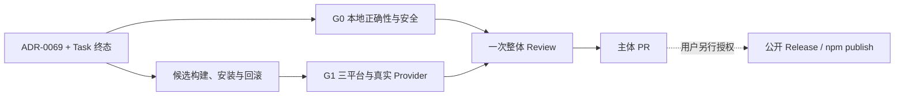

# Kite Code 单维护者开源首发路线图

状态：archived
创建：2026-07-29
修订：2026-08-04
完成：2026-08-04
优先级：P0
权威决策：ADR-0068、ADR-0069
Task 状态：`release/oss-first-release/task-status.json`
完成记录：[`2026-08-04-single-maintainer-open-source-first-release.md`](../execution/completed/2026-08-04-single-maintainer-open-source-first-release.md)

## 目标

交付一个可由单人维护、可在 macOS、Linux 和 Windows 上安装运行的首个开源 TUI/CLI 候选版本。
上线标准是本地正确性、核心安全边界、普通 GitHub-hosted 跨平台 CI、可安装制品和两条真实模型
最小调用，不建设企业发布 authority、托管执行服务或多租户平台。

## 当前基线

Phase 0、1A、1B、1C 与 2A Foundation 的历史实现和完成证据保留。Release schema、Gate、verifier、
workflow、Runtime fault/soak、Compaction、Verification、MCP write 与 Skills 的本地 fail-closed 控制面
继续使用。旧 milestone、OIDC/Sigstore/attestation registry、external rollout 和 promotion 窗口已经
移出当前及后续路线图。

108 个历史 Task 已按 ADR-0069 收敛为终态：

| 状态 | 数量 | 首发含义 |
| --- | ---: | --- |
| `completed` | 83 | 首发必须完成；以本地实现、定向测试、G0/G1 和最终整体验证收口 |
| `superseded` | 25 | 旧认证、external participant、运营资格、rollout/promotion、Auto Compaction 和 enterprise GA 路线已被取代 |
| 合计 | 108 | 每个 ID 在状态注册表中精确出现一次 |

当前为 0 optional，且不存在 pending 或 in-progress Task。该分类不把缺失的外部证据登记为通过；`superseded`
表示不再实施，不表示对应外部事实已经发生。

## 首发 Gate

### G0：本地正确性与安全

- 核心、Runtime fault/soak、TUI system、typecheck、format、lint、core boundary 和文档门禁通过；
- secret 不进入日志、模型正文、artifact 或 Git；
- Workspace 越界、未知 external effect、network、MCP write 和 destructive 操作 fail closed；
- capability profile 不扩大 embedded ceiling，测试失败不转换为成功；
- 已知 P0/P1 为零；P2 已修复或记录明确处置；
- install、uninstall、rollback 基本流程通过真实候选包 smoke。

### G1：普通发布验证

- GitHub-hosted `macos-15`、`ubuntu-24.04`、`windows-2025` 构建、安装、启动通过；
- manifest、逐文件 checksum 与 archive checksum 可独立重建；
- CLI help/version 与 TUI version/startup smoke 通过；
- DeepSeek `deepseek-v4-flash` 和阿里千问 OpenAI-compatible route 各完成一次低成本真实调用；
- release notes、默认关闭能力和已知限制准确。

G0/G1 不要求签名、notarization、SLSA、provenance、SBOM attestation、第三方评审、独立人员、外部
cohort 或长期观察。checksum 只证明完整性，不能表述为来源认证。

## 实施批次

### Batch A：权威范围与状态

新增 ADR-0068/ADR-0069 和 active 首发终态规则；更新本路线图、全部 Phase 子计划、decision register、README、
技术全书与文档映射；让文档门禁验证新的 108 Task 分类，而不是旧企业 milestone。

### Batch B：Release Candidate

实现可重复执行的 Bun 原生编译流程、manifest/checksum、gzip tar、严格 verifier、安全安装器、安装/启动/回滚/
卸载 smoke 和普通维护者检查清单。三平台 workflow 只读源码并上传候选 artifact，不申请 OIDC、
attestation 或发布权限。

### Batch C：Evaluation 与 Operations

保留小规模 adversarial、安全和正确性 case；增加 DeepSeek 与千问 OpenAI-compatible 的显式 opt-in
真实最小 runner。凭据只来自环境变量或本机配置，runner 不记录 prompt/response/key。保留本地结构化
无正文日志、health/status、kill switch、incident runbook 与本地 rehearsal；不建立 external cohort、
长期服务等级/error-budget 或远程运营资格路线。

### Batch D：Phase 4–6 本地收口

保留 Compaction、Verification、MCP write 和 Skills 的本地 conformance、安全 Gate、status 与
adversarial case。capability 默认 off，只有本机用户可显式开启。Auto Compaction 首版不受支持并默认
关闭；旧 rollout/promotion 和 GA authority assembly 已被取代，不形成后续阶段。

### Batch E：统一 Review 与最终验证

所有本地实现共同收敛后只做一次整体 Review，修复 P0/P1 并处置 P2。随后显式执行
`document-before-commit`，运行一次完整验证，创建一个共同收敛提交和一个主体 PR，跟踪三平台 CI。

## 依赖图

公开 Release 和 npm publish 是路线图之外的不可逆动作，未获用户单独授权时不得执行。

## 支持边界

首发支持单个本地 OS 用户、单个已信任 Workspace、前台 TUI 和前台 Headless CLI。Windows、Linux、
macOS 的普通发行兼容性与 effectful execution capability 分开判断；缺少强隔离的平台仍可运行只读/
受限 TUI/CLI，但对应 Shell、writer、MCP write 或 effectful Skill 必须保持关闭。

明确不支持：Web、多租户或共享 SaaS、远程托管 runner、跨设备控制、服务端 credential custody、
无人值守共享 writer 和企业 promotion/authority/attestation 服务。

## 终态与非目标

- 第三方安全评审 Gate、平台签名/notarization、Sigstore、SLSA/provenance 与企业 SBOM attestation；
- external cohort、长期服务等级/error-budget 与分阶段 rollout/promotion；
- Auto Compaction 与 enterprise GA authority/profile assembly；
- 托管 observability、托管执行、多租户或服务端 credential custody。

对应历史 Task 均为 `superseded`，不属于发布后待办。未来产品形态改变时必须新建 RFC/ADR 和 Task，
不得恢复旧 milestone 或把历史 synthetic contract 冒充真实证据。

## 维护者检查

唯一首发检查清单位于 `release/oss-first-release/MAINTAINER_CHECKLIST.md`。它不要求另一身份、签名或
独立审批。检查失败即停止公开发布；修复后重新生成候选并重跑 G0/G1。
