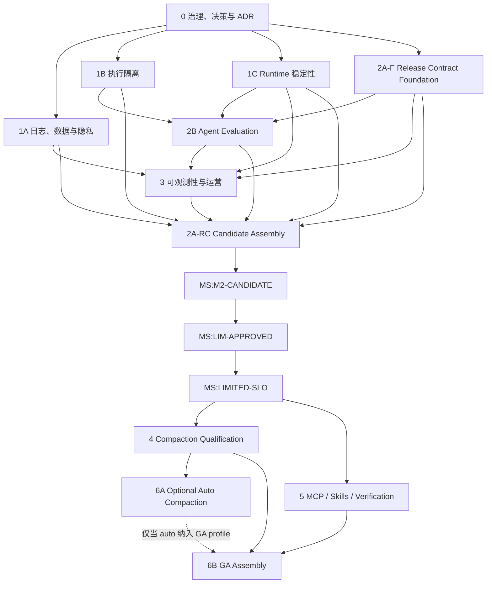

# Agent 生产就绪实施总路线图

状态：active
创建：2026-07-29
优先级：P0
初始论证基线：`410b2c24717ab50f0cd7fe32d54942fa6fca9840`
当前执行复核基线：`dc64d25d67c9e40330676668b5f039872d04269a`（2026-08-02）
依赖：已批准的
[`Agent 生产就绪与渐进发布控制 RFC`](../../design/2026-07-29-agent-production-readiness-rfc.md)
替代：无

## 目标

把已批准 RFC 拆成可独立实施、验证和回滚的工程计划，最终只在证据满足时生成本地单用户
`limited-production` 制品，再逐能力进入 canary 和 GA。

本路线图是所有子计划的统一入口，负责：

1. 固定计划边界和依赖顺序；
2. 定义跨计划共享的数据契约、Gate 和完成证据；
3. 防止某个子计划局部完成后被错误宣传为整体生产就绪；
4. 明确哪些工作可以并行、哪些工作必须串行；
5. 规定计划完成后如何更新 active 文档、ADR、完成记录和发布结论。

2026-07-30 的 Phase 0 artifact 不改变 Phase 0–6 顺序、Task ID、`dependsOn` 或 milestone
producer。它把新 execution binding 的最低 `baselineCommit` 前移到
`4be8735b29ec0fe3951bf7a0876f7b5e722c846a`（或经重新复核的后继提交），并把更早基线的 live
结果降为历史证据。1C.1 已把原 schema v17 基线迁移为带 resource ledger 的 v18；v17→v18
迁移、工具调度、系统/工具契约和默认测试 runner 必须继续进入 1C/2A/2B/3 的实现及 Release
Evidence；不得用本说明把尚未完成的 Task 标为完成。

## 里程碑状态

- `MS:M0`：2026-07-30 已完成，由
  [Phase 0 Task 0.5 完成记录](../execution/completed/2026-07-30-agent-production-governance.md)
  唯一产生；artifact commit 为 `4be8735b29ec0fe3951bf7a0876f7b5e722c846a`。
- Gate 结论仅为 `approved_for_internal_implementation`，不生成 production artifact，也不允许
  external cohort。
- Phase 1A（Task 1A.1–1A.7）已完成，由
  [Task 1A.7 完成记录](../execution/completed/2026-07-30-agent-production-local-data-privacy.md)
  唯一产生 `MS:1A-DONE`。该 milestone 不产生 production-qualified route 或
  production artifact；当前 ProviderDataPolicy approved bundle 仍为空，D-14 批准的 MCP
  route 集合也为空。
- Phase 1B（Task 1B.0–1B.9）已完成。D-04 以空支持集关闭；1B.2/1B.3 的完成结论是三平台候选
  均明确 `excluded`。两路最终整体 Review 均为 GO 且 P0/P1/P2=`0/0/0`；默认分支
  [Execution Boundary Artifact Conformance run 30739946155](https://github.com/ferqx/kite-code/actions/runs/30739946155)
  的三个 negative artifact 经独立 verifier 收口。Task 1B.9 唯一产生 `MS:1B-DONE`；该 milestone
  不产生 production qualification、非空平台支持或可分发制品。证据见
  [Phase 1B 完成记录](../execution/completed/2026-08-02-agent-production-phase-1b.md)。
- Phase 1C（Task 1C.1–1C.8）已完成，并由默认分支 [Ubuntu qualification run 30710906064](https://github.com/ferqx/kite-code/actions/runs/30710906064)
  的正式 artifact 与独立 verifier 收口；Task 1C.8 唯一产生 `MS:1C-DONE`。该 milestone 不生成
  production artifact，其他后续 milestone 仍为 pending。
- D-06 已按 ADR-0062 关闭；2A.0–2A.7 Release Contract Foundation 已由
  `2e98681c800a2f1f745bc18e41ac682d9c09e84b` 与
  [完成记录](../execution/completed/2026-07-30-agent-production-release-control.md)收口，Task 2A.7
  唯一产生 `MS:2A-F`。该结果不包含 G2–G5、真实 signing/attestation、production platform、RC
  或 external release 结论。
- 2A.8、2A.9、2B.1–2B.9、3.1–3.8/3.10 已完成各自本地 fail-closed contract。依赖与整体复核
  满足后，2B.1–2B.3/2B.8 已完成，2B.4/2B.5 保持 `in_progress`；2A.8 仍等待真实供应链/平台
  evidence。D-03、authenticated live route/baseline/attempt、真实人工/incident/SLO evidence 未满足，
  `MS:2B-DONE`、`MS:3-OPS-READY`、`MS:2A-RC` 和 `MS:LIMITED-SLO` 均未产生。
- Phase 4–6 的本地 schema、conformance、profile、selection 与 Gate contract 已提前实现；D-10 已按
  ADR-0064 关闭。4.1–4.3/4.6/4.8 与 5.1/5.2/5A.1/5A.2/5C.1/5C.2/5.4 已完成，4.4 保持
  `in_progress` 等待 authenticated evaluator；其余 Task 按正式依赖保持未绑定。所有
  route/profile/cohort 均 off/empty/0；本地 synthetic/blocked fixture 不产生 manual stable、能力
  stable、GA、canary、maturity 或第三方评审 evidence。
- 整体 Review 发现的 Release 第三方评审/production admission、Limited SLO、D-07、GA/Auto、
  worktree handoff/Git 环境和 workflow pin 问题均已 fail-closed 修复；两路最终复核均为 GO 且
  P0/P1/P2=`0/0/0`。第三方 reviewer trust root 仍为空，本地 external review fixture 不能产生
  approved candidate；该最终复核不替代 external release 前的真实第三方安全评审。

## 首发支持边界

第一份 `limited-production` 制品只支持：

- 单个本地 OS 用户；
- 单个已信任 Workspace；
- 本地 TUI；
- 由同一用户启动、用户在场的前台 Headless CLI；
- 固定 platform、sandbox backend 和 provider route 支持矩阵。

以下形态保持 No-Go，不属于本路线图的交付：

- Web 入口；
- 多租户或共享服务；
- 远程托管 runner；
- 跨设备控制；
- 服务端 credential custody；
- 无人值守 SaaS 或共享 CI writer。

如果实施期间需要扩大该边界，必须暂停对应工作并新增 RFC；不能只在某个子计划中追加任务。

## 子计划

| 顺序 | 计划 | RFC 阶段 | 优先级 | 主要产出 |
| --- | --- | --- | --- | --- |
| 0 | [治理、决策与 ADR](2026-07-29-agent-production-governance-decisions.md) | Phase 0 | P0 | 具名 Owner、14 项决策、ADR、计划契约 |
| 1A | [本地日志、Provider 数据与隐私](2026-07-29-agent-production-local-data-privacy.md) | Phase 1 | P0 | metadata 默认、安全文件、Provider Data Policy |
| 1B | [执行隔离与变更边界](2026-07-29-agent-production-execution-isolation.md) | Phase 1 | P0 | workspace sandbox、network allowlist、protected path、worktree、MCP transport boundary |
| 1C | [Runtime 稳定性、资源预算与故障语义](2026-07-29-agent-production-runtime-resilience.md) | Phase 1 | P0 | 累计预算、有界取消、failure matrix、PTY 稳定 |
| 2A | [Release Profile、制品证据与 Gate](2026-07-29-agent-production-release-control.md) | Phase 2 | P0 | profile、manifest、evidence、artifact、供应链与平台矩阵 |
| 2B | [Agent 任务评估与产品验收](2026-07-29-agent-production-evaluation.md) | Phase 2 | P0 | 版本化任务集、oracle、重复运行、人工验收 |
| 3 | [无正文可观测性与生产运营](2026-07-29-agent-production-observability-operations.md) | Phase 3 | P0 | metrics、告警、kill switch、事故演练、limited cohort SLO |
| 4 | [压缩质量资格与 manual canary](2026-07-29-agent-production-compaction-qualification.md) | Phase 4 | P1 | 离线资格、internal auto 新鲜度、external manual maturity |
| 5 | [MCP、Skills、Verification 分能力发布](2026-07-29-agent-production-capability-rollout.md) | Phase 5 | P1 | 各能力 internal、external canary、beta/stable maturity |
| 6 | [可选 Auto Compaction 与 GA 收敛](2026-07-29-agent-production-ga.md) | Phase 6A/6B | P1 | 可选 Auto maturity、GA capability selection、制品与发布后观察 |

## 依赖图



Phase 1A、1B、1C 和 2A-F 可以在 Phase 0 完成后并行。2B 的 schema/oracle scaffold 可在
2A-F 后开始，但真正执行 fixture/worktree/adversarial case 必须等待 1B/1C；3 在 1A/1C、
2A-F 和 2B 指标契约可用后开始。外部 `limited-production` Gate 必须等待 1A–3 与 2A-RC
全部完成，不能以“后续补指标”或“先发制品再补 sandbox”绕过。

这里不存在计划级循环依赖：2A-F 先交付 profile、detached manifest、evidence/Gate schema
和本地 evaluator；2B 与 3 再按该 contract 产出 task/运营 evidence；2A-RC 最后消费这些
evidence。2B/3 不需要等待 `limited-production` artifact 已经发布。

Phase 4 和 Phase 5 的离线实现可以提前准备，但所有 external canary Task 必须同时等待
`MS:LIM-APPROVED` 和 `MS:LIMITED-SLO`。两者可以并行，但每次只允许一个尚未 stable 的
高风险 capability 首次进入同一 cohort。Phase 6A 是可选 Auto Compaction rollout；
Phase 6B 只要求拟进入 GA profile 的 capability 具备独立 stable evidence。未纳入 GA 的
Auto、MCP 或 Skill capability 可以保持 off，不阻塞基础 GA。

## Task 激活协议

计划文档使用 `draft | active | blocked | completed | archived | superseded` 表达
`PlanLifecycleState`；其中 plan `blocked` 表示整个计划受外部依赖阻断。Task 尚无 execution
binding 时，其 `TaskReadiness` 由 `dependsOn` 计算为 `blocked | ready`，与 plan lifecycle
是两个独立字段；`blocked_on_M0` 只是 readiness reason，不是 lifecycle/status 枚举。
Phase 0 Task 按自身依赖激活；所有非 Phase 0 Task 在 `MS:M0` 前保持未绑定且 readiness 为
`blocked`。

Task readiness 变为 `ready`、准备实际开始时，decision register 才新增 execution binding：

```typescript
interface TaskExecutionBinding {
  taskId: string;
  executor: string;
  baselineCommit: string;
  branch: string;
  status: 'ready' | 'in_progress' | 'blocked' | 'completed';
  blockedReason?: string;
  completionRecordPath: string;
  activatedAt: string;
}
```

- `executor` 使用可审计 identity，不在计划中虚构个人；single-maintainer 模式不得把维护者的
  另一个账号伪装成 backup；
- branch/commit 必须在实际工作开始时绑定，不能预写不存在的引用；
- 每次只能激活所有 `dependsOn` 已满足的 Task；
- 实现偏离矩阵时先更新计划/ADR，再继续代码；
- 没有 binding 的 Task 不进入执行状态；已经开始后才可使用 binding 中的 `blocked`；
- M0 只要求协议、依赖注册表和下一批即将启动 Task 的 binding，不要求预先绑定 Phase 4–6。

### 稳定依赖引用

`dependsOn` 只允许以下可解析形式：

- 无前置依赖：`—`；
- 同一计划 Task：裸 Task ID，例如 `1A.3`；
- 跨计划 Task：`T:<plan>:<task>`，例如 `T:1C:1C.4`；
- 已关闭决策：`D-01:CLOSED` 至 `D-14:CLOSED`；
- milestone/Gate：下表中的稳定 ID。

范围表达式 `1A–1C`、`3 SLO`、`Phase 0 platform decision`、`framework`、`boundaries` 等自然
语言不得出现在 `dependsOn` 单元格。多个依赖全部使用逗号列出，区间仅允许同一计划的明确
Task 区间。

| 稳定 ID | 唯一 producer |
| --- | --- |
| `MS:M0` | Task 0.5 Phase 0 评审记录 |
| `MS:1A-DONE` | Task 1A.7 完成记录 |
| `MS:1B-DONE` | Task 1B.9 完成记录 |
| `MS:1C-DONE` | Task 1C.8 完成记录 |
| `MS:2A-F` | Task 2A.7 foundation Gate |
| `MS:2B-DONE` | Task 2B.10 完成记录 |
| `MS:3-OPS-READY` | Task 3.9 运营就绪记录 |
| `MS:2A-RC` | Task 2A.11 RC Gate |
| `MS:M2-CANDIDATE` | M2 candidate Gate |
| `MS:LIM-APPROVED` | M2 后人工发布评审记录；single-maintainer 模式必须包含独立第三方安全评审 |
| `MS:LIMITED-SLO` | Task 3.10 limited cohort SLO Gate |
| `MS:4-INTERNAL-AUTO-FRESH` | Task 4.9 internal rollout evidence |
| `MS:4-MANUAL-STABLE` | Task 4.11 manual maturity Gate |
| `MS:5A-STABLE` | Task 5A.5 Verification maturity Gate |
| `MS:5B-STABLE` | Task 5B.6 MCP write maturity Gate |
| `MS:5C-READONLY-STABLE` | Task 5C.5 readonly Skill maturity Gate |
| `MS:5C-EFFECTFUL-STABLE` | Task 5C.8 effectful Skill maturity Gate |
| `MS:6A-AUTO-STABLE` | Task 6A.4 Auto maturity Gate |

## 共享契约

### 1. Release identity

所有测试和 canary 证据必须绑定：

- commit、payload digest 与 detached manifest digest；
- Release Profile digest；
- agent contract digest；
- model-visible Tool Registry digest；
- default config digest；
- Provider Data Policy digest；
- Runtime scheduling policy digest；
- Gate policy 与 build recipe digest，其中 build recipe 绑定默认测试入口和隔离测试清单；
- Runtime schema version；
- task/compaction suite、scorer 和 route identity。

这些字段由 2A 计划提供规范实现。2A 完成前，其他计划可以产出原型报告，但不能形成
production Release Evidence。

### 2. 统一终态

所有入口必须区分：

- `completed`；
- `blocked`；
- `failed`；
- `unknown`；
- `cancelled`；
- `cancel_incomplete`；
- `budget_exhausted`；
- `resource_saturated`；
- `verification_failed`；
- `verification_inconclusive`。

模型 final、Plan completed 或进程正常退出都不能单独转换为 `completed`。统一语义由 1C
落地，2A Gate 与 2B task oracle 消费。

### 3. 内容边界

- 本地生产日志默认 metadata；
- 远程 telemetry 只发送 allowlist 元数据；
- 模型 Provider、每个远程 MCP 和 secondary evaluator 是三个独立接收方；
- credential、secret 和受保护路径不得因 endpoint allowlist 自动外发；
- 真实用户正文默认不得进入 benchmark 或人工 review。

1A 提供 schema 和 mapper；2A 把 policy digest 绑定制品；3 只消费无正文 mapper。

### 4. 执行与并发边界

- 父/子 Agent 共用 `maxConcurrentToolInvocations` 与
  `maxConcurrentShellInvocations`，项目、用户和 CLI 只能收紧；
- parallel read batch 与 shell sibling overlap 中的每个 invocation 分别原子占用预算，
  scheduler 常量不是 Release Profile；
- shell invocation permit 只统计顶层调用；每个调用的完整 process tree 另受
  `maxProcessTreeSizePerShellInvocation` 平台强制上限约束；
- permit 等待使用有界的按资源 FIFO；shell 的 tool + shell invocation permit 必须同事务
  全有或全无，不能部分占用；超时是 `resource_saturated`，run deadline 到期仍是
  `budget_exhausted`，清理不完整为 `cancel_incomplete`；
- 每个并发网络/MCP 调用独立执行 network boundary、egress permit、revision 和 receipt
  检查，不能共享前一个 sibling 的允许结果；
- 取消、审批拒绝或 terminal outcome 后不再启动未 dispatch sibling；运行中 child 有界
  清理，late event 不改变 durable terminal。
- `auto` 不替代 sandbox、network、protected path 或 worktree；
- sandbox/allowlist/worktree controller 不可用时按统一 failure matrix 降级；
- 后台、并发、定时和委派 writer 不得回退到共享 checkout；
- push、PR、merge、deploy 等外部边界继续经过既有授权和 Verification。

1B 提供技术边界，1C 提供失败终态，2B 提供 adversarial task 验收。

1C 同时导出唯一的 `RuntimeSchedulingPolicyV1` canonical snapshot；2A 只对实际打包 snapshot
做 canonical serialize、digest 和 artifact smoke 比对，不复制 scheduler allowlist 或取消
语义。

## 里程碑与 Gate

### M0：设计执行入口建立

完成条件：

- Phase 0 的 Owner、真实 backup 或显式 `none (single-maintainer)` 和决策记录建立；
- 必要 ADR 已接受；
- 各子计划的边界、依赖和验证命令获得确认；
- 未决项有到期 milestone，默认值为最严格配置。

未完成 M0 不得开始会改变生产行为的实现。

### M1：内部安全 dogfood

完成条件：

- 1A、1B、1C 的安全行为已在 internal profile 生效；
- Required CI 无失败和 Runtime warning；
- Skills、MCP write、Verification 完成声称、manual/auto compaction 对普通用户关闭；
- TUI/CLI 能展示 effective profile、sandbox、network、logging 和验证状态。

M1 只授权团队内部 dogfood，不产生外部发布结论。

### M2：本地单用户 limited candidate

完成条件：

- 1A–3 全部完成；
- 2A-RC 生成真实 payload/detached manifest/evidence；
- 2B 任务集达到预先批准的 limited 门槛；
- 所有声明支持的 platform/backend 目标组合 artifact smoke 通过；未支持平台必须明确排除，
  不能用其他平台结果替代；
- rollback 和事故 runbook 演练通过；
- 所有适用 G0–G4 通过且无普通 waiver。

M2 只产生 `MS:M2-CANDIDATE`，允许提交 `limited-production` 人工发布评审。该评审验证
artifact identity、Owner、支持矩阵、已知限制和 cohort 联系方式；single-maintainer 模式还
必须包含由不同真人完成的第三方安全评审，绑定 candidate payload/manifest/profile、平台、
route、安全边界和 findings。维护者不能自批 G0 例外。完整批准记录产生
`MS:LIM-APPROVED`；没有该记录不得进入任何 external cohort。

### M2.5：Limited SLO 资格

完成条件：

- `MS:LIM-APPROVED` 已产生；
- 只运行 limited 基础能力，不混入尚未 stable 的新高风险 capability；
- Task 3.10 达到预注册样本量、观察窗口和 error budget；
- 无 G0/G1，数据缺失不按绿色处理。

通过后产生 `MS:LIMITED-SLO`。

### M3：单能力 canary

完成条件：

- `MS:LIM-APPROVED` 和 `MS:LIMITED-SLO` 均已满足；
- 4 或 5 中一个 capability 的 G3 通过；
- capability 有独立 kill switch、dashboard 和 rollback；
- canary 用户得到实验提示和退出方式。

### M4：GA

完成条件：

- 6B 的全部 Gate 通过；6A 仅在 Auto Compaction 纳入 GA profile 时为前置；
- 所有公开为 stable/general 的能力都有 L5 证据；
- 发布说明、支持矩阵、升级/回滚和用户恢复入口准确；
- 无未关闭 G0/G1、无到期未决决策、无 Owner 空缺。

## 跨计划验证

每个 PR 运行其子计划列出的定向测试，并至少运行：

```bash
bun run typecheck
bun run format:check
bun run lint
bun run check:core-boundary
bun run check:docs-impact
bun run check:docs
bun run test
```

触及 Runtime、TUI、MCP、真实 Provider 或发布制品时，再按子计划运行对应 E2E、PTY、live 和
artifact smoke。真实 Provider 测试保持显式 opt-in，不并入默认 `bun test`。

在 stage、commit、push 或 PR 前必须执行项目 `document-before-commit` Skill；如果
`check:docs-impact` 未通过，当前子计划不得标记完成。

## 文档收敛规则

每个子计划完成时：

1. 更新受影响的 `docs/active/`、根文档、`docs/book/` 和
   `docs/documentation-map.json`；
2. 新增或接受对应 ADR，不能改写既有 accepted ADR 的历史结论；
3. 在 `docs/space/execution/completed/` 创建具备命令、结果、制品和限制的完成记录；
4. 把子计划状态更新为 `archived` 并更新 `plans/index.md`；
5. 未完成项进入 backlog，不把部分完成表述为整个 Phase 完成；
6. 更新本路线图的里程碑状态和下一 Gate。

## 回滚

- 优先关闭单个 Release Capability；
- 再把 canary cohort 置 0；
- 再回退 embedded Release Profile；
- 最后回退 artifact；
- 不删除 transcript、Plan、Receipt、Verification 或 checkpoint；
- 不把新安全门禁回滚为旧的不安全路径；
- 外部副作用终态未知时进入 reconciliation，不宣称已撤销。

## 风险

| 风险 | 控制 |
| --- | --- |
| 子计划并行导致 schema 漂移 | Phase 0 冻结共享契约；2A conformance 校验 digest |
| 安全 P0 被发布工程抢跑 | M2 明确依赖 1A–3 全部完成 |
| 旧遥测计划被误执行 | 新 3 计划明确 supersede，并更新注册表和旧文件状态 |
| 为赶进度扩大首发拓扑 | 任何 Web/hosted/multi-tenant 请求先新增 RFC |
| 测试结果未绑定真实制品 | 2A Gate 先校验 identity/digest，再读取结论 |
| 模型任务只保留最好结果 | 2B 强制重复运行、分布和 failure taxonomy |
| capability 同时 canary 难以归因 | M3 一次只首次放行一个高风险能力 |

## 验收条件

- M4 通过；
- 所有子计划已归档并有完成记录；
- 当前行为完全收敛到 active 文档和 accepted ADR；
- RFC 的需求—设计—证据追踪表每行都能定位到实际 evidence、Gate、Owner 和 rollback；
- 对外支持边界与真实实现、制品、文档和运营值班一致。
