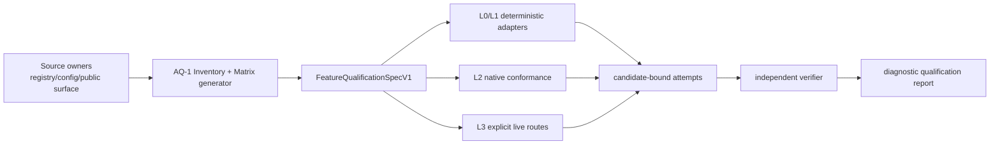

# Kite Code Agent 发布资格化实施方案

- 状态：`active`
- 创建：2026-08-05
- 优先级：P0
- 设计依据：[Agent 发布资格化 RFC](../../design/2026-08-05-agent-release-qualification-rfc.md)（accepted）
- 当前发布边界：[`open-source-first-release.md`](../../active/open-source-first-release.md)、ADR-0068、ADR-0069

> 本方案把已接受 RFC 转换为可验证的实施顺序；它本身不改变当前 G0/G1，也不重新启用
> dogfood、canary、maturity promotion 或 Auto Compaction 的默认支持。`AQ-0` 只允许形成 ADR；AQ-1–AQ-8、
> AQ-9A/AQ-9B 与 AQ-10 的实现、CI 或 current 行为文档变更，须在 ADR-0070 状态为 `accepted`、ADR 注册表已
> 更新且必填治理决策完整后开始。
> 该 ADR 只能追加/替代历史决定，不能改写 ADR-0068/0069 的历史结论。

> **执行分支调整（2026-08-06）：** 现有 `Required` workflow 继续只交付无 Provider secret 的 deterministic
> Agent scenario validation。维护者随后授权 ADR-0072：在 GitHub-hosted Actions 的手动、protected-main、Environment-secret
> workflow 中运行一组低频真实 Agent diagnostic cases。该分支只产生 public-safe
> `GitHubActions*Diagnostic*ReportV1`，没有 artifact、ledger、retained evidence、release/G0/G1 或 production-content
> authority；未实际运行时只能报告 preflight/contract 状态。ADR-0071 的 formal
> `LiveCompatibilityObservationV1`、persistent-supervisor 和 `activation=false` 则完全保持不变。
>
> 因此本计划有两个不能互相替代的末端：ADR-0072 的 GitHub Actions 真实诊断分支按
> `AQ-8 → AQ-9A → AQ-9B → AQ-10` 完成 report/workflow/aggregate；ADR-0071 的 formal retained-observation
> 分支仍因 Linux control plane、native isolation 和 deletion proof 而 `blocked`。前者不宣称后者已经完成，后者也不能
> 阻塞已授权的 public-safe 评估。

执行状态：AQ-0 已完成：ADR-0070 已通过独立架构/治理/安全复审并标记为 `accepted`，ADR 注册表已同步。
AQ-1 已完成并通过独立终审：source-owned Matrix、symbol-level default-off binding、正向 structural assertion、
文档映射和 diagnostic/G0/G1 隔离已收敛。AQ-2 已完成并通过独立架构/治理/安全复审：独立 evidence/observation
schema、跨平台 closure、可信 execution set、day/month reservation/retention witness 与 diagnostic-only verifier
均已收敛，release parser/bundle/gate 输入均显式拒绝。AQ-3 现在可以按本计划继续；任何后续 AQ 仍必须遵守其
显式依赖和同 Task 文档门禁。AQ-3 已完成并通过独立架构/治理/安全复审：四个 exact product-owned L0 pair、sealed
corpus self-check、receipt source-binding closure、shared metadata guard 与 source-owned Sentinel V1 均已收敛；当前
十条 Sentinel 行因尚无 L1 receipt 而明确保持 `blocked`，没有任何发布或 production admission 结论。AQ-4 已完成并
通过独立架构与安全一致性复审：Tool/Approval/Verification L1、独立 CLI/TUI projection receipt 与 source-owned
Sentinel V2 均保持 diagnostic-only；specialized verifier 精确锁定各自 synthetic fixture/runner，V2 的 `observed`
只能由三个 candidate-bound source-owned verifier 重建，CLI projection 也已从 config/release-heavy bootstrap 拆入纯
projection 模块。AQ-5 已完成：六个 sealed Skill/MCP source-owned L1 pair、独立 receipt/verifier 与
candidate-bound Sentinel V2 input v2 均已收敛；V1 保持 AQ-3/AQ-4 的兼容语义与 blocked 边界，V2 仅将 journey
3–6 的精确 diagnostic closure 标为 observed。完整 CLI/TUI end-to-end entrypoint 尚未暴露的地方显式保留
`entrypoint_not_exposed`，局部 `provider.action_required` TUI prompt 不代替 J6 的 login/new-turn 证据。AQ-6 已完成：
七个 sealed Subagent/Runtime recovery pair、独立 `L1SubagentRecoveryReceiptV1` verifier 与保留 v1/v2
reconstruction 的 Sentinel V3 input 均已收敛；J7–J9 的 CLI/TUI N/A 仅来自 source-owned public-surface collector，
J10 则以独立的真实 TUI `/rewind` projection receipt 覆盖。所有状态仍为 diagnostic-only，不能借用 AQ-5 receipt、
V2 record 或放宽 source/execution/candidate 绑定，更不进入 G0/G1 或 production content admission。
AQ-7 已完成：L2 source-owned target/capability corpus、独立 local platform projection、archive marker closure、
blocked governance-preflight transport、narrow receipt verifier、feature-matrix scoped N/A 与 current docs/map 已收敛。
当前受保护 CI 没有可审计的 atomic control plane，因此它只输出 metadata-only
`blocked/protected_ci_governance_control_plane_unavailable` transport；不会 build/probe/smoke，也不会产生 L2
positive receipt、aggregate evidence、production support 或任何发布准入结论。该 local projection 不输入、extend 或
模拟既有 platform-capability evidence/parser/verifier，generic qualification verifier 仍拒绝 GitHub execution。
AQ-8 的 route declaration、owner-only ledger schema、最小 observation schema/source registry/specialized verifier、source-byte closure、fixed child transport、output guard 与本地安全 contract 均已落地。ADR-0071 的静态 Linux deployment declaration，以及 manifest、nonce-digest-bound canonical-Ed25519-SPKI attestation、root-private atomic `LiveScratchSupervisorNonceConsumptionV1` / complete nonce-scope index、pre-allocation commitment 与 signed lifecycle-receipt 的 metadata-only schema 也已落地；私钥 PEM 和 endpoint/path/content-shaped ID 均拒绝，所有可变 ID 必须是服务/ledger 生成的 L3 UUIDv4 opaque token。index 必须签名地声明恰一个 nonce consumption/一个 allocation，receipt 只绑定其 digest。commitment journal sequence 必须直接续接 consumption，满足 `committedAt < allocatedAt < attestation.expiresAt`；normal exit 的 reaping/scrub/delete 从 worker exit 起一秒内完成，crash deadline 为 86,400 秒。binding 还精确固定 ADR-0070 `ephemeral_local` profile ID/digest、retention/storage/audit/authorizer、quota ledger/retention witness 与 owner-only projection-policy digest，terminal receipt 另绑定 owner-only projection digest。所有记录严格绑定 candidate/execution、Matrix/suite/oracle/corpus/evaluator/verifier/runner、governance/policy、worker/service epoch、reservation/lease/journal/scratch handle digest，且不安装或模拟 service。AQ-8 **仍不能标为完成**：当前 `liveScratchSupervisorActivationIsImplementedV1()` 是 checked-in `false`，公共入口在读取 environment/ledger 或创建 resolver、reservation、lease、scratch/child 前安全阻断。health record 只验证 future wire shape/freshness，绝不是 durable deletion、authorization 或 supervisor identity；schema 的 crypto chain 也不能自行发现 root-protected host manifest/key、验证 Linux native isolation、process reaping、atomic index、owner-only projection 或实际 deletion proof。ADR-0071 已接受受保护 supervisor 的授权边界，但实际 root-owned control plane、Linux native probe、crash/normal-exit deletion proof、负向隔离 contract 与 AQ-8 review 仍未实现；任何 opt-in 或 writable ledger health JSON 都不能激活 L3。

ADR-0071 的 **formal AQ-8 capability** 继续保持 **blocked / safe-disabled**，未执行真实 L3 调用，也没有
compatibility 或发布结论。2026-08-06 维护者已授权受保护 Linux root-owned systemd service、native helper 与 immutable
worker bundle 的范围；独立架构/治理/安全审阅确认，原先设想的 local-owner health/ledger 或 detached process 不能满足
service identity、86,400 秒 retention、实际 deletion proof 与 workspace OS isolation。ADR-0071 acceptance 只批准架构，**不**
部署/启动 service 或改变 activation。

ADR-0072 的 GitHub Actions AQ-8 分支已完成独立架构/治理/安全复审并被接受：它以独立 public-safe real-Agent report 取代此分支
所需的 retained observation，不能产生 formal L3 evidence。AQ-9A 的零网络 L1 failure contract 已在 AQ-8 之后重新验收完成；
AQ-9B 的 real success/cancel runner、AQ-10 aggregate 与 workflow 接线均已完成最终独立架构/治理/安全复审并被接受；尚未实际
dispatch 真实 Provider。
这不是对 formal AQ-8/AQ-9B 的完成声明，也不改变 G0/G1。

## 当前工作树复审记录（2026-08-06）

下表保存本次集成后的可复现复审依据。它不以本地绿色测试替代真实 L3、native platform 或 release
admission 结论；AQ-8 的 formal status 仍以 implementation/proof 分支为准。

| 检查点 | 独立复审范围 | 可复现依据 | 结论 |
| --- | --- | --- | --- |
| AQ-0 | ADR / 架构 / 治理 current-tree re-audit | ADR-0070、ADR registry、governance profile strict schema、`feature-matrix` / `evidence` / release-negative suites | `accepted` 仍成立；G0/G1 与 ADR-0068/0069 历史结论未改写。 |
| AQ-2 | diagnostic evidence / release-isolation current-tree re-audit | candidate/execution/governance/retention mutation tests、release parser/bundle/gate negative tests，以及 qualification metafile import audit | schema/verifier 在 diagnostic scope 内通过；不证明 persistent ledger 或 live deletion 已部署。 |
| AQ-8 | formal 和 ADR-0072 分支的架构/治理/安全一致性复审 | formal source-byte/transport contracts；ADR-0072 workflow、public-safe report、sealed tool surface、secret boundary、negative verifier tests | ADR-0071 **formal AQ-8 仍 blocked**；ADR-0072 real-Agent branch 已通过独立复审并 accepted，尚未实际运行真实 Provider。 |
| AQ-9A | L1 failure contract ordered re-validation | `auto-compaction-failure-contract` 与 `context-compaction-auto` 的 source-owned failure/next-turn retry suites | `completed`：仅 deterministic、零网络的 AQ-9A 前置已在 ADR-0072 AQ-8 review 后重验；不完成或解除 formal L3。 |
| AQ-9B | public-safe success/cancel runner 的安全一致性复审 | opaque lease、captured-fetch acknowledgement、8,192 in-memory threshold、60 秒 hard race、late-fetch denial、success/cancel contract tests | `accepted`：ADR-0072 runner 只产出独立 diagnostic report；没有实际 manual live dispatch。 |
| AQ-10 | aggregate/workflow 的架构、治理与安全一致性复审 | fixed three-case child identity、one-shot `2 + 2 + 1`/5 cap、180 秒 suite cap、release-negative tests、workflow/docs/ADR audit | `completed for ADR-0072 public-safe branch`；未实际 dispatch 时只能报告 local/preflight 或 `blocked`，不得用 aggregate/report 或文档汇总补偿前序依赖。 |

## 目标

建立一条可审计的 Agent 资格化证据链：有限公开 surface 由 source owner 登记，生成 Matrix；各层
测试产出与候选制品、执行身份、适用 scope 和评测器绑定的 attempt；独立 verifier 只对同一候选的完整
证据派生报告。它补充“单一任务成功率即可代表发布质量”的评估模型，但在本计划范围内只产生诊断和
兼容性结论，不取代当前首发 Gate。

完成后的最小成果是：

1. 可由 CI 生成和校验的 Feature Matrix，而不是第二份人工维护的产品清单；
2. 可重建、不可跨 candidate 拼接的资格化 evidence/verifier；
3. L0/L1/L2/L3 分层适配现有测试资产，优先补 P0/P1 的确定性缺口；
4. 显式、无密钥的 live route declaration 与本机 opt-in runner；
5. 保留模型真实 context capability 的低阈值自动压缩 live runner；
6. 明确的报告、保留、隐私、CI 和未来 Gate-promotion 边界。

## 已冻结的实施边界

| 主题 | 本计划的决定 |
| --- | --- |
| 当前发布 | G0/G1 继续是唯一当前首发判断；本计划的报告默认 `diagnostic`、非发布证据。现有 G1 的 DeepSeek 与 Qwen `qwen3.6-flash` 单次 smoke 保持原义；AQ L3 即使使用同一 Qwen route，也只是不同 identity 的 diagnostic compatibility evidence，不能满足、替代、削弱或扩大 G0/G1，也不形成 production content admission。 |
| 旧路线 | 不重启 `release/oss-first-release/task-status-v2.json` 中 25 个 `superseded` Task，不复用旧 milestone。 |
| Matrix | 由 registry、config schema、公开 CLI/TUI surface、release profile 和 active contract 生成；source owner 仍是权威。 |
| 证据 | 仅复用 `ReleaseArtifactIdentityV1`、`ReleaseEvidenceExecutionIdentityV1` 与 canonical digest primitives；独立 diagnostic closure 可汇总不同平台 job，但每条 attempt 必须绑定同一 candidate、自己的受信 execution 和完整 scope。它不扩展或模拟 `ReleaseEvidenceV1`/其 identity 语义。 |
| 真实 Provider | DeepSeek、Qwen `qwen3.6-flash`、OpenCode Go 均以显式 `routeId` 测量；非当前已批准 route 不获得 production content admission。 |
| 自动压缩 | 不改变用户配置或 feature 默认值；AQ-9B runner 不读取、设置或推断 `contextWindowTokens`，并仅在内存中使用 8,192 token 绝对触发阈值。 |
| Reserve/Dogfood | 私有 reserve、dogfood 和任何 Gate authority 不在本计划的实现范围；需要私有环境和新的明确 ADR 后另立计划。 |
| 数据与凭据 | 默认 metadata-only；不记录 key、完整 endpoint、prompt/response/reasoning、文件正文、完整命令或工作区绝对路径。 |

## 目标架构与 source ownership



实现中的边界如下：

- `scripts/evals/contracts/` 拥有独立的 qualification diagnostic schema、canonical digest 和 verifier contract；
  它只复用 `ReleaseArtifactIdentityV1`、`ReleaseEvidenceExecutionIdentityV1` 和 digest primitives，**不得**
  extend `ReleaseEvidenceV1`、其 G0–G5 vocabulary 或 gate evaluator，也不能复制一份 candidate SHA 模型。
- `release/qualification/` 只保存无密钥的 declaration、schema snapshot 与可生成的 report input；不得
  存放 Provider key、真实 request/response 或 private reserve case。
- `tests/evals/qualification/` 只放 deterministic fixture、good/bad/mutation corpus 与 adapter test。
- `tests/e2e/live/model/*.live.ts` 只放显式 opt-in 的真实模型 runner；默认 `bun test` 永不发现它们。
- Matrix 是 generator 的产物。修改公开 surface 后，source owner 必须同时更新其 source reference 或让
  generator 拒绝未映射项；不能编辑生成结果来补绿。

## 实施前置与决策检查点

`AQ-0` 是其余所有实现的硬依赖。ADR 必须把以下决定写成可审核结论：

1. ADR-0070 必须为 `accepted`，本阶段是对 G0/G1 的诊断性增强，而不是替代 Gate；
2. F0–F6 仅为未来语义，不产生当前 `qualified-for-release`；
3. 新证据模型扩展 ADR-0052，不形成平行 release identity；
4. Qwen/OpenCode 是实验性 compatibility route；现有 provider data policy 不扩大；
5. Auto Compaction 仅增加 evaluation runner，不重新 admission 产品能力；
6. private reserve/dogfood 的 owner、ACL、轮换和外发规则未就绪前保持 out of scope；
7. 带 secret 的 workflow 只在受保护、已审查 ref 的固定 evaluator 上运行，候选代码/fixture 不接触 secret；
8. `EvidenceGovernanceProfileV1` 的 retention/deletion、ACL/encryption、容量与 token/attempt/time/cost 上限、
   超额=`blocked`、Issue default-deny 与维护者授权；
9. sealed synthetic input root、固定受审 ref、allowlist env；Provider key 不继承至 Tool/Skill/MCP/Subagent/
   不受信 stdio MCP，也不允许读取 workspace/project/session 内容。

若其中任何一项未通过，后续 Task 必须停在 `blocked`，而不是以更宽松的脚本或假 evidence 继续。

## 任务执行矩阵

| Task | dependsOn | 文件/产出 | 定向验证 | 迁移与回滚 |
| --- | --- | --- | --- | --- |
| `AQ-0` | accepted RFC | `ADR-0070 (accepted)`、ADR 注册表、完整治理记录 | `bun run check:docs`、`bun run check:docs-impact` | ADR 为 `draft`/`proposed` 或有开放必填决策时，后续一律 `blocked` |
| `AQ-1` | `AQ-0 (ADR-0070 accepted)` | Feature spec/condition schema、source manifest、Matrix generator、map rule 与 fixtures | `bun test tests/evals/qualification/feature-matrix.test.ts`、`bun run check:docs-impact` | generator 可删除；source owner 不变；不把 Matrix 当手工真相源 |
| `AQ-2` | `AQ-1` | diagnostic attempt/observation、跨平台 candidate artifact closure、governance profile、canonical digest、独立 verifier | `bun test tests/evals/qualification/evidence.test.ts`、`bun run check:docs-impact` | 新 schema versioned；身份不匹配的旧 receipt 一律不计入 |
| `AQ-3` | `AQ-1`、`AQ-2` | L0 adapter、Good/Bad/mutation corpus、evaluator report、journey map | `bun test tests/evals/qualification/contract-adapter.test.ts tests/evals/qualification/evaluator.test.ts`、`bun run check:docs-impact` | adapter 失效时报告 `blocked`，不降低断言或删除 negative case |
| `AQ-4` | `AQ-2`、`AQ-3` | Tool/Approval/Verification 的 L1 scripted-runtime slice、journey 1–2、per-receipt suite provenance 的 Sentinel V2 | `bun test tests/evals/qualification/runtime-tool-verification.test.ts`、`bun run check:docs-impact` | 只新增 deterministic harness；失败不改变 Runtime policy |
| `AQ-5` | `AQ-2`、`AQ-3` | Skills/MCP 的 L1 revision/effect/recovery slice、journey 3–6 | `bun test tests/evals/qualification/runtime-skill-mcp.test.ts`、`bun run check:docs-impact` | 不迁移足够的既有测试；缺口以 Feature `blocked` 披露 |
| `AQ-6` | `AQ-2`、`AQ-3` | Subagent/Runtime cancel-resume/crash cut-point L1 slice、journey 7–10 | `bun test tests/evals/qualification/runtime-subagent-recovery.test.ts`、`bun run check:docs-impact` | 失败保持 fail-closed；不把 unknown effect 自动成功化 |
| `AQ-7` | `AQ-1`、`AQ-2` | L2 local platform-projection adapter、candidate artifact receipt、blocked CI transport、map rule/current docs | `bun test tests/evals/qualification/native-conformance.test.ts tests/evals/qualification/l2-*.test.ts`、`bun run check:docs-impact` | 按 `platform × capability` 降为 `verified_disabled`/`unsupported`，不宣称全局 PASS；当前 CI 仅产出 blocked transport |
| `AQ-8` | `AQ-0 (ADR-0070 accepted)`、`AQ-1`、`AQ-2` | ADR-0071 formal sealed L3 contract（safe-disabled）以及 ADR-0072 GitHub Actions public-safe `runRuntimeAgent` report/workflow、map/current docs | formal: `bun test tests/evals/qualification/live-route-resolver.test.ts tests/test-discovery.test.ts`; GHA: `bun test tests/evals/qualification/github-actions-agent-evaluation.test.ts tests/evals/qualification/github-actions-agent-evaluation-workflow.test.ts`; `bun run check:docs-impact` | 关闭 GitHub workflow/Environment secret 即停止 real diagnostic；不改普通配置、G0/G1 或 formal activation |
| `AQ-9A` | ADR-0072 `AQ-8` review closed | L1 auto-compaction summary/provider/provider-network failure contract、source-owned receipt/verifier、map/current docs | `bun test tests/evals/qualification/auto-compaction-failure-contract.test.ts tests/runtime/context-compaction-auto.test.ts`、`bun run check:docs-impact` | 删除 diagnostic contract 不改变产品 flag/context window |
| `AQ-9B` | ADR-0072 `AQ-8`、`AQ-9A` | independent GitHub Actions real auto-compaction success/client-abort report、policy/corpus/oracle identity、map/current docs | new public-safe runner tests、`bun run check:docs-impact` | 删除 runner 或关闭 Environment secret 即停止；不改 formal wrapper/product flag/context window |
| `AQ-10` | ADR-0072 `AQ-1`–`AQ-9B` | same-job public-safe aggregate、CI diagnostic integration、README/book 汇总、完成记录模板 | `bun run check:docs-impact`、`bun run check:docs`、`bun run typecheck`、定向 suites | CI 只撤回 diagnostic job；G0/G1、release profile 和 candidate workflow 保持原状 |

## 执行分支与 fail-closed 决策

本节把任务表中的依赖、状态和回滚展开为可审计的分支设计。它定义的是本方案的**目标实现
契约**，不是对尚未实现的 current behavior 的声明。每个 `continue`、`blocked`、`unsupported`、
`not_applicable` 或 `failed` 分支都必须留下仅含 metadata 的记录：Task/Feature/attempt（适用时）、
所检查的前置条件、相关 source/matrix/policy/profile/candidate digest、稳定 reason code、定向验证
结果与所需复审结论；不得记录 credential、正文、完整 endpoint、绝对路径或 child output。

### AQ 顺序、复审与停止点

执行顺序固定为：

```text
AQ-0 → AQ-1 → AQ-2 → AQ-3 → AQ-4 → AQ-5 → AQ-6 → AQ-7 → AQ-8 → AQ-9A → AQ-9B → AQ-10
```

不得因为某个后续 Task 看起来独立而跳过、并行越过或用后续报告补足前置 Task 的失败。每个 Task
只有在其前置 Task 的代码、定向验证、同 Task 文档影响和本节指定的复审都收敛后才可进入下一项。
AQ-0、AQ-2、AQ-8 与 AQ-10 的复审必须由独立子 agent 覆盖架构、治理与安全一致性；任一 blocker
只能经修复、重测和同类复审关闭，不能由实现者自行放宽。

| 检查点 | 继续分支 | 阻断分支与必须动作 | 不允许的降级 |
| --- | --- | --- | --- |
| AQ-0 | ADR-0070 为 `accepted`，注册表、治理 profile、配额、保留/删除、ACL/encryption/audit、secret/ref 隔离均有可测试的确定值；完成独立子 agent 的架构/治理/安全复审。 | ADR 不是 `accepted`、任一治理字段开放、quota/删除不可验证、或隔离 sentinel 失败：后续 AQ 全部 `blocked`，不得落地 schema/runner/CI。复审发现 blocker 时修复、重测并复审。 | 用 prose、环境约定或“单维护者会小心处理”替代治理机制。 |
| AQ-1 | source-owned registry/config/public surface 全部可解析、每个公开项有唯一映射，Matrix 稳定生成。 | 未映射公开项、sourceRef/AST/condition/suite drift、缺 owner/risk/applicability/evidence，或无法证明默认关闭 guard：生成失败，AQ-1 `blocked`。 | 手工编辑 Matrix、test-only sourceRef、全局 N/A 或空 evidence 补绿。 |
| AQ-2 | diagnostic schema/verifier 可独立重建并拒绝 release-path 接入；candidate artifact closure 对每个平台精确闭合并完成独立子 agent 的架构/治理/安全一致性复审。 | identity splice、platform/artifact swap、profile/retention/digest 漂移、release vocabulary/gate adapter 依赖或 verifier false-pass：AQ-2 `blocked`；修复后重跑 mutation/negative suite 和复审。 | 将本机 observation 当 aggregate evidence，把单一 artifact 当成全平台代表，或把不完整 receipt 标成通过。 |
| AQ-3–AQ-7 | 每层只在已验证的 Matrix/attempt/verifier 之上增加对应 adapter/receipt；每次行为、schema、runner 或 CI 改动同步完成文档门禁。 | 任一 Good/Bad/mutation、journey、native platform/capability 或文档影响失败：当前 AQ `blocked`，后续层不得用其他层绿色结果替代。 | 删除 negative case、弱化 Runtime fail-closed 语义，或把其他 OS/entrypoint 的结果借给缺失 scope。 |
| AQ-8 | route、policy、governance reservation、sealed root、allowlist env、protected-ref predicate 与 output guard 都通过；完成独立子 agent 的架构/治理/安全一致性复审。 | 缺 route/key/allowlist/capability/policy/budget，overlay/child/sentinel/protected-ref 任一失败，或发现 secret 输出：零网络 `blocked`；撤销/隔离 credential 后修复并复审。 | 回退到普通 config loader、任意 SHA、`pull_request_target`、可执行 fixture，或让 child 继承 Provider key。 |
| AQ-9A → AQ-9B | AQ-9A 的 L1 failure contract 先收敛，才可进入 AQ-9B 的 L3 success/cancel。 | AQ-9A 未证明同 turn 停止与下一 turn retry：AQ-9B `blocked`。AQ-9B 未满足 live 前置或未运行：报告为 `blocked/not_observed`。 | 用真实网络偶发 failure 代替 AQ-9A，或以 mock/历史绿色冒充 L3。 |
| AQ-10 | 全部 AQ 的记录、文档、verifier 和定向验证可重建；完成最终独立子 agent 的架构/治理/安全一致性复审。 | 任一前置 Task、文档 map、验证或复审未收敛：AQ-10 `blocked`，只报告缺口。 | 以 aggregate/README/book 汇总掩盖前序 Task 的文档债，或宣布 diagnostic report 是发布许可。 |

### Matrix、默认关闭与 N/A 分支

Matrix 的 source owner 事实与候选 evidence 状态必须分开。下表中的状态均只作用于 diagnostic
qualification，绝不改变现有 Feature Flag、Release Profile 或 G0/G1 的运行时语义。

| source-owned 情形 | Matrix / verifier 分支 | 必须绑定或验证 | 禁止的替代 |
| --- | --- | --- | --- |
| 公开 surface、sourceRef、owner、risk/rationale、applicability、condition 和 required evidence 均完整 | 生成对应 Feature；source/matrix digest 变化会使旧 evidence 失效。 | registry/config/public declaration 与公开披露，且 assertion/suite/condition 均为可解析的 source-owned 引用。 | 人工平行清单或仅测试文件存在。 |
| source 未映射、重复 ID、AST/声明不相邻、或 source fact 不能解析 | generator fail closed，AQ-1 `blocked`。 | 缺失项的稳定 reason code 与造成 drift 的 digest。 | 直接把该项标 `not_applicable`、`unsupported` 或从输出中删除。 |
| `implemented` 且默认关闭的 Feature Flag；每个实际 consumer 均有相邻 `@qualification-default-off-guard-v1` | 只有所有 binding 都是可验证的 `safe_disable`，才可声明 `experimental_default_off`；它同时要求 flag-enabled 条件与 `default_off_safe_disable` 条件。 | 每个 guard 必须直接读取该 flag，并在 `false` 分支以可验证的 closed result（`deny`、`empty`、`identity`、`inactive` 或 `off`）停止该入口；entrypoint 从真实 binding 派生。 | 把显示/超时/旧路径 fallback 伪装为 `entry_rejection`，或以固定 `cli/tui/runtime` 数组假定适用性。 |
| 默认关闭 consumer 的 `false` 路径保留 legacy fallback，或不能由 source 验证 safe disable | 明确投影为 `unsupported/default_off_legacy_fallback`；不得创建 `default_off_safe_disable` 条件。 | source binding、fallback 类别和不支持理由进入 source fact/digest。 | 将 fallback 当成安全拒绝、以空 required evidence 获得 `qualified`，或把它记作产品 admission。 |
| 无 consumer 的注册占位 | 仅当注册表明确为 `declared_only` 时，投影为 `unsupported/source_not_supported`。 | 无实际产品 consumer 的 source scan 及注册表 implementation state。 | 把占位 flag 标成实验性可运行 surface。 |
| 一个已有 Feature 的某个 scope 条件确实不适用 | 对该**明确 scope**记录 `not_applicable` 和结构化理由；它不贡献 pass，其他适用 scope 继续要求 evidence。 | source-owned condition digest、release profile/platform/entrypoint/route 事实和 N/A rationale。 | 用全局 N/A 隐藏默认开启 Feature、未运行 live suite 或缺失 assertion。 |
| 适用 scope 缺 evidence、identity/route/policy 漂移或需要人工决策 | `blocked`；任一 required assertion 实际失败则为 `failed`。 | 缺失/漂移的精确 reason code 与相关 digest。 | 使用历史绿色、本机 observation、其他 candidate/OS/route 的 result 补位。 |
| release profile 明确不支持且所有入口未暴露、公开披露一致 | `unsupported`；若拒绝/未暴露证据完整，可在相应 scope 派生 `verified_disabled`。 | profile、入口拒绝、公开 disclosure 和完整 deterministic evidence。 | 只凭 default-off 字段或 README 文案自行宣布安全关闭。 |

`entry_rejection` 只描述真实的禁用入口拒绝；它不能被 default-off guard、legacy fallback 或展示层
逻辑复用。删除 `safe_disable` guard、将其改为条件性 fallback，或新增未注解的 consumer，必须使
source collection/generation 失败或把该 Feature 明确降为上述 `unsupported` 分支，绝不能静默保留
experimental qualification。

### L1、L3 与真实调用分支

| 场景 | 允许的执行 | 结果与下一步 | 绝不允许 |
| --- | --- | --- | --- |
| L0/L1 deterministic contract | 仅 synthetic fixture、Scripted Model、假时钟/调度器和明确 fault injection；不读取 Provider credential，也不发网络。 | receipt 与 assertion 进入 diagnostic evidence；失败保持 `failed` 或 `blocked`，不改变 Runtime policy。 | 以一次真实模型成功替代 deterministic 安全、授权、恢复或 Verification 断言。 |
| AQ-9A `summary_failure` / `provider_network_failure` | 在 L1 注入同一 test policy 的故障。 | 当前 turn 停止、不得普通 model dispatch；仅下一用户 turn 重新 preflight/retry。每类故障都有 receipt。 | 借真实网络偶发失败制造证据，或让失败 summary/late event 复活同 turn dispatch。 |
| ADR-0071 formal AQ-8/AQ-9B wrapper | 固定 source-byte binding 后，checked-in `liveScratchSupervisorActivationIsImplementedV1()===false`；不读取 caller environment/ledger，不创建 resolver/reservation/lease/scratch/child。 | 确定性零网络 `blocked/governance_reservation_unavailable`；只返回脱敏、有界的 blocked run report，不产生 observation、receipt、retained/observed report 或 evidence。health JSON 只能是 future wire-shape/freshness test，不能改变此分支。 | 用 opt-in、credential、writable ledger、health record、mock 或历史运行绕过 literal gate，或把 safe-disabled 写成 live compatibility。 |
| ADR-0072 GitHub Actions real-Agent diagnostic | 仅 manual `workflow_dispatch`，固定 canonical protected `main`、reviewed `github.sha`、Environment-secret step 和 source-owned read-only synthetic case；`Required` CI 不参与。 | 真实 `runRuntimeAgent` 只能输出同次 workflow 的 public-safe report；缺 GitHub context/protection/credential/usage/quota/deadline 或未运行均为 `blocked`，不生成 retained evidence。 | 将它称为 formal L3、`LiveCompatibilityObservationV1`、G0/G1、release evidence、production content admission，或让 PR/fork/caller input/child 接触 secret。 |
| ADR-0071 accepted 后的 L3 preflight | 仅在已接受 ADR 的受保护 Linux service identity、root-owned control plane、crash/normal-exit retention proof、Linux native isolation probe 都完成后，且显式 opt-in、固定 `routeId`、有效 `LiveSuitePolicyV1`、有效 diagnostic data policy、quota reservation、sealed synthetic root、临时 home/config/cwd、allowlist child env 与 sealed diagnostic candidate closure 全部通过时，才可由 parent resolver/model boundary 获取 credential 并发起调用。 | 任一缺失/超额/过期/隔离失败或 candidate/execution/scope/runner splice 均为零网络 `blocked`；未运行写 `not_observed` reason code。 | 普通 config/project overlay fallback、fixture 写入/执行、stdio MCP 或 Tool/Skill/Subagent child 取得 credential，或将 local-synthetic sentinel 伪装为 repository revision。 |
| 未来授权的 L3 live regression success 或受控 cancel | L3 只验证真实 success/cancel；AQ-9B 以 8,192 的内存绝对阈值和 **9–10K 的完整 source-owned projection** 触发自动压缩，且不得读取、设置或推断 `contextWindowTokens`（source registry 固定 `unknown/not_declared`）。它不是 9–12K settled transcript：后者连同 summary/tail 两次 dispatch 会超过 ADR-0070 `ephemeral_local` 单次 12,288 token ceiling。 | 仅当 source-owned phase caps（exact summary-provider input ≤7,800、summary output ≤600、post-checkpoint tail provider input ≤3,229、tail output ≤600，合计 ≤12,229）与当前 estimator 的 dry-run 形状均成立时，才可产出独立 `LiveCompatibilityObservationV1` 或受信 candidate-bound diagnostic attempt，固定 `authority='diagnostic'`、`evidenceEligible=false`；否则零网络 `blocked`。candidate/execution、Matrix/suite/oracle/corpus/evaluator/verifier/runner、governance/retention 与 record/report digest 必须闭合，Auto Compaction 默认状态和 production admission 不变。 | 将 L3 的 success/cancel、相同 route 的 G1 smoke，或 route 可调用性表述为产品支持/发布准入；以多个 reservation、实际短输出或更宽 policy 绕过 12,288 ceiling。 |
| L3 timeout、非预注册 retry、预算耗尽、route/policy drift 或真实 failure | 严格按预注册 policy 的 failure taxonomy 处理；不得在 policy 外重试。 | `blocked` 或 policy 明确定义的 `failed`，并完成 reservation reconciliation；不会补发普通配置调用。 | 用 mock、旧结果、另一 route 或“Unsafe=0”填补缺失结果。 |

### ADR-0071 formal persistent scratch supervisor 授权分支（当前 blocker）

当前 formal 分支固定为 `activation=false`：ADR-0071 AQ-8/AQ-9B public wrapper 只能 zero-network `blocked`，不得因 writable ledger 中的 health JSON、opt-in 或 credential 改变。`hasFreshLiveScratchSupervisorHealthV1` 仅检查有界 no-secret wire shape/freshness，不是 deletion proof、authorization root 或 supervisor identity。

2026-08-06 的维护者授权已接受 ADR-0071 的 Linux root-owned systemd service、`/run` tmpfs scratch、immutable worker bundle、native helper、OS isolation、actual lifecycle receipt 与 86,400 秒 breach incident 边界。三份独立 review 的共同结论是：不应把它理解为允许 health JSON 或普通 local-owner daemon activation。ADR acceptance 不安装、启动或 reload 服务，也不触发真实 L3；只有该受保护 control plane、Linux native probe、actual deletion proof、negative security contract 与 AQ-8 独立复审均完成后才重新审查 activation。macOS/Windows 继续 unsupported/blocked，不改变现有 G0/G1。

#### 本次 GitHub Actions 自动评估范围

本次有两个严格分开的 GitHub Actions 面。现有 `Required` workflow 继续运行无 Provider secret 的
deterministic validation：`quality` 运行类型/文档门禁，`unit` 运行 Agent task/qualification case，
`compaction-contract` 运行 mock compaction，`runtime-e2e`、`runtime-fault-soak` 与 `tui-system` 覆盖恢复与用户可见交互；
它们在 PR 与 main 都可运行，但不产生真实 Provider 结论。

ADR-0072 另有 manual-only `agent-live-evaluation.yml`。它的 no-secret preflight 可报告 protected-context 缺失；live
仅在 canonical protected `main`、reviewed checkout、外部 Environment reviewer/no-bypass 与 step-level secret 都成立时，
调用真实模型驱动一个 source-owned read-only Agent task。该 workflow 无 inputs、无 PR/fork/tag/ref 入口、无 artifact/Issue/
release 上传，且只输出 `GitHubActionsAgentEvaluationRunReportV1` 的 public-safe metadata/digest/bucket。它不是
`LiveCompatibilityObservationV1`、AQ-8 retained evidence、release evidence 或 G0/G1；未配置外部前提或未实际运行都不能
声称真实 Provider 评估。

ADR-0071 formal activation 仍需要另行完成并复审：

1. 实现 ADR-0071 已接受的 root-owned Linux supervisor 部署物、owner/minimum-privilege control plane、service identity 与禁止 `pull_request_target`、任意 SHA/fork ref、不受信 fixture 接触 secret 的 host contract。
2. 独立控制面证明正常退出立即 scrub、crash/restart 后在 `ephemeral_local` 的 86,400 秒上限内完成 scrub，并保留可审计、无正文/无 secret 的 retention proof；health 文件不能替代该证明。
3. 以独立安全复审和负向测试证明 credential 只到 resolver/model boundary，所有 Tool/Skill/MCP/Subagent/stdio child 只有 allowlist environment，且 source binding、quota/retention、cleanup/reaping 与 late-result quarantine 全部 fail closed。
4. 仅在前三项与 AQ-8 targeted tests 收敛后，才可在新审查中讨论替换 activation literal；随后分别重新验证 AQ-8 与 AQ-9B，仍不得改变 G0/G1 或 production content admission。

若 L3 的 `routeId` 恰好使用 DeepSeek 或 Qwen `qwen3.6-flash` 的同一路由，它仍必须拥有独立的
route/policy/suite/evaluator/runner identity。现有 G1 smoke 必须原样独立运行：G1 通过不能补足 L3，
L3 通过也不能补足、替代或扩大 G1，更不能获得 production content admission。

### 治理、secret 与外发分支

| 前置或事件 | 分支 | 处理 |
| --- | --- | --- |
| profile 不存在、未知字段/数据类别、profile digest 不匹配、retention/删除不可执行、或 retained-artifact/expiry 组合非法 | `blocked`，不创建可用 evidence。 | 不 dispatch，不上传，不以本机临时文件替代所需 retained evidence；修复 profile/存储/删除机制后重新开始。 |
| quota ledger 不可用、reservation 失败、任何 run/day/month token/attempt/time/cost/concurrency 超额 | `blocked`，零网络。 | retry/cancel 也计入 reservation；超额不降低上限、不借其他 profile、也不把未取得 usage/cost 当作零。 |
| sealed root、overlay、session、symlink、child environment、stdio MCP 或 output sentinel 触及 secret/受禁内容 | 安全 blocker。 | 停止 runner、清理临时 root、撤销受影响 credential；只保留经 output guard 清洗的 reason code。修复隔离 contract 后从 preflight 重跑。 |
| protected CI ref/workflow/repository/protection snapshot/evaluator/fixture/policy 任一不精确匹配 | `blocked`，secret job 不创建。 | 只允许固定受保护 `main`、最小 `contents: read` 权限和固定 reviewed input；禁止 `pull_request_target`、任意 SHA/fork ref 和可执行候选/fixture。 |
| 需要 Issue、PR comment、默认 artifact、telemetry 或 release bundle 外发 | 默认拒绝。 | 仅维护者发起、未过期、严格绑定 profile/policy/actor/purpose/脱敏摘要 digest 的 metadata-only authorization 可走例外；CI 永不自动外发。 |

### Evidence verifier 与 G0/G1 隔离分支

verifier 的输入、派生状态和 release-path 拒绝必须遵循以下顺序：

1. 先以 strict schema 检查独立的 `AgentQualificationEvidenceV1` 或
   `LiveCompatibilityObservationV1`，literal `authority='diagnostic'` 与
   `evidenceEligible=false`、governance/retention，以及 record/report digest；任何 release evidence、
   G0–G5 vocabulary、release bundle 或 gate evaluator 依赖均直接拒绝。
2. 再精确解析每个 `executionId`，并校验 candidate、artifact/platform、profile、entrypoint、route、test
   policy、matrix、suite、oracle、corpus、evaluator、verifier、runner 与 governance digest。candidate splice、
   其他 OS/route 结果借用、dangling/duplicate execution 或任何 drift 一律 `blocked`。
3. 只对适用的 required evidence 派生状态：全部通过才是 `qualified`；完整的禁用/披露证据才是
   `verified_disabled`；明确不支持才是 `unsupported`；缺失/身份不匹配/未运行为 `blocked`；任一 required
   assertion 失败为 `failed`。这些均是 diagnostic report 状态。
4. 任何将上述记录输入 `ReleaseEvidenceV1`、release bundle、release gate evaluator、G0/G1 policy 或
   production content admission 的尝试必须被独立 negative test 拒绝。此分支不修改
   `release/oss-first-release/task-status-v2.json`，也不改变现有 G0/G1、DeepSeek 或 Qwen smoke 的语义。

任何 Task 一旦改变 schema、runner、CI 或其他 current 行为，必须在**同一 Task**声明 source glob、更新
`docs/documentation-map.json` 与对应 `docs/active/` 记录，并运行 `bun run check:docs-impact`。没有 current
行为影响时，Task 必须记录 `none` 及理由。AQ-10 只做 aggregate/CI 自身、README/book 和完成记录的最终审计，
不能补偿前面 Task 积累的文档债。

## Task AQ-0：治理 ADR 与当前边界

新增 `docs/adr/0070-agent-release-qualification-framework.md`，明确它补充而不篡改 ADR-0052、0068、0069。
ADR 的 decision 必须固定：初期 report 不构成 release authority；任何把 F0–F6、private reserve 或 dogfood
升格为硬 Gate 的提议，必须有独立的 ADR、成本/统计/数据边界和实施计划。

AQ-0 还必须冻结 `EvidenceGovernanceProfileV1`：按 repository declaration、本机 diagnostic、protected-CI
diagnostic 与 private reserve 分类，分别规定允许内容、retention/deletion、ACL/encryption、审计、单 run/日/月
token/cost/attempt/concurrency 上限、超额=`blocked` 和 Issue default-deny/维护者授权。它还必须冻结 live runner
的 sealed synthetic input root、受保护 ref、临时 home/config/cwd、allowlist child environment，以及 Tool/Skill/
MCP/Subagent/不受信 stdio MCP 不继承 Provider credential 的测试契约。

同步更新 ADR 注册表和本计划的依赖说明。不得在这一步修改当前 active 文档来声称已有新行为；active 更新只能
随实际 runner、schema 或 CI 行为变化发生。

验收：只有 ADR-0070 状态为 `accepted`、ADR 注册表已更新且所有上述 decision 都有可测试的值/机制时，AQ-1
才可开始。`draft`/`proposed` ADR、未知 retention/ACL/cost、可读取 workspace overlay、或 stdio child environment
含 credential sentinel 时一律 `blocked`。ADR alternatives 明确记录“维持单一任务成功率”“直接替代 G0/G1”
“公开 holdout”“任意 SHA 取 secret”为何被拒绝；`docs/adr/0068` 与 `0069` 保持历史原文不变。

## Task AQ-1：公开 surface inventory 与生成式 Matrix

新增 `AgentFeatureQualificationSpecV1` schema、source manifest 和 generator。有限 inventory 至少覆盖：
Builtin Tool registry、Capability Catalog、Feature Flags、config schema、CLI 参数、TUI 操作、Release Profile、
Session/Resume/Fork/Rewind、Approval/Authorization、sandbox/execution、Verification 与公开文档声明。

generator 必须输出稳定排序的 Matrix digest，并拒绝：重复 Feature ID、缺 `owner`、risk/rationale、完整
applicability 或 `declaredExposure`，空或 test-only `sourceRefs`，默认开启却缺 `requiredEvidence`，不存在的
suite/assertion/conditionId，未说明的 `notApplicableRationale`，公开 surface 无 Feature 映射，以及自由 prose
`requiredWhen`。外部 MCP、用户 Skill 和 custom Provider 只登记 protocol/effect/binding/egress/fail-closed
契约，不能伪装为逐个第三方认证。

`manual_usability` 仅可由 ADR-0070 已接受的结构化 condition 启用；初期未启用时必须在 Matrix 明确排除，
不得用空 evidence 或全局 N/A 把默认开启的用户可见 Feature 计为通过。每项 Feature 的 support state 与
evidence state 必须分离；`not_observed` 只能是 `blocked` 的 reason code/展示标签，不是新状态。

验收：以小型 fixture 逐字段删改 owner、risk、sourceRef、applicability、exposure、condition、evidence、
not-applicable 理由，均使 generation fail；并证明 source 增删、feature flag 暴露或 suite drift 会导致
Matrix digest 改变和旧 evidence 失效。AQ-1 在同一改动新增其 `documentation-map` rule 并更新
`agent-task-evaluation.md` 的当前 schema/映射边界；生成输出不包含工作区正文、credential 或 API endpoint query。

## Task AQ-2：候选绑定 attempt 与独立 verifier

新增独立、versioned 的 `AgentQualificationEvidenceV1` 与 `LiveCompatibilityObservationV1`。它们只复用
`scripts/release/evidence-identity-primitives.ts`（由旧 `evidence-schema.ts` 原样 re-export）中的
`ReleaseArtifactIdentityV1`、`ReleaseEvidenceExecutionIdentityV1` 与 canonical digest primitives，**不得** extend `ReleaseEvidenceV1`、
G0–G5/gate evaluator 或 release bundle vocabulary。两类记录顶层固定 `authority='diagnostic'`、
`evidenceEligible=false`；local live observation 永不作为 candidate aggregate required evidence。

每个 aggregate attempt 必须包含：Feature/assertion/layer、candidate、`executionId`、platform/profile/entrypoint、
route identity（适用时）、test policy、Matrix/suite/oracle/corpus/evaluator/verifier/runner digest、status/reason
code 与 evidence digest。record 还必须结构化绑定 `EvidenceGovernanceProfileV1` 的 profile ID/digest、
retention class、expiry（适用时）与 retained-artifact digest（适用时）。`executionId` 必须精确解析到 canonical
execution record；record/report digest 以 domain-separated canonical JSON 覆盖 candidate、execution、attempt、
authority literal、governance/retention metadata 和所有 identity digest。

每个可用的 local record 同时绑定同一 reservation 的 day/month ledger 与 retention witness：两个 ledger 的
`reservationId`、route-policy digest 必须相同并匹配所有 attempt/observation scope，UTC record time 必须分别落入
day `YYYY-MM-DD` 与 month `YYYY-MM-01` periodStart，reconciled counters 不能超过 reservation/profile quota 且 attempts
必须精确计入。aggregate execution 与 live observation execution 都必须逐项匹配可信 verifier context；额外、重复或未
注册 attempt/执行一律全局 `blocked/identity_drift`。`LiveCompatibilityObservationV1` 另有专用 verifier，但只产生
`observed` 或 `blocked`，没有 aggregate、qualification 或 release-admission 输出。

跨平台 candidate 不新增或模拟 candidate SHA。AQ-2 必须定义 canonical、strict 的 candidate artifact closure：
每项只包含一个 `platformIdentity` 和一个直接复用的 `ReleaseArtifactIdentityV1`，按 platform code-point 排序且
唯一。closure 内所有 artifact 的 `canonicalRepository`、`repositoryId`、`commit`、`behaviorDigest`、
`profileDigest` 与 `gatePolicyDigest` 必须完全一致；`payloadSha256` 与 `canonicalManifestDigest` 都可按平台不同：
现有 manifest 将单一 distribution target 与本平台 payload 绑定，因而不能把跨平台 manifest digest 相等作为
资格化前提。attempt 仍必须精确引用本平台的两项 digest。
attempt 以 `platformIdentity` 加对应 artifact identity 精确引用 closure 项。缺项、重复平台、将 A 平台 artifact
换到 B 平台、或把一个 artifact 当作另一平台的代表，均为 `blocked`；不得用 closure digest 取代每项直接 identity
或借用 release bundle/candidate SHA 语义。

aggregate 可以引用多个平台/job 的受信 execution，但只要 candidate、scope、route、suite、evaluator 或 policy
不匹配即拒绝。verifier 只派生 `qualified`、`verified_disabled`、`unsupported`、`blocked`、`failed`；没有
evidence 的情况不是 pass。

验收：测试必须覆盖 candidate splice、artifact/platform swap、route/model/prompt/tool catalog drift、suite/oracle/
corpus/evaluator/verifier replacement、duplicate/dangling execution、错误 `not_applicable`、profile/digest/expiry/
retained-artifact replacement、record/report digest 篡改，以及 diagnostic record 被提升为 release evidence/gate input
的尝试。AQ-2 在同一改动更新
`documentation-map` 与 `release-control.md`/`agent-task-evaluation.md` 的当前 diagnostic non-authority 边界。

## Task AQ-3：L0 适配器与 evaluator 自身资格

产品-facing L0 只将 source owner 紧邻声明的、实际由 deterministic adapter 执行的公开 operation 映射到
Feature/assertion，而非搬迁或重写已有有效测试。初始闭合集合是 Approval policy、Verification policy、Capability
Catalog binding 与 execution-boundary schema；每个 `{ adapterId, assertionId }` 都必须同时精确绑定 adapter 实际
调用的 product symbol/sourceRef，不能以 qualification-side Feature map、移动 annotation 或有效 pair 伪装另一个
operation。新增 adapter 仅补映射与稳定 receipt，优先 P0/P1 的 schema、policy、reducer、reason code、serialization
和 fail-closed 断言。

现有 `AgentTaskCaseV1` parser、synthetic compaction continuation contract 与 runtime fault-soak catalog 是 L0
evaluator 的 self-contract dependency：其 exact source fact 与安全 synthetic self-check 进入 evaluator identity，
但它们不映射为产品 Feature/assertion，也不借用 legacy adversarial/release-linked evidence。这样保留既有确定性
资产对 evaluator 自身的约束，同时避免把历史或 release 语义错误地认证为 product-facing L0 behavior。

为每个 evaluator 建立版本化 Good/Bad corpus 与预注册 mutation corpus。required negative cases 必须全部拒绝，
同时报告 false reject；不使用无法证明的“全局 False Pass=0”表述。

验收：删除/弱化断言、伪造成功、stale binding、unknown effect 成功化、重复 child result、缺 verification
receipt、identity 篡改等 mutation 都不会产生 `qualified`。evaluator digest 的组合根必须覆盖 Good/Bad corpus、
mutation corpus、oracle 和 verifier digest。

AQ-3 同时建立 source-owned `SentinelJourneyMapV1`。其生产 builder 必须自行重建当前 Matrix/suite，持久 map 也必须
与该重建结果精确一致；raw row、Matrix/suite digest、condition、receipt 或 projection 不能成为 authority。每行固定
`journeyId → featureIds → assertionIds → receiptIds → entrypointProjectionAssertions → requiredWhen/notApplicableRationale`。
十条 journey 全部必须有行；缺任一 link 即为 `blocked`，适用 TUI/CLI projection 必须有独立 assertion/receipt。AQ-3
尚无 AQ-4–AQ-6 的可信 L1 receipt 时，十行必须显式保持 `blocked`，不得以 L0 或 fabricated map 声称 observed。

## Task AQ-4：L1 Tool、审批与 Verification 纵向切片

以 Scripted Model、真实 Kernel、假时钟、确定性 scheduler 和 fault injection 实现第一条纵向切片：
`Tool → Approval → Execution → Verification → Cancel/Restart`。覆盖非法参数、approval rejection、并发 permit、
unknown dispatched effect、late terminal、required verification、false completion 与 bounded cleanup。

验收：每个关键 transition 有 assertion ID 和 candidate-bound receipt；成功路径不掩盖任一否定路径。L1 失败必须
保持 Runtime 当前 fail-closed 语义，不能为 evaluator 便利改变 controller/reducer。`SentinelJourneyMapV1`
中的 journey 1–2 必须在本 Task 收敛；适用的 TUI/CLI projection 各有 assertion/receipt，非适用有结构化理由。

`SentinelJourneyMapV1` 是 AQ-3 source-owned 的全 `blocked` 快照，只有重建时的 L0 suite identity，不能承载
AQ-4–AQ-6 的多个 behavioral suite。AQ-4 必须新增 versioned `SentinelJourneyMapV2`：每个 behavioral receipt 及
每个 CLI/TUI projection receipt 都显式绑定自身的 `suiteId`/`suiteDigest`，并由 verifier 逐条重建 source owner、
Matrix、suite、receipt、projection 与 applicability。V1 保持可解析并继续全部 `blocked`；不得把 AQ-4 suite 塞入
其全局 L0 `suiteDigest`，也不得静默宽化 V1。若 V2 的 exact reconstruction、independent projection receipt 或
source-owned L1 binding 尚未收敛，journey 1–2 保持 `blocked`，AQ-4 不得继续至 AQ-5。

## Task AQ-5：L1 Skills 与 MCP 纵向切片

将 Skill scan/shadow、manifest/effect join、activation/frame、workflow/compensation、revision drift，以及 MCP
config/control snapshot、project approval、catalog churn、OAuth/credential、effective effects、egress 与 unknown
write reconciliation 映射为 Feature。

验收：至少覆盖 `Skill → MCP dependency → revision drift → fail closed` 和 `MCP auth invalid → provider action
→ login → new turn` 两条 journey；动态第三方对象只以其通用契约计数。`SentinelJourneyMapV1` 保持 AQ-3
的全 `blocked` L0 快照，绝不接收 AQ-5 receipt；journey 3–6 只能在 `SentinelJourneyMapV2` 中由各自
specialized、candidate-bound source-owned verifier 的 fresh reconstruction 收敛。每条 V2 journey 都必须包含
适用的 TUI/CLI projection，或由 source owner 生成结构化 `entrypoint_not_exposed` N/A 理由；缺任一 receipt、
candidate closure、fixture/runner、binding 或 applicability link 均保持 `blocked`。

### AQ-5 分支闭合

AQ-5 的分支以 source owner、独立 suite 和 candidate-bound record 为准，不能用通用 MCP/Skill 描述、
测试 fixture 名称或局部 UI 效果替代。下面的表是此 Task 的目标 fail-closed 契约；它不把任一 `observed`
diagnostic state 升格为发布资格。

| 分支 | 必须闭合的 source-owned 条件 | 结果与禁止替代 |
| --- | --- | --- |
| closed inventory | 六个 pair 只能分别绑定 `executeRuntimeTools`/`mcp-auth-invalid-provider-action-v1`、`DefaultMcpSupervisor`/`mcp-project-approval-catalog-churn-v1`、`classifyMcpWriteRecoveryV1`/`mcp-unknown-write-reconciliation-v1`、`eventsForRuntimeAction`/`runtime-provider-action-new-turn-v1`、`activateSkillLifecycle`/`skill-discovery-activation-output-v1`、`compileSkillWorkflow`/`skill-mcp-dependency-revision-drift-v1`。 | 少/多/重复 pair、annotation 不相邻、sourceRef 或 Feature/assertion drift 时 collector/verifier `blocked`；不得用 qualification-side Feature map 补足。 |
| sealed L1 runner | 每 run 使用新建、最终删除的 synthetic root、显式 `SkillScanOptions`、in-memory MCP control plane 与 fake Provider；不读取 caller cwd、workspace/project/session overlay、HOME/config/credential，不启动 network、HTTP/stdio 或 child process。 | 任何默认 config loader、真实 Provider/credential、untrusted fixture 或 child environment 触达都使该分支 `blocked`；不得以真实调用补足 deterministic contract。 |
| specialized evidence | `L1SkillMcpReceiptV1` 固定 diagnostic authority，并逐项绑定 source binding、Matrix/suite/corpus/evaluator/verifier/runner、candidate/execution/scope、governance/retention 与 outcome；专用 verifier 必须 fresh reconstruct。 | generic aggregate verifier、caller 传入的 report、receipt/source splice、fixture/runner swap、candidate/execution/governance drift 都不能产生 `qualified`。 |
| Sentinel V1 / V2 compatibility | `SentinelJourneyMapV1` 永远是 AQ-3 的全 `blocked` L0 snapshot。V2 input v1 保留 AQ-4 journey 1–2 的既有重建语义，journey 3–6 仍 `blocked`。 | 不得将 AQ-5 suite/receipt 写入 V1，也不得破坏 V2 input v1 的可重建性。 |
| Sentinel V2 AQ-5 input | versioned V2 input 以六个固定 source-surface key 分别承载 candidate-bound specialized verifier input；J3=Skill discovery/activation/output，J4=Skill/MCP revision drift，J5=project approval/catalog churn + unknown-write reconciliation，J6=auth-invalid/provider-action + fresh-turn。所有六份 record 与 AQ-4 behavioral/CLI/TUI record 的 candidate closure 必须一致。 | 缺任一 key/record/receipt/binding/closure、source record 交换或 candidate 不一致时相应 journey `blocked`；不得把一份 broad suite record 当作六个 owner 的通过。 |
| full public-entrypoint applicability | 当前没有覆盖完整 J3–J6 的公开 CLI/TUI end-to-end receipt，必须由 source owner 为 CLI/TUI 生成 `entrypoint_not_exposed` N/A。`tui-provider-action-projection-v1` 只能独立验证 `provider.action_required` prompt。 | 局部 TUI prompt 不得证明 login completion 或 fresh new turn，尤其不得链接为完整 J6 projection；不得伪造 projection receipt 来规避 N/A。 |
| release isolation | 所有 AQ-5 record 固定 diagnostic-only，并保持 release parser/bundle/gate、当前 G0/G1 及 DeepSeek/Qwen `qwen3.6-flash` G1 smoke 的输入图不变。 | 不得把 scripted/in-memory result 写成 production content admission、候选发布许可或 G0/G1 结论。 |

## Task AQ-6：L1 Subagent 与 Runtime 恢复纵向切片

实现 parent/child ceiling/reservation、approval wait、cancel、六类**实际持久化边界**的 crash cut point，以及
continuation/child result 的一次本地消费 receipt adapter。现有 fault/soak 和 recovery contract 应优先复用；新
harness 只在无法映射现有断言时建立。

验收：`effect dispatched → unknown → restart → reconciliation`、parallel Tool/Subagent cancel 和 elevated session
rewind/fork 后权限收紧均有 deterministic receipt。这里的“一次”只指 Runtime 中有持久化 claim 的 continuation
以及单一 canonical ToolMessage/terminal consumption；它**不**承诺 Provider、Tool 或其他外部系统的分布式
exactly-once。任何已经 dispatch、而又没有 terminal fact 的 effect 必须保持 `unknown` 并等待 reconciliation，
不能自动 replay。`SentinelJourneyMapV1` 永远保持 AQ-3 的全 `blocked` L0 snapshot；AQ-6 只能新增版本化
`SourceOwnedSentinelJourneyMapV2InputV3`（保留 input v1/v2 的 fresh reconstruction），在其中收敛 journey
7–10。每条 journey 都包含适用的 TUI/CLI projection 或 source owner 生成的结构化 N/A 理由；已公开的 TUI
入口不得伪装为 N/A。任何 unknown effect、未消费/重复消费 child result 或 late event 都不能被 evaluator
计作成功。

### AQ-6 分支闭合

AQ-6 先修复产品恢复语义，再为其建立 sealed diagnostic receipt；它不能把 fault-soak 报告、局部 child
callback 或 AQ-4/AQ-5 receipt 当作恢复成功。以下 P1–P6 是从当前 Runtime 实际 event/store 边界导出的固定
cut point，不能虚构 continuation snapshot 的中间落盘点。任一恢复状态缺少准确 durable fact 都必须 `blocked`，
而非重放或猜测成功。

| 分支 | source-owned 条件与固定 cut point | required receipt / fail-closed 结果 |
| --- | --- | --- |
| P1 — parent reservation 尚未 dispatch | `runSubAgent`、`createDescendantResourceAdmissionV1` 与 resource-budget state machine 必须把 child model/tool 计入同一 parent reservation；P1 为 parent `resource_budget.reserved` 已持久化、尚未写 `dispatch_started`。 | child 不得越过 parent ceiling；重启只释放可证明未 dispatch 的 reservation，external-effect fact 为 `none`。缺 parent link、FIFO/ceiling drift 或跨 child receipt 时 `blocked`。 |
| P2 — parent dispatch 已开始 | P2 为 parent `dispatch_started` 已持久化、executor 尚未形成 terminal fact。 | 重启必须归入 `unknown`，而不是 release 或自动重派；只允许受限 reconciliation。receipt 不得把“尚未观察到 child callback”当作未 dispatch。 |
| P3 — child model dispatch 已开始 | P3 为 descendant model reservation `dispatch_started` 已持久化、尚未收到 model terminal/response。 | 重启后 child model effect 保持 `unknown`；不得以相同 invocation 自动重放。任何可计量 usage 只能经 resource-only reconciliation 进入 ledger。 |
| P4 — child tool dispatch 已开始 | P4 为 descendant tool reservation `dispatch_started` 已持久化、尚未收到 tool terminal。 | 重启后 child tool effect 保持 `unknown`；不得盲重放或把 parent 粗粒度结算伪装成 child terminal。late resource reconciliation 不能产生新的 tool/model dispatch。 |
| P5 — approval continuation 与 resume claim | `executeRuntimeTools`/`handleSubAgentResume`、`resumeSubAgent` 与 continuation codec 必须先持久化 suspended continuation/approval，随后在原 blocked child tool dispatch 前持久化单次 `subagent.resume_claimed`。P5 覆盖“approval/snapshot 已持久化、尚未 claim”与“claim 已持久化、尚未 child dispatch”两个可恢复观察点。 | 前者只能按原 `toolCallId` 继续受治理的恢复路径；后者在重启时必须成为 recovery-unavailable/unknown，绝不能自动 dispatch。claim、snapshot 或 child identity 不匹配，以及遗留无法证明 claim 的状态，均 `blocked`。 |
| P6 — terminal consumption 与 late event | P6 为 child/task terminal 已开始持久化，或 terminal/late event 抵达已取消、terminal 或 unknown state。reducer 必须保持同一 task 的单一 canonical ToolMessage，并拒绝不同 payload 的 duplicate/late terminal。 | “一次”仅是这个本地 durable consumption/terminality 不变量；无 durable consumption proof 时保持 `blocked`，不重新喂给 child loop。late path 只可走专用 resource reconciliation，不能复活 tool、turn、child 或调度。 |
| parallel cancellation convergence | `eventsForRunCancellation` 与 Runtime runner 的 Tool/Subagent concurrency 共同取消 active/queued child、waiter 与 parent state。 | Tool/Subagent 并行取消后的 queue/active/waiter/reservation 必须收敛；未确认 child 保持 unknown，任何 late result 不得成功化。 |
| elevated rewind/fork tightening 与公开投影 | `restoreNamedSnapshot`/`forkSession`/`rebindForkState` 必须移除 elevated mode、command grants、bindings、interaction、pending provider waiver、suspended subagent 与 resume claim。TUI `/rewind` 是实际公开入口：它必须由独立 receipt 覆盖 `/rewind` → `useRunRewind` → `forkSession` 的权限收紧，不得以 reducer/local UI state 代替。 | 缺少该实际 TUI receipt 时 J10 TUI 保持 `blocked`，不是 N/A。当前 CLI 仅在 collector 从真实 public surface 证明不存在相应入口时，才可生成 `entrypoint_not_exposed`；不得手写 N/A。 |
| Sentinel V2 input v3 & release isolation | V3 固定键控 AQ-6 source-surface-specific verifier inputs，且 AQ-4/AQ-5/AQ-6 全部 record 的 candidate closure 一致；V1/V2 input 保持可重建。 | 缺任一 source record、fixture/runner/receipt/binding/candidate closure、或将 diagnostic state 输入 Release Evidence/bundle/gate/G0/G1，均 `blocked`。 |

### AQ-6 完成记录

AQ-6 已按上述 P1–P6 的 durable boundary 完成：seven source-owned recovery pair 分别覆盖 parent/child
reservation、approval resume claim、local terminal consumption、restart unknown、late terminal、parallel cancel 与
fork tightening；专用 verifier 对 Matrix、suite、corpus、oracle、evaluator、runner、source binding、receipt 和
candidate/execution/governance/retention closure fresh reconstruct，任一 splice 或 drift 都 fail closed。这里的
single consumption 仍只限本地 durable claim 与 canonical ToolMessage，绝不声称 Provider、Tool 或其他外部系统
的 distributed exactly-once。

`SourceOwnedSentinelJourneyMapV2InputV3` 保留 v1/v2 语义并以这些独立 record 收敛 J7–J10。J7–J9 的
CLI/TUI 没有相应公开端到端入口，唯一允许的 N/A 是 source-owned collector 的
`not_applicable` / `entrypoint_not_exposed`，不得补造 projection。J10 的 CLI 可由同一 collector 给出该 N/A；
TUI 则是 required public surface，必须且已经使用独立
`qualification-l1-tui-rewind-fork-projection-v1` receipt 覆盖真实 `/rewind` → `useSlashCommand` →
`dispatchTuiRewindRequest` → `useRunRewind` → `forkSession` 路径及 fork 权限收紧。该 receipt 不复用 AQ-4
projection 或任何 release evidence。

完成验证：`bun test tests/evals/qualification/runtime-subagent-recovery.test.ts`
`tests/evals/qualification/tui-rewind-projection.test.ts`
`tests/evals/qualification/l1-evidence.test.ts`
`tests/evals/qualification/sentinel-journey-map-v2.test.ts`
`tests/evals/qualification/source-owned-sentinel-journey-map-v2.test.ts`
`tests/tui-rewind-path.test.tsx`、`bun run typecheck`。这些结果仅为 diagnostic evidence，不能改变现有
G0/G1、DeepSeek/Qwen `qwen3.6-flash` G1 smoke 或 production content admission。

## Task AQ-7：L2 Native Environment Conformance

基于现有 platform capability probe、候选 artifact build/install/smoke、新 sandbox/PTY/keyring/process-tree 测试，
生成 `platform × capability` receipt。L2 只对 release profile 声明支持的 surface 要求正向 native evidence。

standalone keyring 等刻意 fail-closed unavailable 的能力，应验证所有入口拒绝且公开披露一致，报告
`verified_disabled` 或 `unsupported`；它既不是全平台 PASS，也不应无理由使整个 candidate 失败。

验收：三平台 artifact identity 不可互换；platform/probe/profile drift 使对应 attempt `blocked`，不允许以
其他 OS 的绿色结果补足。AQ-7 在同一改动更新 platform/release 相关 `documentation-map` rule 与
`execution-platform-support.md`、`capability-release-tracks.md` 的实际行为边界。

### AQ-7 分支闭合

AQ-7 的 L2 结论按 **candidate × distribution target × capability** 分开派生。它只消费 source-owned
distribution registry、D-04 support declaration、候选 archive/manifest 的 canonical digest、L2-local opaque
platform projection 的 canonical digest，以及专用 metadata-only receipt；不能把现有 platform-capability evidence、
历史 projection、另一平台 archive、PR candidate 或
普通 release candidate workflow 的绿灯拼成一个结论。所有以下分支仍是 `diagnostic`，不会改变 D-04 空支持集、
G0/G1、candidate admission 或 production content admission。

| 分支 | 必须闭合的 source-owned 条件 | 结果与禁止替代 |
| --- | --- | --- |
| A — target inventory 与 Matrix | `PRODUCTION_DISTRIBUTION_TARGETS_V1` 的三个 identity（macOS 15 arm64、Ubuntu 24.04 x64、Windows 2025 x64）必须逐项映射到 exact candidate target、GitHub-hosted runner class、OS/arch、source surface/Feature/assertion；support state 只能从 `support-matrix-v1.json` 与 `approved-execution-qualifications-v1.json` 的当前 D-04 declaration 投影。 | 少/多/重复 target、手写 platform 名、registry/config/source fact digest 漂移、或将空 support set 改写为声明支持，均为对应 scope `blocked`；不得用 Matrix 外的“all platforms”结论或单一 archive 代替三个 target。 |
| B — protected native worker | 仅 `native-conformance-qualification.yml` 的 canonical repository + `refs/heads/main` + fixed job `native-conformance` + exact runner class 可以形成 L2 GitHub execution；workflow 无 secret、无 `pull_request_target`、无 caller-selected SHA/ref，并只输出 metadata-only per-target worker transport。workflow 在运行任何 candidate/probe 前必须先通过 protected-CI ledger、maintainer authorization、retention witness 与 protected-ref proof；当前缺任一 control plane 时只写固定 `blocked` worker record，不执行 native candidate。 | fork、PR/tag/ref、unknown job/runner、workflow path/ref/SHA、repository ID、commit、clock identity 或治理 preflight 不匹配时 execution `blocked`；通用 qualification verifier 仍拒绝 GitHub execution，不能由该 syntactic identity 获得一般 behavioral trust。 |
| C — archive / projection / smoke closure | 只有通过 B 的治理预检后，每个平台才可在同一 commit 上独立 build、verify、install/PTY/rollback smoke，并以本机 target 的 archive SHA-256、manifest digest、candidate identity 和 L2-local independently verified opaque platform-projection digest 闭合；该 projection 不输入、extend 或模拟现有 platform-capability evidence/verifier。worker 只保留上述 digest、outcome token 与 stable reason code。 | archive/manifest/projection swap、target/OS/arch/runner mismatch、dirty candidate、projection 未由未来 L2-only verifier 重建、缺 receipt 或跨 target 借用任何一个 digest 时该 attempt `blocked`；不得上传 projection body、archive、source、binary、logs 或 workspace content，也不得把 child stdout/stderr 写入 Actions log 或 L2 evidence。 |
| D — support-state derivation | 只有 source declaration 对某 capability/profile 明确为 `supported`，且该 scope 的 native receipt/probe/runner/candidate 全为正向闭合，才可导出该 scope 的 diagnostic `qualified`；`read_only_only` 只适用于 source declaration 明确为该状态且对应无进程证据齐全。当前 D-04 声明的 `excluded` / 空 supported set 仍需要完整 observation，但只能导出 `unsupported`。 | 不能把技术 probe 的 `supported`、candidate smoke 成功、或另一个 capability 的成功变成 D-04 或 distribution support；任一真实 assertion 失败为 `failed`，缺失或 policy drift 为 `blocked`，都不能归约成全局 PASS。 |
| E — standalone keyring disabled surface | standalone candidate 的 exact `@napi-rs/keyring` resolver 必须绑定 source-owned unavailable module、candidate binary/archive digest、credential-store entrypoint（status/get/put/delete）和公开 `KNOWN_LIMITATIONS`/release-note disclosure；所有 credential operation 均必须 fail closed，且 error 不回显 input。 | 全部闭合只能导出该 capability 的 `verified_disabled`（或 source 显式不支持时 `unsupported`），不是 native support 或 secret fallback。未公开的 CLI/TUI credential-specific entrypoint 必须由 collector 给出 scoped N/A；不得以假 UI journey、环境/文件 plaintext fallback 或未测试 stub 当作证据。 |
| F — governance、retention 与 report | per-target worker transport 只是 sealed adapter observation，不是 evidence/receipt；只有 aggregate 才可从三个 target 的 exact inventory 构造 opaque receipt 与独立 `AgentQualificationEvidenceV1` record。每一 record 逐项绑定 candidate closure、其 execution、Matrix/suite/oracle/corpus/evaluator/verifier/runner、receipt、protected-CI quota reservation、retention expiry/artifact digest 与 record/report digest。冻结 profile 的 `perRun.attempts=2`、`perDay.attempts=4`、`maxConcurrentRuns=1` 必须在 dispatch 前原子保留并在 terminal 后 reconcile；不得将 15 个 assertion 伪装成一次 run。 | quota 超额、没有 90-day atomic ledger / maintainer authorization / protected-ref witness、retention/ACL/encryption/audit drift、record/report digest 篡改、candidate closure 不完整或输出含禁止数据时 `blocked`；当前未接入上述 control plane 的 CI 只能产出 blocked transport/report。不得把 worker artifact、Issue、release bundle 或 Gate input 当作 retention/authority 替代物。 |
| G — rollback 与 current-release isolation | workflow、runner 或 L2 suite 被移除/关闭时只撤回 L2 diagnostics；existing platform probe、candidate workflow、D-04 registry 和 G0/G1 原样保留。 | 不得通过改写 ADR-0068/0069、支持 registry、release profile、G0/G1 smoke 或 release evaluator 来“修复” L2 的 `blocked`/`unsupported`。 |

## Task AQ-8：真实 Agent diagnostic 执行分支

### ADR-0072 GitHub Actions public-safe branch

状态：**completed for ADR-0072 public-safe branch**。独立架构/治理/安全复审已接受 ADR-0072；`.github/workflows/agent-live-evaluation.yml` 只允许
`workflow_dispatch`，无 caller inputs，固定 canonical repository、`refs/heads/main` 与 `github.sha`，只授予
`contents: read`。无密钥 preflight 在不满足 protected ref 时也会输出脱敏 `blocked/github_context_invalid` report；live job
还要求 `github.ref_protected=true`、专用 Environment 与 step-level secret。workflow 不使用
`pull_request_target`、PR/tag/fork、任意 SHA/ref、artifact upload、Issue/PR comment 或 release job。

`github-actions-agent-evaluation-v1.ts` 只运行一个 source-owned、只读 synthetic `read_file` Agent task。它以 direct
zero-retry model binding、最多两次 dispatch、observed token/output/deadline fail-closed cap 和 temporary HOME/config/cwd/
in-memory store 执行真实 `runRuntimeAgent`；没有普通 config/project/session/workspace overlay、Shell/MCP/Skill/Subagent/
stdio child 或写入工具。key 只进入 model closure，随后从 environment 删除；sealed read-only surface 不把 `taskModel`
交给 generic Tool/Skill/Subagent controller。输出为 fixed `GitHubActionsAgentEvaluationRunReportV1` public-safe digest/bucket/
reason-code report；它明确拒绝 `AgentQualificationEvidenceV1`、`LiveCompatibilityObservationV1`、`ReleaseEvidenceV1`、
release bundle/gate/G0/G1 vocabulary 或任何 production-content conclusion。

这条分支不满足 ADR-0070 retained evidence 的 ACL/ledger/retention/deletion 证明，故不改变或完成 formal L3。首次真实
workflow run 还依赖 GitHub 外部实际配置 main protection、Environment reviewer/no-bypass 与 Environment secret；配置缺失或未运行
只能得到 blocked/preflight，不得写成真实 Provider 评估成功。AQ-8 的定向 tests、文档 map/current docs 及独立架构/治理/安全
复审均已无 blocker，ADR-0072 已标为 `accepted`；真实 dispatch 前提仍需在 GitHub 外部配置。

### ADR-0071 formal L3 branch

状态：**blocked / safe-disabled**。固定 child transport、本地 contract 及 ADR-0071 installation/native-boundary contract 已落地，后者只收敛 future Linux systemd/manifest/native-helper 的无密钥、不可执行 interface；root-owned Linux persistent supervisor、protected control plane/service identity、native isolation 与 crash/normal-exit retention proof 尚未实现。该 formal branch 不得标为 completed，且尚未执行真实 L3 调用。

当前 public runner 的 source-byte guard 后立即检查 checked-in `activation=false`，并在读取 caller environment/ledger、创建 resolver/reservation/credential lease、scratch 或 child 前返回 `blocked/governance_reservation_unavailable`。health record 只验证 future bounded wire shape/freshness，不能 activation，也不是 deletion witness、authorization 或 supervisor identity。

installation/native-boundary contract 只描述 fixed deployment-derived identity、opaque ID/digest 类别，并将 root-only
manifest/bundle/key fingerprint、fixed `/run` roots、systemd semantics 及 native helper 的 create/scrub/recover preconditions
写为 source-owned schema。native helper frame 固定为 root-supervisor private one-shot channel 的 `not_public` /
`authorization_not_representable` internal descriptor，不提供 caller request parser 或 admission；它也不提供可启用 unit、shell、
installer、host API 或 caller-selectable path/command/FD/ref/SHA/fixture/route/credential。它在当前 macOS workspace 不能证明 Linux root ownership、tmpfs/mount/peer credential/cgroup isolation、fsync
journal/recovery index、reaping/scrub/deletion 或 owner-only projection，故不降低上述 AQ-8 blockers。

未来 implementation/proof 分支新增的无密钥 `routeId` declaration 和专用 resolver 只读取受版本控制 declaration，并只从环境变量或 owner-only 本机 credential source 读取 key；不得调用会合并 workspace `.kite-code`/project overlay 的普通 config loader。缺 route、key、allowlist、capability 或 budget 时 fail closed。

未来 implementation/proof 分支的 runner 固定使用 reviewed fixture/evaluator、sealed synthetic input root、detached temp cwd 与临时空
`HOME`/`KITE_CODE_HOME`/`USERPROFILE`/XDG 路径；不得读取 workspace、project overlay、session/log 或真实文件
正文。Provider credential 只进入 parent resolver，随后只经受限的私有 IPC one-shot lease 交给固定、source-owned、
可 kill 的 child transport；不得进入 parent/child 环境、argv、fixture 文件、stdout、report 或 evidence。父进程不得为
live run 改写自己的 `env/cwd`；child 以 allowlist environment、临时 cwd/home/config 运行。Tool、Skill、MCP、
Subagent 与所有非固定 child process 都不在该路径中；不受信 stdio MCP 默认拒绝，初期 live suite 只能使用 in-process
fake。unit contract 必须用恶意 overlay、session、stdio MCP/tool/subagent child 和 credential sentinel 证明读取、route
覆盖、stdout/evidence 泄漏与 child inheritance 都 fail closed。secret job 只能执行受保护默认分支固定 evaluator，
不得使用 `pull_request_target`、任意 SHA checkout 或可执行候选/fixture。

每个 route identity 记录 alias、protocol family、规范化 endpoint identity、model、capability declaration/source、
prompt/tool environment、provider data policy、suite/evaluator/runner、测试 policy digest 和 credential source
枚举；不得输出 secret、完整 endpoint、prompt 或 response。Qwen 固定为 `qwen3.6-flash`；OpenCode Go 按
Chat Completions、Messages、Responses 协议族分别声明 adapter，不假设 API 可替换。

新增显式 `bun run` wrapper，并更新 test-discovery guard，保证 live runner 不进入默认 `bun test`。未来授权的 AQ-8 wrapper
每次只可产生一条脱敏的 `success`/`cancelled` observation 或 `blocked/not_observed` report，不能计算或宣称 rate、Wilson
区间、聚合独立性或安全证明；这些 aggregate-only 字段留给 AQ-10 的独立 report，且仍不构成发布结论。带 credential 的
CI 只能在受保护、已审查 ref 的固定 runner 执行，不能允许输入任意 SHA 或执行不受信 fixture。

每个 wrapper 只能接受预注册、无密钥 `LiveSuitePolicyV1`：它绑定 case IDs、fixture/corpus/oracle、route、
attempt/retry 与 reason code、timeout、token/cost/concurrency budget、sampling/prompt/tool environment、failure
taxonomy、aggregate denominator/threshold/CI method 和 missing/over-budget/timeout 语义。policy drift、非预注册
retry、超预算或未实际运行都不得产生 pass；未来 implementation/proof 分支的本机真实调用仅产生独立 `LiveCompatibilityObservationV1`，固定
`authority='diagnostic'`、`evidenceEligible=false`，并以独立 diagnostic candidate closure 闭合 local-synthetic
execution、scope profile、Matrix/suite/oracle/corpus/evaluator/verifier/runner、`EvidenceGovernanceProfileV1`、retention
metadata 与 record/report digest。该 closure 不是 candidate aggregate、repository revision 或任何发布输入；未运行则为
`blocked` + `not_observed` reason code。

未来授权的 AQ-8 reservation 分支固定如下：reservation 前的 route/policy/fixture/credential/ledger preflight 失败必须零网络且
`providerDispatchCount=0`；可信的 pre-dispatch cancellation 也只能以零 dispatch `blocked` 结束。reservation 成功后，
只有可信且实际 dispatch 的 `success`/`cancelled` 可以进入专用 source-owned verifier；provider/network failure、
dispatcher exception、sealed cleanup exception 或任何未受信 terminal 必须按本次 policy 的完整
attempt/token/time/cost request 最大值 reconcile，返回 `blocked/not_observed` 和
`providerDispatchCount='unknown'`，不得伪造 observation、退款或把未知状态改写为零 dispatch。专用 verifier 同时重建
policy、route、Matrix/suite、candidate、fixture/corpus/oracle/evaluator/verifier/runner 和 ledger witness；其 Bun
metafile 闭包拒绝 generic verifier、产品 config/runtime/MCP/Tool/Skill/Subagent/session graph、source-owned surface
以及 release bundle/gate。绝对 deadline 仅由 deadline signal 触发，外部 cancel 不得伪装为 timeout；deadline 必须先
terminal-latch、关闭 private IPC、kill child/process group 并确认 exit，任何 late IPC/result 均丢弃且不得进入
observation、tail 或 evidence。无法确认 child exit 时同样 full-request `blocked`。

AQ-8 在同一改动更新 `documentation-map`、`real-model-test-boundary.md` 与 `model-provider-boundary.md`，准确
说明新 runner 的 discovery、diagnostic authority、synthetic-only 和 secret isolation 边界。

## Task AQ-9A：L1 自动压缩 failure contract

状态：**completed for ADR-0072 sequencing**。在 AQ-8 independent review 关闭后，local deterministic contract 已按本节
重新验收并解锁 AQ-9B/AQ-10。ADR-0071 formal implementation/proof branch 未完成不会被该 deterministic result 替代或标为
formal L3 completed。

用 Scripted Model/transport fault injection 覆盖 `summary_failure`、`provider_failure` 与
`provider_network_failure`：当前 turn 停止、无普通 model dispatch、下一用户 turn 才重新 preflight/retry。
它通过真实 AgentKernel/ModelController/executor/scheduler/runner 路径运行，仍保留产品
`context.compaction_failed(summary_model_failed)` 语义。fixture 用当前 estimator 构造 9–12K 安全 synthetic context，
只在内存中设置 8,192 threshold；不调用真实网络，也不得将 Provider 偶发错误当证据或改写默认 flag/
`contextWindowTokens`。

验收：每一种 failure 都有独立 assertion/receipt，late event 或失败 summary 不能复活同 turn dispatch；同一改动
更新 `documentation-map`、`agent-task-evaluation.md`、`release-control.md`、`compaction-release-qualification.md`
和 `real-model-test-boundary.md` 的实际测试边界。receipt/verifier 只产生 `authority='diagnostic'`、
`evidenceEligible=false` 的 metadata-only record，不能形成 G0/G1、G1 smoke、Gate 或 production admission 结论。

## Task AQ-9B：真实自动压缩 success/cancel runner

状态：**completed for ADR-0072 public-safe branch; final independent review accepted**。ADR-0072 的 AQ-8 review
和 AQ-9A re-validation 已完成；同一 protected GitHub Actions job 的 one-shot opaque lease 现已向独立 AQ-9B runner 交付
fixed success/cancel binding，并由 AQ-10 fresh aggregate 复核。它不 import formal observation/governance/release code，只验证
真实 success 与 harness-controlled client abort after captured Provider transport entry；GitHub-hosted Actions 不能诚实证明
operator SIGINT。ADR-0071 formal wrapper 继续 `activation=false`，不读取 caller environment/ledger、不会
resolver/reserve/lease/spawn 或 dispatch。二者不能互相替代，尚未执行真实 AQ-9B 调用。

在 `tests/e2e/live/model/` 保留 `*.live.ts` runner，使用与 AQ-8 future implementation/proof branch 相同的受控 resolver 和 route identity。runner **不得读取、设置或推断** `contextWindowTokens`；source registry 对它固定 `unknown/not_declared`。capability declaration digest 与隔离测试 policy digest 分开，且不得把模型 context window 改写为 8K/16K。

未来 implementation/proof 分支的 runner 只在内存中设置：`contextCompactionV2=true`、`contextCompactionAutoV1=true`、`autoMode=live`、
`compactAfterEstimatedTokens=8192`、`maxSummaryTokens=600`、`maxNarrativeTokens=800`、
`maxSummaryInputTokens=8192`。它应利用当前 token estimator 构造 9–10K、无敏感信息的**完整 projection**，
而不是用固定字符数猜 token；runner 从不读取、设置或推断 `contextWindowTokens`。AQ-9B 以独立 policy 预先关闭
**exact summary-provider input** ≤7,800（`maxSummaryInputTokens=8192` 只限制产品 payload，不能替代该 provider-request
cap）、summary output ≤600、post-checkpoint tail provider input ≤3,229、tail output ≤600（phase sum ≤12,229，
保留 59-token margin），以符合 ADR-0070 `ephemeral_local` 的单次 12,288 token ceiling；两次 dispatch 前都必须以
当前 estimator/countTokens 和固定 dry-run request shape 验证 cap，任一 estimate 或 phase cap drift 均为零网络
`blocked`。因此不实现 9–12K settled history 的文字目标：该目标在两次真实 dispatch 下会越过
已接受的治理配额，若未来需要它必须另有 ADR/profile 变更。

未来授权后的成功 oracle 必须观察：`context.compaction_requested(reason=auto)`、触发前无普通 model dispatch、
`compact_context` 完成并通过现有 reduction/narrative acceptance、同一 `requestedAtTurnId` 随后使用 checkpoint
与 live tail 正常调用模型。L3 只验证测试 harness 可控取消：当前 turn 不得普通 dispatch，下一用户 turn 才重新
preflight/retry。summary/provider/network failure 仅由 AQ-9A 的 L1 注入验证，不依赖真实网络偶发失败。

验收：当前只能由 zero-credential `runSyntheticAutoCompactionContractV1` 验证 product-chain success/cancel；它不能产生 reservation、receipt、observation、report 或 evidence。本 future runner 的 stdout/evidence 只能含 route alias、model、受控 phase/event 语义标签、粗粒度 duration bucket、reason code 和 digest；绝不含 raw duration、token exact value、credential、完整 endpoint、prompt/response/reasoning、源码或工作区正文。任何未来本机 live success/cancel 只记为 experimental diagnostic compatibility observation，不能改变 Auto Compaction 默认状态或写入 release Gate。AQ-9B 在同一改动更新 `documentation-map`、`compaction-release-qualification.md` 与
`real-model-test-boundary.md`，并仅复用 AQ-8 的 resolver/ledger/fixed isolated child-transport primitive；它必须拥有
独立的 multi-dispatch policy、fixture/corpus/oracle/evaluator/verifier/source registry，不能复用 AQ-8 的单 dispatch
runner、policy、observation 或 verifier。它还必须提供独立 default-off `success` 与 operator-`SIGINT` `cancel`
package wrapper/discovery boundary；后者只接受 summary transport 已进入后的真实 cancellation，过早或其他 terminal
均为非零 `blocked`。每个 model-boundary pre-dispatch 都检查 external cancellation 或 absolute deadline；deadline
之后不得启动 primary tail，child late IPC/result 不能复活 product chain、receipt、observation 或 evidence，且 child
exit 未确认时按完整 request 配额 `blocked`。

## Task AQ-10：报告、diagnostic CI 与文档收敛

状态：**completed for ADR-0072 public-safe branch; final independent architecture/governance/security review accepted**。aggregate、workflow 接线、
source-owned verifier 与 local contract coverage 已在同一改动收敛；没有实际手动 live dispatch，因此不得报告任何真实 Provider
结果或发布准入结论。

ADR-0072 aggregate 只在同一次 `live-agent-evaluation` job/进程中 fresh-verify AQ-8、AQ-9B success 与 AQ-9B
client-abort 的 public-safe child reports，并精确要求同一 canonical repository/ref/commit/workflow/run/attempt/job 与
exact case inventory。子报告 candidate digest 可以因 suite 不同而不同；aggregate 必须重新绑定自己的 source-owned suite，
不能把它们错误拼成一个 candidate 或产品结论。缺失、重复、跨 run/commit/workflow、suite drift、未观察或 child verification
failure 均为 `blocked/not_observed`；被预期的受控 cancel 本身可以是 diagnostic case `passed`，但绝不是远端 Provider
取消确认。

PR 只运行 L0/L1/local verifier；ADR-0072 live 保持显式受保护 ref 的 manual job。aggregate 没有 artifact、ledger、
release evidence、release bundle、G0/G1/Gate 或 production-content input；缺 live result 必须显示 `blocked`
（reason code 为 `not_observed`），不能用 mock 或历史单次运行替代。

AQ-10 只收敛 aggregate/CI 自身的 active/doc map 影响，并汇总已在 AQ-1–AQ-9B 同步更新的当前文档。
它更新受影响的 `README.md`、`docs/book/12-测试体系.md` 与 `open-source-first-release.md`（仅准确说明
diagnostic non-authority 与 G0/G1 不变）；不能用最终汇总替代前置 Task 的文档门禁。只有代码、测试、active
文档、ADR 与 report schema 共同收敛，才能创建完成记录。

验收：`bun run check:docs-impact`、`bun run check:docs`、`bun run typecheck` 及本矩阵所有已实现的定向 suite
通过。若任何映射范围不准确，修正 documentation map，不绕过检查。

## 资格结论与未来 Gate 的分界

本计划交付的 `qualified` 是“指定 candidate、scope、suite 与 evidence 下的资格化结论”，不是默认对外
发布许可。当前 G0/G1 仍由既有 release tooling 计算。只有在 AQ-0 之后另有明确 ADR，且下列条件都满足时，
才能提出新的 Gate-promotion 计划：

- feature inventory 和 source ownership 已收敛；
- candidate/verifier 已抗 identity splice；
- 默认开启的 P0/P1 deterministic/native scope 有完整 evidence；
- live route 的数据策略、成本、privacy 和 protected-workflow 边界已被单独审计；
- private reserve/dogfood（若要使用）有真实私有环境、owner、ACL、轮换与退出机制；
- 新 Gate 的失败语义、rollback 和用户可见支持声明已被批准。

在此之前，F0–F6 只能作为 report vocabulary，不能修改 `release/oss-first-release/task-status-v2.json`、
G0/G1 判定或公开发布声明。

## 风险与回滚

| 风险 | 控制 | 回滚 |
| --- | --- | --- |
| Matrix 与真实 surface 漂移 | source refs、generated digest、未映射项 fail closed | 移除 diagnostic generator；source owner 保持原权威 |
| 证据串包/伪造绿灯 | `ReleaseArtifactIdentityV1`、per-attempt execution、scope digest、独立 verifier | 拒绝新 schema version；旧报告全部 `blocked` |
| diagnostic 记录污染 release Gate | diagnostic literals、独立 schema、release-evidence/gate-adapter negative tests | 拒绝 diagnostic record；G0/G1 bundle 不变 |
| evidence 生命周期或外发失控 | `EvidenceGovernanceProfileV1`、ACL/encryption、配额、Issue default-deny | 停止上传/外发，仅保留 owner-local ephemeral diagnostic |
| live key 外泄 | 无密钥 declaration、受保护 ref、最小权限 credential、metadata-only output | 撤销 key、删除 route declaration、禁用 wrapper/job |
| child process 继承 Provider key | sealed root、临时 home、allowlist env、stdio/tool/subagent sentinel tests | 撤销 key、禁用 secret runner，修复前不重试 |
| writable health JSON 被误当作 live authorization | checked-in `activation=false`、health 仅 no-secret wire-shape/freshness、公共 gate 在 env/ledger/resolver 前 | 保持 safe-disabled；不得以 health/opt-in 激活，按 ADR-0071 实施受保护 supervisor 后独立复审 |
| crash 后 scratch/retention 无法证明 | persistent service control plane、normal-exit scrub + crash/restart ≤86,400 秒 retention proof、独立 audit | 保持 activation=false、撤销 credential；health/ledger 不能替代删除证明 |
| 模型/route 不稳定或成本超支 | opt-in、预注册 budget/timeout、failure taxonomy、metadata-only report | 停止该 route；保留 `blocked` 不降级断言 |
| fake compaction coverage | capability/test-policy 双 digest、真实 Kernel/scheduler、L1 failure injection | 删除 live runner；Auto flag/default 不变 |
| 公开 holdout 污染 | reserve 不进仓库、不默认 Issue 同步 | 不建立 reserve；报告名称降级为 local/private regression |
| 默认关闭刷通过 | 入口 fail-closed + 披露一致才可 `verified_disabled` | 报告 feature `blocked`，不把 disabled 计作 feature pass |

## 完成条件与后续记录

ADR-0072 分支的 AQ-8–AQ-10 代码、测试、active 文档与 ADR 已完成，并由各自 public-safe verifier 重建及独立复审；它可记录为
已完成的真实 Agent diagnostic workflow **实现**。实际 run 仍须单独报告 route、policy digest、结果与外部前提。
ADR-0071 formal retained-observation 分支不因前者完成，仍在 persistent control plane/proof 就绪前保持 blocked。本计划只有
两个分支都按各自承诺收敛时才可整体 `completed`；若只完成某一分支，计划保持 `active`，报告必须准确披露未资格化 scope。

private reserve、dogfood 或将 F0–F6 变成实际 release Gate 不属于本计划的完成条件；它们需要新的 ADR 与新的
实施计划，不能借本计划的诊断结果自动获得授权。
